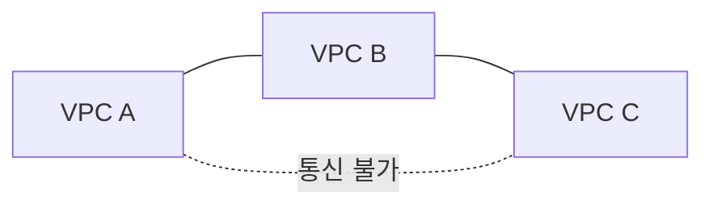
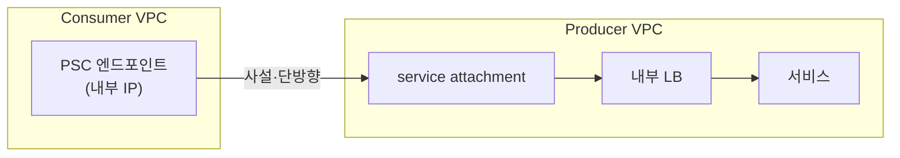

* TOC
{:toc}

> "방화벽을 열었는데 왜 연결이 안 되죠?"

---

## 도입 — 방화벽을 열었는데 왜 연결이 안 되죠?

같은 VPC, 다른 서브넷에 있는 두 VM 사이에서 `ping`이 실패하는 흔한 원인 하나는 방화벽 우선순위다. `allow-icmp` 규칙을 추가해도 그 규칙의 priority가 기존 deny 규칙보다 **숫자가 크면** 적용되지 않는다. GCP에서 방화벽 우선순위는 숫자가 낮을수록 강하다 — 직관과 정반대다.

PCA 시험의 VPC 문제도 같은 성격이다. 표면적으로는 "ping이 왜 안 되나", "어떤 구성이 가장 적합한가"를 묻지만 본질은 하나다 — **요구사항을 읽고 올바른 GCP 프리미티브로 매핑할 줄 아는가.** Peering인가 Shared VPC인가 VPN인가, Cloud NAT인가 Private Google Access인가, Network Tag인가 Service Account인가.

<div class="callout-note">
이 글의 지도: 정신모델 → 패킷 흐름(Route·Firewall·HFP) → 연결 3선택지 → Private Access → 진단 도구 → 시험 유형 공략 → 케이스. 각 축은 "문제 → 케이스 → 결론"으로 닫는다.
</div>

암기가 아니라 판단을 묻는 시험이므로, 각 섹션 끝에서 "그래서 시험에선 뭘 고르나"를 손에 쥐는 것을 목표로 한다.

---

## 정신모델 — GCP는 네트워크를 어떻게 보는가

### Global VPC, Regional Subnet

GCP에서 **VPC는 글로벌 리소스**다. 하나의 VPC가 모든 리전에 걸쳐 존재하고, 그 안의 **서브넷은 리전 단위**다. `us-central1`의 서브넷과 `asia-northeast3`의 서브넷을 같은 VPC에 두면, 둘은 별도의 VPN이나 Peering 없이 Google 백본을 통해 사설 IP로 직접 통신한다.

<div class="callout-warning">
AWS는 VPC가 <strong>리전</strong> 단위라 리전 간 통신에 Peering/Transit Gateway가 필요하다. GCP는 VPC가 <strong>글로벌</strong>이라 같은 VPC 내 리전 간은 <strong>기본 라우팅</strong>된다. "리전 간 연결에 무엇이 필요한가"에서 같은 VPC라면 정답은 "아무것도 필요 없다" — AWS 직관을 가져오면 오답.
</div>

라우팅 모드도 알아두자. VPC의 **Dynamic Routing Mode**(`Regional` 기본 / `Global`)는 Cloud Router가 학습한 온프렘 BGP 경로를 해당 리전에만 전파할지 모든 리전 서브넷에 전파할지를 정한다. "온프렘 경로가 한 리전에서만 보인다" 류 트러블슈팅으로 등장한다(6편).

### IP 주소 설계: Primary와 Secondary Range

서브넷은 **Primary CIDR**를 하나 가지며 VM의 NIC IP가 여기서 나온다. 추가로 **Secondary range**를 붙일 수 있는데, GKE의 **VPC-native(Alias IP)** 클러스터가 Pod·Service IP를 이 secondary range에서 가져온다. Pod이 노드 IP를 빌리지 않고 자기 IP를 갖게 되어 VPC의 1급 시민이 된다(3편).

> CIDR 비중첩은 철칙이다. 같은 VPC 내 서브넷은 물론, 나중에 Peering·VPN으로 연결할 상대 네트워크와도 겹치면 안 된다. 멀티 프로젝트·하이브리드를 염두에 두고 IP 대역을 처음부터 넉넉히, 겹치지 않게 할당하는 것이 아키텍트의 일이다.

**결론**: VPC는 글로벌·서브넷은 리전, CIDR은 비중첩. 이 둘이 이후 모든 연결 결정의 전제다. 주소를 그었으니, 그 위로 패킷이 어떻게 흐르는가.

---

## 패킷은 어떻게 흐르는가 — Route와 Firewall

VM이 패킷을 보내면 **Route**가 "어디로 보낼지"를, **Firewall**이 "보내도/받아도 되는지"를 결정한다. 시험 트러블슈팅의 대부분이 이 둘 중 하나다.

### Route 우선순위

라우트는 두 종류다. **System-generated**(VPC 생성 시 자동 — 서브넷 간 통신용 subnet route, 인터넷으로 향하는 default route `0.0.0.0/0`)와 **Custom**(사용자 static route, 또는 Cloud Router가 BGP로 학습한 dynamic route. 다음 홉을 NVA·VPN 터널·ILB로 지정 가능)이다.

여러 라우트가 한 목적지에 매칭되면 **가장 좁은(구체적인) prefix**가 우선한다. `10.1.2.0/24`와 `10.1.0.0/16`이 `10.1.2.5`에 모두 매칭되면 `/24`가 이긴다. prefix가 같으면 priority(낮을수록 우선)로 정한다.

> "default route를 삭제했더니 인터넷이 안 된다"는, system-generated `0.0.0.0/0`이 인터넷 게이트웨이로 향하는 유일한 경로였기 때문이다. 외부 통신을 막을 때 의도적으로 쓰기도 한다.

### Firewall Rule의 숨은 규칙

VPC 방화벽은 **stateful**(응답 트래픽 자동 허용)이고, 두 개의 **implied rule**이 숨어 있다 — **implied deny ingress**(명시 allow 없으면 인바운드 차단)와 **implied allow egress**(명시 deny 없으면 아웃바운드 허용). 그래서 "egress는 되는데 ingress가 안 된다"가 기본 상태다.

<div class="callout-warning">
Firewall priority는 <strong>숫자가 낮을수록 우선</strong>(0이 최강, 기본 1000, 범위 0~65535). priority 100짜리 deny가 1000짜리 allow를 이긴다. priority가 같으면 deny가 allow보다 우선. 직관과 반대 — 함정 1순위.
</div>

타겟팅 방식이 다음 문제다. 두 방식을 나란히 본다.

<div class="compare-grid">
<div class="compare-col" markdown="1">

**Network Tag 타겟팅**

```bash
gcloud compute firewall-rules create allow-web \
  --network=prod-vpc \
  --target-tags=web-server \
  --source-ranges=0.0.0.0/0 \
  --allow=tcp:80
```

`compute.instances.setTags` 권한만 있으면 누구나 VM에 태그를 붙여 규칙 적용 대상을 바꿀 수 있다 — 변경이 쉽다 = 보안 경계로는 약하다.

</div>
<div class="compare-col" markdown="1">

**Service Account 타겟팅**

```bash
gcloud compute firewall-rules create allow-web \
  --network=prod-vpc \
  --target-service-accounts=web@proj.iam.gserviceaccount.com \
  --source-ranges=0.0.0.0/0 \
  --allow=tcp:80
```

SA를 바꾸려면 IAM 권한이 필요하다 — 강결합 = 거버넌스가 강하다. 보안 중요 시 PCA 권장 답. 단, 한 규칙에서 Tag와 SA **혼용 불가**.

</div>
</div>

> 트러블슈팅 체크리스트: ① 수신 측 ingress allow가 있는가(implied deny 전제) → ② priority가 deny보다 낮은가 → ③ Tag/SA가 양쪽 VM에 매칭되는가 → ④ source range가 의도대로인가. 이 순서면 대부분 풀린다.

**결론**: ping 실패 = priority 역전 또는 implied deny. 보안 중요 타겟팅은 **Service Account**. 방화벽 규칙을 VPC 단위로 봤으니, 이제 조직 단위로 확장한다.

### Hierarchical Firewall Policy — 조직 단위 방화벽 정책

VPC 방화벽 규칙은 **단일 VPC** 안에서만 통한다. 조직 전체에 "이 포트는 어디서든 막아라"를 강제하려면 **Hierarchical Firewall Policy(HFP)**가 필요하다.

평가 순서는 계층 그대로 흐른다: **조직 정책 → 폴더 정책 → VPC 방화벽 규칙**. 상위 정책이 먼저 평가되고, 매칭되지 않은 트래픽만 아래로 내려간다.

핵심 액션이 하나 추가된다 — **`goto_next`**. `allow`·`deny` 외에 "이 트래픽은 아래 계층에서 결정하라"는 위임이다.

<div class="compare-grid">
<div class="compare-col" markdown="1">

**VPC 방화벽 규칙 (기존)**

- 단일 VPC 범위
- action: `allow` / `deny`
- 관리: 팀별 분산 → 일관성 보장 어려움

</div>
<div class="compare-col" markdown="1">

**Hierarchical Firewall Policy**

- 조직·폴더 범위 (하위 VPC 전체 적용)
- action: `allow` / `deny` / **`goto_next`**
- 관리: 보안팀 중앙 집중 → 거버넌스 강제

</div>
</div>

<div class="callout-warning">
평가 순서: <strong>HFP(조직) → HFP(폴더) → VPC 방화벽</strong>. 상위 정책에서 <code>deny</code>가 먹히면 VPC 방화벽은 아예 평가되지 않는다. 하위에 위임하려면 <code>goto_next</code>를 명시해야 한다 — 기본값은 위임이 아니다.
</div>

**케이스 적용 — 전사 SSH 차단**: 모든 팀 VPC에서 외부 SSH(TCP 22)를 금지해야 한다. 각 팀 VPC 방화벽을 일일이 수정하면 누락·오설정 위험이 있다 → 조직 레벨 HFP에 `deny TCP 22 ingress` 추가. 팀이 VPC 방화벽에 어떤 규칙을 넣어도 조직 정책이 먼저 막는다. Shared VPC와 조합하면 "네트워크도, 정책도 중앙 통제"가 완성된다.

**결론**: 전사·폴더 강제 정책 = **HFP**, 팀·VPC 세부 규칙 = **VPC 방화벽**. 패킷의 길을 봤으니, 이제 시험의 핵심 — VPC를 연결하는 세 길이다.

---

## VPC를 연결하는 세 가지 길 — 이 챕터가 시험의 핵심

요구사항을 읽고 Peering / Shared VPC / VPN·Interconnect 중 하나를 고르는 능력이 VPC 파트의 절반이다. 각각 "무엇을 위한 것인가"를 한 문장으로 못 박는다.

### VPC Peering — 비전이적 내부 연결

두 VPC를 사설 IP로 직접 연결한다. **서로 다른 프로젝트·조직**의 VPC끼리도 맺을 수 있고, 트래픽이 Google 백본으로 흐른다. **연결(Peering) 자체에는 추가 비용이 없지만, 그 위로 흐르는 트래픽은 무료가 아니다** — 리전 간/존 간 egress는 일반 VM 네트워크 요금과 동일하게 과금된다(같은 리전·같은 존 내부만 무과금). "Peering이라 공짜"라는 오해가 시험·실무 모두에서 함정이다. 세 제약이 시험 포인트다 — ① **CIDR 중첩 불가** ② **비전이성**(A↔B, B↔C 있어도 A↔C 불가) ③ **subnet route만 자동 교환**(static·dynamic route는 기본 미전파).



**케이스 적용 — M&A 후 통합**: 회사를 인수해 두 VPC를 Peering으로 잇는데, **양쪽 모두 `10.0.0.0/16`**을 쓴다.

<div class="callout-warning">
Peering의 절대 제약: <strong>CIDR이 겹치면 맺을 수 없다.</strong> 위 M&A는 Peering 불가 → 한쪽 대역 재설계(IP 재할당·마이그레이션) 또는 단기 HA VPN+별도 대역 우회. "왜 Peering이 안 되나"의 단골 정답.
</div>

**결론**: 독립 조직/프로젝트 간 · 내부 IP · CIDR 안 겹침 · 최소 비용 → **Peering**. 단 비전이성·CIDR 중첩을 항상 의심하라.

### Shared VPC — 조직 단위 중앙 거버넌스

**한 조직 안에서** 네트워크를 중앙 집중 관리한다. **Host Project**가 VPC·서브넷을 소유하고 **Service Project**들이 그 서브넷을 빌려 자기 리소스를 띄운다. 네트워크는 Host의 관리자가 단일 통제하고, 각 팀은 컴퓨트만 운영한다.

**케이스 적용 — 멀티팀 SaaS**: 10개 팀이 각자 프로젝트를 운영하되, 보안팀이 방화벽·서브넷을 중앙 관리하고 싶다 → Host Project 1개 + Service Project 10개의 Shared VPC. 각 팀 admin에게 해당 서브넷의 `compute.networkUser`만 부여하면, 그 admin은 지정 서브넷에 인스턴스만 띄울 수 있고 네트워크는 못 바꾼다. "팀은 워크로드, 보안팀은 네트워크"가 IAM으로 강제된다.

<details>
<summary>심화 — Service Project Admin 권한 경계 (검증 필요)</summary>
<div markdown="1">

Shared VPC 권한은 두 단계로 나뉜다.

- **Shared VPC Admin**(조직/폴더 레벨 `compute.xpnAdmin`): Host Project를 지정하고 어떤 Service Project를 붙일지 결정한다.
- **Service Project Admin**: Host의 특정 서브넷에 대해 `compute.networkUser` 역할을 받은 주체. 이 역할은 **지정된 서브넷에 인스턴스/리소스를 띄우는 것**까지만 허용한다. 서브넷·방화벽·라우트를 생성·수정할 수는 없다.

`compute.networkUser`를 **서브넷 단위**로 줄지 **Host Project 전체**로 줄지에 따라 위임 범위가 달라진다. 최소 권한 원칙상 팀별로 필요한 서브넷에만 부여하는 것이 권장된다. 정확한 역할명·범위는 GCP 공식 문서로 재확인 권장.

</div>
</details>

**결론**: 한 조직 · 여러 팀/프로젝트 · 중앙 네트워크 통제 → **Shared VPC**. Peering(다른 VPC 연결)과 달리 하나의 VPC를 공유하는 구조임에 주의.

### Cloud VPN / Interconnect — 온프렘으로 가는 길 (6편 예고)

위 둘은 GCP 내부 연결이다. **온프렘 데이터센터**와의 사설 연결은 다른 도구를 쓴다. **Cloud VPN**은 IPsec 암호화 터널을 인터넷 위에 세운다(저비용·빠른 구축, HA VPN은 99.99% SLA). **Dedicated/Partner Interconnect**는 물리 전용 회선이다(고대역 10/100 Gbps·저지연·고비용).

**케이스 적용 — 하이브리드 연동**: 온프렘 DB와 GCP가 사설 통신, 일 수백 GB 동기화, 지연 중요하나 초저지연까지는 아님 → 초기엔 **HA VPN**으로 시작, 대역·안정성 요구가 커지면 **Interconnect**로 승급. 둘 다 Cloud Router(BGP)로 경로 교환.

**결론**: 저비용·빠른 구축 → VPN, 고대역·저지연·안정성 → Interconnect. 상세 비교·SLA·대역 산정은 6편. 연결을 봤으니, 외부 IP 없이 사는 법이다.

---

## 외부 IP 없이 살아가기 — Private Access 패턴

"VM에 외부 IP를 주지 말라"가 보안·규제 요구에 자주 등장한다. 그럼 그 VM은 어떻게 패키지를 받고 GCS·BigQuery를 호출하는가? 두 도구가 **서로 다른 문제**를 푼다 — 혼동하면 바로 오답이다.

<div class="compare-grid">
<div class="compare-col" markdown="1">

**Cloud NAT — 일반 인터넷 egress**

```bash
gcloud compute routers nats create nat-cfg \
  --router=prod-router --region=us-central1 \
  --nat-all-subnet-ip-ranges \
  --auto-allocate-nat-external-ips
```

`apt update` 등 일반 인터넷 egress를 외부 IP 없는 VM에 공유 제공. **egress only — 외부에서 먼저 들어오는 인바운드는 불가**(인바운드는 외부 IP나 LB 필요). 외부 IP 절약.

</div>
<div class="compare-col" markdown="1">

**Private Google Access — Google API 한정**

```bash
gcloud compute networks subnets update prod-subnet \
  --region=us-central1 \
  --enable-private-google-access
```

서브넷 수준 설정. 외부 IP 없는 VM이 **Google API·서비스**(GCS·BigQuery·Pub/Sub)에 사설 경로로 접근. 트래픽은 인터넷으로 안 나간다. **Google API 한정** — 임의 외부 사이트 불가.

</div>
</div>

<div class="callout-warning">
혼동 1순위: <strong>apt 패키지 다운로드 → Cloud NAT</strong>(일반 인터넷), <strong>GCS/BigQuery 접근 → Private Google Access</strong>(Google API). "외부 IP 금지"라고 둘을 한 덩어리로 묶으면 틀린다 — 한 시나리오에 둘 다 필요한 경우가 많다.
</div>

<details>
<summary>심화 — Private Google Access / VPC Service Controls의 경계 (검증 필요)</summary>
<div markdown="1">

자주 혼동되는 두 개념을 분리한다(세 번째 축인 **Private Service Connect**는 바로 다음 섹션에서 정식으로 다룬다).

- **Private Google Access**: 외부 IP 없는 VM이 **사설 경로로 Google API에 접근**하는 서브넷 설정. "연결성"의 문제.
- **VPC Service Controls(VPC-SC)**: GCS·BigQuery 등 관리형 서비스 둘레에 **서비스 경계(perimeter)**를 쳐서, 탈취된 자격증명으로도 경계 밖 **데이터 유출(exfiltration)을 막는다.** 네트워크 연결이 아니라 "데이터 경계"의 문제.

시험에서는 키워드 매칭이 안전하다 — "외부 IP 없이 Google API = Private Google Access", "데이터 유출 방지 경계 = VPC-SC". 정밀 정의는 GCP 공식 문서 1차 출처로 재확인 권장.

</div>
</details>

**결론**: 외부 IP 없이 Google API는 **PGA**, 일반 인터넷은 **Cloud NAT**(egress only), 데이터 유출 방지는 **VPC-SC**. 세 도구가 각각 다른 문제를 푼다. 그런데 PGA의 한계 — "공인 API IP로 라우팅한다"는 점 — 를 넘어서는 또 하나의 사설 접근 모델이 있다. Private Service Connect다.

---

## Private Service Connect — 서비스를 사설 엔드포인트로 노출하고 소비하기

PGA·Peering·Shared VPC가 "네트워크를 어떻게 잇는가"의 도구라면, **Private Service Connect(PSC)**는 "특정 **서비스 하나**를 사설로 노출하고 소비하는가"의 도구다. 전체 VPC를 연결하지 않고, 소비자 VPC 안의 **내부 IP 엔드포인트** 하나로 producer 측 서비스에 닿는다.

### 정신모델 — producer와 consumer의 단방향 연결

PSC는 두 역할로 구성된다.

- **Producer**: 서비스를 노출하는 쪽. 내부 로드밸런서 뒤의 서비스를 **service attachment**로 게시한다.
- **Consumer**: 그 서비스를 쓰는 쪽. 자기 VPC에 **PSC 엔드포인트**(내부 IP를 가진 forwarding rule)를 만들어 producer 서비스로 향한다.

핵심은 연결이 **단방향·서비스 단위**라는 점이다. consumer는 자기 VPC 내부 IP로 producer 서비스에 접근하지만, 두 VPC의 나머지 대역은 서로 보이지 않는다. CIDR이 겹쳐도 무방하다 — 트래픽이 NAT을 거쳐 들어가므로 양쪽 IP 공간이 충돌하지 않는다.



### PSC의 두 갈래

PSC는 무엇을 노출하느냐에 따라 두 형태로 나뉜다. 시험에서 키워드로 구분된다.

<div class="compare-grid">
<div class="compare-col" markdown="1">

**PSC for Google APIs**

외부 IP 없는 VM이 **Google API(GCS·BigQuery 등)**를 소비자 VPC 안에 만든 **내부 엔드포인트 IP**로 호출한다. `all-apis`/`vpc-sc` 같은 번들 또는 개별 API를 한 엔드포인트에 묶을 수 있다.

```bash
gcloud compute addresses create psc-google-apis \
  --global --purpose=PRIVATE_SERVICE_CONNECT \
  --addresses=10.10.0.5 --network=prod-vpc

gcloud compute forwarding-rules create psc-google-apis-fr \
  --global --network=prod-vpc \
  --address=psc-google-apis \
  --target-google-apis-bundle=all-apis
```

내가 직접 정한 내부 IP로 Google API에 닿는다. 온프렘에서 Cloud Router로 이 IP를 광고하면, **온프렘에서도** 사설로 Google API를 부를 수 있다(PGA로는 까다로운 시나리오).

</div>
<div class="compare-col" markdown="1">

**PSC for published services**

내가 만든 서비스 또는 **타 조직·SaaS 벤더의 관리형 서비스**를 사설로 노출·소비한다. producer가 service attachment를 게시하면, consumer는 자기 VPC에 엔드포인트를 만들어 인터넷을 거치지 않고 소비한다.

```bash
# consumer 측 — producer가 게시한 service attachment로 향하는 엔드포인트
gcloud compute forwarding-rules create psc-vendor-ep \
  --region=us-central1 --network=consumer-vpc \
  --address=10.20.0.7 \
  --target-service-attachment=\
projects/vendor-proj/regions/us-central1/serviceAttachments/svc-attach
```

서드파티 데이터 API·파트너 SaaS를 **공인 인터넷 노출 없이** 소비할 때의 정석. Peering처럼 양쪽 VPC를 통째로 잇지 않으므로 CIDR 충돌·과잉 노출이 없다.

</div>
</div>

### PSC vs Private Google Access — 라우팅 방식이 다르다

둘 다 "외부 IP 없이 Google API"를 풀지만 **트래픽이 향하는 IP가 다르다.**

<div class="callout-warning">
<strong>PGA</strong>는 외부 IP 없는 VM의 트래픽을 <strong>Google API의 공인 IP 대역</strong>으로 사설 경로를 통해 라우팅한다(목적지 IP는 여전히 공인 API IP). <strong>PSC for Google APIs</strong>는 소비자 VPC 안에 만든 <strong>내부 IP 엔드포인트</strong>로 향한다(목적지 IP가 내 사설 IP). "내가 IP를 통제해야 한다", "온프렘에서 사설 IP로 Google API를 부른다", "VPC-SC 경계와 특정 엔드포인트를 묶는다"면 PSC, 단순히 "외부 IP 없이 GCS 접근"이면 PGA로 충분하다.
</div>

### PSC vs VPC Peering — 전체 연결인가, 서비스 노출인가

연결을 고민할 때 가장 흔히 부딪히는 갈림길이다.

| 기준 | VPC Peering | Private Service Connect |
|------|-------------|--------------------------|
| 연결 범위 | **VPC 전체**(양쪽 서브넷 상호 도달) | **특정 서비스 하나**(엔드포인트→service attachment) |
| 방향성 | 양방향 | 단방향(consumer→producer) |
| 전이성 | 비전이(A↔C 불가) | 해당 없음(서비스 단위) |
| CIDR 중첩 | **불가**(절대 제약) | **허용**(NAT 경유로 충돌 회피) |
| 노출 범위 | 연결된 VPC 전체가 서로 보임 | 게시한 서비스만 보임(최소 노출) |
| 대표 용도 | 신뢰하는 자사 VPC 간 폭넓은 사설 통신 | 타 조직/SaaS 서비스 소비, 멀티테넌트 서비스 게시 |

<div class="callout-note">
시험 신호어로 가른다 — <strong>"특정 서비스만 사설로 노출/소비"</strong>, <strong>"CIDR이 겹치는데 연결해야 한다"</strong>, <strong>"타 조직·SaaS 관리형 서비스를 사설로 소비"</strong>, <strong>"서비스 producer/consumer"</strong>가 보이면 <strong>PSC</strong>. 반대로 <strong>"두 VPC 전체를 사설로 연결"</strong>, <strong>"양쪽 모든 서브넷이 서로 통신"</strong>이면 <strong>Peering</strong>. 단 Peering은 CIDR이 겹치면 불가 — 이때 PSC가 우회로가 된다.
</div>

**케이스 적용 — CIDR이 겹치는 SaaS 벤더 연동**: 외부 SaaS 데이터 제공사의 관리형 API를 사설로 소비해야 하는데, 우리 VPC(`10.0.0.0/16`)와 벤더 VPC 대역이 겹친다. Peering은 CIDR 중첩으로 **불가**. 벤더가 service attachment를 게시하고 우리는 PSC 엔드포인트를 만들면, IP 충돌 없이(NAT 경유) 그 **서비스만** 사설로 소비한다 — 벤더 VPC의 나머지는 우리에게 보이지 않고, 우리 VPC도 벤더에게 노출되지 않는다.

**결론**: 전체 VPC 연결·신뢰 도메인 내부 = **Peering/Shared VPC**, 특정 서비스만 단방향 사설 노출·CIDR 충돌 회피·타 조직 서비스 소비 = **PSC**. "외부 IP 없이 Google API"는 PGA가 기본, 내부 IP 통제·온프렘 사설 호출이 필요하면 **PSC for Google APIs**.

---

## 진단 도구 — 보이지 않는 것을 보이게

VPC 문제는 연결 설계만큼 **진단**이 중요하다. PCA 시험은 "어떻게 문제를 파악할 것인가"를 따로 물어본다.

### VPC Flow Logs — 트래픽 흐름 기록

서브넷 수준에서 활성화하는 네트워크 흐름 기록이다. VM 간·VM↔인터넷 패킷 흐름을 **5-tuple(출발지 IP·포트, 목적지 IP·포트, 프로토콜) + 메타데이터(바이트·패킷 수, 레이턴시)** 로 Cloud Logging에 남긴다.

```bash
gcloud compute networks subnets update prod-subnet \
  --region=us-central1 \
  --enable-flow-logs \
  --logging-aggregation-interval=interval-5-sec \
  --logging-flow-sampling=0.5
```

**샘플링 비율**(0.0~1.0, 기본 0.5)로 로그 양과 비용을 조율한다.

| 사용 케이스 | 설명 |
|------------|------|
| 보안 감사 | 비정상 외부 접속·내부 횡이동 탐지 |
| 트러블슈팅 | 패킷이 실제로 나가고 있는가 확인 |
| 비용 분석 | 고비용 리전 간 트래픽 패턴 파악 |

<div class="callout-warning">
Flow Logs는 <strong>허용된 트래픽</strong>을 기록한다. 방화벽에서 막힌 트래픽은 남지 않는다. "왜 안 되는가" 원인 추적보다 "무엇이 흐르고 있는가" 확인에 적합하다. 방화벽 거부 트래픽 기록이 필요하면 방화벽 규칙의 <strong>logging</strong>을 별도로 활성화해야 한다.
</div>

### Network Intelligence Center — 연결·정책 분석

GUI 기반 진단 스위트. 4개 도구가 각각 다른 진단 질문에 답한다.

| 도구 | 질문 | 작동 방식 |
|------|------|----------|
| **Connectivity Tests** | "VM A → VM B가 연결 가능한가?" | 방화벽·라우팅 규칙을 시뮬레이션. 실제 패킷 불필요 |
| **Firewall Insights** | "이 방화벽 규칙은 쓰이고 있나?" | 미사용·shadowed 규칙·과잉 허용 탐지 |
| **Network Topology** | "우리 VPC 구조는 어떻게 생겼나?" | VPC·서브넷·Peering·VM 관계 시각화 |
| **Performance Dashboard** | "지연과 패킷 손실은 어느 구간인가?" | 리전 간·온프렘 연결 성능 메트릭 |

<div class="callout-note">
PCA 시험에서 <strong>Connectivity Tests</strong>가 가장 자주 나온다. "방화벽을 다 확인했는데 왜 연결이 안 되는지 가장 빠르게 파악하는 방법은?" → Connectivity Tests. 실제 트래픽을 보내지 않고 설정만으로 경로를 시뮬레이션하기 때문에 무중단 진단이 가능하다.
</div>

**결론**: 흐름 기록 → **VPC Flow Logs**, 연결 가능성 시뮬레이션 → **Connectivity Tests**, 방화벽 규칙 정리 → **Firewall Insights**. 진단 도구를 봤으니 이제 시험장이다.

---

## 시험장에서 — 문제 유형별 공략

### 아키텍처 설계형 (유형 A)

가장 출제 빈도가 높다. 요구사항 키워드를 연결 방식으로 매핑하는 치트시트가 본편의 핵심 자산이다.

| 요구사항 키워드 | 정답 프리미티브 |
|-----------------|-----------------|
| 한 조직 · 여러 팀 · 중앙 네트워크 통제 | **Shared VPC** |
| 독립 조직/프로젝트 간 · 내부 IP · CIDR 안 겹침 · 최소 비용 | **VPC Peering** |
| 특정 서비스만 사설 노출/소비 · CIDR 중첩 회피 · 타 조직/SaaS 서비스 사설 소비 | **Private Service Connect** |
| 외부 IP 없이 Google API(GCS/BQ)만 | **Private Google Access** |
| 외부 IP 없이 일반 인터넷 egress(apt) | **Cloud NAT** |
| 온프렘 · 저비용 · 빠른 구축 | **Cloud VPN(HA)** |
| 온프렘 · 고대역 · 저지연 · 안정성 | **Interconnect** |
| 데이터 유출 방지 경계 | **VPC Service Controls** |
| 전사·폴더 단위 방화벽 정책 강제 | **Hierarchical Firewall Policy** |
| 트래픽 흐름 기록 · 보안 감사 | **VPC Flow Logs** |
| 연결 불가 원인 빠른 무중단 진단 | **Connectivity Tests** |

### 트러블슈팅형 (유형 B)

연결 실패는 정해진 순서로 디버깅한다.

| 점검 | 흔한 원인 |
|------|-----------|
| 수신 측 ingress allow 존재? | implied deny ingress 전제 |
| priority가 deny보다 낮은가? | priority 역전(가장 흔함) |
| Tag/SA가 양쪽 매칭? | 타겟 누락 |
| Peering 너머 3번째 VPC? | 비전이성(A↔C 직접 필요) |
| 상위 HFP에 deny가 있는가? | 조직·폴더 정책이 VPC 방화벽보다 먼저 평가 |
| 설정 변경 없이 경로 시뮬레이션 필요? | **Connectivity Tests** 사용 |

### 비교선택형 (유형 C)

| 질문 | 판별 |
|------|------|
| apt vs GCS 접근 | apt=**Cloud NAT** / GCS=**PGA** |
| Shared VPC vs Peering | 단일 조직·중앙=**Shared VPC** / 독립 조직 간=**Peering** |
| Peering vs PSC | VPC 전체 연결=**Peering** / 특정 서비스만·CIDR 중첩=**PSC** |
| PGA vs PSC for Google APIs | 공인 API IP 라우팅=**PGA** / 내부 IP 엔드포인트=**PSC** |
| Tag vs SA 타겟 | 보안 중요=**Service Account** |

---

## 실전 케이스로 굳히기

앞 축에서 부분 적용한 케이스를 GCP 구조 매핑으로 정리한다.

| 케이스 | 상황 | 매핑 |
|--------|------|------|
| 1. 멀티팀 SaaS | 10팀 각 프로젝트, 보안팀 중앙 관리 | Shared VPC(Host+Service, `compute.networkUser`) |
| 2. M&A 통합 | 독립 VPC 사설 연결, CIDR 충돌 | Peering 불가 → 재설계 또는 HA VPN 우회 |
| 3. 금융 데이터 격리 | 외부 IP 금지, apt+GCS, 유출 방지 | Cloud NAT + PGA + VPC-SC |
| 4. 하이브리드 | 온프렘 DB ↔ GCP 사설 통신 | HA VPN(저비용) → Interconnect(승급) |

케이스 3이 특히 함정이다. "외부 IP 금지"를 NAT/PGA 한 덩어리로 묶지 말 것 — 패치(apt)는 NAT, Google API(GCS·BQ)는 PGA, 유출 방지는 VPC-SC로 **세 도구가 각각** 들어간다.

---

## 마무리

"방화벽을 열었는데 왜 연결이 안 되죠?"는 implied deny와 priority 역전을 알면 풀린다. 그 너머의 모든 VPC 문제는 요구사항을 읽고 올바른 연결 방식을 고르는 의사결정이다.

<div class="callout-tip">
VPC 문제 = <strong>연결 방식 선택 문제</strong>. 요구사항 키워드(거버넌스 / 비용 / 격리 / 온프렘)를 연결 방식에 매핑하면 답이 보인다.
</div>

시험 직전에 훑을 **함정 8쌍**:

| 혼동 쌍 | 핵심 구분선 |
|---------|------------|
| Peering vs Shared VPC vs VPN | Peering=독립 VPC 연결 / Shared VPC=단일 조직 1 VPC 공유 / VPN=온프렘 암호화 터널 |
| Cloud NAT vs PGA | NAT=일반 인터넷 egress(apt) / PGA=Google API 한정(GCS·BQ) |
| Network Tag vs Service Account | Tag=변경 쉬움·약함 / SA=IAM 강결합·권장 |
| Firewall priority 방향 | 0~65535, 기본 1000, **숫자 낮을수록 우선** |
| VPC=Global, Subnet=Regional | 같은 VPC면 리전 간 기본 라우팅(AWS 함정) |
| Peering 비전이성 | A↔B, B↔C 있어도 A↔C 불가 |
| Peering vs PSC | Peering=VPC 전체·CIDR 중첩 불가 / PSC=특정 서비스 단방향·CIDR 중첩 허용 |
| PGA vs PSC for Google APIs | PGA=공인 API IP로 사설 라우팅 / PSC=내가 통제하는 내부 IP 엔드포인트 |
| HFP vs VPC 방화벽 | HFP=조직·폴더 강제(goto_next로 위임) / VPC 방화벽=VPC 단위 세부 규칙 |
| Flow Logs vs 방화벽 logging | Flow Logs=허용 트래픽 기록 / 방화벽 logging=거부(deny) 트래픽 기록 |

다음 편 **2편 Compute Engine & 인스턴스 설계**에서는 이 VPC 위에 실제 워크로드를 올린다. 머신 타입, MIG와 오토스케일링, 가용성 설계, 그리고 인스턴스에 붙는 Service Account가 방화벽·IAM과 어떻게 맞물리는지 — 네트워크 위에 컴퓨트를 쌓는다.

---

## 실전 퀴즈 — 핵심 개념 검증

각 문제는 PCA 시험의 실제 출제 패턴을 따른다. 정답을 고른 뒤 해설을 펼쳐 확인하라.

---

**Q1. Hierarchical Firewall Policy와 VPC 방화벽 우선순위**

조직 레벨 HFP에 다음 규칙이 설정되어 있다.

- priority: 500 / direction: INGRESS / action: **DENY** / port: TCP 22 / source: 0.0.0.0/0

dev 팀 VPC 방화벽에는 다음 규칙이 있다.

- priority: **100** / direction: INGRESS / action: **ALLOW** / port: TCP 22 / source: 0.0.0.0/0

개발자가 이 VPC의 VM에 외부 SSH를 시도한다. 결과는?

- (A) VPC 방화벽 priority가 100으로 더 낮으므로 SSH가 허용된다.
- (B) HFP는 VPC 방화벽보다 먼저 평가되고, DENY 매칭 시 VPC 방화벽은 평가되지 않는다. SSH가 차단된다.
- (C) HFP와 VPC 방화벽은 동일한 priority 공간을 공유하므로 priority 100 ALLOW가 우선한다.
- (D) HFP의 DENY는 `goto_next`가 없으면 무효이므로 VPC 방화벽 ALLOW가 적용된다.

<details>
<summary>정답 및 해설</summary>
<div markdown="1">

**정답: (B)**

HFP는 **계층 순서**로 평가된다 — 조직 HFP → 폴더 HFP → VPC 방화벽. priority는 **같은 계층 안**에서만 비교한다. 조직 HFP의 priority 500과 VPC 방화벽의 priority 100은 **별개 공간**이며 서로 비교하지 않는다.

HFP에서 DENY가 먼저 매칭되면 평가는 거기서 끝난다. 하위 계층으로 넘기려면 명시적으로 `goto_next` 액션을 써야 한다 — `goto_next`는 "위임"을 선언하는 것이지 DENY의 전제 조건이 아니다.

| 선택지 | 오답 이유 |
|--------|----------|
| (A) | HFP와 VPC 방화벽의 priority가 같은 공간이라는 잘못된 전제 |
| (C) | (A)와 동일한 전제 오류 |
| (D) | `goto_next` 부재 → DENY 무효라는 인과관계 오해. `goto_next` 없으면 DENY가 그대로 적용됨 |

</div>
</details>

---

**Q2. VPC Peering — CIDR 중복 + 비전이성 복합**

세 VPC가 있다.

| VPC | CIDR | 프로젝트 |
|-----|------|---------|
| VPC-A | 10.0.0.0/16 | project-alpha |
| VPC-B | 10.1.0.0/16 | project-beta |
| VPC-C | 10.0.0.0/16 | project-gamma |

현재 VPC-A ↔ VPC-B Peering, VPC-B ↔ VPC-C Peering이 설정되어 있다. project-alpha의 VM(10.0.1.10)에서 project-gamma의 VM(10.0.2.20)으로 통신하려 한다. 문제를 가장 정확하게 설명한 것은?

- (A) Peering은 비전이적이므로 A↔C 직접 Peering을 추가하면 해결된다.
- (B) VPC-A와 VPC-C의 CIDR이 겹치므로 직접 Peering이 불가능하다. Peering의 비전이성으로 VPC-B 경유도 불가능하다.
- (C) project-alpha와 project-gamma가 다른 조직이므로 Peering 대신 Shared VPC를 써야 한다.
- (D) VPC-B의 Dynamic Routing Mode가 Regional로 설정되어 경로가 전파되지 않는 것이 원인이다.

<details>
<summary>정답 및 해설</summary>
<div markdown="1">

**정답: (B)**

두 제약이 동시에 적용된다.

1. **CIDR 중복**: VPC-A와 VPC-C 모두 `10.0.0.0/16` → Peering의 절대 전제(비중첩) 위반. A↔C 직접 Peering이 불가능하다.
2. **비전이성**: A↔B, B↔C 가 있어도 A→B→C 경유 통신은 지원하지 않는다.

(A)는 비전이성만 인식하고 CIDR 중복을 놓쳤다. 직접 Peering을 추가해도 CIDR 충돌로 맺을 수 없다.

해결책: VPC-A 또는 VPC-C의 IP 대역을 재설계한 뒤 직접 Peering, 또는 단기 우회로 HA VPN 사용.

</div>
</details>

---

**Q3. 진단 도구 선택 — 차단 트래픽 기록 vs 연결 시뮬레이션**

운영팀이 다음 두 가지를 파악하려 한다.

- ① 지난 24시간 동안 특정 VM으로의 외부 TCP 3306 연결 시도 중 **차단된** 것의 출발지 IP 목록
- ② 현재 방화벽 설정에서 TCP 3306 외부 ingress가 **이론적으로 허용되는지** 경로 확인

각 목적에 맞는 도구 조합은?

- (A) ① VPC Flow Logs, ② Firewall Insights
- (B) ① 방화벽 규칙 logging, ② Connectivity Tests
- (C) ① VPC Flow Logs, ② Connectivity Tests
- (D) ① 방화벽 규칙 logging, ② Firewall Insights

<details>
<summary>정답 및 해설</summary>
<div markdown="1">

**정답: (B)**

| 목적 | 올바른 도구 | 이유 |
|------|-----------|------|
| 차단된 연결 기록 | 방화벽 규칙 logging | VPC Flow Logs는 **허용된** 트래픽만 기록. DENY된 패킷은 남지 않음 |
| 연결 가능 여부 시뮬레이션 | Connectivity Tests | 방화벽·라우팅 설정을 분석해 실제 패킷 없이 경로를 시뮬레이션 |

Firewall Insights는 미사용·shadowed 규칙 탐지 도구이지 특정 연결 경로 검증 도구가 아니다 — (A)(D)에서 ②에 Firewall Insights를 쓰는 것은 용도 오해다.

(C)는 Flow Logs로 차단 트래픽을 잡으려는 실수 — 차단된 패킷은 Flow Logs에 기록되지 않는다.

</div>
</details>

---

**Q4. Private Access 복합 시나리오**

금융 규제로 모든 VM에는 외부 IP가 없어야 하며, 다음 세 작업을 수행해야 한다.

- (A) 운영체제 보안 패치 (`apt-get upgrade`)
- (B) Cloud Storage 버킷에서 데이터 읽기
- (C) 제3자 금융 데이터 API (`api.findata.io`) 호출

또한 GCS 데이터가 승인되지 않은 외부 경로로 유출되는 것을 차단해야 한다.

필요한 최소 구성은?

- (A) Cloud NAT + Private Google Access
- (B) Cloud NAT + Private Google Access + VPC Service Controls
- (C) Private Google Access + VPC Service Controls (PGA가 일반 egress도 처리하므로 Cloud NAT 불필요)
- (D) Cloud NAT만으로 (A)(B)(C) 모두 처리 가능하고, VPC-SC는 별도 옵션이다

<details>
<summary>정답 및 해설</summary>
<div markdown="1">

**정답: (B)**

| 작업 | 필요한 도구 | 이유 |
|------|-----------|------|
| `apt-get upgrade` | Cloud NAT | 일반 인터넷 egress |
| GCS 접근 | Private Google Access | Google API 사설 경로 접근 |
| `api.findata.io` 호출 | Cloud NAT | 외부 도메인 → 일반 인터넷 egress. **PGA 범위 밖** |
| 데이터 유출 방지 | VPC Service Controls | GCS 주위에 서비스 경계(perimeter)를 쳐서 탈취된 자격증명으로도 경계 밖 반출 차단 |

(C)의 "PGA가 일반 egress도 처리"는 오개념 — PGA는 **Google API 전용**이며 외부 파트너 도메인에는 적용되지 않는다.

(D)는 VPC-SC의 역할(네트워크 차단이 아닌 데이터 경계 통제)을 누락했고, Cloud NAT는 Google API에 PGA 없이 접근하는 용도가 아니다.

</div>
</details>

---

**Q5. Shared VPC 최소 권한**

Shared VPC 환경에서 Host Project가 VPC와 두 서브넷(`subnet-team-a`, `subnet-team-b`)을 소유한다. 팀 A는 `subnet-team-a`에만 VM을 배포해야 하며, 방화벽·라우트·`subnet-team-b`는 수정하거나 볼 수 없어야 한다.

팀 A에게 부여해야 할 **최소 권한**으로 올바른 것은?

- (A) Host Project 전체에 `roles/compute.networkAdmin`
- (B) Host Project의 `subnet-team-a`에 `roles/compute.networkUser`
- (C) Host Project 전체에 `roles/compute.networkUser`
- (D) Service Project에 `roles/compute.networkAdmin`

<details>
<summary>정답 및 해설</summary>
<div markdown="1">

**정답: (B)**

`compute.networkUser`를 **서브넷 단위**로 부여하는 것이 핵심이다.

| 선택지 | 문제점 |
|--------|--------|
| (A) Host Project에 `networkAdmin` | 방화벽·라우트·모든 서브넷 수정 권한 포함 → 과다 권한 |
| (B) `subnet-team-a`에 `networkUser` | 해당 서브넷에 인스턴스만 배포 가능. 방화벽·라우트 수정 불가. **최소 권한 원칙 충족** |
| (C) Host Project 전체에 `networkUser` | `subnet-team-b` 포함 모든 서브넷 사용 가능 → 격리 요구 위반 |
| (D) Service Project에 `networkAdmin` | Shared VPC에서 Service Project에 네트워크 권한을 줘도 Host의 서브넷을 제어하지 못함. 구조 오해 |

`compute.networkUser` 역할은 지정된 서브넷에 리소스(VM, 내부 LB 등)를 **배포하는 것**만 허용한다. 서브넷·방화벽·라우트의 생성·수정·삭제는 불가능하다.

</div>
</details>

---

**Q6. Private Service Connect vs VPC Peering — CIDR 중첩 + 서비스 단위 노출**

외부 SaaS 데이터 제공사의 관리형 분석 API를 **사설로** 소비해야 한다. 제약은 다음과 같다.

- 우리 VPC와 벤더 VPC가 **모두 `10.0.0.0/16`**을 사용한다(CIDR 중첩).
- 벤더의 **그 API 서비스 하나만** 접근하면 되고, 벤더 VPC의 나머지 리소스는 보일 필요도, 보여서도 안 된다.
- 트래픽이 공인 인터넷으로 나가서는 안 된다.

가장 적합한 구성은?

- (A) 벤더 VPC와 VPC Peering을 맺어 사설 IP로 직접 통신한다.
- (B) 벤더가 service attachment를 게시하고, 우리 VPC에 PSC 엔드포인트를 만들어 그 서비스만 사설로 소비한다.
- (C) Private Google Access를 활성화해 벤더 API에 사설로 접근한다.
- (D) Shared VPC로 벤더 프로젝트를 Service Project로 붙인다.

<details>
<summary>정답 및 해설</summary>
<div markdown="1">

**정답: (B)**

두 제약이 Peering을 배제하고 PSC를 가리킨다.

1. **CIDR 중첩**: 양쪽 모두 `10.0.0.0/16` → Peering의 절대 전제(비중첩) 위반. PSC는 NAT을 경유하므로 IP 공간이 충돌해도 무방하다.
2. **서비스 단위 최소 노출**: PSC는 게시한 **service attachment 하나**만 노출한다. 벤더 VPC의 나머지는 우리에게 보이지 않고, 우리 VPC도 벤더에게 노출되지 않는다.

| 선택지 | 오답 이유 |
|--------|----------|
| (A) | CIDR 중첩으로 Peering 자체가 불가. 또한 Peering은 VPC 전체를 연결해 과잉 노출 |
| (C) | PGA는 **Google API 전용** — 서드파티 SaaS 도메인에는 적용되지 않음 |
| (D) | Shared VPC는 **단일 조직 내** 네트워크 공유 모델 — 타 조직 벤더에 적용 불가 |

</div>
</details>

---

## 참고

- [[/cloud]] — Google PCA 준비 시리즈 인덱스
- Google Cloud, [*VPC overview*](https://cloud.google.com/vpc/docs/vpc) — VPC·서브넷·라우팅 1차 출처
- Google Cloud, [*Firewall rules overview*](https://cloud.google.com/firewall/docs/firewalls) — priority·implied rule·타겟팅 정확한 수치
- Google Cloud, [*VPC Network Peering*](https://cloud.google.com/vpc/docs/vpc-peering) / [*Shared VPC*](https://cloud.google.com/vpc/docs/shared-vpc) — 비전이성·CIDR 제약·권한 모델
- Google Cloud, [*Private Google Access*](https://cloud.google.com/vpc/docs/private-google-access) / [*Cloud NAT*](https://cloud.google.com/nat/docs/overview) / [*VPC Service Controls*](https://cloud.google.com/vpc-service-controls/docs/overview) — 세 개념 경계 정밀 확인
- Google Cloud, [*Private Service Connect*](https://cloud.google.com/vpc/docs/private-service-connect) — PSC for Google APIs / published services·service attachment·엔드포인트 모델
- Google Cloud, [*VPC pricing*](https://cloud.google.com/vpc/network-pricing) — Peering 트래픽 egress 등 네트워크 과금 모델
- Google Cloud, [*Hierarchical Firewall Policies*](https://cloud.google.com/firewall/docs/firewall-policies) — 조직·폴더 정책 계층 구조 및 goto_next 동작
- Google Cloud, [*VPC Flow Logs*](https://cloud.google.com/vpc/docs/flow-logs) — 샘플링·필터링·비용 모델
- Google Cloud, [*Network Intelligence Center*](https://cloud.google.com/network-intelligence-center/docs/overview) — Connectivity Tests·Firewall Insights 상세
