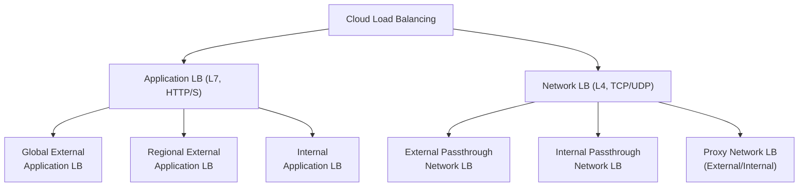
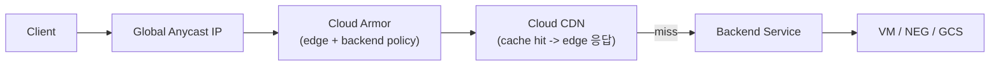
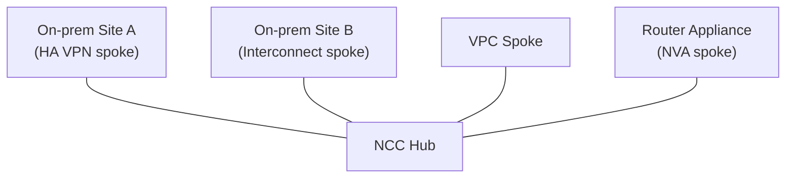

* TOC
{:toc}

> PCA 네트워킹 문제의 절반은 "이 트래픽을 어느 LB로, 어느 경로로 보내는가"다. 표면은 "가장 적합한 구성은?"이지만 본질은 단순하다 — 요구사항(글로벌인가 리전인가, 외부인가 내부인가, HTTP인가 raw TCP인가, 클라이언트 IP를 보존해야 하나, 온프렘과 얼마나 빠르게·안전하게 이어야 하나)을 읽고 올바른 GCP 프리미티브로 매핑할 줄 아는가. 이 글은 LB 선택, 엣지 보안(CDN·Cloud Armor), 하이브리드 연결(VPN·Interconnect·NCC) 세 축을 "요구사항 → 선택 기준 → 결론"으로 닫는다. VPC 기본(서브넷·Shared VPC·Peering·NAT·DNS)은 [[/concept/cloud/03_vpc_for_pca]]에 있으니 여기서는 그 위에 트래픽을 얹는 문제에 집중한다.

---

## 도입 — 같은 "로드밸런서"라는 단어가 여섯 가지를 가리킨다

"로드밸런서를 붙이세요"는 GCP에서 단일 답이 아니다. Cloud Load Balancing은 **글로벌/리전**, **외부/내부**, **L7(Application)/L4(Network)**, **프록시/패스스루**라는 네 개의 축이 곱해진 제품군이다. 시험은 이 축들의 교차점에서 "어느 것 하나"를 고르게 한다. 그리고 그 선택은 곧바로 엣지 보안과 이어진다 — Cloud CDN과 Cloud Armor는 아무 LB에나 붙는 게 아니라 **특정 LB 유형의 백엔드 서비스**에만 붙기 때문이다.

<div class="callout-note">
이 글의 지도: LB 4축 정신모델 → 6종 LB 구분과 의사결정 표 → passthrough vs proxy → Cloud CDN → Cloud Armor(와 LB 결합) → 하이브리드 연결(VPN/Interconnect/NCC) → 시험 공략 → 퀴즈. 각 축은 "요구사항 → 기준 → 결론"으로 닫는다.
</div>

암기가 아니라 판단을 묻는 시험이다. 각 섹션 끝에서 "그래서 시험에선 뭘 고르나"를 손에 쥐는 것을 목표로 한다.

---

## 정신모델 — 로드밸런서를 가르는 네 개의 축

GCP의 LB를 외울 게 아니라 **네 개의 질문**으로 분해하면 6종이 자동으로 나온다.

| 축 | 질문 | 가르는 것 |
|----|------|----------|
| **트래픽 범위** | 단일 anycast IP로 전 세계를 받나, 한 리전인가? | Global vs Regional |
| **노출 방향** | 인터넷을 향하나, VPC 내부 전용인가? | External vs Internal |
| **OSI 계층** | HTTP/HTTPS를 이해해야 하나(경로·헤더 라우팅), raw TCP/UDP면 되나? | Application(L7) vs Network(L4) |
| **연결 처리** | 연결을 끊고 다시 맺나(프록시), 패킷을 그대로 흘리나(패스스루)? | Proxy vs Passthrough |

<div class="callout-warning">
가장 자주 틀리는 전제: <strong>단일 글로벌 anycast IP는 글로벌 프록시 기반 LB만 제공한다.</strong> Application LB(전역)와 Proxy Network LB(전역)는 하나의 IP로 전 세계 트래픽을 가장 가까운 리전으로 보낸다. 반면 <strong>Passthrough Network LB는 리전 전용</strong>이라 전역 단일 IP가 없다. "전 세계 사용자에게 단일 IP"라는 요구가 보이면 패스스루 계열은 후보에서 빠진다.
</div>

L7(Application)은 HTTP/HTTPS를 해석해 URL 경로·호스트·헤더 기반 라우팅을 하고, TLS를 종료하며, Cloud CDN·Cloud Armor WAF를 붙일 수 있다. L4(Network)는 TCP/UDP/기타 프로토콜을 포트 단위로 다룬다. 이 차이가 이후 모든 결정의 뼈대다.

---

## 여섯 가지 LB — 구분과 선택

GCP Cloud Load Balancing은 현재 다음 6종으로 정리된다(현대 네이밍 기준).



### Application Load Balancer (L7, HTTP/HTTPS)

URL 맵으로 경로·호스트 기반 라우팅을 하고, TLS를 종료하며, HTTP(S)에 특화된다. **Cloud CDN과 Cloud Armor WAF가 붙는 것은 이 계열(프록시 기반)이다.**

- **Global External Application LB** — 단일 글로벌 anycast IP, 전 세계 사용자를 가장 가까운 백엔드로. 크로스 리전 백엔드, Cloud CDN, Cloud Armor, Premium 네트워크 티어 기반. 글로벌 웹/API의 기본값.
- **Regional External Application LB** — 단일 리전에 고정. 데이터 거주(data residency)·규제로 트래픽을 특정 리전에서만 처리해야 할 때. Envoy 프록시 기반.
- **Internal Application LB** — VPC 내부 전용 L7. 마이크로서비스 간 경로 기반 라우팅. 리전 또는 크로스 리전(내부) 구성.

### Network Load Balancer (L4, TCP/UDP)

HTTP를 해석하지 않는다. raw TCP/UDP, 임의 포트, 비-HTTP 프로토콜을 다룬다. 여기서 **패스스루 vs 프록시**가 갈린다.

- **External Passthrough Network LB** — 패킷을 변형 없이 백엔드로 전달, **클라이언트 소스 IP 보존**, 연결 종료 없음. 리전 전용. 초저지연·비TCP·IP 보존이 필요한 외부 워크로드.
- **Internal Passthrough Network LB** — VPC 내부 L4. **커스텀 라우트의 next hop으로 지정 가능**(NVA·방화벽 어플라이언스 앞단 분산에 자주 쓰임). 리전 전용.
- **Proxy Network LB (External/Internal)** — TCP/SSL 연결을 종료하고 백엔드로 새 연결을 맺는다. External은 글로벌 구성이 가능해 비-HTTP TCP에 단일 글로벌 IP가 필요할 때 쓴다. Cloud Armor 결합 가능(프록시 기반이므로).

### 의사결정 표 — 요구사항에서 LB로

| 요구사항 | 선택 |
|----------|------|
| 글로벌 웹/API · 단일 anycast IP · CDN/WAF 필요 | **Global External Application LB** |
| HTTP 서비스를 특정 리전에만 고정(데이터 거주) | **Regional External Application LB** |
| VPC 내부 마이크로서비스 L7 경로 라우팅 | **Internal Application LB** |
| 외부 TCP/UDP · 클라이언트 IP 보존 · 초저지연 · 비HTTP | **External Passthrough Network LB** |
| 커스텀 라우트 next hop · 내부 L4 분산(NVA 앞단) | **Internal Passthrough Network LB** |
| 비HTTP TCP인데 단일 글로벌 IP·프록시(Armor) 필요 | **External Proxy Network LB** |
| VPC 내부 TCP를 프록시로 분산 | **Internal Proxy Network LB** |

<div class="callout-tip">
빠른 판별 흐름: ① 내부 전용인가 외부인가 → ② HTTP를 라우팅·종료해야 하나(Application) raw TCP/UDP인가(Network) → ③ Network면 클라이언트 IP 보존·초저지연이면 passthrough, 글로벌·프록시 기능이면 proxy → ④ 글로벌 단일 IP가 요구되면 Application(전역) 또는 Proxy(전역)만 가능.
</div>

**결론**: LB 선택은 4축의 곱이다. "글로벌/외부/L7"이면 Global External Application LB, "IP 보존/초저지연/외부 L4"면 External Passthrough Network LB가 기본. 표를 손에 쥐고 키워드로 좁힌다.

---

## passthrough vs proxy — L4에서 가장 많이 틀리는 한 쌍

Network LB 안에서 패스스루와 프록시의 차이는 시험 단골이다. 동작 원리가 근본적으로 다르다.

<div class="compare-grid">
<div class="compare-col" markdown="1">

**Passthrough (패스스루)**

- 패킷을 **변형 없이** 백엔드로 전달
- 연결 종료 없음 — 백엔드가 클라이언트와 직접 핸드셰이크
- **클라이언트 소스 IP 그대로 보존**
- TCP·UDP·기타 프로토콜, 임의 포트
- **리전 전용** (글로벌 IP 없음)
- TLS 종료·HTTP 라우팅 불가
- 부하 분산 방식: Maglev 해시(연결 단위)

</div>
<div class="compare-col" markdown="1">

**Proxy (프록시)**

- 클라이언트 연결을 **종료**하고 백엔드로 **새 연결**
- 백엔드가 보는 소스 IP는 LB의 IP (원본은 `X-Forwarded-For`/PROXY 프로토콜로 전달)
- TCP/SSL 종료 가능 — TLS 오프로드
- **External Proxy는 글로벌 구성 가능**
- Cloud Armor 결합 가능(프록시 기반)
- 헤더 기반 세밀 제어는 L7(Application)에서

</div>
</div>

<div class="callout-warning">
함정: "백엔드 애플리케이션이 <strong>실제 클라이언트 IP</strong>를 봐야 한다(접근 제어·감사·지역 분석)"이면 → <strong>Passthrough</strong>. 프록시는 기본적으로 백엔드에 LB IP를 보여준다. 반대로 "TLS를 LB에서 종료하고 단일 글로벌 IP가 필요"하면 패스스루로는 불가능 — 프록시(또는 Application LB)여야 한다.
</div>

**결론**: 클라이언트 IP 보존·초저지연·임의 프로토콜 → passthrough(리전 전용). TLS 종료·글로벌 IP·Armor → proxy 또는 Application LB.

---

## Cloud CDN — 엣지 캐싱

Cloud CDN은 Google의 전 세계 엣지 POP에 콘텐츠를 캐시해 origin 부하와 사용자 지연을 줄인다. **Global External Application LB의 백엔드 서비스/백엔드 버킷에 토글로 활성화**한다 — CDN은 독립 제품이 아니라 LB 위의 기능이다.

```bash
# 백엔드 서비스에 Cloud CDN 활성화 (개념 예시 — 플래그는 환경에 따라 다름)
gcloud compute backend-services update web-backend \
  --global \
  --enable-cdn \
  --cache-mode=CACHE_ALL_STATIC \
  --default-ttl=3600
```

### 무엇이 캐시되는가 — origin과 cache mode

- **Origin**: 캐시 미스 시 콘텐츠를 가져오는 출처. 백엔드 서비스(VM·NEG·서버리스)나 백엔드 버킷(GCS).
- **Cache mode**: 캐시 정책. 대표적으로 정적 콘텐츠를 자동 캐시하는 모드, origin 응답 헤더(`Cache-Control`)를 그대로 따르는 모드, 헤더와 무관하게 강제 캐시하는 모드가 있다. 동적 콘텐츠를 강제 캐시하면 사용자별 데이터가 섞일 수 있어 위험하다.

### Cache key — 무엇을 같은 객체로 볼 것인가

캐시 히트 여부를 결정하는 키다. 기본은 전체 URI지만 **프로토콜·호스트·쿼리스트링 포함/제외**를 커스터마이즈할 수 있다.

<div class="callout-warning">
캐시 키 함정: 쿼리스트링에 캐시와 무관한 파라미터(예: <code>utm_source</code> 같은 트래킹 값)가 포함되면 사실상 같은 객체가 매번 캐시 미스로 처리되어 히트율이 폭락한다. 캐시 키에서 불필요한 쿼리 파라미터를 제외하는 것이 히트율 튜닝의 핵심이다. 반대로 사용자별로 달라야 하는 콘텐츠를 호스트만으로 키를 잡으면 콘텐츠가 섞인다.
</div>

### 접근 제어 — Signed URL / Signed Cookie

캐시된 사설 콘텐츠(유료 영상, 다운로드 등)에 시간 제한 접근을 부여한다.

| 방식 | 적합한 경우 |
|------|------------|
| **Signed URL** | 단일 객체에 한정된 접근 부여(특정 파일 다운로드 링크) |
| **Signed Cookie** | 여러 객체·경로에 한 번에 접근 부여(영상 세그먼트 다발 등) |

### 언제 켜나

| 켠다 | 끈다 |
|------|------|
| 정적 자산(이미지·JS·CSS·동영상) 비중이 큼 | 거의 모든 응답이 사용자별 동적 콘텐츠 |
| 전 세계 사용자, origin이 한 리전 | origin과 사용자가 같은 좁은 지역 |
| origin 부하·egress 비용을 낮추고 싶음 | 강한 실시간 일관성이 필수(캐시 무효화 지연 곤란) |

**결론**: Cloud CDN은 Global External Application LB 위의 캐싱 기능. 정적 비중이 크고 글로벌일 때 켜고, 캐시 키 튜닝으로 히트율을 지키며, 사설 콘텐츠는 Signed URL/Cookie로 보호한다.

---

## Cloud Armor — 엣지 WAF와 DDoS 방어

Cloud Armor는 LB 앞단(엣지)에서 동작하는 보안 정책 엔진이다. **백엔드 서비스에 security policy를 붙여** WAF 규칙, rate limiting, geo 기반 차단, DDoS 방어를 적용한다.

### 어떤 LB와 결합되는가 — 가장 중요한 제약

<div class="callout-warning">
Cloud Armor의 WAF/rate limiting/geo 같은 L7 정책은 <strong>프록시 기반 LB의 백엔드 서비스</strong>에만 붙는다 — Global/Regional External Application LB, External Proxy Network LB 등. <strong>Passthrough Network LB(L4)에는 일반 보안 정책(WAF 규칙)이 적용되지 않는다.</strong> 패스스루 트래픽의 볼류메트릭 L3/L4 DDoS 방어는 Cloud Armor의 네트워크 DDoS 방어(상위 등급 기능)로 별도 처리한다. "WAF로 SQLi를 막아라"가 보이면 그 앞단은 Application LB여야 한다.
</div>

### 규칙 종류

| 규칙 | 무엇을 하나 |
|------|------------|
| **사전 구성 WAF 규칙** | OWASP ModSecurity Core Rule Set 기반(SQLi·XSS·LFI·RFI·RCE 등) 탐지·차단 |
| **DDoS 방어** | 프록시 LB 앞단의 L3/L4 볼류메트릭 공격을 항상 흡수(always-on). 상위 등급은 적응형 보호(Adaptive Protection)로 L7 이상 트래픽 학습 |
| **Rate limiting** | 클라이언트(IP/키)별 요청 수 임계 초과 시 throttle 또는 일정 시간 ban |
| **Geo 기반** | 출발지 국가/리전 코드로 allow/deny |
| **IP allow/deny** | 명시적 IP·CIDR·named IP 목록 기반 제어 |

### Edge security policy vs Backend security policy

Cloud Armor 정책에는 적용 지점이 다른 두 종류가 있다.

- **Backend security policy** — 백엔드 서비스에 적용. WAF·rate limit·geo 등 대부분의 L7 정책이 여기 속한다. 캐시 미스로 origin까지 가는 요청에 적용.
- **Edge security policy** — 캐시된 콘텐츠와 백엔드 버킷에 더 가까운 엣지에서 적용. CDN으로 서비스되는 콘텐츠를 엣지에서 거르는 데 쓴다.



**결론**: Cloud Armor는 프록시/Application LB의 백엔드 서비스에 붙는 엣지 보안. WAF(OWASP)·rate limit·geo는 L7이므로 Application LB 필요. 패스스루 L4에는 WAF가 아니라 네트워크 DDoS 방어를 쓴다. 캐시 콘텐츠는 edge policy, origin 요청은 backend policy.

---

## Cloud IDS — 네트워크 위협 탐지

Cloud Armor가 엣지에서 악성 요청을 **차단**한다면, Cloud IDS는 VPC 안을 흐르는 트래픽을 들여다보며 위협을 **탐지**한다. 패킷 미러링으로 트래픽 **사본**을 떠서 검사하는 관리형 침입 탐지 서비스다. 악성 트래픽, 익스플로잇 시도, 멀웨어·스파이웨어 시그니처, command-and-control(C2) 통신 같은 네트워크 위협을 식별해 로그·알림으로 가시화한다.

<div class="callout-warning">
가장 중요한 한 줄: <strong>Cloud IDS는 탐지(detection)이지 차단(prevention)이 아니다.</strong> 트래픽 <strong>사본</strong>을 검사하므로 원본 트래픽의 경로·지연·처리량에 개입하지 않는다. 위협을 발견해도 IDS 스스로 끊지 않는다 — 차단은 VPC 방화벽·Cloud NGFW·Cloud Armor 같은 별도 enforcement가 맡는다. "탐지했는데 왜 안 막혔나"는 함정이 아니라 IDS의 설계다.
</div>

### 동작 — 패킷 미러링 기반

- **Packet Mirroring**: 대상 인스턴스/서브넷 트래픽의 사본을 떠서 Cloud IDS 엔드포인트로 보낸다. 원본은 그대로 흐른다(out-of-band 검사).
- **IDS 엔드포인트(zonal)**: 미러된 트래픽을 받아 업계 위협 시그니처로 검사하는 검사 지점. 존 단위로 배치한다.
- **검사 범위**: north-south(인터넷↔VPC)뿐 아니라 **east-west(VM↔VM, 내부 횡적 이동)** 트래픽도 본다 — 엣지 WAF가 못 보는 내부 측면 이동(lateral movement) 가시성이 IDS의 차별점이다.

### IDS와 Armor — 역할 구분

<div class="compare-grid">
<div class="compare-col" markdown="1">

**Cloud IDS (탐지/가시성)**

- 패킷 미러링으로 **사본** 검사 — out-of-band
- 악성 트래픽·익스플로잇·멀웨어·C2 **시그니처 탐지**
- north-south + **east-west(내부 횡적)** 가시성
- 결과는 로그·알림 — 스스로 **차단하지 않음**
- 신호어: "침입 탐지", "네트워크 위협 가시성", "패킷 검사", "IDS/IPS 시그니처"

</div>
<div class="compare-col" markdown="1">

**Cloud Armor (차단/방어)**

- LB 앞단(엣지)에서 **인라인 차단**
- WAF(OWASP)·rate limit·geo·DDoS
- north-south(외부→LB)에 작동
- 정책에 걸리면 **요청을 거부**
- 신호어: "WAF로 막아라", "DDoS 방어", "특정 국가 차단"

</div>
</div>

### 요구사항 → 선택 기준 → 결론

| 요구사항 키워드 | 정답 |
|-----------------|------|
| "네트워크 위협을 **탐지·가시화**하라", "패킷을 검사해 익스플로잇/멀웨어 식별" | **Cloud IDS** |
| "VM 간 내부 횡적 이동(lateral movement)을 들여다봐야 한다" | **Cloud IDS** (east-west 가시성) |
| "악성 요청을 엣지에서 **차단**하라", "WAF/DDoS" | **Cloud Armor** |
| "탐지 + 자동 차단을 함께" | **IDS(탐지) + 방화벽/NGFW·Armor(차단)** 조합 |

**결론**: 문제에 "침입 탐지·위협 가시성·패킷 검사"가 보이면 Cloud IDS, "차단·WAF·DDoS"가 보이면 Cloud Armor다. 둘은 경쟁재가 아니라 보완재 — IDS가 보고, enforcement가 막는다. IDS 단독으로는 트래픽을 끊지 못한다는 점만 헷갈리지 않으면 된다.

---

## 하이브리드 연결 — 온프렘으로 가는 길

이 LB·엣지가 GCP 안으로 들어온 트래픽을 다룬다면, 하이브리드 연결은 **온프렘 데이터센터와 GCP를 사설로 잇는** 문제다. 세 도구가 서로 다른 요구사항을 푼다. (VPC Peering·Shared VPC 등 GCP 내부 연결은 [[/concept/cloud/03_vpc_for_pca]] 참고.)

### Cloud VPN — 인터넷 위 IPsec 터널

인터넷 회선 위에 IPsec 암호화 터널을 세운다. 빠르게 구축하고 비용이 낮다. 두 종류가 있다.

<div class="compare-grid">
<div class="compare-col" markdown="1">

**HA VPN (권장)**

- 두 개의 인터페이스·두 개의 외부 IP로 이중화
- **BGP(Cloud Router) 동적 라우팅 필수**
- 권장 토폴로지로 구성 시 **99.99% SLA**
- 신규 구축의 기본값

</div>
<div class="compare-col" markdown="1">

**Classic VPN (레거시)**

- 단일 인터페이스
- 정적 라우팅 또는 BGP
- **99.9% SLA**
- 일부 구성은 더 이상 신규 권장되지 않음

</div>
</div>

<div class="callout-warning">
HA VPN의 99.99% SLA는 <strong>공짜가 아니다.</strong> 게이트웨이의 두 인터페이스 각각에 터널을 두고(피어 측도 이중화), BGP로 경로를 교환하는 권장 토폴로지를 충족해야 한다. 터널을 하나만 걸면 99.99%가 적용되지 않는다. "99.99%를 원한다 → HA VPN을 권장대로 이중 구성"이 정답 패턴이다.
</div>

VPN은 인터넷을 경유하므로 대역폭·지연이 인터넷 품질에 의존한다. 터널당 처리량에는 상한이 있어(대략 수 Gbps 수준, 버전·구성에 따라 다름) 더 큰 대역은 여러 터널을 ECMP로 묶어 확장한다.

### Cloud Interconnect — 물리 전용 회선

인터넷을 거치지 않는 사설 물리 연결이다. 고대역·저지연·일관된 성능. 두 종류가 있다.

| | **Dedicated Interconnect** | **Partner Interconnect** |
|---|---|---|
| 연결 형태 | Google와 **직접** 물리 연결(콜로케이션 시설 필요) | 서비스 제공자(파트너)를 **경유** |
| 대역폭 단위 | 10 Gbps 또는 100 Gbps 회선 | 50 Mbps ~ 50 Gbps(파트너가 분할 제공) |
| 적합 | 대용량·자체 회선 구축 가능, 데이터센터가 Google POP 근처 | Google POP에서 멀거나 대용량이 불필요, 빠른 시작 |
| 라우팅 | Cloud Router(BGP)로 VLAN attachment 통해 경로 교환 | 동일 |

<div class="callout-warning">
Interconnect는 기본적으로 <strong>암호화되지 않는다</strong>(사설 회선이라는 전제). 규제로 전송 암호화가 요구되면 Dedicated의 MACsec, 또는 HA VPN over Interconnect를 얹는다. "Interconnect니까 자동으로 암호화"는 오개념.
</div>

SLA는 회선을 어떻게 이중화하느냐(단일 영역 vs 메트로/다중 영역 이중화)에 따라 **99.9% 또는 99.99%**로 갈린다 — 단일 회선만으로는 최상위 SLA가 보장되지 않는다.

### Network Connectivity Center (NCC) — 허브 앤 스포크

여러 사이트·여러 VPC·여러 연결을 **하나의 허브**로 모아 중앙에서 라우팅·관리하는 모델이다.

- **Hub**: 중앙 라우팅 지점
- **Spoke**: 허브에 붙는 연결 단위 — HA VPN 터널, Interconnect VLAN attachment, 라우터 어플라이언스(NVA), VPC spoke 등
- **Site-to-site 데이터 전송**: 온프렘 사이트 A ↔ 온프렘 사이트 B를 Google 백본을 경유해 잇는 트랜짓 허브로 사용(지점 간 메시 단순화)



NCC는 사이트·VPC가 많아지면서 Peering의 비전이성(A↔C 직접 연결 필요)과 풀메시 관리 부담이 커질 때, 이를 허브 앤 스포크로 단순화하는 데 쓴다.

### Cross-Cloud Interconnect — 타 클라우드로 가는 전용 회선

위 VPN·Interconnect가 **온프렘**을 잇는 도구라면, Cross-Cloud Interconnect는 **다른 퍼블릭 클라우드(AWS·Azure·Oracle 등)**를 GCP에 전용 물리 연결로 사설 연결하는 도구다. Google이 GCP와 상대 클라우드 사이의 물리 회선을 프로비저닝·관리하므로, 멀티클라우드 트래픽이 공용 인터넷을 거치지 않고 사설로 흐른다.

<div class="callout-warning">
"멀티클라우드 연결"을 보고 일반 Dedicated Interconnect를 고르면 틀린다. Dedicated/Partner Interconnect는 <strong>온프렘↔GCP</strong>용이고, <strong>다른 클라우드↔GCP</strong>는 <strong>Cross-Cloud Interconnect</strong>다. 회선 단위는 Dedicated와 비슷하게 <strong>10 Gbps 또는 100 Gbps 포트</strong>를 쓰며, 라우팅은 동일하게 Cloud Router(BGP)·VLAN attachment로 교환한다. 암호화는 사설 회선 전제라 기본 비암호화이며, 필요하면 상위에 암호화를 얹는다(Interconnect와 동일한 함정).
</div>

연결을 "무엇과 무엇을 잇는가"로 정리하면 세 갈래로 깔끔하게 갈린다.

| 연결 대상 | 도구 | 비고 |
|-----------|------|------|
| **온프렘 ↔ GCP** | Cloud VPN(HA/Classic) · Dedicated/Partner Interconnect | 암호화·빠름이면 VPN, 고대역·일관성이면 Interconnect |
| **타 클라우드(AWS·Azure 등) ↔ GCP** | **Cross-Cloud Interconnect** | Google 관리 전용 물리 연결, 10/100 Gbps 포트, BGP 교환 |
| **Google-to-Google(GCP 리소스·리전 간)** | 글로벌 VPC · VPC Peering · Network Connectivity Center | 같은 Google 백본 내부 — 별도 물리 연결 불필요 |

<div class="callout-tip">
세 단어로 외운다: <strong>온프렘=Interconnect/VPN, 멀티클라우드=Cross-Cloud Interconnect, Google-to-Google=글로벌 VPC/Peering/NCC.</strong> "AWS와 사설로 잇는다"가 보이면 Cross-Cloud Interconnect, "두 GCP 리전·VPC를 잇는다"가 보이면 글로벌 VPC나 NCC다.
</div>

**결론**: 연결 문제는 먼저 "양 끝이 무엇인가"를 본다. 온프렘이면 VPN/Interconnect, 다른 퍼블릭 클라우드면 Cross-Cloud Interconnect, GCP 내부끼리면 글로벌 VPC·Peering·NCC. 회선 사양·BGP 라우팅·기본 비암호화는 일반 Interconnect와 같다.

### 연결 방식 선택 기준 표

| 기준 | Cloud VPN (HA) | Dedicated Interconnect | Partner Interconnect |
|------|----------------|------------------------|----------------------|
| 인터넷 경유 | 예(IPsec 암호화) | 아니오(사설 회선) | 아니오(파트너 경유 사설) |
| 대역폭 | 인터넷 의존, 터널/ECMP로 확장 | 10/100 Gbps 회선 | 50 Mbps ~ 50 Gbps |
| 지연 | 인터넷 품질에 의존 | 낮고 일관됨 | 낮음(파트너 품질) |
| 비용 | 낮음 | 높음(물리 회선·콜로) | 중간 |
| 구축 속도 | 빠름 | 느림(물리 프로비저닝) | 빠른 편 |
| SLA | 99.99%(권장 토폴로지) | 99.9~99.99%(이중화 따라) | 99.9~99.99%(이중화 따라) |
| 기본 암호화 | 있음(IPsec) | 없음(MACsec 옵션) | 없음 |

<div class="callout-tip">
선택 흐름: ① 빠르게·저비용·암호화가 필요하고 대역이 크지 않음 → <strong>HA VPN</strong> ② 큰 대역·낮고 일관된 지연·사설 회선 + Google POP 근처 → <strong>Dedicated</strong> ③ 사설 회선을 원하지만 POP에서 멀거나 작은 대역 → <strong>Partner</strong> ④ 다수 사이트·VPC를 중앙에서 묶어야 함 → 위 연결들을 <strong>NCC 허브</strong>로 집약.
</div>

**결론**: 저비용·빠름·암호화 → HA VPN(99.99%는 권장 이중 구성 조건부). 고대역·저지연·일관성 → Interconnect(Dedicated/Partner, 암호화는 별도). 다수 사이트·VPC 집약 → NCC 허브 앤 스포크. 모두 Cloud Router(BGP)로 경로를 교환한다.

---

## 온톨로지 접점 — 이 데이터 모델이 그래프와 닿는 곳

이 글의 프리미티브들은 그래프 관점에서 **엔티티(LB·정책·연결)–관계(붙는다/보호한다/경유한다)–제약(SLA·계층)**으로 모델링된다.

- `LoadBalancer` 엔티티는 `scope`(global/regional)·`exposure`(external/internal)·`layer`(L7/L4)·`mode`(proxy/passthrough) 속성을 가진다.
- `CloudCDN`·`CloudArmorPolicy`는 `attaches_to → BackendService`(특정 LB 유형)라는 **제약된 관계**를 가진다 — 아무 LB에나 붙지 않는다는 사실 자체가 그래프의 엣지 제약이다.
- `HybridConnection`(VPN/Interconnect)은 `connects(GCP, OnPrem)`이며 `exchanges_routes_via → CloudRouter(BGP)`로 [[/concept/cloud/03_vpc_for_pca]]의 Dynamic Routing Mode와 이어진다.

이 관계 제약(특히 "Armor·CDN은 프록시/Application LB에만 붙는다")이 editor의 relations 설계에 직접 쓰인다.

---

## 시험장에서 — 문제 유형별 공략

### 아키텍처 설계형 — 요구사항 키워드 매핑

| 요구사항 키워드 | 정답 프리미티브 |
|-----------------|-----------------|
| 글로벌 웹·단일 anycast IP·CDN/WAF | **Global External Application LB** |
| HTTP를 특정 리전에만 고정(데이터 거주) | **Regional External Application LB** |
| VPC 내부 마이크로서비스 L7 라우팅 | **Internal Application LB** |
| 외부 L4·클라이언트 IP 보존·초저지연 | **External Passthrough Network LB** |
| 커스텀 라우트 next hop·NVA 앞단 분산 | **Internal Passthrough Network LB** |
| 비HTTP TCP에 글로벌 단일 IP·Armor | **External Proxy Network LB** |
| 정적 콘텐츠 캐싱·글로벌 지연 감소 | **Cloud CDN**(Global External App LB 위) |
| WAF·OWASP·rate limit·geo 차단 | **Cloud Armor**(프록시/App LB 백엔드) |
| 네트워크 위협 탐지·패킷 검사·익스플로잇/멀웨어 가시성 | **Cloud IDS**(탐지, 차단 아님) |
| 사설 콘텐츠 시간제한 접근 | **Signed URL/Cookie** |
| 온프렘·저비용·빠름·암호화·99.99% | **HA VPN**(권장 이중 구성) |
| 온프렘·고대역·저지연·일관성 | **Dedicated Interconnect** |
| 온프렘·사설인데 POP 멀거나 소대역 | **Partner Interconnect** |
| 타 클라우드(AWS·Azure 등)와 사설 전용 연결 | **Cross-Cloud Interconnect** |
| 다수 사이트·VPC 중앙 집약 | **Network Connectivity Center** |

### 비교선택형 — 헷갈리는 쌍

| 질문 | 판별 |
|------|------|
| Application vs Network LB | HTTP 라우팅·TLS 종료·CDN/WAF=**Application** / raw TCP·UDP=**Network** |
| passthrough vs proxy | 클라이언트 IP 보존·초저지연·리전=**passthrough** / TLS 종료·글로벌 IP·Armor=**proxy** |
| Global vs Regional 단일 IP | 전역 단일 anycast IP는 **프록시/Application(전역)만** — passthrough는 리전 전용 |
| VPN vs Interconnect | 저비용·암호화·빠름=**VPN** / 고대역·저지연·일관성=**Interconnect** |
| Dedicated vs Partner | POP 근처·대용량·자체 회선=**Dedicated** / POP 멀거나 소대역=**Partner** |
| CDN edge vs backend policy(Armor) | 캐시 콘텐츠 엣지 필터=**edge** / origin 요청 WAF=**backend** |
| Cloud IDS vs Cloud Armor | 패킷 검사·위협 **탐지**·가시성(차단 안 함)=**IDS** / 엣지 WAF·DDoS **차단**=**Armor** |
| 연결 대상 구분 | 온프렘=**VPN/Interconnect** / 타 클라우드=**Cross-Cloud Interconnect** / GCP 내부=**글로벌 VPC·Peering·NCC** |

### 트러블슈팅·함정형

| 점검 | 흔한 원인/정답 |
|------|---------------|
| WAF가 안 먹힌다 | 앞단이 passthrough L4 → Armor WAF 미적용. Application LB로 |
| 백엔드가 클라이언트 IP를 못 본다 | 프록시 LB라 LB IP가 보임 → passthrough 필요하거나 XFF 파싱 |
| HA VPN인데 99.99%가 안 나온다 | 단일 터널·이중화 미충족 → 권장 토폴로지 재구성 |
| Interconnect인데 암호화가 안 된다 | 기본 비암호화 → MACsec 또는 HA VPN over Interconnect |
| CDN 히트율이 낮다 | 캐시 키에 트래킹 쿼리 파라미터 포함 → 제외 설정 |
| 전 세계 단일 IP가 필요한데 패스스루 검토 중 | 패스스루는 리전 전용 → 글로벌 App LB/Proxy LB |

---

## 마무리

로드밸런싱 문제는 결국 **4축 분해**(글로벌/외부/L7/프록시)다. 거기서 엣지(CDN·Armor)가 어떤 LB에 붙는지의 제약이 따라오고, 하이브리드 연결은 비용·대역·지연·SLA·암호화·인터넷 경유의 트레이드오프 선택이다.

<div class="callout-tip">
한 줄 요약: <strong>"단일 글로벌 IP·HTTP·CDN·WAF"는 Global External Application LB로 수렴</strong>하고, <strong>"클라이언트 IP 보존·초저지연 L4"는 External Passthrough Network LB</strong>로 수렴한다. 온프렘은 <strong>저비용·빠름이면 HA VPN, 고대역·일관성이면 Interconnect</strong>, 다수 집약이면 NCC.
</div>

시험 직전에 훑을 **함정 7쌍**:

| 혼동 쌍 | 핵심 구분선 |
|---------|------------|
| Application vs Network LB | L7(HTTP·CDN·WAF) vs L4(raw TCP/UDP) |
| passthrough vs proxy | IP 보존·리전 vs TLS 종료·글로벌 가능 |
| 글로벌 단일 IP의 조건 | 프록시/Application(전역)만 — passthrough는 리전 전용 |
| Armor 결합 LB | 프록시/Application 백엔드만 — passthrough L4엔 WAF 미적용 |
| CDN 결합 | Global External Application LB 위의 기능(아무 LB 아님) |
| HA VPN 99.99% | 권장 이중 터널·BGP 토폴로지 충족이 조건 |
| Interconnect 암호화 | 기본 비암호화 — MACsec/HA VPN over IC로 별도 |

---

## 실전 퀴즈 — 핵심 개념 검증

각 문제는 PCA 시험의 실제 출제 패턴을 따른다. 정답을 고른 뒤 해설을 펼쳐 확인하라.

---

**Q1. LB 선택 — 클라이언트 IP 보존 + 비HTTP**

게임 서버가 UDP로 동작하고, 부정행위 탐지를 위해 백엔드 애플리케이션이 **실제 클라이언트 소스 IP**를 봐야 한다. 단일 리전에 배포된다. 가장 적합한 LB는?

- (A) Global External Application LB
- (B) External Passthrough Network LB
- (C) External Proxy Network LB
- (D) Internal Application LB

<details>
<summary>정답 및 해설</summary>
<div markdown="1">

**정답: (B)**

UDP(비HTTP) → Network LB. 클라이언트 IP 보존 → passthrough(프록시는 백엔드에 LB IP를 보여줌). 단일 리전이면 패스스루의 리전 전용 제약도 문제없다.

- (A) Application LB는 HTTP/S 전용이라 UDP를 다루지 못함
- (C) Proxy는 연결을 종료해 백엔드가 클라이언트 IP를 직접 못 봄(XFF/PROXY 필요), 또한 UDP 프록시 부적합
- (D) 내부 전용이며 L7 — 외부 UDP 부적합

</div>
</details>

---

**Q2. Cloud Armor와 LB 결합 제약**

보안팀이 SQLi·XSS를 OWASP 사전 구성 WAF 규칙으로 차단하려 한다. 현재 서비스는 **External Passthrough Network LB** 뒤에 있다. 가장 정확한 설명은?

- (A) 패스스루 LB의 백엔드 서비스에 Cloud Armor WAF 정책을 그대로 붙이면 된다.
- (B) WAF(L7) 정책은 프록시 기반 LB에만 적용된다. Application LB로 전환해야 Cloud Armor WAF를 적용할 수 있다.
- (C) Cloud Armor는 LB와 무관하게 VPC 방화벽 규칙으로 적용된다.
- (D) 패스스루 LB에서도 edge security policy를 쓰면 WAF가 동작한다.

<details>
<summary>정답 및 해설</summary>
<div markdown="1">

**정답: (B)**

Cloud Armor의 WAF·rate limit·geo 같은 L7 정책은 **프록시 기반(Application/Proxy Network) LB의 백엔드 서비스**에만 붙는다. Passthrough Network LB(L4)에는 일반 WAF 정책이 적용되지 않으며, 패스스루의 보호는 네트워크 DDoS 방어(상위 등급)로 별도 처리한다. SQLi/XSS WAF가 필요하면 앞단을 Application LB로 전환해야 한다.

(C)는 Cloud Armor와 VPC 방화벽을 혼동한 것이고, (D)의 edge security policy는 캐시 콘텐츠/백엔드 버킷 대상이지 패스스루 L4에 WAF를 부여하는 도구가 아니다.

</div>
</details>

---

**Q3. 하이브리드 연결 — SLA 조건**

온프렘과 GCP를 잇는데 요구사항은 ① 전송 암호화 ② 빠른 구축 ③ **99.99% 가용성**이다. 대역폭은 인터넷으로 충분하다. 올바른 구성은?

- (A) Classic VPN 터널 한 개 — 99.99% 제공
- (B) HA VPN을 두 인터페이스·이중 터널 + BGP의 권장 토폴로지로 구성
- (C) Dedicated Interconnect 단일 회선 — 암호화 기본 제공
- (D) Partner Interconnect 단일 연결 — VPN보다 항상 높은 SLA

<details>
<summary>정답 및 해설</summary>
<div markdown="1">

**정답: (B)**

암호화(IPsec)·빠른 구축·99.99%를 동시에 만족하는 것은 **HA VPN을 권장 토폴로지로 구성**한 경우다. 99.99% SLA는 두 인터페이스·이중 터널·BGP 조건을 충족해야 적용된다 — 터널 하나로는 불가.

- (A) Classic VPN은 99.9% 수준이며 단일 터널로 99.99% 불가
- (C) Interconnect는 기본 비암호화이고 단일 회선으로는 최상위 SLA 미보장, 구축도 느림
- (D) Partner도 단일 연결이면 최상위 SLA 미보장이고 기본 비암호화

</div>
</details>

---

**Q4. Cloud CDN 캐시 키 튜닝**

정적 이미지를 Global External Application LB + Cloud CDN으로 서비스하는데 캐시 히트율이 매우 낮다. 분석 결과 동일 이미지 URL에 마케팅 트래킹 쿼리 파라미터(`?utm_source=...`)가 매번 다르게 붙는다. 가장 효과적인 조치는?

- (A) Cloud CDN을 끄고 origin에서 직접 서비스한다.
- (B) 캐시 키에서 불필요한 쿼리스트링 파라미터를 제외하도록 캐시 키를 커스터마이즈한다.
- (C) 캐시 모드를 동적 콘텐츠 강제 캐시로 바꾼다.
- (D) Cloud Armor rate limiting으로 요청 수를 줄인다.

<details>
<summary>정답 및 해설</summary>
<div markdown="1">

**정답: (B)**

기본 캐시 키는 전체 URI(쿼리스트링 포함)다. 트래킹 파라미터가 매번 달라지면 같은 이미지가 매번 다른 캐시 객체로 취급되어 히트율이 떨어진다. **캐시 키에서 해당 쿼리 파라미터를 제외**하면 동일 객체로 인식되어 히트율이 회복된다.

(A)는 문제를 회피할 뿐 캐싱 이점을 버린다. (C)는 정적 이미지엔 무관하고 동적 콘텐츠 강제 캐시는 오히려 위험. (D)는 보안 기능으로 캐시 히트율과 무관하다.

</div>
</details>

---

**Q5. 글로벌 단일 IP의 조건**

전 세계 사용자에게 **하나의 IP 주소**로 접근시키되, 트래픽은 비HTTP **TCP** 프로토콜이다. 가장 적합한 LB는?

- (A) External Passthrough Network LB (리전마다 IP를 두고 DNS로 분산)
- (B) External Proxy Network LB (글로벌 구성)
- (C) Regional External Application LB
- (D) Internal Passthrough Network LB

<details>
<summary>정답 및 해설</summary>
<div markdown="1">

**정답: (B)**

비HTTP TCP이므로 Application LB(L7)는 부적합하고, **단일 글로벌 anycast IP**는 패스스루로는 불가능하다(패스스루는 리전 전용). 글로벌 구성이 가능한 **External Proxy Network LB**가 비HTTP TCP에 단일 글로벌 IP를 제공한다.

- (A) 패스스루는 리전 전용이라 단일 글로벌 IP 불가 — DNS 분산은 "단일 IP" 요구를 충족하지 못함
- (C) Application LB는 HTTP/S 전용이고 리전 고정
- (D) 내부 전용 — 외부 글로벌 트래픽 부적합

</div>
</details>

---

**Q6. 위협 탐지 vs 차단 — IDS와 Armor 구분**

보안팀이 VPC 내부에서 오가는 트래픽(VM 간 횡적 이동 포함)을 검사해 멀웨어·익스플로잇·C2 통신을 **탐지하고 가시화**하길 원한다. 검사 때문에 워크로드 성능이 떨어져선 안 된다. 가장 적합한 서비스는?

- (A) Cloud Armor에 OWASP WAF 규칙을 적용한다.
- (B) Cloud IDS를 패킷 미러링으로 구성한다.
- (C) Internal Passthrough Network LB로 트래픽을 모아 검사한다.
- (D) VPC 방화벽 규칙으로 모든 트래픽을 거부한다.

<details>
<summary>정답 및 해설</summary>
<div markdown="1">

**정답: (B)**

요구가 "내부 트래픽을 검사해 위협을 **탐지·가시화**", "성능 저하 없이"다. Cloud IDS는 패킷 미러링으로 트래픽 **사본**을 검사하므로 원본 성능에 개입하지 않고, north-south뿐 아니라 **east-west(VM 간 횡적 이동)**까지 본다. 멀웨어·익스플로잇·C2 시그니처 탐지가 정확히 IDS의 역할이다.

- (A) Cloud Armor는 엣지에서 외부 요청을 **차단**하는 WAF/DDoS 도구로, VPC 내부 east-west 트래픽 탐지가 목적이 아니다.
- (C) Internal Passthrough Network LB는 분산 도구이지 위협 탐지 엔진이 아니다.
- (D) "탐지·가시화"가 요구인데 전면 거부는 가시성이 아니라 단절이다.

핵심 구분: IDS=**탐지/가시성(차단 안 함)**, Armor=**차단**. 탐지된 위협을 실제로 끊으려면 IDS 뒤에 방화벽·NGFW·Armor 같은 enforcement를 둔다.

</div>
</details>

---

## 참고

- [[/cloud]] — Google PCA 준비 시리즈 인덱스
- [[/concept/cloud/03_vpc_for_pca]] — VPC·서브넷·Peering·NAT·Private Access 기반(이 글의 전제)
- Google Cloud, [*Cloud Load Balancing overview*](https://cloud.google.com/load-balancing/docs/load-balancing-overview) — LB 6종 분류·글로벌/리전·프록시/패스스루 1차 출처
- Google Cloud, [*Application Load Balancer overview*](https://cloud.google.com/load-balancing/docs/application-load-balancer) / [*Network Load Balancer overview*](https://cloud.google.com/load-balancing/docs/network) — L7/L4 동작·IP 보존
- Google Cloud, [*Cloud CDN overview*](https://cloud.google.com/cdn/docs/overview) — cache mode·cache key·Signed URL/Cookie 정확한 동작
- Google Cloud, [*Cloud Armor overview*](https://cloud.google.com/armor/docs/cloud-armor-overview) — WAF 사전 구성 규칙(OWASP CRS)·rate limiting·edge/backend policy
- Google Cloud, [*Cloud VPN overview*](https://cloud.google.com/network-connectivity/docs/vpn/concepts/overview) — HA VPN vs Classic·99.99% SLA 토폴로지 조건
- Google Cloud, [*Cloud Interconnect overview*](https://cloud.google.com/network-connectivity/docs/interconnect/concepts/overview) — Dedicated vs Partner·대역폭·MACsec
- Google Cloud, [*Network Connectivity Center overview*](https://cloud.google.com/network-connectivity/docs/network-connectivity-center/concepts/overview) — hub-and-spoke·spoke 유형·site-to-site
- Google Cloud, [*Cloud IDS overview*](https://cloud.google.com/intrusion-detection-system/docs/overview) — 패킷 미러링 기반 침입 탐지·위협 시그니처·탐지 전용(차단 아님)
- Google Cloud, [*Cross-Cloud Interconnect overview*](https://cloud.google.com/network-connectivity/docs/interconnect/concepts/cross-cloud-interconnect) — 타 클라우드 사설 연결·10/100 Gbps 포트·BGP 교환
