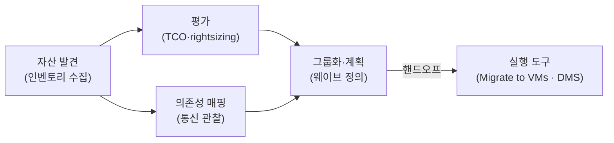
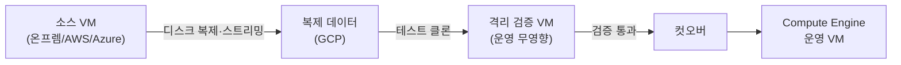
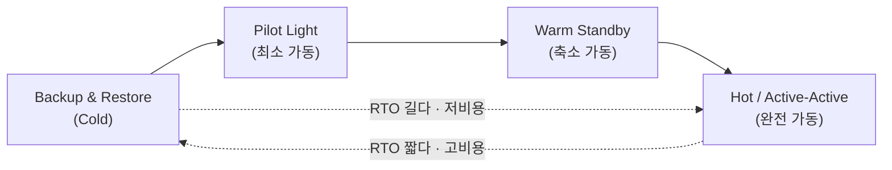

* TOC
{:toc}

> PCA 시험의 마이그레이션·DR 문제는 거의 항상 두 개의 숫자에서 출발한다 — 얼마나 멈춰도 되는가(RTO), 얼마만큼의 데이터를 잃어도 되는가(RPO). 그리고 하나의 제약이 따라붙는다 — 데이터를 옮길 시간과 대역폭이 충분한가. 이 글은 마이그레이션 6R을 GCP 서비스로 매핑하고, 데이터 이동 수단(온라인 vs 오프라인)을 선택 기준으로 정리하며, RTO/RPO 요구치에서 DR 패턴을 역산하는 의사결정 구조를 다룬다. 마이그레이션과 DR을 한 글에 묶는 이유는 단순하다 — 둘 다 "데이터를 어떻게 안전하게, 정해진 시간 안에 옮기고 복구하는가"라는 같은 질문의 다른 얼굴이기 때문이다. 이 글은 PCA 준비 시리즈 10편이다.

---

## 도입 두 숫자와 한 제약

마이그레이션·DR 도메인의 문제는 표면이 다양해도 본질은 좁다.

- **마이그레이션**: "이 워크로드를 GCP로 어떻게 옮기나" → 다운타임 허용치와 변경 의지(그대로 옮길지, 고쳐 옮길지)가 답을 가른다.
- **데이터 전송**: "이만큼의 데이터를 어떻게 보내나" → 데이터량과 대역폭이 온라인/오프라인을 가른다.
- **DR/BCP**: "장애가 나면 어떻게 복구하나" → RTO/RPO 요구치가 DR 패턴을 가른다.

세 질문 모두 "요구사항(숫자·제약) → 선택 기준 → 결론"의 같은 구조다. 암기할 서비스 이름이 많아 보이지만, 실제로 시험이 묻는 것은 "이 요구사항에 어떤 도구가 맞는가"라는 매핑 능력 하나다.

<div class="callout-note">
이 글의 지도: 6R과 GCP 매핑 → Migrate to VMs → Database Migration Service → 데이터 전송(온라인 vs 오프라인) → BigQuery Data Transfer → RTO/RPO 정의 → DR 패턴 4종 → 멀티리전 HA·백업·존/리전 장애 → 의사결정 표 → 케이스 → 퀴즈. 각 축은 "요구사항 → 선택 기준 → 결론"으로 닫는다.
</div>

---

## 마이그레이션 6R과 GCP 매핑

마이그레이션 전략을 분류하는 표준 프레임이 **6R**이다. 원래 Gartner의 5R에서 출발해 업계에서 6개로 정착했다. 각 R은 "원본 워크로드를 얼마나 바꿔서 옮기는가"의 스펙트럼이다.

| 전략 | 의미 | 변경량 | GCP 대표 경로 |
|------|------|--------|--------------|
| **Retire (폐기)** | 더 안 쓰는 워크로드는 옮기지 않고 종료 | 없음 | 마이그레이션 인벤토리에서 제외 |
| **Retain (유지)** | 규제·기술 제약으로 당분간 온프렘 유지 | 없음 | 하이브리드 연결(Interconnect/VPN)로 연동 |
| **Rehost (리호스트, lift-and-shift)** | 코드 변경 없이 그대로 옮김 | 최소 | **Migrate to Virtual Machines**로 VM 이전 |
| **Replatform (리플랫폼, lift-and-reshape)** | 핵심은 유지하되 일부를 관리형으로 교체 | 중간 | 자가관리 DB → **Cloud SQL/AlloyDB**, VM 위 컨테이너 → **GKE/Cloud Run** |
| **Repurchase (리퍼처스, drop-and-shop)** | 기존 제품을 SaaS로 갈아탐 | 높음(구매) | 자체 메일·CRM → SaaS 구독으로 대체 |
| **Refactor / Re-architect (리팩터)** | 클라우드 네이티브로 재설계 | 최대 | 모놀리스 → 마이크로서비스(GKE) + 매니지드 백엔드(Spanner, Pub/Sub, BigQuery) |

GCP 공식 마이그레이션 프레임워크는 이 6R을 더 거칠게 세 갈래로 묶어 설명하기도 한다 — **Lift and shift**(그대로), **Improve and move**(개선하며 이전), **Rip and replace**(폐기 후 재구축). 6R의 Rehost가 lift-and-shift, Replatform/Refactor가 improve-and-move, Repurchase/Re-architect가 rip-and-replace에 대응한다고 보면 된다.

<div class="callout-warning">
시험 함정: <strong>"가장 빠르고 위험이 낮은 초기 이전" = Rehost(lift-and-shift)</strong>, <strong>"클라우드 이점을 최대화하고 운영부담을 줄임" = Replatform/Refactor</strong>. "최소 변경으로 빠르게"인데 Refactor를 고르거나, "관리형 DB로 운영부담 감소"인데 Rehost(VM에 그대로)를 고르면 오답이다. 변경량과 시간·비용·이점은 트레이드오프 관계다.
</div>

마이그레이션 단계(GCP 권장)는 **Assess(평가·인벤토리·TCO) → Plan(기반 구성·랜딩존·네트워크/IAM) → Deploy(이전 실행) → Optimize(최적화·관리형 전환)** 4단계다. 시험에서 "마이그레이션을 시작하기 전 가장 먼저 할 일"을 물으면 답은 거의 항상 **Assess(현황 평가·종속성 파악)**다 — 무엇을, 얼마나, 어떤 종속성으로 옮기는지 모르면 계획을 세울 수 없다.

**결론**: 변경량 스펙트럼으로 6R을 외우고, "최소 변경·빠른 이전 → Rehost", "관리형 전환·운영부담 감소 → Replatform/Refactor"로 매핑하라. 시작점은 항상 Assess다.

---

## Migration Center 자산 평가와 이전 계획의 단일 도구

6R 매핑과 단계론(Assess→Plan→Deploy→Optimize)이 "무엇을 할지"의 틀이라면, 그 **Assess·Plan을 실제로 수행하는 GCP의 통합 도구**가 **Migration Center**다. 마이그레이션을 시작하기 전에 "무엇을, 얼마에, 어떻게 옮길지"를 데이터로 답하는 콘솔이다. 앞 절에서 "시작점은 항상 Assess"라고 했는데, 그 Assess를 손으로가 아니라 도구로 하는 자리가 여기다.

<div class="callout-note">
시험 신호어: <strong>"마이그레이션 전 자산을 평가하고 TCO를 산정"</strong>, <strong>"무엇을 어떻게 이전할지 계획"</strong>, <strong>"온프렘 자산 인벤토리와 GCP 비용 비교"</strong>가 나오면 Migration Center다. 개별 이전 실행 도구(Migrate to VMs·DMS)보다 한 단계 앞, 즉 <strong>평가·계획 단계</strong>의 도구라는 위치를 기억하라.
</div>

### 네 가지 핵심 기능

| 기능 | 하는 일 | 답하는 질문 |
|------|--------|-----------|
| **자산 발견·인벤토리** | 디스커버리 수집(수집 클라이언트) 또는 인벤토리 파일 가져오기로 온프렘·타 클라우드의 VM·사양·사용률을 모은다 | "우리가 가진 게 정확히 무엇인가" |
| **TCO 평가** | 수집한 사용률 기반으로 GCP 예상 비용을 산출하고 현 온프렘 비용과 비교, 적정 머신 타입(rightsizing)을 제안 | "옮기면 얼마이고, 지금보다 싼가" |
| **마이그레이션 그룹화·계획** | 자산을 애플리케이션·웨이브 단위 그룹으로 묶어 이전 순서·범위를 계획 | "무엇을 어떤 순서로 옮기나" |
| **의존성 매핑** | 자산 간 네트워크 통신을 관찰해 종속 관계를 시각화, 함께 옮겨야 할 자산을 식별 | "이걸 옮기면 무엇이 같이 끊기나" |



Migration Center는 결과를 산출하는 도구이지 옮기는 도구가 아니다. 평가·계획이 끝나면 실제 이전은 6R에 맞는 실행 도구(Rehost는 Migrate to VMs, DB는 DMS)로 넘긴다.

<div class="callout-warning">
혼동 주의: Migration Center는 <strong>"평가·계획"</strong>, Migrate to VMs/DMS는 <strong>"실행"</strong>이다. "대규모 자산을 어떤 머신 타입으로, 얼마에 옮길지 산정하라"인데 Migrate to VMs를 고르면 단계가 어긋난 오답이다. 반대로 "이미 평가가 끝났고 VM을 그대로 옮긴다"인데 Migration Center를 고르면 한 단계 뒤로 돌아간 답이다.
</div>

**결론**: 마이그레이션 평가·계획(자산 인벤토리·TCO·그룹화·의존성)의 단일 진입점 = **Migration Center**. 여기서 "무엇을 얼마에 어떻게"를 정한 뒤, 실행은 Migrate to VMs·DMS가 받는다.

---

## 의존성 매핑과 마이그레이션 네트워크 계획

Assess가 얕게 끝나면 "옮길 수 있다고 본 워크로드가 막상 떼어지지 않는" 사고가 난다. 두 가지를 반드시 채워야 한다 — **무엇이 무엇에 묶여 있는가(의존성)**, 그리고 **그 데이터를 옮길 길이 충분한가(네트워크)**다.

**의존성 매핑**은 앱 간 통신과 DB 종속을 그래프로 드러내는 작업이다. 한 서비스만 떼어 옮겼는데 그 서비스가 온프렘 DB나 옆 서비스에 동기 호출로 묶여 있으면, 마이그레이션 직후 지연이 폭증하거나(리전 간 왕복) 기능이 끊긴다. Migration Center의 의존성 매핑이 "함께 움직여야 하는 자산 묶음(무브 그룹)"을 식별하는 이유다. 강하게 결합된 컴포넌트는 같은 웨이브로 묶고, 약하게 결합된 것만 단계적으로 분리한다.

**마이그레이션 네트워크 계획**은 세 질문으로 압축된다. (1) **대역폭** — 옮길 데이터량을 가용 회선으로 나눠 전송 시간이 기한에 드는가(이 글의 데이터 전송 절과 직결). (2) **연결 방식** — 일시적 대량 전송엔 충분한 회선이, 컷오버 후에도 남는 온프렘 자산과의 상시 연동엔 **Cloud VPN 또는 Cloud Interconnect**가 필요하다. 점진 마이그레이션 기간 동안에는 하이브리드 연결을 유지한 채 양쪽이 통신한다. (3) **컷오버 라우팅** — 트래픽을 신구 환경 중 어디로 보낼지의 전환 설계다. DNS TTL을 미리 낮춰 전환을 빠르게 하고, 롤백 시 되돌릴 경로를 남겨 둔다. 하이브리드 연결의 상세 선택 기준은 [[/concept/cloud/03_vpc_for_pca]]에 있다.

<div class="callout-warning">
시험 함정: 점진 마이그레이션 중 온프렘↔GCP 상시 연동을 묻는데 "일회성 대용량 전송 도구(Transfer Appliance 등)"를 고르면 어긋난다. 전송 도구는 데이터를 한 번 옮기는 것이고, 그 뒤에도 남는 통신은 <strong>VPN/Interconnect</strong>의 일이다. 두 축(일시 전송 vs 상시 연동)을 분리하라.
</div>

**결론**: Assess는 의존성 매핑으로 "함께 옮길 묶음"을, 네트워크 계획으로 "옮길 길(대역폭·연결·컷오버 라우팅)"을 확정해야 비로소 안전하다.

---

## 소프트웨어 라이선스 영향과 BYOL

마이그레이션 평가에서 빠지기 쉬운 축이 **소프트웨어 라이선스와 그 재무 영향**이다. 라이선스를 무시하고 옮기면 컴플라이언스 위반이나 라이선스 중복 지출이 발생한다. 핵심 선택은 "라이선스 비용을 어떻게 댈 것인가"다.

<div class="compare-grid">
<div class="compare-col" markdown="1">

**라이선스 포함 이미지 (PAYG)**

- GCP 제공 이미지에 OS·DB 라이선스 비용이 **시간당 요금에 포함**(예: Windows Server, 일부 상용 DB 이미지).
- 보유 라이선스가 없거나, 초기 투자 없이 **사용량만큼** 내고 싶을 때.
- 켜고 끄는 만큼만 과금되어 가변 워크로드에 유리.

</div>
<div class="compare-col" markdown="1">

**BYOL (Bring Your Own License)**

- 이미 보유한 라이선스를 GCP로 **반입**. 별도 라이선스 비용 없이 인프라 요금만 낸다.
- 사용자/디바이스 등 **라이선스 모빌리티(license mobility)** 조건을 충족하면 멀티테넌트 VM에서도 가능.
- **물리 코어·소켓 기반** 라이선스(예: Windows Server Datacenter, SQL Server, Oracle DB)는 물리 하드웨어 점유가 전제 → **sole-tenant 노드**가 필요.

</div>
</div>

### Sole-tenant 노드로 물리 단위 라이선스 충족

물리 코어/소켓 단위로 과금되는 라이선스는 "내 VM이 어느 물리 서버의 몇 코어 위에 있는가"가 라이선스 산정 단위다. 기본 멀티테넌트 VM은 물리 서버를 다른 고객과 공유하므로 이 요건을 증명할 수 없다. **sole-tenant 노드**는 물리 서버 한 대를 전용으로 점유해, 그 노드의 물리 코어 수에 맞춰 라이선스를 가져올 수 있게 한다. 그래서 "물리 코어 기반 라이선스 BYOL"의 정답 신호가 곧 sole-tenant다. sole-tenant 노드 자체의 동작·비용은 [[/concept/cloud/06_compute_for_pca]]에서 다룬다.

| 상황 | 라이선스 전략 |
|------|--------------|
| 보유 라이선스 없음·사용량 기반 과금 선호 | **라이선스 포함 이미지(PAYG)** |
| 사용자/디바이스 라이선스 보유, 모빌리티 조건 충족 | **BYOL(멀티테넌트 VM 가능)** |
| 물리 코어/소켓 기반 라이선스(Windows Datacenter·SQL Server·Oracle 등) 반입 | **BYOL + sole-tenant 노드** |
| 물리적 격리 컴플라이언스까지 요구 | **sole-tenant 노드** |

<div class="callout-warning">
시험 함정: <strong>"보유한 물리 코어 라이선스를 GCP로 가져와 비용을 아끼고 싶다"</strong> → BYOL + <strong>sole-tenant 노드</strong>. 여기서 일반 멀티테넌트 VM을 고르면 물리 단위 라이선스 요건을 못 맞춘다. 반대로 <strong>"보유 라이선스가 없는데"</strong> sole-tenant BYOL을 고르면, 없는 라이선스를 반입하려는 모순이고 PAYG 이미지가 정답이다. 또 sole-tenant는 일반적으로 더 비싸므로, 라이선스·격리 요구가 없는데 비용 절감 목적으로 고르면 오답이다.
</div>

비용 관점에서는 단정하지 말고 비교로 판단한다 — 라이선스 포함 이미지는 라이선스 비용이 인프라 요금에 녹아 사용량에 비례하고, BYOL은 보유 라이선스의 매몰비용을 재활용하는 대신 sole-tenant 같은 전용 인프라 프리미엄이 붙을 수 있다. 보유 라이선스 규모·가동률·sole-tenant 추가 비용을 함께 놓고 TCO로 비교해야 한다(이 비교가 Migration Center TCO 평가의 한 입력이다).

**결론**: 라이선스 없음·가변 워크로드 → **라이선스 포함 이미지**, 보유 라이선스 반입 → **BYOL**, 물리 코어 기반 라이선스 반입·물리 격리 → **sole-tenant 노드**. 어느 쪽이 싼지는 단정하지 말고 TCO로 비교한다.

---

## Migrate to Virtual Machines VM 리호스트의 주력

**Migrate to Virtual Machines**(구 Migrate for Compute Engine, 그 이전 Velostrata)는 온프렘(VMware 등)·AWS·Azure의 VM을 Compute Engine으로 옮기는 GCP 관리형 서비스다. 6R 중 **Rehost(lift-and-shift)**의 대표 도구다.

### 핵심 동작 모델

마이그레이션은 소스 환경에 설치하는 **마이그레이션 커넥터/매니저**가 소스 VM의 디스크를 읽어 GCP로 복제하는 방식으로 동작한다. 두 가지 특성이 시험 포인트다.

- **에이전트리스 vs 에이전트**: VMware vSphere 소스는 일반적으로 **에이전트리스**(게스트 OS에 에이전트 설치 없이 vSphere 레벨에서 디스크 복제)로 동작해 운영 VM에 미치는 영향을 줄인다. 일부 소스/시나리오는 에이전트 기반 복제를 쓴다. "운영 VM에 소프트웨어 설치 없이 옮기고 싶다"는 요구는 에이전트리스 방식의 강점으로 매핑된다.
- **스트리밍 기반 최소 다운타임**: 전체 디스크 복제가 끝나기 전에도 VM을 GCP에서 부팅할 수 있고, 필요한 블록을 백그라운드로 스트리밍하며 점진 동기화한다. 덕분에 컷오버(전환) 다운타임을 줄인다.

### 테스트 클론 컷오버 전 검증

Migrate to VMs의 중요한 기능이 **테스트 클론(test clone)**이다. 운영 소스를 건드리지 않고 GCP 안에 격리된 복제본을 띄워 애플리케이션이 정상 동작하는지 검증한 뒤 실제 컷오버를 진행한다.



<div class="callout-warning">
시험 함정: "마이그레이션 전 운영에 영향 없이 검증하고 싶다" → <strong>테스트 클론</strong>. 테스트 클론은 소스를 계속 가동한 채 GCP 복제본만으로 검증하므로, 검증이 실패해도 롤백이 곧 "기존 온프렘 유지"다. 한 번에 끊고 보는 빅뱅 컷오버보다 위험이 낮다.
</div>

### 적용 기준

| 요구사항 | 적합? |
|---------|-------|
| OS·앱 변경 없이 그대로 GCE로 옮기고 싶다 | Migrate to VMs 적합(Rehost) |
| 운영 VM에 에이전트 설치 부담 최소화 | 에이전트리스(VMware) 강점 |
| 컷오버 다운타임 최소화 | 스트리밍 기반 점진 동기화 |
| 옮기면서 컨테이너/관리형으로 전환 | Migrate to VMs는 부적합 → 별도 리플랫폼(GKE 마이그레이션 등) |

**결론**: "VM을 그대로, 최소 다운타임으로, 운영 영향 없이 검증하며" 옮기는 Rehost = **Migrate to Virtual Machines + 테스트 클론**. 옮기면서 아키텍처를 바꾸는 것은 이 도구의 일이 아니다.

---

## Database Migration Service 다운타임을 줄이는 DB 이전

**Database Migration Service(DMS)**는 관리형(서버리스) DB 마이그레이션 서비스다. 핵심 가치는 **연속 복제(CDC)로 다운타임을 최소화**하는 것이다.

### 동질 vs 이질 마이그레이션

| 구분 | 의미 | 예시 | 특징 |
|------|------|------|------|
| **동질(homogeneous)** | 같은 엔진끼리 | MySQL → Cloud SQL for MySQL, PostgreSQL → Cloud SQL/AlloyDB for PostgreSQL | 스키마 변환 불필요, 네이티브 복제 활용 |
| **이질(heterogeneous)** | 다른 엔진으로 | Oracle → PostgreSQL/AlloyDB, SQL Server → PostgreSQL | **스키마·코드 변환** 필요(변환 워크스페이스) |

동질 마이그레이션은 소스 엔진의 네이티브 복제 메커니즘(예: MySQL binlog, PostgreSQL 논리 복제)을 이용한다. 이질 마이그레이션은 데이터 타입·SQL 방언·스토어드 프로시저가 다르므로 **변환(conversion)** 과정이 추가되며, 자동 변환되지 않는 객체는 수동 보정이 필요하다.

### 연속 복제로 다운타임 최소화

DMS의 표준 흐름은 **초기 적재(full dump) → 연속 변경 복제(CDC) → 컷오버**다.

```mermaid
flowchart LR
  SRC["소스 DB<br/>(가동 중)"] -->|1. 초기 스냅샷| DEST["대상 DB<br/>(Cloud SQL/AlloyDB)"]
  SRC -->|2. 연속 변경(CDC)<br/>지속 복제| DEST
  DEST -->|3. 지연 0 근접 시<br/>컷오버| APP["앱 연결 전환"]
```

초기 적재 후에도 소스의 변경분을 실시간 복제하므로, 컷오버 시점에는 소스를 잠깐 멈추고(또는 쓰기 차단) 잔여 변경만 흘려보낸 뒤 앱 연결을 대상으로 돌린다. 다운타임이 "전체 데이터 복사 시간"이 아니라 "잔여 변경 따라잡기 + 연결 전환 시간"으로 줄어든다.

<div class="callout-warning">
시험 함정: "대용량 운영 DB를 <strong>최소 다운타임</strong>으로 Cloud SQL로 옮겨라" → <strong>DMS의 연속 복제</strong>. 여기서 "한 번 덤프 받아 import"를 고르면 덤프·복원 시간만큼 다운타임이 생겨 오답이다. 반대로 "일회성·소규모·다운타임 허용"이면 굳이 연속 복제까지 갈 필요 없이 export/import도 답이 될 수 있다.
</div>

<details>
<summary>심화 DMS 사전 요구사항과 제약 (검증 필요)</summary>
<div markdown="1">

연속 복제를 켜려면 소스 DB에서 복제 전제 조건을 맞춰야 한다 — 예를 들어 MySQL은 binlog(행 기반) 활성화, PostgreSQL은 논리 복제(`wal_level=logical`) 설정과 복제 권한, 그리고 모든 테이블의 기본키/복제 식별자 요건 등이다. 이질 마이그레이션의 자동 변환 커버리지, 지원 소스·대상 엔진 버전 조합, 네트워크 연결 방식(IP 허용목록/VPC 피어링/리버스 프록시)은 시기·엔진에 따라 달라지므로 정확한 전제 조건과 지원 매트릭스는 GCP 공식 문서로 재확인 권장.

</div>
</details>

**결론**: "운영 중인 DB를 최소 다운타임으로" = **DMS 연속 복제**. 같은 엔진이면 동질(변환 불필요), 엔진을 바꾸면 이질(변환 필요). 다운타임을 허용하면 복제 없는 단순 import도 후보다.

---

## 데이터 전송 온라인 vs 오프라인

대량 데이터를 GCS로 옮길 때 시험은 거의 항상 **데이터량 × 대역폭 → 전송 방식**을 묻는다. 네 가지 도구의 경계를 분명히 한다.

<div class="compare-grid">
<div class="compare-col" markdown="1">

**온라인 전송**

- **gcloud storage / gsutil**: 소규모·일회성. 스크립트로 직접 업로드. 수백 GB 이하·간단한 경우.
- **Storage Transfer Service(STS)**: 관리형 대량 온라인 전송. 클라우드 간(S3·Azure Blob·타 GCS)과 온프렘(전송 에이전트 설치) 소스를 스케줄·재시도·검증과 함께 옮김.

네트워크로 충분히 빨리 옮길 수 있을 때.

</div>
<div class="compare-col" markdown="1">

**오프라인 전송**

- **Transfer Appliance**: Google이 물리 저장 장치를 배송 → 온프렘에서 데이터 적재 → 반송 → Google이 GCS로 업로드.

대역폭이 부족하거나, 온라인이면 **너무 오래 걸리는** 대용량일 때. "네트워크로 옮기면 수 주~수개월"이 신호.

</div>
</div>

### 선택 기준 데이터량과 대역폭, 그리고 시간

핵심은 "네트워크로 옮기는 데 걸리는 시간"이다. 데이터량과 가용 대역폭으로 전송 시간을 추정하고, 그 시간이 사업적으로 감당 가능한지로 결정한다.

| 상황 | 권장 방식 |
|------|----------|
| 수백 GB 이하·일회성·간단 | **gcloud storage / gsutil** |
| 대량·온라인으로 현실적 시간 내 가능·반복/스케줄 필요·클라우드 간 | **Storage Transfer Service** |
| 대용량인데 대역폭 부족 → 온라인이면 수 주~수개월 | **Transfer Appliance** |
| 온프렘에서 GCS로 지속 동기화 | **STS(전송 에이전트)** |

<div class="callout-note">
대략적 감각: 같은 데이터라도 대역폭이 10배면 전송 시간이 10분의 1이다. 예를 들어 100 TB를 기가비트(1 Gbps)급 회선으로 온전히 쓴다 해도 며칠이 걸리고, 회선이 수십 Mbps면 수개월로 늘어난다. 정확한 산정은 "데이터량 ÷ 실효 대역폭"으로 직접 계산하되, 실효 대역폭은 이론치보다 낮음을 감안한다. 구체 수치는 회선·오버헤드에 따라 달라지므로 단정하지 말 것.
</div>

<div class="callout-warning">
시험 함정 1순위: <strong>"대용량 + 저대역폭 + 마감 기한"</strong>이면 Transfer Appliance다. 여기서 "회선을 증설하거나 gsutil 병렬 업로드"를 고르면, 증설 리드타임·전송 기간이 기한을 넘겨 오답이 되는 구성이다. 반대로 데이터가 크지 않거나 대역폭이 충분한데 Transfer Appliance(배송 왕복 수일~수주)를 고르면 과한 선택이다.
</div>

<details>
<summary>심화 Transfer Appliance 용량과 보안 (검증 필요)</summary>
<div markdown="1">

Transfer Appliance는 용량이 다른 여러 모델로 제공되며(수십 TB급과 수백 TB급), 데이터는 전송·보관 중 암호화된다. 정확한 모델별 사용 가능 용량·배송 리드타임·요금·리전 가용성은 시기에 따라 바뀌므로 GCP 공식 문서로 확인 권장. 시험에서는 모델별 정확한 TB 수치를 묻기보다 "대역폭이 부족한 대용량 = 오프라인(Appliance)"의 판단을 묻는 경우가 일반적이다.

</div>
</details>

### gsutil/네트워크 전송과 STS의 경계

`gcloud storage`(구 gsutil)와 STS는 둘 다 온라인이지만 역할이 다르다.

| 측면 | gcloud storage / gsutil | Storage Transfer Service |
|------|------------------------|--------------------------|
| 성격 | CLI 직접 업로드 | 관리형 전송 서비스 |
| 규모 | 소~중규모, 임의 스크립트 | 대규모, 수억 객체 |
| 스케줄·재시도·검증 | 직접 구현 | 내장 |
| 소스 | 로컬·온프렘 | 타 클라우드(S3·Azure)·타 GCS·온프렘(에이전트) |

**결론**: 소규모·임시 = **gsutil**, 관리형 대량 온라인·반복·클라우드 간 = **STS**, 대역폭 부족 대용량 = **Transfer Appliance**. 판단의 축은 항상 "데이터량 ÷ 대역폭 = 시간"이 사업 기한 안에 드는가다.

---

## BigQuery Data Transfer Service 분석 데이터 적재의 자동화

**BigQuery Data Transfer Service(BQ DTS)**는 위의 전송 도구들과 결이 다르다. 범용 파일/디스크 이전이 아니라, **분석용 데이터를 BigQuery로 정기 적재**하는 관리형 스케줄러다.

- **소스**: Google Ads·Campaign Manager·YouTube·Google Play 같은 Google SaaS, 그리고 Amazon S3·Redshift·Azure Blob, Teradata 등.
- **동작**: 예약된 주기로 자동 적재(증분 포함). 파이프라인을 직접 짜지 않고 설정으로 반복 적재를 맡긴다.

<div class="callout-warning">
혼동 주의: <strong>BQ DTS는 "BigQuery로 분석 데이터를 정기 적재"</strong>하는 도구다. 온프렘 파일·VM 디스크를 GCS로 옮기는 것은 STS/Transfer Appliance의 일이고, 운영 DB 이전은 DMS의 일이다. "Redshift/Teradata의 데이터 웨어하우스를 BigQuery로 옮긴다"처럼 분석 시스템 → BQ 맥락에서 BQ DTS가 등장한다.
</div>

**결론**: SaaS·타 DW(Redshift/Teradata)·타 클라우드 스토리지에서 **BigQuery로 정기/일괄 적재** = **BQ DTS**. 범용 객체 전송(STS)·DB 이전(DMS)과 구분하라.

---

## DR과 BCP RTO와 RPO부터

여기서부터 재해복구다. 모든 DR 설계의 출발점은 두 숫자다.

| 지표 | 정의 | 한 줄 요약 | 질문 |
|------|------|-----------|------|
| **RTO** (Recovery Time Objective) | 장애 발생 후 복구까지 허용되는 **최대 시간** | "얼마나 멈춰도 되나" | 복구 속도 |
| **RPO** (Recovery Point Objective) | 복구 시점 기준 허용되는 **최대 데이터 손실(시간 환산)** | "얼마만큼의 데이터를 잃어도 되나" | 데이터 신선도 |

예를 들어 RTO 4시간·RPO 1시간이면, 장애 시 4시간 안에 서비스를 되살려야 하고 마지막 1시간 사이의 데이터는 잃어도 된다는 뜻이다. **RPO는 백업/복제 주기**가, **RTO는 복구 절차의 속도(대기 인프라 유무)**가 좌우한다.

<div class="callout-warning">
시험 핵심: <strong>RPO ≈ 0(데이터 손실 0)</strong>이면 비동기 백업으로는 불가능하다. <strong>동기 복제</strong>(쓰기를 두 곳에 동시 확정) 또는 RPO=0을 보장하는 멀티리전 서비스(예: 다중 리전 Spanner)가 필요하다. <strong>RTO ≈ 0(무중단)</strong>이면 미리 가동 중인 대기 인프라, 즉 hot standby/active-active가 필요하다. "RPO 0인데 일 1회 백업", "RTO 분 단위인데 backup-and-restore"는 즉시 오답.
</div>

RTO/RPO는 공짜가 아니다 — 작을수록(복구가 빠르고 손실이 적을수록) 비용이 가파르게 오른다. DR 설계는 "사업이 요구하는 RTO/RPO를 가장 싸게 만족하는 패턴"을 찾는 최적화다. 그 패턴 4종이 다음 절이다.

---

## DR 패턴 4종과 트레이드오프

DR 패턴은 "평상시 대기 인프라를 얼마나 띄워 두는가"의 스펙트럼이다. 띄워 둘수록 복구가 빠르고(RTO↓) 비용이 높다.



| 패턴 | 평상시 대기 인프라 | 대략적 RTO | 대략적 RPO | 상대 비용 | 언제 |
|------|------------------|-----------|-----------|----------|------|
| **Backup & Restore (Cold)** | 없음(백업 데이터만 보관) | 길다(시간~일) | 백업 주기에 의존 | 최저 | 다운타임 넉넉, 비용 최우선 |
| **Pilot Light** | 핵심 최소 구성만 상시 가동(DB 복제 등), 나머지는 꺼 둠 | 중간(분~시간) | 복제면 작게 | 낮음 | 핵심 데이터는 살리되 비용 절감 |
| **Warm Standby** | 축소 규모로 상시 가동, 장애 시 스케일업 | 짧다(분 단위) | 작다 | 중간 | 빠른 복구 필요, 완전 이중화는 부담 |
| **Hot / Multi-site Active-Active** | 완전 규모로 양쪽 동시 운영 | 거의 0(무중단) | 0에 근접(동기 복제 시) | 최고 | 미션 크리티컬, 무중단 요구 |

각 패턴의 판단 포인트.

- **Backup & Restore**: 평상시 비용이 거의 백업 스토리지뿐이라 가장 싸다. 대신 복구 시 인프라를 새로 띄우고 데이터를 복원하므로 RTO가 길다. RPO는 백업 주기(예: 일 1회면 최대 24시간 손실).
- **Pilot Light**: 데이터 계층(DB)만 복제로 항상 켜 두고, 컴퓨트는 꺼 두거나 최소만 둔다. 장애 시 컴퓨트를 띄워 데이터에 붙인다. "불씨만 살려둔다"는 비유. RPO는 데이터 복제 방식에 따른다.
- **Warm Standby**: 축소된 규모지만 전체 스택이 항상 돌아간다. 장애 시 트래픽을 받고 스케일업한다. RTO가 분 단위로 짧다.
- **Hot / Active-Active**: 두(이상) 리전이 동시에 실서비스를 처리한다. 한쪽이 죽어도 다른 쪽이 받으므로 RTO가 사실상 0. 동기 복제·다중 리전 서비스를 쓰면 RPO도 0에 근접. 가장 비싸고 설계가 복잡(데이터 일관성·충돌).

<div class="callout-warning">
함정: 비용-복구속도는 <strong>정비례 트레이드오프</strong>다. "비용은 최소인데 RTO도 분 단위"는 성립하지 않는다. 문제가 RTO/RPO와 예산을 함께 주면, <strong>요구 RTO/RPO를 만족하는 가장 싼 패턴</strong>이 정답이다 — 더 비싼(더 hot한) 패턴은 요구를 초과 충족하지만 비용 기준에서 탈락한다.
</div>

### RTO/RPO 요구치에서 DR 패턴 역산하기

| 요구 RTO | 요구 RPO | 권장 패턴 | GCP 구성 예 |
|----------|----------|----------|------------|
| 수 시간~일 허용 | 수 시간~일 허용 | **Backup & Restore** | GCS(다중/이중 리전)에 백업, PD 스냅샷, Backup and DR Service |
| 분~시간 | 작게(복제) | **Pilot Light** | 타 리전에 DB 교차 리전 복제본 상시, 컴퓨트는 템플릿/이미지로 대기 |
| 분 단위 | 작게 | **Warm Standby** | 타 리전에 축소 MIG + LB, 장애 시 오토스케일·트래픽 전환 |
| ≈ 0 (무중단) | ≈ 0 | **Hot / Active-Active** | 멀티리전 글로벌 LB + 다중 리전 Spanner(또는 동기 복제), 양 리전 동시 서빙 |

<div class="callout-note">
RPO를 다시 강조: <strong>RPO를 0으로 만드는 것은 패턴이 아니라 데이터 복제 방식</strong>이다. 비동기 복제는 복제 지연만큼 RPO가 생긴다. RPO 0이 필요하면 동기 복제(쓰기를 두 곳에 동시 확정)나 다중 리전에서 RPO 0을 보장하는 서비스가 필요하며, 이는 지연·비용 증가를 동반한다. Hot 패턴이라도 복제가 비동기면 RPO가 0이 아닐 수 있다.
</div>

**결론**: DR은 "RTO/RPO → 패턴" 역산이다. 손실 0(RPO 0)·무중단(RTO 0)은 active-active + 동기/다중리전, 비용 최우선·다운타임 허용은 backup-and-restore. 그 사이를 pilot light와 warm standby가 메운다.

---

## 멀티리전 HA 설계와 백업, 장애 범위

DR 패턴을 GCP 위에 올리려면 "장애 범위(존 vs 리전)"와 "리소스의 가용성 경계"를 알아야 한다.

### 존 장애 vs 리전 장애

| 장애 범위 | 대비 방법 | 핵심 |
|----------|----------|------|
| **존(Zone) 장애** | 같은 리전 내 **여러 존**에 분산(regional/multi-zone 배치) | HA의 1차 방어선. 리전 내 이중화 |
| **리전(Region) 장애** | **여러 리전**에 분산 또는 교차 리전 복제 | DR의 본령. 멀티리전·교차 리전 복제 |

<div class="callout-warning">
시험 함정: <strong>존 단위 HA와 리전 단위 DR을 혼동하지 말 것.</strong> "한 존이 죽어도 서비스 지속"은 리저널 배치(여러 존)로 풀고, "한 리전 전체가 죽어도 지속"은 멀티리전/교차 리전 복제가 필요하다. 리전 장애 대비를 묻는데 "다른 존에 인스턴스 추가"를 고르면 오답이다.
</div>

### 리소스의 가용성 경계 정리

- **Zonal**: 단일 존에 묶임(예: 단일 VM, 존 PD). 존 장애 시 영향.
- **Regional**: 리전 내 여러 존에 걸침(예: Regional MIG, Regional PD, Cloud SQL HA 구성).
- **Multi-regional / Global**: 여러 리전 또는 전역(예: GCS 멀티리전/이중 리전 버킷, 글로벌 외부 LB, 다중 리전 Spanner).

<div class="callout-warning">
시험 단골: <strong>Cloud SQL의 HA 구성은 "리전 내" 보호</strong>다 — 기본(primary)과 대기(standby)를 같은 리전의 다른 존에 두고 동기 복제해 <strong>존 장애</strong>를 막는다. 이것은 <strong>리전 장애 DR이 아니다.</strong> 리전 장애까지 대비하려면 <strong>다른 리전에 교차 리전 읽기 복제본</strong>을 두고, 장애 시 이를 승격(promote)해야 한다. "Cloud SQL HA면 리전 장애도 안전"은 오답.
</div>

데이터 서비스별 멀티리전 옵션을 한눈에.

| 서비스 | 리전 장애 대비 옵션 | RPO 특성 |
|--------|-------------------|----------|
| **Cloud SQL** | 교차 리전 읽기 복제본 → 장애 시 승격 | 비동기 복제 → RPO > 0(복제 지연만큼) |
| **Spanner** | **다중 리전 구성**(여러 리전에 동기 복제) | 강한 일관성·RPO 0 근접 |
| **GCS** | **멀티리전/이중 리전 버킷** | 리전 간 자동 복제(객체) |
| **BigQuery** | 데이터셋의 멀티리전 위치(예: US/EU) | 위치 정책에 따른 복제 |
| **Persistent Disk** | 스냅샷(스토리지 위치 지정 가능), Regional PD(두 존 동기) | 스냅샷 주기에 의존 |

<div class="callout-note">
RPO 0 + 멀티리전 + 강한 일관성을 한 번에 요구하면 관계형 영역에서는 <strong>Spanner의 다중 리전 구성</strong>이 정답 신호다. Cloud SQL 교차 리전 복제는 비동기라 약간의 RPO가 생긴다 — "글로벌·강일관·무손실"이면 Spanner를 떠올려라.
</div>

### 백업 전략

- **Persistent Disk 스냅샷**: 증분 스냅샷으로 디스크 백업. 스냅샷은 리전/멀티리전 스토리지에 보관(위치 지정 가능)하므로, 한 존/리전 디스크가 죽어도 스냅샷에서 복원 가능.
- **GCS 백업 + 라이프사이클**: 백업 객체를 다중/이중 리전 버킷에 저장하고, Nearline/Coldline/Archive로 라이프사이클 전환해 보관 비용 절감.
- **Backup and DR Service**: 관리형 백업·복구 서비스로 VM·DB 등의 백업을 중앙 관리(백업 보관·복구 자동화).
- **DB 자동 백업 + PITR**: Cloud SQL 등은 자동 백업과 특정 시점 복구(Point-in-Time Recovery)를 제공해 RPO를 줄인다.

<div class="callout-warning">
백업 함정: <strong>백업은 복원 테스트를 해야 백업이다.</strong> 그리고 백업을 원본과 같은 리전에만 두면 리전 장애 시 함께 잃을 수 있다 — DR용 백업은 <strong>다른 리전(또는 멀티리전 버킷)</strong>에 두는 것이 원칙이다. "리전 DR인데 백업이 같은 리전"은 설계 결함.
</div>

**결론**: 존 장애 = 리전 내 다중 존, 리전 장애 = 멀티리전/교차 리전 복제. Cloud SQL HA는 존 보호일 뿐 리전 DR이 아니며, RPO 0 글로벌 관계형은 Spanner 다중 리전. 백업은 다른 리전에 두고 복원을 검증한다.

---

## 시험장에서 의사결정 표

요구사항 키워드를 도구로 매핑하는 치트시트다. 이 표가 본편의 핵심 자산이다.

### 마이그레이션 매핑

| 요구사항 키워드 | 정답 |
|----------------|------|
| 최소 변경·빠른 이전·VM 그대로 | **Rehost = Migrate to Virtual Machines** |
| 운영 VM에 에이전트 설치 부담 최소화 | **에이전트리스(VMware)** |
| 컷오버 전 운영 무영향 검증 | **테스트 클론** |
| 자가관리 DB → 관리형, 최소 다운타임 | **DMS 연속 복제(CDC)** |
| 엔진 변경(Oracle→Postgres 등) | **DMS 이질 마이그레이션(변환)** |
| 옮기면서 관리형/컨테이너로 전환 | **Replatform/Refactor** (Cloud SQL/GKE 등) |
| 마이그레이션 착수 첫 단계 | **Assess(평가·인벤토리·종속성)** |
| 자산 평가·TCO 산정·이전 계획 도구 | **Migration Center** |
| 자산 간 종속성 파악·함께 옮길 그룹 식별 | **Migration Center 의존성 매핑** |
| 물리 코어/소켓 라이선스 BYOL | **BYOL + sole-tenant 노드** |
| 보유 라이선스 없음·사용량 기반 과금 | **라이선스 포함 이미지(PAYG)** |

### 데이터 전송 매핑

| 요구사항 키워드 | 정답 |
|----------------|------|
| 소규모·일회성·스크립트 업로드 | **gcloud storage / gsutil** |
| 관리형 대량 온라인·반복·클라우드 간 | **Storage Transfer Service** |
| 대용량 + 저대역폭 + 기한 | **Transfer Appliance(오프라인)** |
| SaaS/Redshift/Teradata → BigQuery 정기 적재 | **BigQuery Data Transfer Service** |

### DR 매핑

| 요구사항 키워드 | 정답 |
|----------------|------|
| 다운타임 넉넉·비용 최우선 | **Backup & Restore** |
| 핵심 데이터만 상시 복제·비용 절감 | **Pilot Light** |
| 분 단위 복구·완전 이중화 부담 | **Warm Standby** |
| 무중단(RTO≈0) | **Hot / Active-Active** |
| 데이터 손실 0(RPO≈0) | **동기 복제 / 다중 리전 Spanner** |
| 존 장애 대비 | **리전 내 다중 존(Regional 배치)** |
| 리전 장애 대비 | **멀티리전 / 교차 리전 복제** |
| 글로벌·강일관·무손실 관계형 | **Spanner 다중 리전** |
| Cloud SQL 리전 장애 대비 | **교차 리전 읽기 복제본 → 승격** |

---

## 실전 케이스로 굳히기

| 케이스 | 상황 | 매핑 |
|--------|------|------|
| 1. 데이터센터 종료 | 200대 VM을 6주 안에 GCP로, 코드 변경 없이 | Assess(인벤토리) → Migrate to VMs(Rehost) + 테스트 클론, 컷오버 단계화 |
| 2. 운영 MySQL 이전 | 5 TB 운영 MySQL을 거의 무중단으로 Cloud SQL로 | DMS 동질 + 연속 복제(CDC), 지연 0 근접 시 컷오버 |
| 3. 대용량 아카이브 | 500 TB 영상 아카이브, 회선 100 Mbps, 마감 1개월 | Transfer Appliance(온라인이면 수개월 → 기한 초과) |
| 4. 글로벌 금융 원장 | 다중 리전 강일관, 데이터 손실 0, 무중단 | Spanner 다중 리전 + 글로벌 LB(Active-Active) |
| 5. 내부 보고 시스템 DR | RTO 8시간·RPO 24시간 허용, 예산 빠듯 | Backup & Restore(다른 리전 GCS 백업 + 스냅샷) |

케이스 3과 5가 함정이다. 3은 "회선이 있으니 STS로"가 유혹이지만 500 TB ÷ 100 Mbps는 수개월이라 기한을 넘긴다 → 오프라인. 5는 "안전하게 warm standby"가 과한 선택이다 — 요구 RTO 8시간·RPO 24시간은 backup-and-restore로 충분하고 예산 기준에서 그게 정답이다. **요구를 초과 충족하는 더 비싼 패턴은 비용 기준에서 탈락한다.**

---

## 마무리

마이그레이션·DR 문제는 두 숫자(RTO·RPO)와 한 제약(데이터량 ÷ 대역폭 = 시간)으로 수렴한다. 서비스 이름이 많아 보여도, 묻는 것은 "이 요구사항에 어떤 도구·패턴이 맞는가"라는 매핑 하나다.

<div class="callout-tip">
DR 문제 = <strong>RTO/RPO 역산 문제</strong>. RPO 0 → 동기 복제/다중 리전, RTO 0 → hot/active-active, 비용 최우선·다운타임 허용 → backup-and-restore. 전송 문제 = <strong>데이터량 ÷ 대역폭 = 시간</strong>이 기한 안에 드는가. 마이그레이션 문제 = <strong>변경량 스펙트럼(6R)</strong>에서 다운타임·이점 요구에 맞는 R 고르기.
</div>

시험 직전에 훑을 **함정 9쌍**:

| 혼동 쌍 | 핵심 구분선 |
|---------|------------|
| Rehost vs Replatform/Refactor | 최소변경·빠름=Rehost / 관리형전환·이점최대=Replatform·Refactor |
| Migrate to VMs vs DMS | VM 리호스트=Migrate to VMs / DB 이전=DMS |
| DMS 연속복제 vs 단순 import | 최소 다운타임=CDC 연속복제 / 다운타임 허용=export·import |
| 동질 vs 이질 마이그레이션 | 같은 엔진=변환 불필요 / 엔진 변경=변환 필요 |
| STS vs Transfer Appliance | 온라인으로 기한 내=STS / 저대역폭 대용량=Appliance(오프라인) |
| STS vs BQ DTS | 범용 객체 전송=STS / BigQuery 정기 적재=BQ DTS |
| RTO vs RPO | RTO=복구까지 시간(멈춤) / RPO=허용 데이터 손실(시간) |
| 비용 vs 복구속도 | 정비례 트레이드오프 — 요구를 만족하는 가장 싼 패턴이 정답 |
| 존 장애 vs 리전 장애 | 존=리전 내 다중 존 / 리전=멀티리전·교차 리전 복제(Cloud SQL HA는 존 보호일 뿐) |

다음 편 **11편 운영과 비용 최적화**에서는 옮기고 복구한 워크로드를 어떻게 모니터링·관측하고, SLO/SLI로 신뢰성을 관리하며, CUD·Spot·라이프사이클로 비용을 깎는지를 다룬다. DR 비용 설계가 비용 최적화 도메인과 직접 맞물린다.

---

## 실전 퀴즈 핵심 개념 검증

각 문제는 PCA 시험의 실제 출제 패턴을 따른다. 정답을 고른 뒤 해설을 펼쳐 확인하라.

---

**Q1. 데이터 전송 방식 선택 데이터량과 대역폭**

미디어 회사가 온프렘에 480 TB의 영상 아카이브를 보유하고 있고, 인터넷 회선은 가용 대역폭이 약 100 Mbps다. 이 데이터를 4주 안에 GCS로 옮겨야 한다. 가장 적합한 방식은?

- (A) gcloud storage(gsutil)로 병렬 업로드한다.
- (B) Storage Transfer Service로 온라인 전송 작업을 스케줄한다.
- (C) Transfer Appliance를 신청해 오프라인으로 옮긴다.
- (D) BigQuery Data Transfer Service로 적재한다.

<details>
<summary>정답 및 해설</summary>
<div markdown="1">

**정답: (C)**

480 TB를 100 Mbps 회선으로 옮기면 이론상으로도 수백 시간을 훨씬 넘겨 수개월 규모가 된다(실효 대역폭은 이론치보다 낮아 더 길다). 4주 기한을 온라인으로는 맞출 수 없다 → **Transfer Appliance(오프라인)**.

| 선택지 | 문제점 |
|--------|--------|
| (A) | gsutil은 소규모용. 병렬화해도 회선 대역폭 자체가 병목이라 기한 초과 |
| (B) | STS도 온라인이라 같은 대역폭 한계. 관리는 편하지만 시간 문제는 못 푼다 |
| (C) | 저대역폭 + 대용량 + 기한 → 오프라인 전송이 정답 |
| (D) | BQ DTS는 BigQuery 분석 적재용. 영상 파일 아카이브 이전과 무관 |

판단 축: **데이터량 ÷ 대역폭 = 전송 시간**이 기한을 넘으면 오프라인.

</div>
</details>

---

**Q2. 최소 다운타임 DB 마이그레이션**

운영 중인 2 TB PostgreSQL을 Cloud SQL for PostgreSQL로 옮겨야 한다. 비즈니스 요구는 "다운타임 최소화"이며 서비스는 24시간 가동 중이다. 가장 적합한 방법은?

- (A) `pg_dump`로 덤프 후 새 Cloud SQL 인스턴스에 import한다.
- (B) Database Migration Service로 초기 적재 후 연속 복제(CDC)를 켜고, 지연이 0에 근접하면 컷오버한다.
- (C) Transfer Appliance로 DB 파일을 통째로 옮긴다.
- (D) Storage Transfer Service로 데이터 디렉터리를 GCS에 복사한 뒤 복원한다.

<details>
<summary>정답 및 해설</summary>
<div markdown="1">

**정답: (B)**

"운영 중 + 최소 다운타임"의 정답 신호는 **DMS 연속 복제(CDC)**다. 초기 스냅샷 후 변경분을 실시간 복제하므로, 컷오버 시점에는 잔여 변경만 따라잡고 연결만 전환하면 된다. 다운타임이 "전체 복사 시간"에서 "잔여 따라잡기 + 전환"으로 줄어든다. PostgreSQL → Cloud SQL은 **동질** 마이그레이션이라 스키마 변환도 불필요하다.

| 선택지 | 문제점 |
|--------|--------|
| (A) | 덤프·복원 시간 = 다운타임. 2 TB면 다운타임이 길어 요구 위반 |
| (C) | Transfer Appliance는 객체/파일 오프라인 전송용. 운영 DB의 일관된 이전 도구가 아님 |
| (D) | DB 데이터 디렉터리 파일 복사는 일관성·복제를 보장하지 못함. DB 이전의 정석이 아님 |

</div>
</details>

---

**Q3. RTO/RPO에서 DR 패턴 역산**

내부 분석 대시보드 시스템의 DR 요구는 RTO 6시간, RPO 24시간이며, 경영진은 평상시 DR 비용을 최소화하라고 못박았다. 가장 적합한 DR 패턴은?

- (A) Hot / Active-Active 멀티리전 구성
- (B) Warm Standby(타 리전 축소 가동)
- (C) Backup & Restore(다른 리전에 일 1회 백업 보관)
- (D) Pilot Light(타 리전 DB 상시 복제)

<details>
<summary>정답 및 해설</summary>
<div markdown="1">

**정답: (C)**

요구 RTO 6시간·RPO 24시간은 **넉넉한** 수치다. 일 1회 백업이면 RPO 24시간을 만족하고, 6시간 안에 인프라를 띄워 복원하면 RTO를 만족한다. 비용 최소화 제약까지 고려하면 평상시 대기 인프라가 없는 **Backup & Restore**가 정답이다. 단, 백업은 **다른 리전**(또는 멀티리전 버킷)에 둬야 리전 장애에 대비된다.

| 선택지 | 문제점 |
|--------|--------|
| (A) | 무중단·무손실용. 요구를 크게 초과 충족하지만 비용 최대 → 비용 제약 위반 |
| (B) | 분 단위 RTO용. 요구(6시간)에 비해 과한 상시 비용 |
| (D) | 핵심 DB 상시 복제는 RTO 6시간에 비해 과함. 비용 기준에서 backup-and-restore에 밀림 |

핵심: **요구를 만족하는 가장 싼 패턴이 정답.** 더 hot한 패턴은 요구를 초과하지만 비용에서 탈락한다.

</div>
</details>

---

**Q4. RPO 0 + 글로벌 강일관**

글로벌 결제 원장 서비스를 설계한다. 요구는 (1) 여러 대륙에서 강한 일관성으로 읽기/쓰기, (2) 리전 장애 시 데이터 손실 0(RPO 0), (3) 무중단(RTO≈0)이다. 데이터 계층으로 가장 적합한 것은?

- (A) Cloud SQL HA 구성(같은 리전 다른 존 동기 복제)
- (B) Cloud SQL + 다른 리전 비동기 읽기 복제본
- (C) 다중 리전 구성의 Cloud Spanner
- (D) 단일 리전 BigQuery 데이터셋

<details>
<summary>정답 및 해설</summary>
<div markdown="1">

**정답: (C)**

"글로벌 + 강한 일관성 + RPO 0 + 무중단"을 관계형으로 동시에 만족하는 신호는 **다중 리전 Spanner**다. 여러 리전에 동기 복제하면서 강한 일관성을 유지해 RPO 0에 근접하고, 한 리전이 죽어도 서비스가 지속된다.

| 선택지 | 문제점 |
|--------|--------|
| (A) | Cloud SQL HA는 **리전 내 존 보호**일 뿐 — 리전 장애 대비가 아님 |
| (B) | 교차 리전 복제본은 **비동기** → 복제 지연만큼 RPO > 0. 손실 0 요구 위반 |
| (C) | 다중 리전 동기 복제 + 강일관 → 요구 충족 |
| (D) | BigQuery는 분석용 DW. 강일관 트랜잭션 원장에 부적합하고 단일 리전은 리전 장애에 취약 |

함정 핵심: Cloud SQL HA(A)와 교차 리전 비동기 복제(B)를 RPO 0과 혼동하지 말 것.

</div>
</details>

---

**Q5. 존 장애 vs 리전 장애**

한 리전의 단일 존에 Compute Engine VM과 Cloud SQL(HA 미구성)으로 서비스가 돌아간다. 아키텍트가 "리전 전체 장애가 나도 서비스가 지속돼야 한다"는 요구를 받았다. 올바른 대응은?

- (A) 같은 리전의 다른 존에 VM을 추가하고 Cloud SQL HA를 켠다.
- (B) 다른 리전에 워크로드를 복제(교차 리전 복제본/멀티리전 배치)하고 글로벌 LB로 트래픽을 분산한다.
- (C) VM 인스턴스 크기를 키우고 가용성을 높인다.
- (D) Persistent Disk 스냅샷 주기를 1시간으로 줄인다.

<details>
<summary>정답 및 해설</summary>
<div markdown="1">

**정답: (B)**

요구는 **리전 장애** 대비다. 같은 리전 안의 어떤 조치(다른 존·HA·인스턴스 확대)도 리전 전체가 죽으면 함께 죽는다. 리전 장애를 견디려면 **다른 리전**에 복제·배치하고 트래픽을 전환할 수단(글로벌 LB)이 필요하다.

| 선택지 | 문제점 |
|--------|--------|
| (A) | 다른 존·Cloud SQL HA는 **존 장애** 보호. 리전 전체 장애에는 무력 |
| (B) | 다른 리전 복제 + 글로벌 LB → 리전 장애에도 지속. 정답 |
| (C) | 단일 존 안의 성능 강화일 뿐, 가용성 경계를 넓히지 못함 |
| (D) | 스냅샷은 백업(RPO 개선)이지 리전 장애 시 자동 지속성을 주지 않음 |

핵심: **존 장애 = 리전 내 다중 존, 리전 장애 = 멀티리전/교차 리전.** Cloud SQL HA는 존 보호임을 기억하라.

</div>
</details>

---

**Q6. 마이그레이션 착수 전 자산 평가**

한 기업이 온프렘 데이터센터의 수백 대 서버를 GCP로 옮기려 한다. 경영진은 착수 승인 전에 "무엇을 가지고 있고, 옮기면 비용이 얼마이며, 무엇을 어떤 순서로 옮길지"를 데이터로 보고하라고 요구했다. 가장 먼저 사용할 도구는?

- (A) Migrate to Virtual Machines로 VM을 옮기기 시작한다.
- (B) Migration Center로 자산을 발견·인벤토리하고 TCO를 평가한 뒤 그룹화·계획한다.
- (C) Database Migration Service로 DB부터 복제한다.
- (D) Transfer Appliance를 신청해 데이터를 먼저 옮긴다.

<details>
<summary>정답 및 해설</summary>
<div markdown="1">

**정답: (B)**

"무엇을 가졌고, 비용이 얼마이며, 어떤 순서로 옮길지"는 전형적인 **Assess·Plan** 요구이고, GCP에서 이를 수행하는 통합 도구가 **Migration Center**다. 자산 발견·인벤토리 → TCO 평가(rightsizing) → 그룹화·계획 → 의존성 매핑까지가 한 콘솔에서 이뤄진다.

| 선택지 | 문제점 |
|--------|--------|
| (A) | Migrate to VMs는 **실행** 도구. 평가·계획 없이 옮기기부터 하면 순서가 어긋남 |
| (B) | 평가·TCO·계획의 단일 진입점 = Migration Center. 정답 |
| (C) | DMS도 실행 단계 도구이고 DB에 한정. 전체 자산 평가가 아님 |
| (D) | 전송 도구는 데이터 이동 실행용. "무엇을 얼마에 옮길지" 평가와 무관 |

핵심: **평가·계획 = Migration Center, 실행 = Migrate to VMs/DMS.** 단계를 건너뛴 답을 거른다.

</div>
</details>

---

**Q7. 물리 코어 기반 라이선스 반입**

기업이 보유한 **물리 코어 단위 SQL Server 라이선스**를 GCP로 가져와 라이선스를 다시 사지 않고 비용을 아끼려 한다. 라이선스 약관은 물리 코어 기준으로 인스턴스를 산정한다. 올바른 구성은?

- (A) 라이선스 포함(PAYG) Windows/SQL Server 이미지를 쓴다.
- (B) 일반 멀티테넌트 Compute Engine VM에 SQL Server를 직접 설치한다.
- (C) BYOL로 sole-tenant 노드 위에 인스턴스를 올려 물리 코어 단위 라이선스를 충족한다.
- (D) Cloud SQL for SQL Server 관리형 인스턴스로 옮긴다.

<details>
<summary>정답 및 해설</summary>
<div markdown="1">

**정답: (C)**

물리 코어/소켓 단위 라이선스는 "내 워크로드가 어느 물리 서버의 몇 코어를 점유하는가"가 산정 단위다. 멀티테넌트 VM은 물리 서버를 공유해 이를 증명할 수 없으므로, 물리 서버를 전용 점유하는 **sole-tenant 노드 + BYOL**이 정답이다.

| 선택지 | 문제점 |
|--------|--------|
| (A) | PAYG 이미지는 라이선스를 새로 사는 방식 → 보유 라이선스 재활용·비용 절감 의도와 어긋남 |
| (B) | 멀티테넌트 VM은 물리 코어 단위 라이선스 요건을 충족하지 못함 |
| (C) | sole-tenant로 물리 하드웨어를 점유 → 물리 코어 BYOL 충족. 정답 |
| (D) | Cloud SQL는 관리형이라 물리 코어 BYOL 모델과 맞지 않음(라이선스 모델이 다름) |

핵심: **물리 코어/소켓 BYOL = sole-tenant 노드.** 보유 라이선스가 없으면 반대로 PAYG 이미지가 답이다.

</div>
</details>

---

## 참고

- [[/cloud]] — Google PCA 준비 시리즈 인덱스
- [[/concept/cloud/08_databases_and_storage_for_pca]] — DB 선택·스토리지 클래스(DR 데이터 계층의 전제)
- [[/concept/cloud/09_security_for_pca]] — KMS·VPC-SC(마이그레이션·백업 데이터 보호)
- [[/concept/cloud/03_vpc_for_pca]] — 하이브리드 연결(Interconnect/VPN)·온프렘 전송 경로
- Google Cloud, [*Migration to Google Cloud*](https://cloud.google.com/architecture/migration-to-gcp-getting-started) — 마이그레이션 단계(Assess·Plan·Deploy·Optimize)와 전략
- Google Cloud, [*Migration Center*](https://cloud.google.com/migration-center/docs) — 자산 발견·인벤토리·TCO 평가·그룹화·의존성 매핑
- [[/concept/cloud/06_compute_for_pca]] — sole-tenant 노드·BYOL(물리 코어 라이선스 충족의 전제)
- Google Cloud, [*Migrate to Virtual Machines*](https://cloud.google.com/migrate/virtual-machines/docs) — 에이전트리스/에이전트·테스트 클론·스트리밍 컷오버
- Google Cloud, [*Database Migration Service*](https://cloud.google.com/database-migration/docs) — 동질/이질 마이그레이션·연속 복제(CDC)·변환 워크스페이스
- Google Cloud, [*Storage Transfer Service*](https://cloud.google.com/storage-transfer/docs/overview) / [*Transfer Appliance*](https://cloud.google.com/transfer-appliance/docs/4.0/overview) — 온라인/오프라인 전송 선택 기준
- Google Cloud, [*Choosing a transfer option*](https://cloud.google.com/storage-transfer/docs/overview#choosing-an-option) — 데이터량·대역폭별 권장 도구
- Google Cloud, [*BigQuery Data Transfer Service*](https://cloud.google.com/bigquery/docs/dts-introduction) — SaaS·타 클라우드·DW → BigQuery 정기 적재
- Google Cloud, [*Disaster recovery planning guide*](https://cloud.google.com/architecture/dr-scenarios-planning-guide) — RTO/RPO·DR 패턴(cold/warm/hot) 스펙트럼
- Google Cloud, [*Backup and DR Service*](https://cloud.google.com/backup-disaster-recovery/docs) — 관리형 백업·복구
