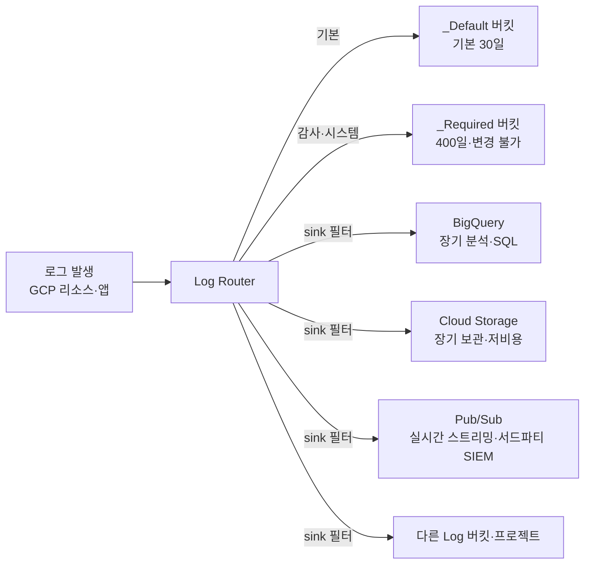
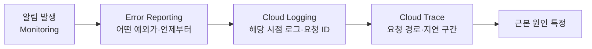
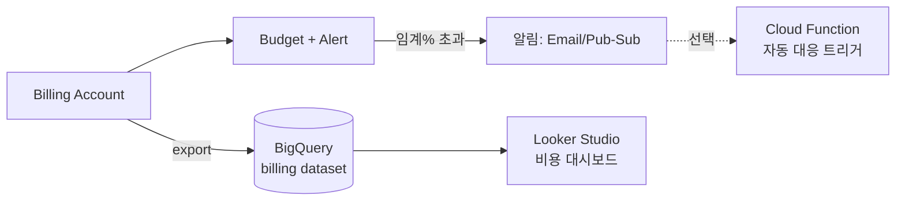

* TOC
{:toc}

> PCA의 운영·비용 문제는 "구축"이 아니라 "운영 가능성"을 묻는다 — 장애를 어떻게 관측하고(Observability), 변경을 어떻게 안전하게 내보내고(배포), 비용을 어떻게 가시화·절감하느냐다. 시험은 거의 항상 "요구사항(가용성·위험 허용도·예산·컴플라이언스)을 주고 → 어떤 서비스·전략·약정을 고르는가"를 묻는다. 이 글은 Cloud Operations 4종(Monitoring·Logging·Trace·Error Reporting), SRE의 SLI/SLO/SLA와 error budget, 배포 전략 4종, IaC/CI-CD, 비용 최적화 5축(CUD·SUD·Spot·rightsizing·Billing)을 **함정 → 판단 기준 → 결론**으로 정리한다. 이 글은 PCA 준비 시리즈 11편이다.

---

## 도입 — 운영은 세 질문이다

설계가 끝난 시스템을 운영한다는 것은 세 질문에 답하는 것이다.

1. **지금 시스템이 건강한가** — 관측(Cloud Operations: Monitoring·Logging·Trace).
2. **변경을 어떻게 안전하게 내보내는가** — 배포 전략(rolling·blue-green·canary)과 자동화(IaC·CI/CD).
3. **이 가용성을 얼마에 사느냐** — SLO로 목표를 정하고, 비용 최적화로 청구서를 줄인다.

PCA 시험은 이 세 축에서 "혼동 쌍"을 판다. SLO와 SLA를 섞고, canary와 blue-green을 섞고, CUD와 SUD를 섞고, budget alert가 지출을 막아준다고 착각하게 만든다. 각 함정의 판별선을 손에 쥐는 것이 이 글의 목표다.

<div class="callout-note">
이 글의 지도: Cloud Operations(관측·벤치마킹) → 트러블슈팅/RCA → SRE(SLI/SLO/SLA·error budget) → 배포 전략 4종 → IaC/CI-CD → 개발자·API 도구 → 테스트와 신뢰성 → 비용 최적화 5축 → 거버넌스·지원 → 시험 공략 → 퀴즈. 각 축은 "함정 → 판단 기준 → 결론"으로 닫는다. 전반은 SDLC(개발 → 테스트 → 배포 → 운영) 순서에 운영·비용 관점을 겹쳐 읽는다.
</div>

---

## Cloud Operations — 관측의 네 기둥

구 Stackdriver는 현재 **Cloud Operations**로 통합됐다. 네 컴포넌트의 책임이 명확히 다르다 — 시험은 "이 증상에는 어떤 도구"를 묻는다.

| 컴포넌트 | 답하는 질문 | 데이터 종류 |
|----------|-------------|-------------|
| **Cloud Monitoring** | 시스템이 건강한가, 임계치를 넘었는가 | 시계열 메트릭(metric) |
| **Cloud Logging** | 무슨 일이 일어났는가 | 로그(event) |
| **Cloud Trace** | 요청이 어디서 느린가 | 분산 추적(latency) |
| **Error Reporting** | 어떤 예외가 얼마나 자주 터지는가 | 오류 그룹핑 |

추가로 **Cloud Profiler**(CPU·메모리 프로파일링)가 있다. 구 **Cloud Debugger**(프로덕션 라이브 디버깅)는 **지원 종료됐다(shutdown)** — 더 이상 신규로 쓸 수 없으므로 보기에 등장하면 함정이다.

### Cloud Monitoring — 메트릭·대시보드·알림·업타임

핵심 개념 네 가지.

- **메트릭(Metric)**: 시계열 수치. GCP 리소스는 기본 메트릭을 자동 수집하고, 애플리케이션은 **커스텀 메트릭**을 보낼 수 있다. VM 게스트 OS 내부 메트릭(메모리 사용률 등)은 **Ops Agent**를 설치해야 수집된다 — 외부에서 보이는 메트릭과 게스트 내부 메트릭을 구분하는 것이 함정이다.
- **메트릭 범위(Metrics Scope)**: 여러 프로젝트의 메트릭을 한 곳에서 보는 단위(구 Workspace). 멀티 프로젝트 환경에서 중앙 모니터링을 설계할 때 등장한다.
- **알림 정책(Alerting Policy)**: 조건(메트릭이 임계치를 N분 초과 등) + 알림 채널(Email·SMS·Slack·PagerDuty·Pub/Sub·Webhook). 조건 언어로 **MQL**(Monitoring Query Language)과 **PromQL**을 지원한다.
- **업타임 체크(Uptime Check)**: 외부 위치들에서 HTTP(S)·TCP로 엔드포인트 생존을 주기 점검. 공개 엔드포인트의 가용성 SLI 측정에 직접 쓰인다.

<div class="callout-warning">
"VM의 <strong>메모리·디스크 사용률</strong>로 알림을 걸고 싶다" → 기본 메트릭만으로는 안 된다. <strong>Ops Agent</strong>를 설치해야 게스트 OS 메트릭이 들어온다. CPU 사용률은 하이퍼바이저 레벨에서 보이지만 메모리는 게스트 내부 정보다.
</div>

### Cloud Logging — 로그 라우팅·sink·버킷·로그 기반 메트릭

로그의 흐름은 **Log Router**가 통제한다. 모든 로그는 일단 Log Router를 거쳐 **sink**의 필터에 따라 목적지로 라우팅된다.



- **로그 버킷(Log Bucket)**: 로그가 실제로 저장되는 컨테이너. `_Required`(감사 로그 등, 보존 기간·삭제 변경 불가), `_Default`(일반 로그, 기본 보존 약 30일, 사용자 설정 가능)가 자동 생성된다.
- **sink(싱크)**: 필터에 맞는 로그를 목적지로 내보낸다. 목적지별 용도가 시험 포인트다.

| sink 목적지 | 언제 고르나 |
|-------------|-------------|
| **BigQuery** | 로그를 SQL로 분석·조인·대시보드화 |
| **Cloud Storage** | 장기·저비용 보관, 컴플라이언스 아카이브 |
| **Pub/Sub** | 실시간 스트리밍, Splunk 등 서드파티 SIEM 연동 |
| **다른 Log 버킷** | 중앙 집계 프로젝트로 통합 |

- **로그 기반 메트릭(Log-based Metric)**: 로그에서 메트릭을 추출한다. **카운터형**(특정 패턴 발생 횟수, 예: `5xx` 로그 수)과 **분포형**(로그에서 추출한 수치의 분포, 예: 응답 지연)이 있다. "로그에만 있는 정보를 알림으로 걸고 싶다"의 답이다.

<div class="callout-warning">
함정: 로그를 BigQuery·Splunk 등으로 보내는 것은 <strong>sink</strong>다. 특정 로그를 저장에서 빼는 것은 sink가 아니라 <strong>exclusion(제외) 필터</strong>다. "로그를 외부 SIEM으로 실시간 전송" → Pub/Sub sink. "비용 절감을 위해 불필요한 로그를 저장하지 않음" → exclusion 필터(수집은 되지만 저장 청구를 피함).
</div>

### Cloud Audit Logs — 네 종류와 함정

"누가·언제·무엇을 했는가"는 일반 로그가 아니라 **Cloud Audit Logs**가 답한다. EHR·금융·정부처럼 전 접근을 감사해야 하는 요구에서 직접 등장한다. 네 종류의 성격이 다르고, 특히 **기본 켜짐 여부**가 시험 함정이다.

| 감사 로그 종류 | 기록 내용 | 기본 상태 |
|----------------|-----------|-----------|
| **Admin Activity** | 리소스 구성·메타데이터를 바꾸는 관리 작업(생성·삭제·IAM 변경 등) | **항상 켜짐, 비활성화 불가·무료** |
| **System Event** | Google 시스템이 자동 수행한 변경(예: 라이브 마이그레이션) | 항상 켜짐, 비활성화 불가·무료 |
| **Data Access** | 데이터 읽기/쓰기, 리소스 메타데이터 조회 | **기본 꺼짐(opt-in), 대량·유료**(BigQuery 등 일부 예외) |
| **Policy Denied** | 조직 정책·서비스 경계 위반으로 거부된 접근 | 위반 발생 시 기록(비활성화 불가) |

- **Admin Activity / System Event**: 끌 수 없고 과금되지 않는다. "관리 작업 감사가 남는가?"의 답은 **항상 남는다**.
- **Data Access**: 명시적으로 켜야 하고(IAM 정책에서 서비스·로그 종류·principal 지정), 볼륨이 커서 저장 비용이 든다. "데이터 조회까지 감사해야 한다(HIPAA·PCI)" → **Data Access 로그를 opt-in으로 활성화**.
- 감사 로그는 `_Required` 버킷에 들어가는 항목(Admin Activity·System Event·Policy Denied)이 **400일 고정 보존, 변경 불가**다. 더 오래 보관하려면 **sink로 BigQuery/GCS에 내보내** 별도 보존한다.

<div class="callout-warning">
함정: "관리 작업(IAM·리소스 변경) 감사를 켜라"는 <strong>이미 켜져 있다</strong> — Admin Activity는 비활성화가 불가능하다. 진짜 추가 설정이 필요한 것은 <strong>Data Access 로그</strong>로, 기본이 <strong>꺼짐</strong>이라 규제 요구가 있으면 명시적으로 활성화해야 하고 볼륨·비용이 크다. "전 <strong>데이터 접근</strong>을 감사"(EHR/PCI) = Data Access opt-in, "<strong>구성 변경</strong> 감사" = Admin Activity(기본 제공).
</div>

### 조직 레벨 집계 싱크 (Aggregated Sink)

멀티 프로젝트 환경에서 감사·보안 로그를 한 곳에 모으는 표준은 **조직/폴더 레벨 aggregated sink**다. 조직 노드에 sink를 만들고 `includeChildren=true`로 두면, **하위 모든 프로젝트의 로그가 자동으로 중앙 목적지**(보안팀 프로젝트의 Log 버킷·BigQuery·GCS)로 라우팅된다. 프로젝트를 새로 만들어도 자동 포함된다.

<div class="callout-note">
"조직 전체의 감사 로그를 중앙 보안 프로젝트에 모아 장기 보관·분석" = <strong>조직 레벨 aggregated sink</strong>(includeChildren) → BigQuery/GCS. 프로젝트마다 개별 sink를 만드는 것은 신규 프로젝트가 누락되는 반복 작업이다. 중앙 집계는 조직/폴더 레벨에서 한 번 건다.
</div>

### Cloud Trace · Profiler · Error Reporting

- **Cloud Trace**: 분산 추적. 마이크로서비스에서 요청이 서비스 간 이동하며 **어디서 지연이 발생하는지**를 본다. "지연(latency)의 원인 구간" → Trace.
- **Cloud Profiler**: 프로덕션 코드의 CPU·메모리 사용을 낮은 오버헤드로 프로파일링. "어떤 함수가 자원을 잡아먹는지" → Profiler.
- **Error Reporting**: 로그의 예외·스택트레이스를 자동 그룹핑해 빈도·신규 발생을 알린다. "어떤 예외가 새로 늘었는가" → Error Reporting.

**결론**: 메트릭·임계치 → Monitoring / 이벤트 기록·라우팅 → Logging / 지연 구간 → Trace / 자원 핫스팟 → Profiler / 예외 그룹핑 → Error Reporting.

### 프로파일링과 벤치마킹 — 기준선을 가진다

관측은 "지금 느린가"를 답하지만, 그 판단에는 **기준선(baseline)**이 필요하다.

- **프로파일링(Profiling)**: Cloud Profiler로 실행 중 코드의 자원 소비 핫스팟을 찾는다. "어느 함수·호출이 비싼가"의 미시 분석.
- **벤치마킹(Benchmarking)**: 알려진 부하·환경에서 **성능 기준선을 측정·기록**한다. 릴리스 전후·머신 유형 변경·아키텍처 변경의 영향을 같은 척도로 비교하는 거시 기준이다. 벤치마크 수치가 있어야 SLO를 현실적으로 정하고, 회귀(regression)를 객관적으로 판별할 수 있다.

프로파일링이 "어디가 비싼가"라면 벤치마킹은 "변경이 빨라졌나 느려졌나"를 답한다. 둘은 보완 관계다.

---

## 트러블슈팅과 RCA — 장애에서 학습으로

관측 도구는 "무엇이 잘못됐나"의 단서를 모은다. 그 단서를 **근본 원인**까지 추적하고 재발을 막는 것이 트러블슈팅과 RCA(Root Cause Analysis, 근본원인분석)다.

### 디버깅 워크플로

증상에서 원인으로 좁히는 표준 흐름은 네 도구의 협업이다.



- **Cloud Monitoring** — 알림으로 "이상"을 인지(SLO·error budget 소진 경보 포함).
- **Error Reporting** — 새로 늘어난 예외 그룹과 최초 발생 시점을 식별. "언제부터 무엇이"의 출발점.
- **Cloud Logging** — 해당 시점·요청 ID로 로그를 좁혀 구체 맥락을 본다(로그 기반 메트릭으로 패턴 추적).
- **Cloud Trace** — 분산 요청에서 실제 지연·실패가 발생한 서비스 구간을 짚는다.

<div class="callout-tip">
RCA의 산출물은 <strong>포스트모템(postmortem)</strong>이다. 핵심 원칙은 <strong>비난 없는(blameless)</strong> 작성이다 — 개인을 탓하는 대신 "어떤 시스템·프로세스 결함이 사람의 실수를 가능하게 했나"를 묻는다. 비난이 들어가면 사람들이 사고를 숨겨 학습이 멈춘다. 포스트모템은 타임라인·영향·근본 원인·재발 방지 액션아이템(소유자·기한 포함)을 담는다.
</div>

**Gemini Cloud Assist**는 배포·운영·트러블슈팅·비용 분석을 자연어로 보조한다(로그 요약, 이상 징후 설명, 구성 권고, 비용 질의 등). RCA 초동 분석의 시간을 줄이는 보조 수단이며, 사람의 판단을 대체하지는 않는다. AI 보조 도구의 상세는 [[/concept/cloud/12_genai_for_pca]]에서 다룬다.

**결론**: 알림(Monitoring) → 예외 식별(Error Reporting) → 맥락(Logging) → 지연 구간(Trace)로 좁히고, 결과를 비난 없는 포스트모템으로 남겨 재발을 막는다.

---

## SRE — SLI · SLO · SLA와 error budget

PCA가 가장 자주 섞는 세 약어다. 정의를 정확히 분리하는 것이 핵심이다.

| 약어 | 정의 | 주체·성격 |
|------|------|-----------|
| **SLI** (Indicator) | 측정값. 실제 관측된 지표 | 예: 성공 요청 비율 99.95% |
| **SLO** (Objective) | 내부 목표. SLI가 도달해야 할 값 | 예: 99.9% (조직이 정한 목표) |
| **SLA** (Agreement) | 고객과의 계약. 위반 시 **보상**(크레딧·배상) | 예: 99.5% 미달 시 요금 환불 |

핵심 관계: **SLA < SLO**여야 한다. 고객 계약(SLA)보다 내부 목표(SLO)를 더 엄격하게 잡아, SLA를 위반하기 전에 내부에서 먼저 경보가 울리게 한다.

<div class="callout-warning">
시험 함정: SLA는 <strong>계약·보상</strong>이 핵심이다. "위반 시 크레딧/환불" 표현이 있으면 SLA다. SLI는 <strong>측정된 실제 수치</strong>, SLO는 <strong>도달하려는 목표</strong>. SLO를 SLA와 같거나 더 느슨하게 잡으면 SLA를 어기기 직전까지 내부 경보가 없다 — 잘못된 설계.
</div>

### error budget — SLO의 운영적 의미

SLO를 정하면 자동으로 **허용 가능한 실패량**이 정해진다. 이것이 error budget이다.

```
error budget = 1 − SLO
SLO 99.9% (30일 기준) → 허용 다운타임 ≈ 약 43분 / 30일
SLO 99.99% (30일 기준) → 허용 다운타임 ≈ 약 4분 / 30일
```

(정확한 분 수는 기간·SLO에 따라 계산값이 다르며, 시험은 "SLO를 높일수록 허용 실패가 급격히 줄어든다"는 관계를 묻는다.)

error budget의 운영적 쓸모는 **개발 속도와 안정성의 객관적 조정 장치**라는 점이다.

| error budget 상태 | 운영 결정 |
|-------------------|-----------|
| 남아 있음 | 새 기능 배포·실험·위험한 변경 허용 (속도 우선) |
| 소진됨 | 신규 배포 동결(feature freeze), 안정화·신뢰성 작업에 집중 |

<div class="callout-tip">
error budget은 "기능을 더 낼 것인가, 안정성에 투자할 것인가"를 감정이 아닌 숫자로 결정하게 한다. budget이 남으면 빠르게 출시하고, 소진되면 멈춘다. SLO를 100%로 잡지 않는 이유가 여기 있다 — 100%는 어떤 변경도 허용하지 않는다는 뜻이라 비현실적이다.
</div>

Cloud Monitoring의 **Service Monitoring(SLO 모니터링)**으로 SLI를 정의하고 SLO 대비 error budget 소진을 추적·알림할 수 있다.

**결론**: SLI=측정, SLO=목표, SLA=계약(보상). SLA<SLO. error budget=1−SLO로 배포 속도를 조절한다.

---

## 배포 전략 — 위험 허용도로 고른다

배포 전략 선택은 "**다운타임을 허용하는가**", "**문제를 일부 사용자에게만 노출해도 되는가**", "**즉시 롤백이 필요한가**", "**여분 인프라 비용을 감당하는가**"의 함수다.

| 전략 | 방식 | 다운타임 | 롤백 속도 | 추가 비용 | 위험 노출 |
|------|------|----------|-----------|-----------|-----------|
| **Recreate** | 구버전 종료 후 신버전 기동 | 있음 | 느림 | 없음 | 전체 |
| **Rolling** | 인스턴스를 점진 교체 | 없음 | 중간(되감기) | 없음/적음 | 점진 |
| **Blue-green** | 두 환경 운영, 트래픽 전체 전환 | 없음 | 매우 빠름(전환 복귀) | 높음(2배 인프라) | 전체(전환 순간) |
| **Canary** | 신버전에 소수 트래픽부터 점증 | 없음 | 빠름(트래픽 회수) | 낮음 | 소수 → 점진 |

판단 기준을 한 줄로.

- **즉시 전체 롤백 + 단순함** → blue-green (단, 인프라 2배, 전환 순간 전수 노출).
- **실제 트래픽으로 점진 검증 + 위험 최소화** → canary (메트릭 보며 비율을 올린다).
- **무중단 + 추가 비용 최소** → rolling (가장 흔한 기본값).
- **다운타임 허용·비용 최소** → recreate (개발·내부 환경).

<div class="callout-warning">
혼동 쌍: <strong>blue-green</strong>은 트래픽을 한 번에 100% 전환한다(전환 전까지 신버전은 0% 사용자 노출). <strong>canary</strong>는 신버전에 5% → 25% → 100%로 점진 이전하며 실사용자 일부로 검증한다. "점진적 트래픽 이전·실사용자 일부 검증" 키워드 = canary. "즉시 전체 전환·빠른 롤백" = blue-green.
</div>

### GCP 서비스별 구현

배포 전략은 추상 개념이고, 시험은 "이 서비스에서 어떻게 구현하나"를 묻는다.

**Cloud Run — 리비전 트래픽 분할**

Cloud Run은 배포마다 불변 **리비전(revision)**을 만들고, 리비전 간 트래픽을 퍼센트로 나눈다. canary가 가장 자연스럽다.

```bash
# 새 리비전을 배포하되 트래픽은 받지 않게(0%) 올린 뒤
gcloud run deploy my-svc --image gcr.io/proj/app:v2 --no-traffic

# 신 리비전에 10%만 흘려 canary 검증
gcloud run services update-traffic my-svc \
  --to-revisions=my-svc-v2=10,my-svc-v1=90

# 메트릭 확인 후 100% 이전(곧 blue-green식 전체 전환도 가능)
gcloud run services update-traffic my-svc --to-revisions=my-svc-v2=100
```

**App Engine — 버전 + 트래픽 분할**

App Engine은 한 서비스에 여러 **버전**을 두고 트래픽을 나눈다. 분할 방식으로 **IP 기반·쿠키 기반·랜덤**을 지원한다(쿠키 기반은 같은 사용자에게 같은 버전을 고정 — 세션 일관성).

```bash
gcloud app deploy --version=v2 --no-promote        # 트래픽 없이 배포
gcloud app services set-traffic default \
  --splits=v2=0.1,v1=0.9 --split-by=cookie          # 쿠키 기준 10% canary
```

**GKE — Deployment 전략 + 트래픽 관리**

- **Rolling update**가 Deployment 기본값(`maxSurge`/`maxUnavailable`로 교체 속도 제어).
- **Recreate**는 명시적으로 선택(다운타임 발생).
- **Canary/blue-green**은 쿠버네티스 기본 Deployment만으로는 트래픽 비율 제어가 부족하다 → 별도 Deployment를 띄우고 **Gateway/Service 가중치**나 **서비스 메시(예: Anthos Service Mesh)**, 또는 **Cloud Deploy의 canary 기능**으로 트래픽을 분배한다.

```yaml
# GKE Deployment 기본 rolling update 설정
apiVersion: apps/v1
kind: Deployment
metadata:
  name: web
spec:
  replicas: 6
  strategy:
    type: RollingUpdate
    rollingUpdate:
      maxSurge: 2          # 교체 중 정원보다 최대 2개 추가
      maxUnavailable: 0    # 가용 Pod가 줄지 않게(무중단 우선)
  # ...
```

<div class="callout-note">
요약 매핑: Cloud Run = 리비전 트래픽 분할(canary/점진 이전이 일급). App Engine = 버전 트래픽 분할(쿠키 기반=세션 고정). GKE = Deployment rolling이 기본, canary/blue-green은 메시·Gateway·Cloud Deploy로 보강. MIG(Managed Instance Group)도 rolling update와 canary(일부 인스턴스에만 새 템플릿)를 지원한다.
</div>

**결론**: 위험 허용도가 낮고 점진 검증이 필요하면 canary, 즉시 전체 전환·빠른 복귀면 blue-green, 무중단+저비용 기본값은 rolling. 구현은 Cloud Run/App Engine은 트래픽 분할이 내장, GKE는 보강 도구 필요.

---

## IaC와 CI/CD — 자동화와 재현성

### IaC — Terraform vs Deployment Manager

| 항목 | Terraform | Deployment Manager |
|------|-----------|--------------------|
| 제공 | HashiCorp(서드파티, 멀티 클라우드) | Google(GCP 전용) |
| 권장 방향 | **현재 GCP 권장** | 신규 사용 비권장(레거시) |
| 멀티 클라우드 | 가능 | 불가(GCP만) |
| 생태계 | 거대(모듈·커뮤니티) | 협소 |
| 관리형 옵션 | **Infrastructure Manager**(GCP 관리형 Terraform) | 자체가 관리형이나 사실상 동결 |

<div class="callout-warning">
시험 함정: "GCP에서 IaC로 인프라를 코드화하라"의 현재 정답은 <strong>Terraform</strong>이다. Deployment Manager는 GCP 전용 레거시로 신규 채택을 권장하지 않는다. Google이 Terraform 사용을 공식 권장하며, 관리형이 필요하면 <strong>Infrastructure Manager</strong>(Google이 운영하는 Terraform)를 고른다.
</div>

```hcl
# Terraform으로 GCS 버킷을 선언적으로 정의 (재현 가능·버전 관리)
resource "google_storage_bucket" "data_lake" {
  name          = "acme-data-lake-prod"
  location      = "ASIA-NORTHEAST3"   # 서울
  storage_class = "STANDARD"
  uniform_bucket_level_access = true   # 균일 버킷 수준 접근(권장)

  lifecycle_rule {
    condition { age = 30 }
    action {
      type          = "SetStorageClass"
      storage_class = "NEARLINE"        # 30일 후 저비용 클래스로
    }
  }
}
```

### CI/CD — Cloud Build · Artifact Registry · Cloud Deploy

- **Cloud Build**: 서버리스 빌드·테스트·배포 파이프라인. `cloudbuild.yaml`에 단계를 정의하고 Git 트리거로 자동 실행.
- **Artifact Registry**: 컨테이너 이미지·언어 패키지(Maven·npm 등) 저장소. 구 **Container Registry(gcr.io)의 후속**이며 신규는 Artifact Registry를 쓴다.
- **Cloud Deploy**: 관리형 **지속적 배포**(CD). dev → staging → prod 같은 **승격 파이프라인**과 승인 게이트, **canary 배포**를 지원한다. 대상으로 GKE·Cloud Run 등을 지원.

```yaml
# cloudbuild.yaml — 빌드→Artifact Registry 푸시→Cloud Run 배포
steps:
  - name: 'gcr.io/cloud-builders/docker'
    args: ['build', '-t',
      'asia-northeast3-docker.pkg.dev/$PROJECT_ID/app/web:$SHORT_SHA', '.']
  - name: 'gcr.io/cloud-builders/docker'
    args: ['push',
      'asia-northeast3-docker.pkg.dev/$PROJECT_ID/app/web:$SHORT_SHA']
  - name: 'gcr.io/google.com/cloudsdktool/cloud-sdk'
    entrypoint: gcloud
    args: ['run', 'deploy', 'web',
      '--image', 'asia-northeast3-docker.pkg.dev/$PROJECT_ID/app/web:$SHORT_SHA',
      '--region', 'asia-northeast3', '--no-traffic']   # canary 위해 트래픽 보류
images:
  - 'asia-northeast3-docker.pkg.dev/$PROJECT_ID/app/web:$SHORT_SHA'
```

**결론**: IaC=Terraform(관리형은 Infrastructure Manager), DM은 레거시. 빌드=Cloud Build, 아티팩트=Artifact Registry(gcr.io 후속), 승격·canary CD=Cloud Deploy.

---

## 개발자·API 도구 — 만들고·통합하고·로컬에서 검증한다

배포 파이프라인 앞에는 개발이 있다. PCA는 SDLC(소프트웨어 개발 수명주기) 전 구간의 도구를 묻는다 — **코드 작성·로컬 테스트(개발 도구) → API 노출·통합(API 관리) → 자동화(SDK) → 배포·운영(앞 절의 CI/CD·관측)**. 이 절은 그중 개발·통합 단계의 도구를 정리한다.

### API 관리 — Apigee vs API Gateway

둘 다 백엔드 앞에 게이트웨이를 두지만, **무게와 목적**이 다르다. 시험 단골 혼동 쌍이다.

<div class="compare-grid">
<div class="compare-col" markdown="1">

**Apigee (풀 라이프사이클 API 관리)**

- API **제품화·수익화(monetization)**, 개발자 포털, API 키·쿼터·SLA 관리
- 정책 엔진(변환·캐싱·속도 제한·위협 보호 등 풍부한 정책)
- 분석·버전 관리·라이프사이클 거버넌스
- 대규모·외부 공개 API 프로그램, **API를 비즈니스 자산으로 운영**할 때

</div>
<div class="compare-col" markdown="1">

**API Gateway (경량 관리형 게이트웨이)**

- 서버리스 백엔드(Cloud Functions·Cloud Run·App Engine) 앞단 게이트웨이
- 인증(API 키·JWT)·기본 라우팅·간단한 트래픽 관리
- OpenAPI 스펙으로 정의, 가볍고 저렴
- **단순히 서버리스 API를 안전하게 노출**하면 충분할 때

</div>
</div>

<div class="callout-warning">
판별선: "<strong>개발자 포털·수익화·정교한 정책·API 분석</strong>" 같은 풀 라이프사이클 관리 요구 = <strong>Apigee</strong>. "<strong>서버리스 백엔드를 키·JWT로 가볍게 노출</strong>" = <strong>API Gateway</strong>. Apigee를 단순 게이트웨이 용도로 쓰면 과한 선택, 반대로 수익화·개발자 포털을 API Gateway로 풀려 하면 기능 부족이다.
</div>

### 개발 환경 — Cloud Shell · Cloud Code · Cloud Shell Editor

| 도구 | 무엇 | 언제 |
|------|------|------|
| **Cloud Shell** | 브라우저 안의 임시 VM 셸. `gcloud`·`bq`·`kubectl` 등 사전 설치, 영구 홈 디렉터리 제공 | 설치 없이 즉시 CLI 작업·실습·빠른 점검 |
| **Cloud Shell Editor** | Cloud Shell에 딸린 브라우저 기반 코드 에디터(VS Code 계열) | 브라우저만으로 코드 편집·디버깅 |
| **Cloud Code** | 로컬 IDE(VS Code·IntelliJ) 플러그인. GKE·Cloud Run 배포, YAML 지원, 디버깅 통합 | 평소 쓰는 IDE에서 GCP 앱 개발·배포 |

핵심 구분: **Cloud Shell/Editor는 브라우저 환경**, **Cloud Code는 로컬 IDE 플러그인**이다.

### SDK와 CLI — gcloud · 스토리지 CLI · bq

| CLI | 용도 | 비고 |
|-----|------|------|
| **gcloud** | GCP 리소스 전반 관리·자동화(컴퓨트·IAM·네트워크 등) | 스크립트·CI에서 비대화형(`--quiet`)으로 자동화 |
| **gsutil → `gcloud storage`** | Cloud Storage 객체 조작 | `gsutil`은 레거시, 신규는 **`gcloud storage`** 권장(대용량 전송도 더 빠른 경우가 많음) |
| **bq** | BigQuery 데이터셋·쿼리·로드/추출 | SQL·잡 자동화 |

세 도구 모두 Cloud SDK에 포함되며, 자동화·스크립팅의 1차 인터페이스다.

### Cloud Emulators — 비용 없이 로컬에서

Bigtable·Spanner·Pub/Sub·Firestore(Datastore) 등은 **로컬 에뮬레이터**를 제공한다. 실제 클라우드 리소스를 띄우지 않고 로컬에서 개발·통합 테스트를 돌릴 수 있어 **비용이 들지 않고 CI에서 빠르다**.

```bash
# Pub/Sub 에뮬레이터를 로컬에 띄우고, 클라이언트가 이를 바라보게 한다
gcloud beta emulators pubsub start --project=local-dev &
$(gcloud beta emulators pubsub env-init)   # PUBSUB_EMULATOR_HOST 환경변수 설정
# 이제 클라이언트 라이브러리가 실제 Pub/Sub 대신 로컬 에뮬레이터로 연결됨
```

<div class="callout-warning">
에뮬레이터는 <strong>기능 동등성이 100%가 아니다</strong> — IAM·성능·일부 고급 기능은 실제 서비스와 다르다. 로컬 개발·CI 단위/통합 테스트에는 적합하지만, 최종 검증은 실제 환경(예: 스테이징 프로젝트)에서 한다.
</div>

### 클라이언트 라이브러리와 API 접근 베스트프랙티스

애플리케이션은 보통 `gcloud`가 아니라 **클라이언트 라이브러리**로 GCP API를 호출한다. 두 가지가 시험·실무의 핵심이다.

- **인증은 ADC(Application Default Credentials)로.** 코드에 키를 박지 않는다. 로컬은 `gcloud auth application-default login`, GCP 위에서는 **연결된 서비스 계정**(GKE Workload Identity, Cloud Run·GCE의 SA)을 ADC가 자동으로 찾는다. 서비스 계정 키 파일은 유출 위험이 크므로 최후의 수단이다.
- **재시도와 지수 백오프(exponential backoff).** API는 일시적 오류(`429`·`503`)를 낼 수 있다. 클라이언트 라이브러리는 멱등 요청에 대해 지터(jitter)를 섞은 지수 백오프 재시도를 기본 제공한다 — 직접 호출할 때도 같은 패턴을 따른다.

```python
# ADC로 인증 + 지수 백오프 재시도 (개념 예시 — 라이브러리가 기본 재시도를 제공)
from google.cloud import storage
from google.api_core.retry import Retry

# 키 파일 경로를 코드에 넣지 않는다 — ADC가 환경의 자격증명을 자동 탐색
client = storage.Client()  # 환경의 SA/ADC 사용

retry_policy = Retry(initial=1.0, maximum=30.0, multiplier=2.0, deadline=120.0)
bucket = client.get_bucket("acme-data-lake-prod", retry=retry_policy)
```

**결론**: 풀 라이프사이클 API = Apigee, 경량 서버리스 노출 = API Gateway. 개발은 Cloud Shell/Editor(브라우저)·Cloud Code(IDE), 자동화는 gcloud·`gcloud storage`·bq, 로컬 검증은 에뮬레이터, 인증은 ADC + 재시도/백오프.

---

## 테스트와 신뢰성 — 프로덕션을 믿을 수 있게

배포 전에 "맞게 동작하는가"를, 운영 전에 "부하·장애·공격을 견디는가"를 검증한다. 신뢰성은 SLO 같은 목표뿐 아니라 **능동적 검증**으로 뒷받침된다.

### 테스트 종류 — 무엇을 검증하나

| 테스트 | 검증 대상 | 언제 |
|--------|-----------|------|
| **단위(Unit)** | 함수·모듈 단위 로직 | 가장 빈번, CI 기본. 에뮬레이터·목으로 빠르게 |
| **통합(Integration)** | 컴포넌트 간 연동(DB·큐·외부 API) | 서비스 경계가 올바르게 맞물리는지. 에뮬레이터/스테이징 활용 |
| **부하(Load)** | 목표 트래픽에서의 성능·확장 | 출시 전 용량 산정, SLO 달성 가능성 확인 |

### 부하 테스트 (Load testing)

예상·피크 트래픽을 인위적으로 가해 **응답 시간·처리량·자동 확장·병목**을 측정한다. 벤치마크 기준선과 함께 SLO가 현실적인지, 오토스케일링이 제때 따라오는지를 검증한다. "블랙프라이데이 트래픽을 견디는가" 같은 질문의 답이다.

### 카오스 엔지니어링 (Chaos engineering)

**의도적으로 장애를 주입**(인스턴스 종료·지연 삽입·존 차단 등)해, 시스템이 설계대로 견디고 복구되는지 검증한다. "장애가 나면 어떻게 되는지"를 사고 전에 통제된 환경에서 확인하는 능동적 신뢰성 검증이다. 재해 복구·다중 존 설계의 가정을 실제로 시험한다.

### 침투 테스트 (Penetration testing)

공격자 관점에서 취약점을 능동적으로 탐색하는 **보안 검증**이다. GCP에서는 자신의 리소스에 대한 침투 테스트에 사전 승인이 필수는 아니지만, 반드시 **허용 사용 정책(Acceptable Use Policy)을 준수**해야 하고 자신이 소유·통제하는 자원으로 범위를 한정해야 한다.

<div class="callout-note">
세 가지는 검증 축이 다르다. <strong>부하 테스트 = 성능·용량</strong>, <strong>카오스 엔지니어링 = 장애 내성·복구</strong>, <strong>침투 테스트 = 보안 취약점</strong>. 신뢰성 요구가 "트래픽을 견디는가"면 부하, "장애에 견디는가"면 카오스, "공격에 견디는가"면 침투다.
</div>

<div class="callout-tip">
<strong>BCP와 DR.</strong> 신뢰성의 가장 큰 그림은 사업 연속성 계획(BCP, Business Continuity Plan)이다. <strong>BCP ⊃ DR</strong> — DR(재해 복구, RTO/RPO·백업·페일오버)은 BCP의 IT 하위 집합이고, BCP는 인력·프로세스·통신까지 포함하는 더 넓은 조직 차원의 계획이다. 카오스 엔지니어링·부하 테스트는 그 계획의 가정을 검증하는 수단이다.
</div>

DR 전략의 상세(RTO/RPO·백업/복구 패턴, 4종 DR 전략)는 [[/concept/cloud/10_migration_and_dr_for_pca]]에서 다룬다.

**결론**: 단위·통합으로 정합성을, 부하로 성능·용량을, 카오스로 장애 내성을, 침투로 보안을 검증한다. 신뢰성은 SLO(목표) + 능동적 테스트(검증)의 합이다.

---

## 비용 최적화 — 다섯 축

PCA 비용 문제는 "이 워크로드 특성에 어떤 할인·구성이 맞는가"를 묻는다. 핵심은 **약정형(CUD)과 자동형(SUD)을 구분**하고, **Spot의 적용 조건**을 알고, **budget alert가 지출을 막지 못한다**는 함정을 피하는 것이다.

<div class="callout-note">
프레이밍: 클라우드 비용의 본질은 <strong>CapEx → OpEx 전환</strong>이다. 온프렘은 하드웨어를 미리 사는 <strong>자본 지출(CapEx)</strong>이라 과대 투자·감가상각 위험이 크다. 클라우드는 쓴 만큼 내는 <strong>운영 지출(OpEx)</strong>이라 초기 투자가 없는 대신, 방치하면 청구가 새어 나간다. 그래서 비용 최적화는 "필요한 만큼만 쓰고(rightsizing·자동 확장·Spot), 예측 가능한 부분은 약정으로 더 싸게(CUD/SUD), 새는 곳을 가시화(Billing export)"하는 OpEx 관리 활동이다.
</div>

### 축 1 — CUD (Committed Use Discounts, 약정 할인)

1년 또는 3년 사용을 **약정**하고 큰 할인을 받는다. 약정이 핵심이며, 약정 기간 동안 쓰지 않아도 요금이 청구된다.

| CUD 유형 | 대상 | 성격 |
|----------|------|------|
| **리소스 기반(resource-based)** | 특정 리전·머신 계열의 vCPU·메모리 약정 | 특정 형태에 묶임, 보통 더 높은 할인 |
| **금액 기반/유연(spend-based, flexible)** | 시간당 일정 **금액** 약정 | 머신 계열·리전 변경에 유연 |

- 3년 약정이 1년보다 할인폭이 크다.
- 안정적·예측 가능한 베이스라인 워크로드(항상 켜져 있는 프로덕션)에 적합.
- 구체 할인율은 유형·계열·기간에 따라 다르므로 시험에서 정확한 % 암기보다 "약정=장기·예측 가능 워크로드의 큰 할인"이라는 성격을 본다.

### 축 2 — SUD (Sustained Use Discounts, 지속 사용 할인)

**자동** 할인. 약정이 필요 없다. 한 달 동안 특정 머신 계열을 **상당 시간 지속 실행**하면 GCP가 자동으로 할인을 적용한다(일부 Compute Engine 머신 계열 대상).

<div class="callout-warning">
가장 잦은 함정: <strong>CUD는 약정(commit), SUD는 자동(automatic)</strong>이다. "약정 없이 오래 켜두면 자동 할인" = SUD. "1·3년 약정으로 큰 할인" = CUD. SUD는 신청·계약이 필요 없고, 사용 시간이 길수록 할인폭이 커진다. 둘은 적용 방식이 다르므로 문제의 "약정 가능 여부"를 보고 가른다.
</div>

### 축 3 — Spot VM (선점형, 저비용 일회성 자원)

여분 용량을 매우 큰 할인(상황에 따라 약 60~91% 수준)으로 제공한다. 대신 GCP가 **언제든 회수(preempt)**할 수 있다.

- 회수 시 **짧은 종료 통지**(수십 초 수준) 후 중단.
- 구 **Preemptible VM**의 후속. Preemptible은 최대 실행 24시간 제한이 있었으나 **Spot VM은 최대 실행 시간 제한이 없다**(그래도 언제든 회수 가능).
- 적합: **내결함성 배치·스테이트리스·재시도 가능** 워크로드(데이터 처리, 렌더링, CI). GKE는 Spot 노드 풀로 활용.
- 부적합: 상태를 잃으면 안 되거나 중단 비용이 큰 워크로드(상태 보존형 DB, 실시간 동기 처리).

| 자원 형태 | 약정 | 회수 위험 | 적합 워크로드 |
|-----------|------|-----------|----------------|
| On-demand | 없음 | 없음 | 일반 |
| **SUD 적용 on-demand** | 없음(자동 할인) | 없음 | 오래 켜두는 워크로드 |
| **CUD** | 1·3년 | 없음 | 예측 가능 베이스라인 |
| **Spot VM** | 없음 | 높음(언제든) | 내결함성 배치 |

### 축 4 — 적정 사이징(Rightsizing)과 Recommender

과대 프로비저닝은 비용 낭비다. GCP **Recommender(Active Assist)**가 사용 데이터를 분석해 권고한다.

| Recommender | 권고 내용 |
|-------------|-----------|
| **VM rightsizing(머신 유형)** | 사용률 기반으로 더 작은/적합한 머신 유형 제안 |
| **유휴 리소스(Idle)** | 미사용 VM·디스크·IP 식별 → 정리 권고 |
| **CUD recommender** | 사용 패턴 기반 약정 구매 권고 |
| **IAM recommender** | 과잉 권한 축소 권고(비용 외 보안) |

"과대 프로비저닝된 VM을 줄여라" → rightsizing recommender. "쓰지 않는 자원으로 새는 비용" → idle resource recommender.

### 축 5 — Cloud Billing 가시성

**예산과 알림(Budget & Alert)**, **BigQuery로 billing export**, **비용 가시화**가 핵심.



<div class="callout-warning">
최대 함정: <strong>Budget alert는 지출을 막지 않는다.</strong> 예산 알림은 임계치(예: 50%·90%·100%)에 도달하면 <strong>통지</strong>만 한다 — 자동으로 리소스를 끄거나 결제를 차단하지 않는다. 실제 차단이 필요하면 예산 알림을 <strong>Pub/Sub</strong>로 받아 <strong>Cloud Function</strong>이 결제 해제·리소스 종료 같은 자동 대응을 수행하도록 직접 구성해야 한다(권장되지 않는 강수단이며 서비스 중단 위험 있음).
</div>

- **Billing export to BigQuery**: 상세 사용·비용 데이터를 BigQuery로 내보내 SQL로 분석하고 Looker Studio로 대시보드화. 비용 귀속(어느 프로젝트·서비스·라벨이 얼마 썼나) 분석의 표준 방법이다. **라벨(label)**을 리소스에 일관되게 붙이면 팀·환경·서비스별 비용 가시성이 생긴다.
- **계층별 가시성**: 조직 → 폴더 → 프로젝트 계층으로 비용을 집계·귀속한다. 프로젝트를 비용 경계로 설계하는 것이 가시성의 출발점이다.
- **Cloud Billing reports(콘솔 내장)**: 별도 파이프라인 없이 콘솔에서 프로젝트·서비스·라벨·SKU별 비용 추이와 할인(CUD/SUD) 적용 현황을 바로 본다. "빠른 비용 조회·추세 파악"은 Billing reports, "SQL·커스텀 대시보드·타 데이터와 조인"은 BigQuery export로 가른다. **Cost breakdown/Recommender**는 낭비를 짚어주고, **FinOps**는 이 도구들(Billing reports·export·Recommender·budget·라벨)을 묶어 "가시화 → 최적화 → 운영"을 반복하는 실천이다.

```sql
-- billing export 테이블에서 서비스별 30일 비용 상위 (확인 쿼리: 먼저 소량 확인)
SELECT
  service.description AS service,
  ROUND(SUM(cost), 2)  AS cost_usd
FROM `proj.billing.gcp_billing_export_v1_XXXXXX`
WHERE usage_start_time >= TIMESTAMP_SUB(CURRENT_TIMESTAMP(), INTERVAL 30 DAY)
GROUP BY service
ORDER BY cost_usd DESC
LIMIT 10;
```

### 네트워크 egress 비용 — 잊기 쉬운 청구

데이터 전송 비용은 설계 단계에서 놓치기 쉬운 항목이다.

| 트래픽 | 일반적 과금 |
|--------|-------------|
| **Ingress(들어오는 트래픽)** | 일반적으로 무료 |
| 같은 존(zone) 내부, 내부 IP | 일반적으로 무료 |
| **리전 내 다른 존 간** | 과금 |
| **리전 간(inter-region)** | 과금 |
| **인터넷으로 나가는 egress** | 과금(대상 대륙·양에 따라 다름) |

<div class="callout-warning">
함정: <strong>ingress는 대체로 무료, egress(특히 인터넷·리전 간)는 과금</strong>이다. 멀티 리전·크로스 리전 복제, 다른 리전의 GCS를 읽는 VM, 인터넷으로 대용량을 내보내는 서비스는 egress 비용이 누적된다. 비용 최적화 문제에서 "데이터를 같은 리전에 배치", "Cloud CDN으로 egress 절감", "리전 간 전송 최소화"가 정답 방향으로 자주 나온다.
</div>

**결론**: 예측 가능 베이스라인=CUD(약정), 오래 켜두면 자동=SUD, 내결함성 배치=Spot, 과대 프로비저닝=rightsizing recommender, 비용 분석=BigQuery export, budget alert는 통지일 뿐 차단 아님, egress(특히 인터넷·리전 간)는 과금.

---

## 거버넌스와 지원 — 셀프서비스와 Customer Care

규모가 커지면 운영은 "한 팀이 다 한다"에서 "안전한 셀프서비스 + 적절한 지원 계약"으로 옮겨간다.

### Service Catalog — 승인된 솔루션의 셀프서비스 배포

**Service Catalog**는 조직 관리자가 **승인·표준화된 솔루션**(Terraform 구성 등)을 카탈로그로 큐레이션하고, 내부 사용자가 그 안에서만 **셀프서비스로 배포**하게 한다.

- 효과: 거버넌스(승인된 구성·정책 준수)와 개발 속도(셀프서비스)를 동시에 잡는다.
- 사용자는 마구잡이로 리소스를 만드는 대신, **검증된 청사진**에서 고른다.

<div class="callout-note">
"개발자에게 자유를 주되 <strong>조직이 승인한 구성만</strong> 배포하게 하라" = <strong>Service Catalog</strong>. Org Policy가 "무엇을 금지하나"의 가드레일이라면, Service Catalog는 "무엇을 권장·제공하나"의 골든 경로(golden path)다. 둘은 보완 관계다.
</div>

### Cloud Customer Care — 지원 등급 선택

지원은 **요구 응답 속도와 전담 인력 필요 여부**로 등급을 고른다.

| 등급 | 성격 | 대략의 적합 대상 |
|------|------|------------------|
| **Basic** | 무료. 문서·커뮤니티·결제 지원만(기술 사례 X) | 지원 계약 불필요 |
| **Standard** | 유상 기술 지원, 업무 시간 응답 | 비프로덕션·소규모 |
| **Enhanced** | 더 빠른 응답 SLA, 24/7 P1 대응 | 프로덕션 운영 |
| **Premium** | 가장 빠른 응답 SLA + **TAM(Technical Account Manager)** 등 전담 지원 | 미션 크리티컬·대규모 엔터프라이즈 |

<div class="callout-warning">
선택 기준은 두 가지다 — <strong>응답 SLA</strong>(장애 시 얼마나 빨리 받아야 하나)와 <strong>전담 인력(TAM)</strong> 필요 여부. "미션 크리티컬·전담 기술 담당자(TAM)·가장 빠른 대응" 키워드 = <strong>Premium</strong>. "프로덕션·24/7 신속 대응이면 충분" = <strong>Enhanced</strong>. 정확한 응답 시간 수치는 등급·심각도에 따라 다르므로, 시험은 "TAM·최속 대응=Premium"의 상대 관계를 본다.
</div>

**결론**: 승인된 구성의 셀프서비스 = Service Catalog. 지원 등급은 응답 SLA와 TAM 필요 여부로 Standard/Enhanced/Premium을 가른다(TAM·최속 대응=Premium).

---

## 운영 우수성이라는 프레임

이 글의 도구들은 흩어진 기능이 아니라 하나의 기둥을 떠받친다. Google Cloud Architecture Framework(GCP판 Well-Architected Framework)의 **운영 우수성(Operational Excellence)** 기둥은 "시스템을 효율적으로 배포·운영·관측·개선한다"를 다룬다 — 이 글의 관측(Operations)·자동화(IaC/CI/CD)·신뢰성(SRE·테스트)·트러블슈팅(RCA·포스트모템)·비용 관리가 모두 이 기둥의 구성 요소다. 시험에서 "운영 부담을 줄여라(reduce operational overhead)"는 표현은 거의 항상 **관리형 서비스·자동화·관측 강화** 방향을 가리킨다.

---

## 케이스 스터디로 읽는 운영·비용

PCA는 4개 공식 케이스 스터디(EHR Healthcare·Helicopter Racing League·Mountkirk Games·TerramEarth)에서 문항의 20~30%를 낸다. 운영·비용 도메인이 각 케이스에서 어떻게 요구로 나타나는지를 매핑하면, "요구사항 문장 → 서비스" 변환이 빨라진다.

| 케이스 | 운영·비용 요구(원문 취지) | 이 글의 도구로 |
|--------|---------------------------|----------------|
| **EHR Healthcare** | 전 접근 감사 로깅, 통합 로깅·모니터링·알림, 멀티리전 99.99% | **Data Access 감사 로그 opt-in** + 조직 aggregated sink → BigQuery, Cloud Monitoring 통합 대시보드·알림, SLO(99.99%)·error budget |
| **Mountkirk Games** | 게임 KPI(동시접속·세션·레이턴시) 실시간 대시보드, **구조화 로그**로 지표 산출, 글로벌 출시 | Cloud Monitoring 커스텀 메트릭·대시보드, **구조화(JSON) 로그 → 로그 기반 메트릭**, canary(리비전/Deployment) 배포, Spot 노드로 배치 비용 절감 |
| **Helicopter Racing League** | 시청 지표 수집·예측 분석, 글로벌 스트리밍 관측성 강화 | Cloud Monitoring + Logging(시청 이벤트) → BigQuery export로 분석, 예측은 [[/concept/cloud/12_genai_for_pca]], 비용은 CDN egress 절감·리전 배치 |
| **TerramEarth** | 텔레메트리 파이프라인 관측, 딜러 API 운영, 데이터 처리 현대화 | Pub/Sub·Dataflow 파이프라인 Monitoring, 딜러 API는 **Apigee**(포털·쿼터·분석), 대량 배치는 Spot, 비용은 라벨·Billing export로 귀속 |

<div class="callout-note">
케이스에서 "<strong>감사</strong>"(EHR)가 나오면 Data Access 로그 opt-in을, "<strong>실시간 KPI·구조화 로그</strong>"(Mountkirk)가 나오면 커스텀 메트릭·로그 기반 메트릭을, "<strong>시청/예측 지표</strong>"(HRL)가 나오면 Logging→BigQuery export 분석을 먼저 떠올린다. 운영 도메인의 케이스 답은 대개 "관리형 관측 + 중앙 집계 로그 + SLO"의 조합이다.
</div>

## 시험장에서 — 문제 유형별 공략

### 관측 도구 선택형

| 요구사항 키워드 | 정답 |
|-----------------|------|
| 메트릭 임계치 알림·대시보드 | Cloud Monitoring(알림 정책) |
| 공개 엔드포인트 외부 생존 점검 | Uptime Check |
| VM 메모리·디스크 사용률 알림 | Ops Agent 설치 후 Monitoring |
| 로그를 SQL로 분석 | Logging sink → BigQuery |
| 로그를 서드파티 SIEM으로 실시간 | Logging sink → Pub/Sub |
| 관리 작업(IAM·리소스 변경) 감사 | Admin Activity 로그(기본 켜짐·비활성 불가) |
| 데이터 읽기/쓰기까지 감사(HIPAA·PCI) | Data Access 로그 opt-in(기본 꺼짐·유료) |
| 조직 전체 로그를 중앙에 집계 | 조직 레벨 aggregated sink(includeChildren) |
| 저장 비용 절감(불필요 로그) | exclusion(제외) 필터 |
| 로그에만 있는 정보로 알림 | 로그 기반 메트릭 |
| 마이크로서비스 지연 구간 추적 | Cloud Trace |
| 예외 빈도·신규 발생 | Error Reporting |
| 성능 기준선 측정·회귀 판별 | 벤치마킹(+ Profiler로 핫스팟) |
| 장애 근본 원인 추적 워크플로 | Monitoring→Error Reporting→Logging→Trace + 비난 없는 포스트모템 |

### SRE·배포 선택형

| 요구사항 키워드 | 정답 |
|-----------------|------|
| 위반 시 크레딧/배상 | SLA |
| 내부 신뢰성 목표 | SLO |
| 실제 관측 수치 | SLI |
| 배포 속도 vs 안정성 결정 근거 | error budget(=1−SLO) |
| 실사용자 일부로 점진 검증 | canary |
| 즉시 전체 전환·빠른 롤백 | blue-green |
| 무중단 + 추가 비용 최소 | rolling update |
| Cloud Run에서 점진 트래픽 이전 | 리비전 트래픽 분할 |
| 같은 사용자에게 같은 버전 고정 | App Engine 쿠키 기반 분할 |

### 비용 최적화 선택형

| 요구사항 키워드 | 정답 |
|-----------------|------|
| 1·3년 약정 큰 할인 | CUD |
| 약정 없이 오래 켜두면 자동 할인 | SUD |
| 내결함성 배치·최저가·중단 허용 | Spot VM |
| 과대 프로비저닝 VM 축소 | rightsizing recommender |
| 유휴 자원으로 새는 비용 | idle resource recommender |
| 비용을 프로젝트·라벨별로 분석 | Billing export → BigQuery |
| 임계치 도달 시 통지 | Budget alert(차단 아님) |
| 임계치에서 실제 차단·자동 대응 | Budget → Pub/Sub → Cloud Function |
| 리전 간·인터넷 전송 비용 절감 | 동일 리전 배치·Cloud CDN |

### 개발·API·테스트·거버넌스 선택형

| 요구사항 키워드 | 정답 |
|-----------------|------|
| 개발자 포털·수익화·정교한 정책의 API 관리 | Apigee |
| 서버리스 백엔드를 키/JWT로 가볍게 노출 | API Gateway |
| 설치 없이 브라우저에서 gcloud 작업 | Cloud Shell |
| 평소 쓰는 IDE에서 GCP 앱 배포 | Cloud Code |
| 비용 없이 로컬에서 Pub/Sub·Spanner 테스트 | Cloud Emulators |
| 코드에 키 없이 안전하게 API 인증 | ADC + 연결된 서비스 계정 |
| 목표 트래픽 성능·용량 검증 | 부하 테스트 |
| 장애 주입으로 복구력 검증 | 카오스 엔지니어링 |
| 공격자 관점 취약점 탐색 | 침투 테스트(AUP 준수) |
| 승인된 구성만 셀프서비스 배포 | Service Catalog |
| TAM·최속 응답 SLA 필요 | Premium 지원 |
| 프로덕션 24/7 신속 대응이면 충분 | Enhanced 지원 |

---

## 실전 퀴즈 — 핵심 개념 검증

---

**Q1. SLI/SLO/SLA 구분과 error budget**

한 팀의 결제 API가 다음 상황이다.

- 고객 계약서: "월 가용성 99.5% 미달 시 요금 크레딧 제공"
- 내부 운영 목표: 월 99.9%
- 지난 30일 실제 측정 가용성: 99.95%

이 중 SLA, SLO, SLI에 해당하는 값과, error budget의 운영적 함의를 올바르게 설명한 것은?

- (A) SLA=99.9%, SLO=99.5%, SLI=99.95%. error budget이 소진됐으므로 신규 배포를 동결한다.
- (B) SLA=99.5%, SLO=99.9%, SLI=99.95%. SLI가 SLO를 초과 달성해 error budget이 남았으므로 신규 기능 배포·실험이 가능하다.
- (C) SLA=99.95%, SLO=99.9%, SLI=99.5%. SLA가 가장 높아야 정상이다.
- (D) 세 값 모두 같은 것을 다르게 부른 것이며 구분은 실무적으로 의미 없다.

<details>
<summary>정답 및 해설</summary>
<div markdown="1">

**정답: (B)**

- **SLA**=99.5% — "크레딧 제공" 문구가 계약·보상이므로 SLA.
- **SLO**=99.9% — 내부 운영 목표.
- **SLI**=99.95% — 실제 측정된 지표.

관계도 정상이다: **SLA(99.5%) < SLO(99.9%)** — 계약보다 내부 목표가 더 엄격해야 SLA 위반 전에 내부 경보가 울린다. SLI(99.95%)가 SLO(99.9%)를 초과 달성했으므로 error budget(1−SLO)이 남아 있어 신규 배포·실험을 진행할 여유가 있다.

| 선택지 | 문제점 |
|--------|--------|
| (A) | SLA/SLO를 뒤바꿈. error budget도 남았는데 소진으로 오판 |
| (C) | SLA가 가장 높아야 한다는 것은 틀림 — SLA는 가장 느슨(낮게)해야 안전 |
| (D) | 세 개념은 주체·성격이 다르며 구분이 운영 결정에 직접 쓰임 |

</div>
</details>

---

**Q2. 배포 전략 선택 — 위험 최소화 점진 검증**

신규 추천 알고리즘을 Cloud Run 서비스에 배포한다. 요구사항: ① 무중단, ② **실제 트래픽의 소수에게 먼저 노출**해 오류율·지연 메트릭을 확인한 뒤 점진적으로 100%까지 올린다, ③ 문제 발견 시 즉시 트래픽 회수. 가장 적합한 전략과 구현은?

- (A) Recreate — 구버전을 내리고 신버전을 한 번에 올린다.
- (B) Blue-green — 신버전을 별도 환경에 띄우고 준비되면 트래픽을 한 번에 100% 전환한다.
- (C) Canary — Cloud Run 리비전 트래픽 분할로 신 리비전에 10%부터 흘리고 메트릭 확인 후 비율을 점증한다.
- (D) 새 프로젝트에 동일 서비스를 만들고 DNS를 수동으로 바꾼다.

<details>
<summary>정답 및 해설</summary>
<div markdown="1">

**정답: (C)**

"실사용자 소수에게 먼저 → 메트릭 확인 → 점진 100%"는 **canary**의 정의다. Cloud Run은 배포마다 불변 리비전을 만들고 리비전 간 트래픽을 퍼센트로 나누므로 canary가 일급으로 지원된다.

```bash
gcloud run services update-traffic my-svc \
  --to-revisions=my-svc-v2=10,my-svc-v1=90    # 10% canary
# 메트릭 양호 → 50 → 100으로 점증, 문제 시 v1=100으로 즉시 회수
```

| 선택지 | 문제점 |
|--------|--------|
| (A) | 다운타임 발생(요구 ① 위반), 점진 검증 불가(② 위반) |
| (B) | blue-green은 한 번에 100% 전환 — 소수 점진 노출(②)이 아님 |
| (D) | 수동 DNS 전환은 점진·즉시 회수가 어렵고 전파 지연 존재 |

blue-green과 canary의 차이(전체 전환 vs 점진 이전)가 핵심.

</div>
</details>

---

**Q3. CUD vs SUD vs Spot**

세 워크로드의 비용을 최적화하라.

- ① 24시간 상시 가동되는 예측 가능한 프로덕션 API 서버(3년간 운영 확정).
- ② 매일 새벽 대량 배치(중단되어도 재시도로 복구 가능, 상태 비저장).
- ③ 약정은 피하고 싶지만 한 달 내내 거의 항상 켜져 있는 분석용 VM.

각각에 맞는 선택은?

- (A) ① Spot VM, ② CUD, ③ SUD
- (B) ① CUD(3년 약정), ② Spot VM, ③ SUD(자동 지속 사용 할인)
- (C) ① SUD, ② CUD, ③ Spot VM
- (D) 셋 다 CUD로 약정하는 것이 항상 최저가다.

<details>
<summary>정답 및 해설</summary>
<div markdown="1">

**정답: (B)**

| 워크로드 | 선택 | 이유 |
|----------|------|------|
| ① 3년 확정 상시 프로덕션 | **CUD(3년)** | 예측 가능·장기 약정 가능 → 약정형 큰 할인 |
| ② 중단 허용 내결함성 배치 | **Spot VM** | 회수돼도 재시도 가능, 최대 할인 |
| ③ 약정 회피 + 거의 상시 | **SUD** | 약정 없이 지속 실행 시 자동 할인 |

핵심 구분: **CUD=약정**, **SUD=자동(약정 불필요)**, **Spot=회수 위험 감수한 최저가**.

(A)는 ①에 Spot을 써서 상시 프로덕션을 회수 위험에 노출 — 부적합. (D)는 ②(중단 허용)에 약정이 낭비이고, ③(약정 회피 요구)을 위반한다. 약정이 항상 최저가는 아니다.

</div>
</details>

---

**Q4. Budget alert의 한계**

재무팀이 "월 예산 $10,000을 넘으면 **추가 비용이 발생하지 않도록 자동으로 막아달라**"고 요청했다. 가장 정확한 대응은?

- (A) Cloud Billing 예산을 $10,000으로 설정하면 초과 시 GCP가 자동으로 리소스를 중지한다.
- (B) Budget alert는 통지만 한다. 자동 차단이 필요하면 예산 알림을 Pub/Sub로 받아 Cloud Function이 결제 비활성화·리소스 종료를 수행하도록 구성한다(서비스 중단 위험을 고지).
- (C) Quota(할당량)를 $10,000으로 설정하면 결제가 차단된다.
- (D) Org Policy로 프로젝트 월 지출 상한을 강제한다.

<details>
<summary>정답 및 해설</summary>
<div markdown="1">

**정답: (B)**

**Budget alert는 임계치 도달 시 통지만 하며 지출을 자동으로 막지 않는다.** 실제 차단이 필요하면 예산 알림을 **Pub/Sub**로 발행하고, 이를 구독한 **Cloud Function**이 프로젝트의 결제 연결 해제·리소스 종료 같은 강수단을 수행하도록 직접 구성해야 한다. 단, 이는 서비스 전면 중단을 초래할 수 있어 신중해야 한다.

| 선택지 | 문제점 |
|--------|--------|
| (A) | 예산은 통지일 뿐 자동 중지 기능이 아님 |
| (C) | Quota는 리소스 수량 제한이지 금액 차단 도구가 아님 |
| (D) | Org Policy는 리소스 동작 제약 도구이며 금액 상한 강제 기능이 아님 |

"예산 알림 = 통지"라는 점이 이 문제의 함정.

</div>
</details>

---

**Q5. 로그 라우팅과 네트워크 비용**

다국적 서비스에서 두 요구가 있다.

- ① 모든 애플리케이션 로그를 **외부 SIEM(Splunk)**으로 실시간 전송해야 한다.
- ② asia-northeast3(서울)의 VM이 us-central1(미국)의 GCS 버킷에서 매일 수 TB를 읽는데 비용이 급증한다.

각 요구의 올바른 처리는?

- (A) ① BigQuery sink, ② 무시 — 리전 간 읽기는 무료다.
- (B) ① Pub/Sub sink로 Splunk에 스트리밍, ② 데이터를 같은 리전(서울)에 배치하거나 리전 간 전송을 최소화해 egress 비용을 줄인다.
- (C) ① Cloud Storage sink, ② Cloud NAT로 비용을 줄인다.
- (D) ① exclusion 필터로 로그를 제외, ② CUD를 구매한다.

<details>
<summary>정답 및 해설</summary>
<div markdown="1">

**정답: (B)**

- ① **실시간 외부 SIEM 전송 = Pub/Sub sink.** Splunk 등 서드파티는 Pub/Sub 구독으로 스트리밍 수신한다. BigQuery·GCS sink는 분석·보관용이지 실시간 스트리밍 연동이 아니다.
- ② **리전 간 데이터 전송은 과금된다.** 서울 VM이 미국 GCS를 매일 수 TB 읽으면 리전 간 egress 비용이 누적된다. 데이터를 같은 리전에 배치하거나 전송량을 줄이는 것이 정답.

| 선택지 | 문제점 |
|--------|--------|
| (A) | 리전 간 읽기가 무료라는 것은 틀림. ingress는 무료지만 리전 간 전송은 과금 |
| (C) | exclusion/Storage sink는 실시간 외부 전송이 아님. Cloud NAT는 egress 단가 절감 도구가 아님 |
| (D) | exclusion은 로그를 버리는 것 — 외부 전송 요구 위반. CUD는 VM 약정이지 전송 비용과 무관 |

"실시간 외부 = Pub/Sub", "리전 간 = egress 과금"이 두 핵심.

</div>
</details>

---

**Q6. API 관리 도구 선택 — Apigee vs API Gateway**

두 시나리오가 있다.

- ① 외부 파트너에게 공개하는 API 프로그램을 운영한다. **개발자 포털, API 키 발급·쿼터, 사용량 기반 과금(수익화), 정교한 요청 변환·속도 제한 정책, API 분석**이 필요하다.
- ② 내부용 Cloud Functions 백엔드 몇 개를 **API 키와 JWT 검증만 붙여 가볍게 노출**하면 된다.

각각에 맞는 선택은?

- (A) ① API Gateway, ② Apigee
- (B) ① Apigee, ② API Gateway
- (C) 둘 다 Apigee — API는 모두 Apigee로 관리해야 한다.
- (D) 둘 다 API Gateway — 게이트웨이는 하나면 충분하다.

<details>
<summary>정답 및 해설</summary>
<div markdown="1">

**정답: (B)**

- ① **개발자 포털·수익화·정교한 정책·분석** = 풀 라이프사이클 API 관리 = **Apigee**.
- ② **서버리스 백엔드를 키/JWT로 가볍게 노출** = 경량 관리형 게이트웨이 = **API Gateway**.

| 선택지 | 문제점 |
|--------|--------|
| (A) | 둘을 뒤바꿈 — 수익화·포털을 API Gateway로는 못 풀고, 단순 노출에 Apigee는 과함 |
| (C) | 단순 서버리스 노출에 Apigee는 과도한 비용·복잡성 |
| (D) | API Gateway엔 개발자 포털·수익화·고급 정책이 없음 |

판별선: "개발자 포털·수익화·고급 정책·분석" = Apigee, "서버리스 가볍게 노출" = API Gateway.

</div>
</details>

---

**Q7. 신뢰성 검증 방법 선택**

프로덕션 출시를 앞두고 세 가지를 검증하려 한다.

- ① 블랙프라이데이 예상 트래픽에서 응답 시간·자동 확장이 SLO를 충족하는지.
- ② 한 존(zone)이 통째로 죽어도 서비스가 살아남고 복구되는지.
- ③ 외부 공격자가 악용할 수 있는 취약점이 있는지.

각각에 맞는 검증 방법은?

- (A) ① 카오스 엔지니어링, ② 부하 테스트, ③ 단위 테스트
- (B) ① 부하 테스트, ② 카오스 엔지니어링, ③ 침투 테스트
- (C) ① 침투 테스트, ② 부하 테스트, ③ 카오스 엔지니어링
- (D) 세 경우 모두 단위 테스트로 충분하다.

<details>
<summary>정답 및 해설</summary>
<div markdown="1">

**정답: (B)**

| 요구 | 방법 | 이유 |
|------|------|------|
| ① 트래픽 성능·확장 | **부하 테스트** | 목표 부하에서 성능·용량·오토스케일 검증 |
| ② 장애 내성·복구 | **카오스 엔지니어링** | 의도적 장애 주입으로 복구력 검증 |
| ③ 보안 취약점 | **침투 테스트** | 공격자 관점 취약점 탐색(AUP 준수) |

핵심 구분: **부하=성능/용량, 카오스=장애 내성, 침투=보안**. 단위 테스트는 함수 로직 검증이라 이 세 축을 대체하지 못한다((D) 오답).

</div>
</details>

---

**Q8. 로컬 개발과 에뮬레이터**

개발팀이 Pub/Sub·Firestore를 쓰는 앱의 통합 테스트를 CI에서 돌리려는데, **실제 클라우드 리소스를 띄우면 비용과 속도가 부담**이다. 가장 적절한 접근은?

- (A) 모든 통합 테스트를 실제 프로덕션 Pub/Sub·Firestore에 직접 연결해 돌린다.
- (B) Cloud Emulators(Pub/Sub·Firestore 로컬 에뮬레이터)로 로컬·CI에서 비용 없이 통합 테스트를 돌리고, 최종 검증만 스테이징 등 실제 환경에서 한다.
- (C) 테스트를 아예 생략하고 프로덕션 배포 후 모니터링으로 확인한다.
- (D) 에뮬레이터는 실제 서비스와 100% 동일하므로 프로덕션 검증을 완전히 대체한다.

<details>
<summary>정답 및 해설</summary>
<div markdown="1">

**정답: (B)**

**Cloud Emulators**는 Pub/Sub·Bigtable·Spanner·Firestore 등을 로컬에서 흉내 내, 실제 리소스 없이 **비용 없이·빠르게** 개발·통합 테스트를 돌리게 한다. CI 단위/통합 테스트에 이상적이다.

| 선택지 | 문제점 |
|--------|--------|
| (A) | 프로덕션 직결은 위험·비용·느림. 테스트 데이터 오염 위험 |
| (C) | 사전 검증 생략은 신뢰성 원칙 위반 |
| (D) | 에뮬레이터는 기능 동등성 100%가 아님(IAM·성능·고급 기능 차이) — 최종 검증은 실제 환경 필요 |

핵심: 에뮬레이터는 **로컬·CI 검증용**, 최종 확인은 실제 환경에서.

</div>
</details>

---

---

**Q9. 감사 로그 종류 — 무엇을 켜야 하는가 (EHR)**

의료 SaaS가 규제 대응으로 "**모든 환자 데이터에 대한 읽기·쓰기 접근을 빠짐없이 감사**하고, 리소스·IAM **구성 변경도 감사**해야 한다"는 요구를 받았다. 가장 정확한 대응은?

- (A) 기본 상태로 충분하다 — Cloud Audit Logs가 모든 데이터 접근을 자동으로 기록한다.
- (B) 구성 변경(Admin Activity)은 기본 켜짐이므로 그대로 두고, **Data Access 로그를 명시적으로 활성화**한다(볼륨·비용 증가를 고지). 필요 시 sink로 BigQuery에 장기 보관한다.
- (C) Data Access 로그는 항상 켜져 있으니, 오히려 Admin Activity를 켜야 한다.
- (D) Cloud Monitoring 알림 정책만 설정하면 데이터 접근 감사가 된다.

<details>
<summary>정답 및 해설</summary>
<div markdown="1">

**정답: (B)**

- **Admin Activity**(구성·IAM 변경)는 **항상 켜져 있고 끌 수 없으며 무료** — 별도 설정 불필요.
- **Data Access**(데이터 읽기/쓰기)는 **기본 꺼짐(opt-in)**이라 규제 요구가 있으면 IAM 정책에서 명시적으로 활성화해야 하고, 볼륨이 커 저장 비용이 든다. 400일 이상 보관하려면 sink로 BigQuery/GCS에 내보낸다.

| 선택지 | 문제점 |
|--------|--------|
| (A) | Data Access는 기본 꺼짐 — "자동 기록"은 틀림 |
| (C) | 켜짐/꺼짐을 뒤바꿈. Admin Activity가 기본 켜짐, Data Access가 꺼짐 |
| (D) | Monitoring 알림은 감사 로그 기록 수단이 아님 |

핵심: "**데이터 접근** 감사"는 opt-in인 **Data Access** 로그를 켜는 것이 답.

</div>
</details>

---

**Q10. 조직 전체 로그 중앙 집계**

수백 개 프로젝트를 가진 조직이 "**모든 프로젝트(신규 포함)의 감사 로그를 보안팀 프로젝트 한 곳에 모아** 장기 보관·SQL 분석"하려 한다. 가장 적절한 구성은?

- (A) 프로젝트마다 개별 sink를 만들어 보안팀 BigQuery로 보낸다.
- (B) 조직(또는 폴더) 레벨 **aggregated sink**를 `includeChildren=true`로 만들어 하위 전 프로젝트 로그를 보안팀 BigQuery/GCS로 라우팅한다.
- (C) 각 프로젝트의 `_Required` 버킷 보존 기간을 늘린다.
- (D) exclusion 필터로 불필요한 로그만 제외하면 자동으로 집계된다.

<details>
<summary>정답 및 해설</summary>
<div markdown="1">

**정답: (B)**

**조직/폴더 레벨 aggregated sink**(`includeChildren=true`)는 하위 모든 프로젝트의 로그를 중앙 목적지로 자동 라우팅하고, **새로 생성되는 프로젝트도 자동 포함**한다. 대규모 조직의 중앙 감사·SIEM 표준이다.

| 선택지 | 문제점 |
|--------|--------|
| (A) | 프로젝트마다 개별 sink는 신규 프로젝트가 누락되는 반복 작업 |
| (C) | `_Required` 보존만으로는 중앙 집계·SQL 분석이 안 됨(각 프로젝트에 흩어짐) |
| (D) | exclusion은 로그를 제외하는 필터이지 집계 수단이 아님 |

핵심: "조직 전체·신규 포함 중앙 집계" = 조직 레벨 aggregated sink.

</div>
</details>

---

**Q11. 게임 KPI 실시간 관측 (Mountkirk)**

모바일 멀티플레이어 게임이 "**동시접속·세션 수·매치 지연** 같은 게임 KPI를 실시간 대시보드로 보고, 앱이 남기는 **구조화(JSON) 로그**에서 이 지표를 뽑아 임계치 알림을 걸고 싶다"고 한다. 가장 적절한 조합은?

- (A) Cloud Trace로 KPI 대시보드를 만든다.
- (B) 애플리케이션 **커스텀 메트릭**을 Cloud Monitoring에 보내 대시보드·알림을 구성하고, 로그에만 있는 값은 **로그 기반 메트릭**으로 추출해 알림을 건다.
- (C) Error Reporting으로 동시접속 수를 집계한다.
- (D) 모든 KPI를 BigQuery로만 보내면 실시간 알림이 자동 생성된다.

<details>
<summary>정답 및 해설</summary>
<div markdown="1">

**정답: (B)**

게임 KPI는 애플리케이션이 아는 값이므로 **커스텀 메트릭**으로 Cloud Monitoring에 보내 대시보드·알림을 만든다. 지표가 **구조화 로그에만** 존재하면 **로그 기반 메트릭**(카운터/분포)으로 추출해 알림 조건으로 쓴다.

| 선택지 | 문제점 |
|--------|--------|
| (A) | Trace는 요청 지연 구간 추적용이지 KPI 대시보드용이 아님 |
| (C) | Error Reporting은 예외 그룹핑용 — KPI 집계가 아님 |
| (D) | BigQuery는 분석·보관용, 실시간 임계치 알림을 자동 제공하지 않음 |

핵심: KPI = 커스텀 메트릭 + (로그에만 있으면) 로그 기반 메트릭.

</div>
</details>

---

**Q12. 시청 지표 분석 (HRL) — 로그를 분석으로**

글로벌 스트리밍 서비스가 "**시청 이벤트 로그**를 대량으로 축적해 SQL로 시청 패턴·지역별 지표를 분석하고, 별도 BI 대시보드로 시각화"하려 한다. 로그 처리 경로로 가장 적절한 것은?

- (A) exclusion 필터로 로그를 제외한다.
- (B) Logging **sink → BigQuery**로 시청 로그를 내보내 SQL로 분석하고 Looker Studio로 대시보드화한다.
- (C) Logging sink → Pub/Sub만으로 SQL 분석과 대시보드가 완성된다.
- (D) `_Default` 버킷(30일)에 두고 콘솔 로그 뷰어로 매번 조회한다.

<details>
<summary>정답 및 해설</summary>
<div markdown="1">

**정답: (B)**

"대량 로그를 **SQL로 분석 + BI 대시보드**"의 표준은 **Logging sink → BigQuery**(→ Looker Studio)다. Pub/Sub sink는 실시간 스트리밍·서드파티 연동용이고, 그 자체로 SQL 분석·대시보드를 제공하지 않는다.

| 선택지 | 문제점 |
|--------|--------|
| (A) | exclusion은 로그를 버리는 것 — 분석 요구 위반 |
| (C) | Pub/Sub는 스트리밍 전달일 뿐, SQL 분석·대시보드는 별도 소비자 필요 |
| (D) | 30일 보관·수동 조회는 대량 분석·시각화에 부적합 |

핵심: SQL 분석·BI = sink → BigQuery, 실시간 외부 전달 = sink → Pub/Sub.

</div>
</details>

---

**Q13. FinOps 도구 선택 — 조회 vs 커스텀 분석**

재무·플랫폼 팀이 두 가지를 원한다.

- ① 매주 **콘솔에서 빠르게** 프로젝트·서비스별 비용 추세와 CUD/SUD 할인 적용을 확인.
- ② 비용 데이터를 **사내 사용량 데이터와 조인**해 팀별 단가 모델을 SQL로 만들고 커스텀 대시보드화.

각각에 맞는 도구는?

- (A) ① BigQuery export, ② Billing reports
- (B) ① **Cloud Billing reports(콘솔)**, ② **Billing export → BigQuery**
- (C) ① Budget alert, ② Quota
- (D) 둘 다 Recommender로 해결된다.

<details>
<summary>정답 및 해설</summary>
<div markdown="1">

**정답: (B)**

- ① **빠른 콘솔 조회·추세** = **Cloud Billing reports**(내장, 파이프라인 불필요).
- ② **SQL·타 데이터 조인·커스텀 대시보드** = **Billing export → BigQuery**(→ Looker Studio).

| 선택지 | 문제점 |
|--------|--------|
| (A) | 두 도구를 뒤바꿈 — 빠른 조회에 export는 과하고, 커스텀 SQL을 콘솔 리포트로는 못 함 |
| (C) | Budget alert는 통지, Quota는 수량 제한 — 비용 분석 도구가 아님 |
| (D) | Recommender는 낭비 권고 도구이지 비용 조회·커스텀 분석 플랫폼이 아님 |

핵심: 빠른 조회=Billing reports, 커스텀 SQL 분석=BigQuery export. 둘은 FinOps 가시화의 상호 보완 도구.

</div>
</details>

---

## 마무리

운영·비용 도메인의 판단은 세 묶음으로 압축된다.

- **관측**: 메트릭은 Monitoring, 이벤트·라우팅은 Logging(sink로 목적지 선택), 지연은 Trace, 예외는 Error Reporting.
- **신뢰성·배포**: SLI(측정)·SLO(목표)·SLA(계약·보상)를 분리하고, error budget(=1−SLO)으로 배포 속도를 조절한다. 점진 검증은 canary, 즉시 전환은 blue-green, 무중단 기본값은 rolling.
- **비용**: 약정은 CUD, 자동은 SUD, 내결함성 배치는 Spot, 과대 프로비저닝은 recommender, 분석은 BigQuery export. budget alert는 통지일 뿐 차단이 아니고, egress(인터넷·리전 간)는 과금된다. 클라우드 비용은 CapEx→OpEx 전환이라는 큰 틀에서 본다.
- **개발·테스트·거버넌스**: API는 풀 라이프사이클이면 Apigee·경량 노출이면 API Gateway. 개발은 Cloud Shell/Code, 로컬 검증은 에뮬레이터, 인증은 ADC. 신뢰성은 부하(성능)·카오스(장애)·침투(보안)로 검증한다. 셀프서비스는 Service Catalog, 지원은 TAM·최속이면 Premium. 장애는 비난 없는 포스트모템으로 학습한다.

<div class="callout-tip">
운영·비용 문제 = "요구사항(가용성·위험 허용도·예산·약정 가능 여부·전송 패턴) → 도구·전략·할인 매핑". 거의 모든 문제가 혼동 쌍(SLO↔SLA, canary↔blue-green, CUD↔SUD, budget alert↔자동 차단, ingress↔egress)에서 갈린다.
</div>

시험 직전에 훑을 **함정 7쌍**:

| 혼동 쌍 | 핵심 구분선 |
|---------|------------|
| SLO vs SLA | SLO=내부 목표 / SLA=계약·보상(위반 시 크레딧), SLA<SLO |
| canary vs blue-green | canary=소수 점진 이전 / blue-green=한 번에 전체 전환·빠른 롤백 |
| CUD vs SUD | CUD=1·3년 약정 / SUD=약정 없이 지속 사용 시 자동 |
| Spot vs On-demand | Spot=최저가·언제든 회수(내결함성 배치만) |
| budget alert vs 자동 차단 | alert=통지뿐 / 차단은 Pub/Sub+Cloud Function 직접 구성 |
| ingress vs egress | ingress 대체로 무료 / egress(인터넷·리전 간)는 과금 |
| Apigee vs API Gateway | Apigee=풀 라이프사이클(포털·수익화·정책·분석) / API Gateway=서버리스 경량 노출 |
| Admin Activity vs Data Access | Admin Activity=구성 변경·기본 켜짐·무료 / Data Access=데이터 접근·기본 꺼짐(opt-in)·유료 |

---

## 참고

- [[/cloud]] — Google PCA 준비 시리즈 인덱스
- [[/concept/cloud/04_gke_for_pca]] — GKE Deployment rolling/canary 구현 전제
- [[/concept/cloud/05_iam_for_pca]] — Cloud Function 자동 대응의 SA 권한 모델 전제
- [[/concept/cloud/10_migration_and_dr_for_pca]] — BCP⊃DR, RTO/RPO·DR 4종 전략
- [[/concept/cloud/12_genai_for_pca]] — Gemini Cloud Assist 등 AI 보조 도구
- Google Cloud, [*Cloud Monitoring overview*](https://cloud.google.com/monitoring/docs) — 메트릭·알림 정책·업타임 체크
- Google Cloud, [*Cloud Logging routing and storage*](https://cloud.google.com/logging/docs/routing/overview) — Log Router·sink·버킷
- Google SRE, [*Service Level Objectives*](https://sre.google/sre-book/service-level-objectives/) — SLI·SLO·error budget
- Google Cloud, [*Committed use discounts*](https://cloud.google.com/docs/cuds) — resource/flexible CUD
- Google Cloud, [*Sustained use discounts*](https://cloud.google.com/compute/docs/sustained-use-discounts) — 자동 지속 사용 할인
- Google Cloud, [*Spot VMs*](https://cloud.google.com/compute/docs/instances/spot) — 선점형·회수 모델
- Google Cloud, [*Create, edit, or delete budgets and budget alerts*](https://cloud.google.com/billing/docs/how-to/budgets) — 예산 알림(통지) 한계
- Google Cloud, [*Export Cloud Billing data to BigQuery*](https://cloud.google.com/billing/docs/how-to/export-data-bigquery) — 비용 분석
- Google Cloud, [*All network pricing*](https://cloud.google.com/vpc/network-pricing) — egress·리전 간 전송 과금
- Google Cloud, [*Apigee API Management*](https://cloud.google.com/apigee/docs) — 풀 라이프사이클 API 관리·정책·수익화
- Google Cloud, [*API Gateway overview*](https://cloud.google.com/api-gateway/docs) — 서버리스 경량 게이트웨이
- Google Cloud, [*Cloud SDK / gcloud storage*](https://cloud.google.com/sdk/docs) — gcloud·gsutil(→gcloud storage)·bq
- Google Cloud, [*Emulators*](https://cloud.google.com/sdk/gcloud/reference/emulators) — Pub/Sub·Spanner·Bigtable·Firestore 로컬 에뮬레이터
- Google Cloud, [*Application Default Credentials*](https://cloud.google.com/docs/authentication/application-default-credentials) — ADC 인증
- Google Cloud, [*Service Catalog overview*](https://cloud.google.com/service-catalog/docs/overview) — 승인된 솔루션 셀프서비스 배포
- Google Cloud, [*Cloud Customer Care*](https://cloud.google.com/support) — Standard/Enhanced/Premium 지원 등급
- Google Cloud, [*Architecture Framework: Operational excellence*](https://cloud.google.com/architecture/framework/operational-excellence) — 운영 우수성 기둥
- Google SRE, [*Postmortem Culture: Learning from Failure*](https://sre.google/sre-book/postmortem-culture/) — 비난 없는 포스트모템
