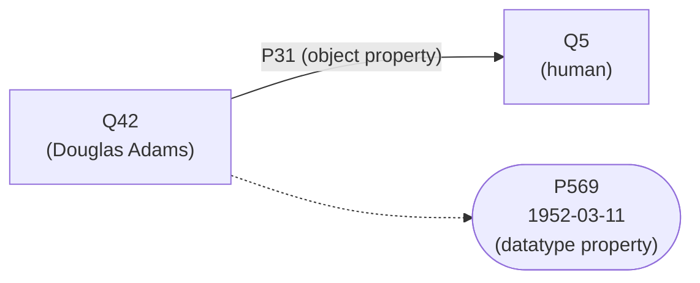
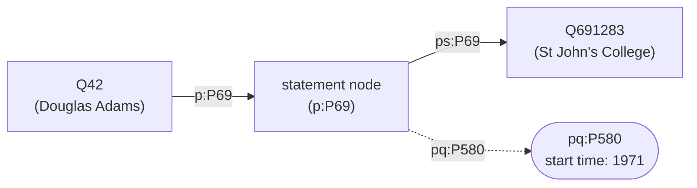
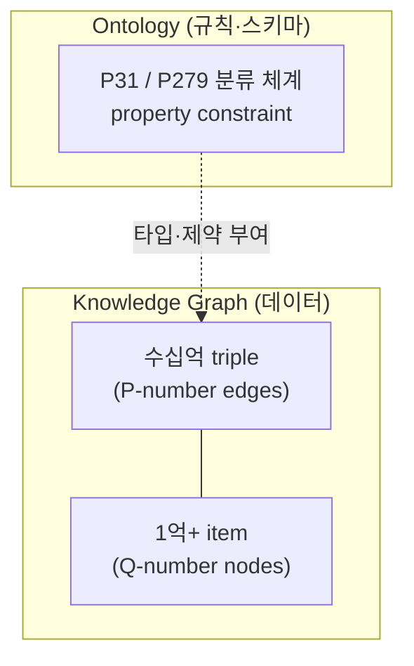

> [[/data-architect/05_how_to_implement_ontology]] 에서 "Customer는 *엔티티*다", "구매를 *관계*로 표현한다", "쿠폰 발송은 *행위*다"라고 썼다. 그 단어들을 엄밀히 구분하지 않은 채로. 1편이 알람 하나로 온톨로지를 훑었다면, 이 글은 그 안에서 매번 미끄러졌던 개념들의 경계를 못 박는다.
---

## 도입 — 같은 개념, 정반대 진영

마켓온은 **폐쇄 세계**였다. 조직 경계 안의 규범 데이터, 커스텀 SQL, CWA. **Wikidata**는 정반대다 — 위키미디어 재단의 협업형 지식베이스, 1억 개 이상의 item, 전체가 RDF로 노출되고 SPARQL로 질의된다. 개방·OWA·표준.

같은 개념(명사·관계·추론·시제)이 양 극단에서 어떻게 형식화되는지 겹쳐 보면, 각 개념의 경계가 입체로 드러난다.

Wikidata의 모든 것은 두 가지로 표현된다. **item**(Q-number, `Q42` = Douglas Adams)과 **property**(P-number, `P31` = instance of).

> **Q42 P31 Q5** — "Douglas Adams는 human의 instance다."

이 한 triple 안에 네 축이 전부 있다. `Q42`(명사), `P31`(관계), RDF triple(표준), *언제 참인가*(시제).

<div class="callout-info">
이 글의 모든 SPARQL은 <code>https://query.wikidata.org</code>에 그대로 붙여 실행할 수 있다. prefix(<code>wd:</code> item, <code>wdt:</code> truthy property, <code>p:/ps:/pq:</code> reified statement)는 WDQS에 기본 등록돼 있다. 결과 건수·값은 Wikidata가 살아있는 DB라 시점에 따라 달라진다.
</div>

---

## 축 1 — 명사: Q-number로 보는 Entity·Object·Type·Instance

| 내 용어(1편) | 무엇 | OWL/표준 용어 | 마켓온 | Wikidata |
|--------------|------|---------------|--------|----------|
| Entity | 개념적 실체 | 실세계 referent | 사람 K씨 | 실존 인물 Douglas Adams |
| Object | 시스템 표상 | named individual | `customers`의 row | item `Q42` |
| Type | 분류 | `owl:Class` | `'customer'` | `Q5`(human) |
| Instance | 개별값 | `owl:NamedIndividual` | `CUST-029182` | `Q42` |

### Entity와 Object의 분리 — IRI로 구현되다

핵심은 **Entity와 Object의 분리**다. 마켓온에서 K씨라는 사람은 시스템 바깥에 존재하는 실체(Entity)이고, `customers`의 한 행은 그를 시스템 안으로 끌어들인 표상(Object)이었다. Wikidata에서 이 분리는 **IRI**(전역 식별자)로 못 박힌다.

```text
실세계 Entity:  영국 작가 Douglas Adams (1952–2001), 시스템 바깥에 존재
       ↓ 표상
Wikidata Object: http://www.wikidata.org/entity/Q42   ← 이 IRI가 곧 Object
```

`Q42`는 Douglas Adams *그 자신*이 아니다. 그를 가리키는 위키데이터의 **named individual**이다. 1편이 `U-29182`와 `M-00991`을 `CUST-029182` 하나로 묶은 것 — 두 개의 불완전한 Object가 하나의 Entity를 가리킨다는 선언 — 이 Wikidata에서는 `owl:sameAs` 혹은 IRI 통합으로 나타난다. 다른 데이터베이스가 같은 사람을 자기 ID로 표상해도, `Q42`라는 IRI 하나에 외부 식별자(P214 VIAF, P244 LoC 등)로 연결하면 entity resolution이 전역 차원에서 일어난다.


### Type와 Instance — "Q42 P31 Q5"가 곧 Type 선언

Type과 Instance의 분리도 한 triple에 박혀 있다.

> **Q42 (instance of / P31) Q5** = "Q42는 Q5(human)의 instance다."

`Q5`(human)가 **Type**(`owl:Class`), `Q42`가 그 Type의 **Instance**(`owl:NamedIndividual`)다. 이것은 1편 `prop_def.entity_type = 'customer'`가 했던 Type 레벨 선언과 *정확히 같은 구조*다. 마켓온은 `'customer'`라는 문자열로 Type을 선언했고, Wikidata는 `Q5`라는 item으로 선언한다. 형식만 다를 뿐 둘 다 "이 개별값은 저 분류에 속한다"를 말한다.

"human이라는 Type의 외연(extension)"은? Wikidata에서 쿼리로 뽑을 수 있다.

```sparql
# "human Type의 외연은 몇 개인가" — Q5의 instance 개수
SELECT (COUNT(*) AS ?count) WHERE {
  ?item wdt:P31 wd:Q5 .
}
```

이 쿼리의 결과집합이 곧 `Q5`의 외연이다 — 1편 `SELECT * FROM customers`가 'customer' Type의 외연이었던 것과 같은 의미. 마켓온은 외연을 *테이블*로 들고 있었고, Wikidata는 외연을 *쿼리로 구성*한다. (실행하면 1,200만 건 이상이 나온다 — Wikidata에 등재된 "사람" item 전부.)

### 메타클래스 — Type도 Instance가 될 수 있다

**하나의 item이 instance이면서 동시에 class일 수 있다.**

```text
Q42        --P31(instance of)-->  Q5 (human)        ← Q42는 instance
Q5 (human) --P279(subclass of)--> Q5314392 (...)    ← Q5는 class이기도
Q3231690 (automobile model) --P31--> Q16889133 (class)  ← 모델은 metaclass의 instance
```

Honda Accord는 "car model"의 instance이고, "car model"은 그 자체로 class다. Wikidata는 class/instance를 *강제하지 않기* 때문에 한 item이 양쪽 역할을 가질 수 있다. 경계는 *관습*이지 *물리적 제약*이 아니다.

<div class="callout-info">
(검증 필요) metaclass·이중 분류는 OWL 2가 <em>punning</em>으로 허용하는 것이며 Wikidata가 그 위에서 운영된다. 다만 한 item에 P31과 P279를 무분별하게 같이 붙이면 *결함*이다(예: Wiener Schnitzel을 dish의 instance이자 subclass로 동시에 만든 비일관 사례는 커뮤니티가 정리 대상으로 본다). "가능하다"와 "권장된다"는 다르다. 정확한 규칙은 <a href="https://www.wikidata.org/wiki/Help:Basic_membership_properties">Help:Basic membership properties</a> 1차 출처를 확인하라.
</div>

다음은 이 명사들을 잇는 선 — 관계와 추론이다.

---

## 축 2 — 관계: P31 vs P279, 그리고 2편이 미룬 추론을 실행한다

외래키는 *어느 행이 어느 행을 참조하는가*만 말한다 — 관계의 **의미**와 **방향**은 말하지 못한다. 마켓온이 `is-a`/`part-of`를 피한 이유는 그 두 관계가 *추론(inference)*을 부르기 때문이다. Wikidata는 `is-a`를 실제로 쓰고, 그 추론을 SPARQL에서 실행해 보여준다.

### P31 vs P279 — Instance/Type 경계가 두 property로 갈린다

Instance/Type의 경계가 Wikidata에서는 두 개의 property로 분리돼 있다.

| property | 의미 | 언어 테스트 | RDF 대응 | transitive? |
|----------|------|-------------|----------|-------------|
| `P31` (instance of) | x는 C의 개별 사례 | "x **is a** C" | `rdf:type` | **아니오** |
| `P279` (subclass of) | A의 모든 instance는 B의 instance | "A **is a kind of** B" | `rdfs:subClassOf` | **예** |

언어 테스트가 핵심이다. **"is a"**(P31)와 **"is a kind of"**(P279)를 구분하면 거의 틀리지 않는다.

- Everest(Q513) **P31** mountain(Q8502) — "에베레스트는 산*이다*" (개별 산)
- volcano(Q8072) **P279** mountain(Q8502) — "화산은 산의 *일종이다*" (산의 하위 분류)

`is-a`($\sqsubseteq$, subsumption)가 **P279**다. Wikidata 공식 문서는 추론 규칙을 명시한다.

> P279는 transitive property다. A가 B의 subclass이고 B가 C의 subclass이면, A는 *암묵적으로* C의 subclass다. 또한 x가 B의 instance이고 B가 C의 subclass이면, x는 *암묵적으로* C의 instance다.

SPARQL의 property path `*`(transitive closure)가 그 subsumption inference를 *명시적으로 실행*한다.

### 추론을 눈으로 — truthy vs transitive

같은 질문 "X는 사람인가?"를 두 가지로 묻는다. 차이가 곧 추론의 효과다.

<div class="compare-grid">
<div class="compare-col" markdown="1">

**추론 없이 — 직접 선언된 것만**

```sparql
# P31로 직접 Q5라고 적힌 것만
SELECT (COUNT(*) AS ?c) WHERE {
  ?x wdt:P31 wd:Q5 .
}
```

`Q42 P31 Q5`처럼 *명시적으로* human이라 적힌 item만 센다.

</div>
<div class="compare-col" markdown="1">

**추론 적용 — subclass까지 타고**

```sparql
# P31 후 P279를 0회 이상 거슬러 Q5에 닿는 것
SELECT (COUNT(*) AS ?c) WHERE {
  ?x wdt:P31/wdt:P279* wd:Q5 .
}
```

`Q5`의 *하위 분류*의 instance까지 — reasoner가 추론할 모든 human을 센다.

</div>
</div>

`wdt:P31/wdt:P279*`를 풀어 읽으면 "P31로 어떤 class에 닿은 뒤, 그 class에서 P279를 0번 이상 거슬러 올라가 `Q5`에 도달하라"다. `*`이 transitive closure — 2편이 "reasoner가 한다"고만 한 그 일을, SPARQL이 쿼리 시점에 *전개*한다.

이 추론은 운영 위에서 실제로 작동한다. 공식 문서의 예시:

> Lighthouse of Alexandria(Q43244)는 lighthouse(Q39715)의 instance이고, lighthouse는 tower(Q12518)의 subclass다. 따라서 Q43244는 *암묵적으로* tower의 instance다 — 누구도 그 triple을 직접 적지 않았는데도.

```sparql
# 알렉산드리아 등대가 '탑'인가? — 직접 선언은 없지만 추론으로 참
SELECT ?x ?xLabel WHERE {
  VALUES ?x { wd:Q43244 }
  ?x wdt:P31/wdt:P279* wd:Q12518 .   # tower
  SERVICE wikibase:label { bd:serviceParam wikibase:language "ko,en". }
}
```

이것이 마켓온이 *포기한* 능력이다. 1편은 모든 판단을 명시적 `WHERE`로 적었다. SQL로 같은 추론을 하려면 재귀 CTE가 필요하다.

<div class="compare-grid">
<div class="compare-col" markdown="1">

**SQL — 재귀로 직접 전개**

```sql
WITH RECURSIVE subclass AS (
  SELECT child, parent
  FROM class_edges
  WHERE parent = 'Q5'        -- human
  UNION ALL
  SELECT e.child, e.parent
  FROM class_edges e
  JOIN subclass s ON e.parent = s.child
)
SELECT COUNT(*) FROM instance i
JOIN subclass s ON i.class = s.child;
```

추론을 *내가* 코드로 짠다.

</div>
<div class="compare-col" markdown="1">

**SPARQL — property path 한 줄**

```sparql
SELECT (COUNT(*) AS ?c) WHERE {
  ?x wdt:P31/wdt:P279* wd:Q5 .
}
```

추론이 *문법*에 내장돼 있다.

</div>
</div>

`WITH RECURSIVE` 블록 전체가 `wdt:P279*` 한 토큰에 압축된다. 표준 스택이 사는 이유의 절반이 이 한 줄에 있다.

<div class="callout-warning">
함정: P31은 transitive가 *아니다*. Angela Merkel(Q567)은 politician(Q82955)의 instance이고 politician은 profession(Q28640)의 instance이지만, "Angela Merkel은 profession의 instance다"는 <strong>거짓</strong>이다. 그래서 추론 path는 <code>P31/P279*</code>(instance 한 번 + subclass 여러 번)이지 <code>P31*</code>이 아니다. P31을 transitive처럼 타면 사람을 직업으로 만든다.
</div>

### object property vs datatype property — Wikidata도 둘을 가른다

2편의 또 다른 표 — 속성이 **값으로 끝나는가** 아니면 **다른 엔티티를 가리키는가** — 도 Wikidata에 그대로 있다.

| 구분 | 끝나는 곳 | 2편 대응 | Wikidata 예시 |
|------|-----------|----------|---------------|
| object property | 다른 entity(IRI) | `links`(`placed`) | `P31`(→ item Q5) |
| datatype property | literal(값) | `prop_def`(`amount`) | `P569`(date of birth → 날짜 literal) |

`Q42 wdt:P31 wd:Q5`의 목적어 `Q5`는 또 다른 item이다 — **object property**, 그래프를 더 순회할 수 있다. 반면 `Q42 wdt:P569 "1952-03-11"`의 목적어는 날짜 리터럴이다 — **datatype property**, 여기서 끝난다. 2편의 mermaid에서 실선(엔티티→엔티티)과 점선(엔티티→값)으로 갈랐던 그 구분이, Wikidata에서는 property의 *값 타입*으로 강제된다.



### 모델링 오류 = 의미 위반, 그리고 constraint

2편은 "외래키는 카디널리티 제약을 강제하지만 그 *의미*는 말하지 못한다 — 온톨로지는 제약과 의미를 함께 적는다"고 했다. Wikidata의 **property constraint**가 그 실증이다.

`P279`에는 여러 제약이 붙어 있다 — 예컨대 "subject가 class여야 한다"는 제약. baker(Q43845)를 occupation(Q12737077)의 *subclass*로 잘못 적으면 "모든 baker가 occupation이 된다"는 의미 오류가 생긴다(baker는 직업의 *일종*이 아니라 그 직업을 *가진 사람*의 분류다). FK로는 절대 못 잡는, 순수 *의미*의 오류다.

<div class="callout-info">
(검증 필요) Wikidata의 property constraint는 <strong>편집 힌트</strong>이지 reasoner의 논리적 강제가 아니다. WDQS는 reasoner가 아니라 graph DB이고, constraint 위반은 빨간 경고로 표시될 뿐 저장을 막지 않는다. 즉 "제약을 적는다"와 "제약이 강제된다"는 Wikidata에서 다른 일이다 — 2편 "FK가 강제하는 제약"과 결이 다른, *느슨한* 거버넌스다. constraint 종류·동작은 <a href="https://www.wikidata.org/wiki/Property:P279">Property:P279</a> 페이지에서 확인하라.
</div>


---

## 축 3 — 표준 스택: SPARQL을 직접 실행한다

| 축 | RDF/OWL 스택 (Wikidata) | 1편 BigQuery 커스텀 (마켓온) |
|----|-------------------------|------------------------------|
| 식별자 | IRI `wd:Q42` | `canonical_id` |
| 관계 | triple store | `links` 테이블 |
| 추론 | property path / reasoner | 없음(명시 SQL) |
| 세계 가정 | OWA | CWA |
| 질의 | SPARQL | SQL |

### triple의 실물 — 한 줄이 곧 한 관계

RDF는 세계를 triple(S-P-O)의 집합으로 표현한다.

```text
wd:Q42   wdt:P31   wd:Q5 .
주어(S)  술어(P)   목적어(O)
```

1편 `links` 테이블의 한 행 = `(source_id, rel_type, target_id)` 가 곧 한 triple이었다. 마켓온은 triple을 *테이블의 행*으로 들고 있었고, Wikidata는 triple을 *일급 시민*으로 든다. 같은 개념, 다른 물리.

### reified statement — 2편이 callout으로만 언급한 것의 실물

`Q42 wdt:P69 wd:Q691283`(Douglas Adams가 St John's College에서 *교육받았다*)는 단순 truthy triple이다. 그런데 "*언제* 다녔는가"라는 **qualifier**를 붙이려면 truthy(`wdt:`)로는 안 된다. statement를 하나의 *노드*로 끌어올려야 한다 — 이것이 reification이다.



세 단계 prefix가 reification의 문법이다.

- `p:P69` — item에서 **statement 노드**로 (truthy를 우회)
- `ps:P69` — statement 노드에서 **실제 값**으로
- `pq:P580` — statement 노드에 **qualifier**(시작 시점)를 붙임

이것이 1편 `links.props JSON` 컬럼의 정체다. 마켓온은 관계에 부가정보를 JSON으로 매달았고, Wikidata는 statement 노드 + qualifier로 매단다. 둘 다 "관계 자체를 기술하는" reification이다.

### 같은 질문, 두 문법 — SQL ↔ SPARQL

"Douglas Adams가 다닌 교육기관을 *입학 시점순*으로" — 같은 질문을 양쪽 문법으로 나란히 적는다.

<div class="compare-grid">
<div class="compare-col" markdown="1">

**SQL — 가상의 관계형 스키마**

```sql
SELECT i.name, e.start_year
FROM education e
JOIN person  p ON p.id = e.person_id
JOIN institution i ON i.id = e.inst_id
WHERE p.name = 'Douglas Adams'
ORDER BY e.start_year;
```

조인 3개. 시점은 `education.start_year` 컬럼.

</div>
<div class="compare-col" markdown="1">

**SPARQL — query.wikidata.org 실행 가능**

```sparql
SELECT ?inst ?instLabel ?start WHERE {
  wd:Q42 p:P69 ?st .
  ?st ps:P69 ?inst .
  OPTIONAL { ?st pq:P580 ?start. }
  SERVICE wikibase:label {
    bd:serviceParam wikibase:language "ko,en". }
}
ORDER BY ?start
```

`p:`/`ps:`/`pq:`로 reified statement 순회.

</div>
</div>

같은 질문이다. SQL은 *테이블을 조인*하고, SPARQL은 *그래프를 순회*한다. `SERVICE wikibase:label`은 Q-number를 사람이 읽을 레이블로 바꿔주는 WDQS 전용 서비스 — 이것 없이는 결과가 `Q691283` 같은 raw IRI로만 나온다.

### 왜 마켓온은 이걸 안 썼나 — 같은 개념, 다른 정답

여기서 2편의 결론으로 돌아온다. Wikidata가 RDF/SPARQL로 도는 이유와 마켓온이 SQL로 도는 이유는 *대칭*이다.

<div class="callout-note">
Wikidata: 외부 데이터 연합 · 공개 vocabulary 재사용 · 전 세계가 같은 <code>Q42</code>를 참조 → <strong>RDF가 맞다</strong>. 마켓온: 조직 경계 안 · 폐쇄적 규범 데이터 · 결정론과 디버깅 가능성 우선 → <strong>SQL이 맞다</strong>. 도구가 아니라 문제가 정당화한다.
</div>

`Q42`라는 IRI를 전 세계 수천 개 데이터셋이 재사용한다 — 이것이 vocabulary 공유다. 마켓온의 `CUST-029182`는 조직 밖에서 의미가 없다. Wikidata는 연합을 *전제*하므로 전역 식별자·triple·SPARQL이 본질적이고, 마켓온은 연합을 *원하지 않으므로* org-local ID·테이블·SQL이 본질적이다. **같은 다섯 개념, 정반대 정답.**


---

## 축 4 — 시제: rank·P585로 시간을 형식화하고, OWA를 실제로 만지다

### OWA를 직접 경험한다 — "없다"가 "거짓"이 아니다

어떤 인물 item에 `P26`(spouse, 배우자) 진술이 없다고 하자. 마켓온이라면 `NOT EXISTS (... WHERE rel='spouse')`로 "미혼"이라 단정한다(negation as failure = CWA). Wikidata에서는 다르다 — `P26`이 없다는 건 "미혼"이 아니라 **"아직 입력 안 됨"**일 뿐이다. 부재가 거짓을 *뜻하지 않는다*. 이것이 OWA가 데이터 모델에 박힌 방식이다.

<div class="callout-warning">
함정: Wikidata에서 <code>FILTER NOT EXISTS { ?person wdt:P26 ?x }</code> 로 "배우자 없는 사람"을 뽑으면, 그건 "미혼인 사람"이 <strong>아니라</strong> "배우자가 입력되지 않은 사람"이다. OWA 데이터에 CWA 쿼리(부재=거짓)를 들이대면 의미가 어긋난다. 마켓온의 <code>NOT EXISTS</code>는 정당했다 — 마켓온은 CWA니까. Wikidata에서 같은 패턴은 함정이다.
</div>

### UNA 미적용 — 두 IRI가 같은 것일 수 있다

2편: "OWL은 고유 이름 가정(unique name assumption)을 적용하지 않는다 — 두 IRI가 같은 것을 가리킬 수 있다." Wikidata에서는 *중복 item*으로 나타난다. 같은 인물이 실수로 `Q42`와 (가상의)`Q9999999`로 두 번 만들어지면, 둘은 `owl:sameAs`로 병합 대상이 된다. 마켓온의 entity resolution(여러 Object → 하나의 Entity)이 Wikidata에서는 item 병합으로 일어난다. 같은 문제, 다른 운영.

### rank = 시간의 형식화, 그리고 핵심 논점

Wikidata는 한 property에 여러 값을 둘 수 있고, **rank**로 그중 무엇이 대표값인지 표시한다. 세 가지다.

| rank | 의미 | 캐나다 인구(Q16 P1082) 예 | 마켓온 대응 |
|------|------|---------------------------|-------------|
| **preferred** | 가장 현재값 / 합의값 | 최신 센서스 인구 | `valid_to IS NULL`(현재 유효) |
| **normal** | 과거이지만 *참*인 값 | 이전 연도 인구 + P585 | 과거 SCD2 레코드 |
| **deprecated** | *틀린* 값 | 오기·철회된 측정치 | (삭제 아닌) 오류 플래그 |

핵심 통찰이 여기 있다.

<div class="callout-warning">
<strong>오래된 값은 deprecated가 아니다.</strong> deprecated는 "틀린 값" 전용이다. "과거였지만 참이었던 값"은 deprecated가 아니라 <strong>normal + P585(point in time)</strong>로 표시한다. 2편이 "<code>valid_to IS NULL</code>은 CWA가 아니라 단지 현재 유효 레코드 선택 술어"라 한 것과 같은 논리 — 과거임(normal)과 틀림(deprecated)은 다른 차원이다. 이걸 섞으면 역사를 오류로 지운다.
</div>

### truthy의 함정 — `wdt:`는 시계열을 숨긴다

이 rank 체계가 SPARQL에 만드는 함정이 2편 "정의의 시제"의 Wikidata판이다. 공식 문서에 따르면 **WDQS는 statement를 두 버전으로 저장한다.**

1. **best rank** 버전 — truthy(`wdt:`)로 접근. preferred가 있으면 그것, 없으면 normal. (deprecated 제외)
2. **any rank** 버전 — `p:`/`ps:`/`pq:`로 접근. 모든 값 + qualifier + reference.

즉 `wdt:P1082`(인구)는 *현재 대표값 하나*만 준다. 전체 시계열을 보려면 reified 경로로 가야 한다. 캐나다(Q16) 인구로 실증한다 — 이건 공식 문서의 예시 그대로다.

<div class="compare-grid">
<div class="compare-col" markdown="1">

**truthy — 현재값만 (함정)**

```sparql
# best rank 하나만 반환
SELECT ?pop WHERE {
  wd:Q16 wdt:P1082 ?pop .
}
```

결과 1행. "캐나다 인구 = (최신값)". 시계열은 *보이지 않는다*.

</div>
<div class="compare-col" markdown="1">

**reified — 전체 시계열**

```sparql
# 모든 인구값 + 시점 + rank
SELECT ?pop ?date ?rank WHERE {
  wd:Q16 p:P1082 ?st .
  ?st ps:P1082 ?pop .
  ?st wikibase:rank ?rank .
  OPTIONAL { ?st pq:P585 ?date. }
}
ORDER BY ?date
```

결과 N행. 연도별 인구 전체가 펼쳐진다.

</div>
</div>

왼쪽은 2편의 "as-of 동결 = 현재 정의로 고정된 한 값"에, 오른쪽은 "소급 재계산을 가능케 하는 전체 이력"에 대응한다. `wikibase:rank`로 각 값이 preferred인지 normal인지 읽을 수 있고, `wikibase:BestRank`를 필터로 쓰면 truthy와 같은 "대표값만" 동작을 reified 경로에서도 재현한다.

<div class="callout-info">
(검증 필요·과단순화 금지) truthy(<code>wdt:</code>)는 "<em>항상 현재값</em>"이 아니라 정확히는 "<em>best rank(deprecated 제외, preferred 우선)</em>"다. 보통 현재값이 preferred로 지정돼 있어 "현재값처럼" 보일 뿐, 편집자가 rank를 안 붙였으면 normal 값 여럿이 다 truthy로 나올 수 있다. <a href="https://www.wikidata.org/wiki/Help:Ranking">Help:Ranking</a> 의 "best rank" 정의가 1차 출처다.
</div>

### 정의의 변경 = 온톨로지의 진화

정의 자체가 시간에 따라 바뀐다. **class 구조 자체**가 드리프트한다. `P31`/`P279`로 짜인 분류 체계가 커뮤니티 합의에 따라 재편되면, 어제 `Q-something`의 instance였던 것이 오늘은 다른 class의 subclass가 된다. 마켓온의 `prop_def`(`valid_from`/`valid_to`)가 정의 이력을 한 테이블에 정규화했다면, Wikidata에서는 그 이력이 item 편집 히스토리에 흩어져 있다.

<div class="callout-info">
(검증 필요) Wikidata class 구조의 시간적 드리프트는 커뮤니티 분석(예: addshore의 통계 블로그)에서 관찰된 <em>주장</em>이지, 공식 명세가 보장하는 속성이 아니다. "P31/P279 분포가 시간에 따라 변한다"는 경향으로 읽되, 구체 수치는 분석 시점에 의존한다.
</div>


---

## 마무리 — 두 극단을 겹쳐야 경계가 보인다

네 축을 마켓온과 Wikidata 양쪽에서 갈랐다. 한 표로 겹쳐 본다.

| 축 | 마켓온 (폐쇄·CWA·커스텀) | Wikidata (개방·OWA·표준) |
|----|--------------------------|---------------------------|
| 명사 | `canonical_id` + `customers` row | IRI `Q42` + `P31 Q5` |
| 관계 | `links` 테이블(`placed`) | truthy/reified triple, `P31`/`P279` |
| 추론 | 없음 — 명시 SQL | `wdt:P31/wdt:P279*` property path |
| 표준 | BigQuery 커스텀 | RDF·SPARQL·reification |
| 시제 | `NOT EXISTS`, `valid_to IS NULL` | OWA 부재, rank, `pq:P585` |

<div class="callout-tip">
1편이 폐쇄 세계(CWA·커스텀)를 <em>짓는 법</em>이었다면, 2편은 같은 다섯 개념을 개방 세계(OWA·표준)가 어떻게 형식화하는지 <em>보여줬다</em>. 두 극단을 겹쳐야 각 개념의 경계가 평면이 아니라 입체로 드러난다. Entity와 Object의 분리는 IRI로, <code>is-a</code> 추론은 property path로, 정의의 시제는 rank로 — 같은 개념이 도구를 바꿔 입증된다.
</div>

마지막 혼동 하나를 정리한다. 온톨로지와 지식 그래프(Knowledge Graph)는 같은 것인가? Wikidata가 가장 또렷한 예다.



아래층 — 1억 개의 item과 수십억 개의 triple — 이 Knowledge Graph다. 위층 — `P31`/`P279`가 짜는 class 분류와 property constraint — 가 Ontology다. 마켓온에서 `links`(KG의 edge) 위에 `prop_def`·`action_def`(온톨로지 규칙)가 올라탔던 것과 같은 두 층위 구조다.

> 다만 이 구분은 *통상적*인 것이지 *정의상* 고정된 것은 아니다. 기술논리에서 ontology는 스키마(TBox)와 인스턴스(ABox)를 *모두* 포함하는 단위로도 쓰인다 — Wikidata에서 metaclass가 instance이자 class였던 것처럼, 경계는 관습이다.

이제 당신은 온톨로지를 *말할* 수 있다. 그리고 `query.wikidata.org`를 열어 *직접 실행하며* 확인할 수 있다.

다음으로 다룰 것이 있다면 **온톨로지 정렬(alignment)과 연합** — 마켓온의 `CUST-029182`와 Wikidata의 `Q42`를 잇는 일. 폐쇄와 개방을 *연결*하는 순간, 두 세계 가정이 충돌한다. 그 충돌이 다음 글의 주제다.

---

## 참고

- [[/data-architect/04_what_is_ontology]] — 온톨로지가 합의를 설계한다는 주장, 시맨틱 웹 실패의 세 이유(OWA·형식화 비용·강제력 부재)
- [[/data-architect/05_how_to_implement_ontology]] — 마켓온 K씨 사건, 다섯 개념(Entity+Identity·Link·Property Definition·Action·Dynamic)의 폐쇄형 구현
- Wikidata, [*Help:Basic membership properties*](https://www.wikidata.org/wiki/Help:Basic_membership_properties) — P31(instance of) vs P279(subclass of) 권위 출처, transitivity 규칙
- Wikidata, [*Help:Ranking*](https://www.wikidata.org/wiki/Help:Ranking) — preferred/normal/deprecated, best rank, 캐나다 인구(Q16 P1082) 예시
- Wikidata, [*SPARQL tutorial*](https://www.wikidata.org/wiki/Wikidata:SPARQL_tutorial) — `wd:`/`wdt:`/`p:`/`ps:`/`pq:` prefix, label service
- Wikibooks, [*SPARQL/WIKIDATA Qualifiers, References and Ranks*](https://en.wikibooks.org/wiki/SPARQL/WIKIDATA_Qualifiers,_References_and_Ranks) — reification·rank 실전 쿼리
- W3C, [*OWL 2 Web Ontology Language Primer*](https://www.w3.org/TR/owl2-primer/) — Class/Individual, OWA·UNA, punning(metaclass)
- 실행 환경: [`https://query.wikidata.org`](https://query.wikidata.org) — 본문 모든 SPARQL 실행 가능
