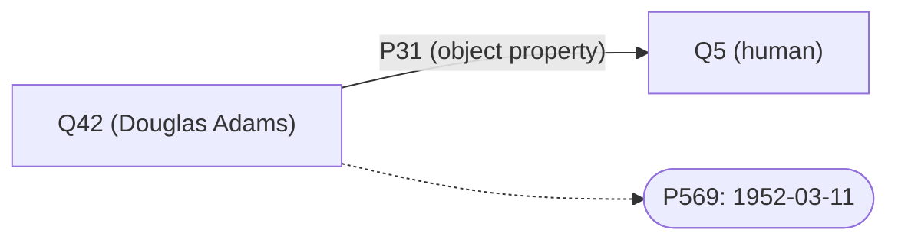
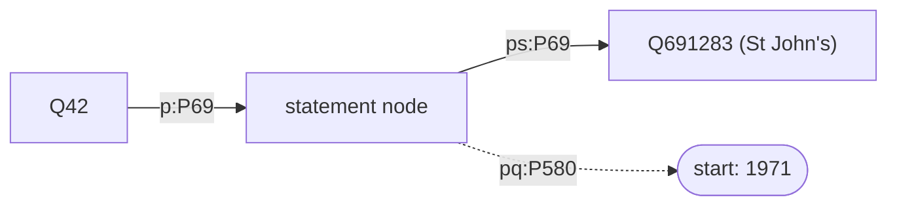
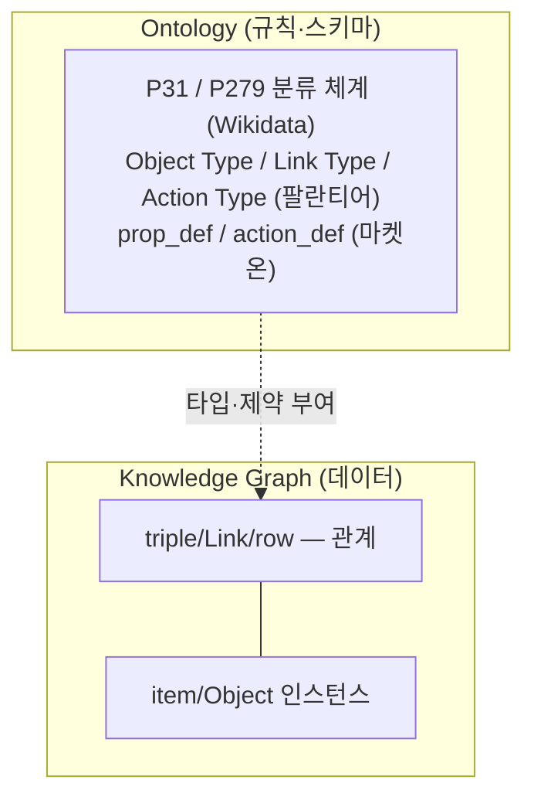

> [[/data-architect/06_how_to_implement_ontology]] 의 마켓온 케이스에서 "Customer는 *엔티티*다", "구매를 *관계*로 표현한다", "쿠폰 발송은 *행위*다"라고 썼다. 그 단어들을 엄밀히 구분하지 않은 채로. 이 글은 그 케이스에서 매번 미끄러졌던 개념들의 경계를 못 박는다.

그리고 세 번째 세계를 추가한다. **마켓온(폐쇄·CWA·커스텀 SQL) → 팔란티어 파운드리(폐쇄·CWA·형식 스키마) → Wikidata(개방·OWA·RDF 표준)**. 같은 개념이 세 형식을 입었을 때 경계가 가장 또렷해진다.

---

## 도입 — 세 세계를 겹쳐야 개념이 입체가 된다

| | 마켓온 | 팔란티어 파운드리 | Wikidata |
|--|--------|-----------------|---------|
| 세계 가정 | CWA | CWA | OWA |
| 경계 | 조직 내부 | 조직 내부 | 전 세계 |
| 스키마 | 커스텀 SQL 테이블 | 형식 온톨로지 (Object Type, Link Type, Action Type) | RDF·OWL (P31, P279, statement) |
| 식별자 | `canonical_id` (로컬) | `objectRid` (로컬) | IRI `Q42` (전역) |
| 질의 | SQL | Ontology API (Python/TS SDK) | SPARQL |
| 추론 | 없음 — 명시 SQL | 없음 — 명시 조회 | property path `P31/P279*` |
| 행위(Action) | 커스텀 SQL + 앱 코드 | **Action Type** (형식 계약) | 없음 — 지식만 표현 |

마켓온과 팔란티어 파운드리는 둘 다 **폐쇄 세계(CWA)**다. 다른 점은 형식화 수준이다. 마켓온은 테이블과 SQL로 온톨로지를 *흉내냈고*, 팔란티어는 Object Type·Link Type·Action Type을 **일급 시민**으로 다룬다.

Wikidata는 반대 극단 — RDF/OWL의 개방 세계. 1억 개 item, 전 세계가 같은 `Q42`를 참조한다.

Wikidata의 모든 것은 두 가지로 표현된다. **item**(Q-number, `Q42` = Douglas Adams)과 **property**(P-number, `P31` = instance of).

> **Q42 P31 Q5** — "Douglas Adams는 human의 instance다."

이 한 triple 안에 네 축이 전부 있다. `Q42`(명사), `P31`(관계), RDF triple(표준), *언제 참인가*(시제).

<div class="callout-info">
이 글의 모든 SPARQL은 <code>https://query.wikidata.org</code>에 그대로 붙여 실행할 수 있다.
</div>

---

## 축 1 — 명사: Entity · Object · Type · Instance

| 내 용어 | 무엇 | OWL/표준 | 마켓온 | 팔란티어 | Wikidata |
|---------|------|---------|--------|---------|---------|
| Entity | 개념적 실체 | 실세계 referent | 사람 K씨 | 사람 K씨 | 실존 인물 Douglas Adams |
| Object | 시스템 표상 | named individual | `customers` row | Object Instance | item `Q42` |
| Type | 분류 | `owl:Class` | `'customer'` 문자열 | **Object Type** (`Customer`) | `Q5` (human) |
| Instance | 개별값 | `owl:NamedIndividual` | `CUST-029182` | Object Instance | `Q42` |

### 팔란티어의 Object Type — 형식 스키마가 있는 CWA

마켓온은 `entity_type = 'customer'`라는 문자열로 Type을 선언했다. 팔란티어는 이것을 **Object Type**이라는 일급 시민으로 올린다.

```
Object Type: Customer
  Primary Key  : canonical_id
  Title Prop   : display_name
  Description  : 채널 무관하게 동일 실체를 가리키는 고객 단위
  Properties   : [display_name, tier, created_at, pii_email(SENSITIVE)]
  Derived Prop : [last_purchase_at, days_since_purchase, gmv_90d]
```

마켓온에서 `SELECT * FROM customers`가 'customer' Type의 외연을 리턴했듯, 팔란티어에서는 `objects.Customer.all()`이 같은 외연을 Object Set으로 리턴한다.

```python
# 팔란티어 Ontology API
all_customers = client.ontology.objects.Customer.all()          # 전체 Object Set
vip_customers = client.ontology.objects.Customer.where(
    Customer.tier.eq("VIP"))                                    # 필터 Object Set
k = client.ontology.objects.Customer.get("CUST-029182")        # 단건
```

### Wikidata의 Entity·Object 분리 — IRI로 구현

```text
실세계 Entity:  영국 작가 Douglas Adams (시스템 바깥에 존재)
       ↓ 표상
Wikidata Object: http://www.wikidata.org/entity/Q42   ← Named Individual
```

마켓온이 `U-29182`와 `M-00991`을 `CUST-029182`로 묶은 것이, Wikidata에서는 외부 식별자(P214 VIAF, P244 LoC)를 `Q42`에 연결하는 것으로 나타난다. 같은 entity resolution, 다른 형식.

### Type과 Instance — "Q42 P31 Q5"가 곧 Type 선언

> **Q42 (instance of / P31) Q5** = "Q42는 Q5(human)의 instance다."

`Q5`(human)가 Type, `Q42`가 Instance. 마켓온의 `entity_type = 'customer'` 선언과 *정확히 같은 구조*다. Wikidata에서 'human Type의 외연'은:

```sparql
SELECT (COUNT(*) AS ?count) WHERE {
  ?item wdt:P31 wd:Q5 .
}
-- 결과: 1,200만+ (Wikidata에 등재된 "사람" 전부)
```

### 메타클래스 — Type도 Instance가 될 수 있다

하나의 item이 instance이면서 class일 수 있다.

```
Q42        --P31--> Q5 (human)        ← Q42는 instance
Q5 (human) --P279-> Q5314392 (...)    ← Q5는 class이기도
```

팔란티어에서의 대응: **Interface**. `Schedulable` 인터페이스는 그 자체가 타입 계약이면서, `Flight`·`MaintenanceJob`·`CrewShift`가 이를 구현하는 인스턴스 타입이 된다.

```
Interface: Schedulable
  Properties: scheduledStart, scheduledEnd, status
  Implemented by: Flight, MaintenanceJob, CrewShift   ← 다형성
```

---

## 축 2 — 관계: P31 vs P279, 추론, 그리고 팔란티어의 Link Type

### 팔란티어의 Link Type — 의미를 담는 관계 선언

팔란티어에서 관계는 **Link Type**이라는 형식 선언이다. FK 조인과 다른 점은 카디널리티와 방향 이름을 의미적으로 명시한다는 것이다.

```
Link Type: placed / placedBy
  Source       : Customer (MANY)
  Target       : Order    (MANY)
  Forward Name : placed   — "K씨가 place한 주문들"
  Reverse Name : placedBy — "이 주문을 place한 고객"

Link Type: hasCrew / assignedTo
  Source       : Flight      (MANY)
  Target       : CrewMember  (MANY)
  Forward Name : hasCrew     — "이 편의 승무원들"
  Reverse Name : assignedTo  — "이 승무원이 배정된 편들"
```

SQL 외래키는 `order.user_id = customer.canonical_id`라는 조인 조건뿐이다. "고객이 주문을 *했다*"는 의미도, 역방향 이름도 없다.

```python
# 팔란티어 — Link 탐색 (Search Around)
orders = k.links.placed.list()                          # K씨의 주문들
customers = order.links.placedBy.list()                 # 역방향 탐색
crew = flight.links.hasCrew.list()                      # 편의 승무원
```

### Wikidata의 P31 vs P279 — Instance/Type 경계가 두 property로 갈린다

| property | 의미 | 언어 테스트 | transitive? |
|----------|------|-------------|-------------|
| `P31` (instance of) | x는 C의 개별 사례 | "x **is a** C" | **아니오** |
| `P279` (subclass of) | A의 모든 instance는 B의 instance | "A **is a kind of** B" | **예** |

- Everest(Q513) **P31** mountain(Q8502) — "에베레스트는 산*이다*" (개별 산)
- volcano(Q8072) **P279** mountain(Q8502) — "화산은 산의 *일종이다*"

팔란티어의 Object Type 계층과 비교하면:
- `P31` ↔ `Object Type: Flight` + 개별 인스턴스 `KE001`
- `P279` ↔ `Interface: Schedulable`이 `Flight`를 포함하는 상위 계약 — "Flight는 Schedulable의 일종"

### 추론을 눈으로 — truthy vs transitive

```sparql
-- 추론 없이: 직접 선언된 것만
SELECT (COUNT(*) AS ?c) WHERE { ?x wdt:P31 wd:Q5 . }

-- 추론 적용: subclass까지 타고
SELECT (COUNT(*) AS ?c) WHERE { ?x wdt:P31/wdt:P279* wd:Q5 . }
```

`wdt:P31/wdt:P279*` = "P31으로 어떤 class에 닿은 뒤, P279를 0번 이상 거슬러 올라가 Q5에 도달". SQL로 같은 추론을 하려면 재귀 CTE가 필요하다.

```sql
-- SQL — 재귀로 직접 전개
WITH RECURSIVE subclass AS (
  SELECT child, parent FROM class_edges WHERE parent = 'Q5'
  UNION ALL
  SELECT e.child, e.parent FROM class_edges e JOIN subclass s ON e.parent = s.child
)
SELECT COUNT(*) FROM instance i JOIN subclass s ON i.class = s.child;
```

팔란티어는 추론을 하지 않는다 — 대신 Interface로 다형성을 *명시적으로 선언*한다. `objects.Schedulable.all()`은 추론 없이 Interface 구현체 전체를 반환한다.

<div class="callout-warning">
함정: P31은 transitive가 <strong>아니다</strong>. Angela Merkel은 politician의 instance이고 politician은 profession의 instance이지만, "Angela Merkel은 profession의 instance"는 거짓이다. 추론 path는 <code>P31/P279*</code>이지 <code>P31*</code>이 아니다.
</div>

### object property vs datatype property

| 구분 | 끝나는 곳 | 마켓온 | 팔란티어 | Wikidata |
|------|-----------|--------|---------|---------|
| object property | 다른 entity | `links.placed` | Link Type | `P31`(→ Q5) |
| datatype property | literal | `orders.amount` | Property (Scalar) | `P569`(→ 날짜 리터럴) |



---

## 축 3 — 표준 스택: SPARQL vs Ontology API vs SQL

### triple의 실물

```text
wd:Q42   wdt:P31   wd:Q5 .
주어(S)  술어(P)   목적어(O)
```

마켓온의 `links` 테이블 한 행 `(source_id, rel_type, target_id)` = 한 triple. 팔란티어의 Link Type 인스턴스 = 한 triple. 같은 개념, 다른 물리.

### 같은 질문, 세 문법

"K씨/Douglas Adams가 연결된 주문/교육기관을 *시간순*으로":

**마켓온 SQL:**
```sql
SELECT o.source_id, o.completed_at, o.amount
FROM links l JOIN orders o ON o.canonical_id = l.target_id
WHERE l.source_id = 'CUST-029182' AND l.rel_type = 'placed'
ORDER BY o.completed_at;
```

**팔란티어 Ontology API (Python):**
```python
orders = k.links.placed.order_by(Order.completed_at.asc()).list()
for o in orders:
    print(o.completed_at, o.amount)
```

**Wikidata SPARQL (reified — qualifier 포함):**
```sparql
SELECT ?inst ?instLabel ?start WHERE {
  wd:Q42 p:P69 ?st .
  ?st ps:P69 ?inst .
  OPTIONAL { ?st pq:P580 ?start. }
  SERVICE wikibase:label { bd:serviceParam wikibase:language "ko,en". }
}
ORDER BY ?start
```

세 문법이 같은 그래프 탐색을 표현한다. SQL은 *테이블을 조인*하고, Ontology API는 *Link Type을 탐색*하고, SPARQL은 *triple store를 순회*한다.

### reified statement — qualifier의 실물

`Q42 wdt:P69 wd:Q691283`(Douglas Adams가 St John's College에서 교육받음)에 "*언제* 다녔는가"를 붙이려면 statement를 노드로 끌어올려야 한다.



마켓온의 `links.props JSON` = 팔란티어의 Link Type에 부가 속성 = Wikidata의 qualifier. 셋 다 "관계 자체를 기술하는" reification이다.

### 왜 마켓온과 팔란티어는 이걸 안 썼나

Wikidata가 RDF/SPARQL로 도는 이유와 마켓온·팔란티어가 SQL/Ontology API로 도는 이유는 *대칭*이다.

> **Wikidata**: 외부 데이터 연합·공개 vocabulary 재사용·전 세계가 같은 `Q42`를 참조 → **RDF가 맞다.**  
> **마켓온·팔란티어**: 조직 경계 안·폐쇄적 규범 데이터·결정론과 디버깅 가능성 우선 → **SQL/Ontology API가 맞다.**

`Q42`라는 IRI를 전 세계 수천 개 데이터셋이 재사용한다. `CUST-029182`는 조직 밖에서 의미가 없다. 연합을 *전제*하면 RDF·SPARQL이 본질적이고, 연합을 *원하지 않으면* 로컬 ID·SQL/API가 본질적이다. **같은 다섯 개념, 정반대 정답.**

---

## 축 4 — 시제: rank · P585 · SCD2

### OWA를 직접 경험한다 — "없다"가 "거짓"이 아니다

어떤 item에 `P26`(spouse, 배우자) 진술이 없을 때:

| 시스템 | 해석 |
|--------|------|
| 마켓온 (CWA) | `NOT EXISTS(...)` = "미혼"으로 단정 |
| 팔란티어 (CWA) | `customer.spouse == null` = "배우자 없음"으로 단정 |
| Wikidata (OWA) | `P26` 없음 = **"아직 입력 안 됨"** — 미혼의 증거가 아님 |

마켓온과 팔란티어의 `NOT EXISTS`는 CWA 시스템에서 정당하다. Wikidata에서 같은 패턴은 의미가 어긋난다.

### rank = 시간의 형식화

Wikidata는 한 property에 여러 값을 둘 수 있고, rank로 대표값을 표시한다.

| rank | 의미 | 마켓온 대응 | 팔란티어 대응 |
|------|------|------------|-------------|
| **preferred** | 가장 현재값 | `valid_to IS NULL` | 현재 Property 값 |
| **normal** | 과거이지만 *참*인 값 | 과거 `prop_def` 레코드 | 이력 API (별도) |
| **deprecated** | *틀린* 값 | 오류 플래그 | deprecated Object |

<div class="callout-warning">
<strong>오래된 값은 deprecated가 아니다.</strong> deprecated는 "틀린 값" 전용. "과거였지만 참이었던 값"은 normal + P585(시점). 마켓온의 <code>valid_to IS NULL</code>도 같은 논리 — 과거임과 틀림은 다른 차원이다.
</div>

### 팔란티어의 SCD2 — prop_def와 Property 정의 이력

팔란티어에서 Property 값 자체는 현재 상태만 저장한다. *정의*에 이력을 붙이는 것은 [[/data-architect/06_how_to_implement_ontology]]의 `prop_def` 패턴(의미의 SCD2)이고, 팔란티어 파운드리에서는 Object Type의 버전 관리와 Ontology SDK 변경 이력으로 나타난다.

Wikidata에서 정의 변경은 item 편집 히스토리에 흩어지고, 마켓온과 팔란티어에서는 `prop_def`·SDK 히스토리에 정규화된다.

### truthy의 함정 — `wdt:`는 시계열을 숨긴다

```sparql
-- truthy — best rank 하나만 (현재값처럼 보임)
SELECT ?pop WHERE { wd:Q16 wdt:P1082 ?pop . }

-- reified — 전체 시계열
SELECT ?pop ?date ?rank WHERE {
  wd:Q16 p:P1082 ?st .
  ?st ps:P1082 ?pop ;
      wikibase:rank ?rank .
  OPTIONAL { ?st pq:P585 ?date. }
}
ORDER BY ?date
```

팔란티어에서 `customer.last_purchase_at`을 `wdt:`처럼 조회하면 현재값 하나다. 시계열(구매 이력 전체)을 보려면 `placed` Link Type을 탐색해야 한다.

---

## 축 5 — 팔란티어 파운드리: 세 번째 세계관

마켓온(비형식 CWA)과 Wikidata(형식 OWA) 사이에 팔란티어 파운드리가 자리한다.

### 팔란티어만 가진 것: Action Type (Kinetic Layer)

Wikidata는 지식을 *표현*한다. 세계를 *바꾸는* 행위는 없다. 마켓온은 행위를 앱 코드에 숨겼다.

팔란티어는 **Action Type**이라는 형식 계약으로 행위를 일급 시민으로 다룬다.

```
Action Type: issue_churn_coupon
  Parameters       : customer, couponAmount, notifyChannel
  Validation Rules : days_since_purchase >= 90, active_coupon_count == 0
  Effects          : CREATE_OBJECT Coupon + CREATE_LINK received
  Allowed Callers  : [automation:churn-model, cs:human, agent:recommendation]
```

이것이 [[/data-architect/04_what_is_ontology]]의 **Kinetic Layer**다. Wikidata에는 이 계층이 없다. 마켓온에는 있었지만 코드 안에 숨어 있었다.

```python
# 팔란티어 — Action 실행
client.ontology.actions.issue_churn_coupon(
    customer=k,
    coupon_amount=20000,
    notify_channel="sms"
)
# → Validation Rule 검사 → Effect 실행 → action_log 기록 → Notification
```

### Object Set — SPARQL SELECT의 팔란티어 등가물

Wikidata의 `SELECT ?x WHERE { ?x wdt:P31 wd:Q5 }` 결과 = human들의 집합.  
팔란티어의 `objects.Customer.where(Customer.tier.eq("VIP"))` = VIP 고객들의 **Object Set**.

둘 다 지연 평가(lazy evaluation)다. SPARQL은 실행 시 WDQS가 평가하고, Object Set은 `.list()`/`.count()` 호출 시 평가된다.

```python
# Object Set — 지연 평가
vip = objects.Customer.where(Customer.tier.eq("VIP"))            # 아직 실행 안 됨
at_risk = vip.where(Customer.days_since_purchase.gt(60))          # 조건 추가 (아직 실행 안 됨)
count = at_risk.count()                                           # 여기서 실행
result = at_risk.intersect(churned_last_year).take(100)           # 집합 연산 후 실행
```

SPARQL과의 결정적 차이: Object Set은 **Action을 실행할 수 있다**.

```python
# Object Set 위의 Action 실행 — Wikidata에는 없는 개념
for customer in at_risk.take(1000):
    client.ontology.actions.issue_churn_coupon(customer=customer, ...)
```

### Interface — rdfs:subClassOf의 팔란티어 등가물

Wikidata의 `P279`(subclass of)는 추론으로 상위 class의 속성을 하위 class에 전파한다.  
팔란티어의 Interface는 추론 없이 *명시적 계약*으로 같은 효과를 낸다.

```
Wikidata:   volcano P279 mountain  → volcano의 instance는 암묵적으로 mountain의 instance
팔란티어:   Flight implements Schedulable → Flight는 Schedulable의 모든 Property를 보유 (명시적)
```

추론(implicit) vs 계약(explicit)의 차이다. 팔란티어는 CWA 시스템이므로 암묵적 추론보다 명시적 선언을 선호한다.

---

## 마무리 — 세 세계를 겹쳐야 경계가 보인다

다섯 축을 세 시스템에서 나란히 갈랐다.

| 축 | 마켓온 (비형식·CWA) | 팔란티어 (형식·CWA) | Wikidata (형식·OWA) |
|----|---------------------|---------------------|---------------------|
| **명사** | `canonical_id` + SQL row | **Object Type** + Instance | IRI `Q42` + `P31 Q5` |
| **관계** | `links` 테이블 (`placed`) | **Link Type** (카디널리티·방향) | truthy/reified triple, `P31`/`P279` |
| **추론** | 없음 — 명시 SQL | 없음 — Interface로 명시 | `wdt:P31/wdt:P279*` property path |
| **행위** | 앱 코드 함수 | **Action Type** (Parameters·Validation·Effects) | 없음 — 읽기 전용 지식 |
| **표준** | BigQuery 커스텀 | Ontology SDK (Python/TS) | RDF·SPARQL·reification |
| **시제** | `valid_to IS NULL`, `prop_def` SCD2 | Property 현재값 + SDK 이력 | rank, `pq:P585`, OWA 부재 |

세 시스템을 겹쳐야 각 개념의 경계가 평면이 아니라 입체로 드러난다.

- **Entity와 Object의 분리**: 마켓온은 `canonical_id`로, 팔란티어는 Object Type Primary Key로, Wikidata는 IRI로 구현
- **`is-a` 관계**: 마켓온은 없음(FK만), 팔란티어는 Interface(명시적), Wikidata는 `P279`(추론)
- **정의의 시제**: 마켓온은 `prop_def` SCD2, 팔란티어는 SDK 이력, Wikidata는 편집 히스토리
- **행위**: 마켓온은 코드 안, 팔란티어는 Action Type 일급 시민, Wikidata는 없음

### 온톨로지와 지식 그래프의 관계



아래층(KG) 위에 위층(온톨로지)이 올라탄다. 마켓온에서 `links`(KG edge) 위에 `prop_def`·`action_def`(온톨로지 규칙)가 올라탔던 것과, 팔란티어에서 Object/Link 인스턴스 위에 Object Type·Link Type·Action Type이 올라탄 것과, Wikidata에서 item·triple 위에 `P31`/`P279` 분류가 올라탄 것이 — 모두 같은 두 층위 구조다.

---

## 참고

- [[/data-architect/04_what_is_ontology]] — 온톨로지가 합의를 설계한다는 주장, Semantic·Kinetic·Dynamic 3계층, 시맨틱 레이어와의 구분
- [[/data-architect/06_how_to_implement_ontology]] — 마켓온 케이스 (이탈 오분류 시나리오), 다섯 개념의 BigQuery 구현
- [[/data-architect/05_ontology_objects_summary]] — 팔란티어 Object Type·Property·Link Type·Action Type·Interface·Object Set 전체 스펙
- Wikidata, [*Help:Basic membership properties*](https://www.wikidata.org/wiki/Help:Basic_membership_properties) — P31(instance of) vs P279(subclass of), transitivity
- Wikidata, [*Help:Ranking*](https://www.wikidata.org/wiki/Help:Ranking) — preferred/normal/deprecated, best rank
- Wikidata, [*SPARQL tutorial*](https://www.wikidata.org/wiki/Wikidata:SPARQL_tutorial) — prefix, label service, reification
- W3C, [*OWL 2 Web Ontology Language Primer*](https://www.w3.org/TR/owl2-primer/) — Class/Individual, OWA·UNA, punning
- 실행 환경: [`https://query.wikidata.org`](https://query.wikidata.org)
