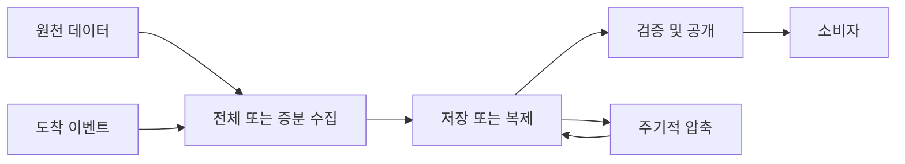

* TOC
{:toc}

데이터를 읽어서 저장하는 코드는 짧다. 하지만 입력이 일부만 도착했거나, 같은 작업이 두 번 실행되거나, 적재 도중 소비자가 데이터를 조회하면 이야기가 달라진다. 수집 파이프라인을 설계할 때는 **처리 범위, 공개 시점, 재실행 결과, 복구 가능 범위**를 함께 정해야 한다.

이 글은 *Data Engineering Design Patterns* 예제 저장소의 `chapter-02`를 공부하며 Python, SQL, YAML과 실습 README를 함께 읽은 기록이다. 패턴의 개념을 설명한 뒤 실제 구현을 읽고, 그 구현이 보장하는 것과 추가 설계가 필요한 것을 구분한다. 책 본문을 요약한 글은 아니다.

처음 읽는다면 전체 적재와 날짜별 증분 적재를 먼저 보고, 아래 학습 실험으로 재실행 결과를 확인한 뒤 CDC와 이벤트 처리를 읽으면 좋다. 이 글에서 쓰는 용어는 다음 의미다.

| 용어 | 이 글에서의 의미 |
|---|---|
| 스냅샷 | 특정 시점의 전체 데이터 상태 |
| 멱등성 | 동일 작업을 반복해도 최종 결과가 한 번 수행한 결과와 같음 |
| 체크포인트 | 스트림의 처리 진행 위치와 상태를 복구하기 위한 기록 |
| CDC / CDF | 원천 DB / Delta 테이블에서 발생한 행 변경을 읽는 방법 |
| 공개 | 적재 결과를 소비자가 조회할 수 있는 상태로 전환 |

## 1. 먼저 폴더를 하나의 지도로 보기

| 폴더 | 해결하려는 문제 | 구현 | 공부할 질문 |
|---|---|---|---|
| [01-full-load](https://github.com/bartosz25/data-engineering-design-patterns-book/tree/master/chapter-02/01-full-load/) | 전체 데이터를 새 스냅샷으로 교체 | Spark → Delta, Airflow → PostgreSQL | 새 데이터가 불완전하면 어떻게 되는가? |
| [02-incremental-load](https://github.com/bartosz25/data-engineering-design-patterns-book/tree/master/chapter-02/02-incremental-load/) | 새 구간이나 변경분만 수집 | 날짜 파티션, Debezium CDC, Delta CDF | 어디까지 읽었고 무엇을 변경으로 보는가? |
| [03-replication](https://github.com/bartosz25/data-engineering-design-patterns-book/tree/master/chapter-02/03-replication/) | 원본 또는 변환된 데이터를 복제 | 텍스트, Kafka, Delta | 값·순서·메타데이터 중 무엇을 보존하는가? |
| [04-data-compaction](https://github.com/bartosz25/data-engineering-design-patterns-book/tree/master/chapter-02/04-data-compaction/) | 저장·읽기 비용을 줄임 | Kafka log compaction, Delta 파일 병합 | 이력과 물리 파일 중 무엇을 줄이는가? |
| [05-data-readiness](https://github.com/bartosz25/data-engineering-design-patterns-book/tree/master/chapter-02/05-data-readiness/) | 소비 가능한 시점 표시 | `COMPLETED`, `_SUCCESS` | 파일 존재와 데이터 완성은 같은가? |
| [06-event-driven](https://github.com/bartosz25/data-engineering-design-patterns-book/tree/master/chapter-02/06-event-driven/) | 데이터 도착에 반응해 실행 | S3 이벤트 → Lambda → Airflow | 같은 이벤트가 다시 오면 어떻게 되는가? |

이 여섯 가지는 서로 배타적인 선택지가 아니다. 이벤트로 실행한 작업이 증분 데이터를 적재하고, 검증 후 완료 마커를 만들며, 별도 작업이 쌓인 파일을 압축하도록 조합할 수 있다.



그림은 패턴을 조합한 설계 예시다. 저장소에 위 전체 흐름이 하나의 파이프라인으로 구현되어 있다는 뜻은 아니다.

## 2. Full Load — 전체 교체의 핵심은 입력의 완전성

### JSON을 Delta 스냅샷으로 바꾸기

[load_json_data.py](https://github.com/bartosz25/data-engineering-design-patterns-book/blob/master/chapter-02/01-full-load/01-full-loader-spark-with-conversion/python/load_json_data.py)는 JSON을 명시적 스키마로 읽어 Delta 테이블 전체를 덮어쓴다.

```python
input_dataset = (
    spark_session.read
    .schema('type STRING, full_name STRING, version STRING')
    .format('json')
    .load(DemoConfiguration.INPUT_PATH)
)
input_dataset.write.mode('overwrite').format('delta').save(
    DemoConfiguration.DEVICES_TABLE
)
```

스키마를 명시하면 입력 샘플에 따라 컬럼 타입이 달라지는 문제를 줄이고 스키마 추론 작업을 피할 수 있다. 다만 스키마 선언만으로 필수값, 중복, 예상 건수까지 검사하는 것은 아니다. 이 코드에도 그런 품질 검증 단계는 없다.

전체 적재는 작은 기준정보나 완성된 스냅샷을 교환하는 상황에서 이해하기 쉽다. 이전 상태에 변경분을 적용할 필요 없이 새로운 전체 상태를 저장하면 된다. 대신 입력이 정말 전체인지 확인해야 한다.

[load_json_partial_data.py](https://github.com/bartosz25/data-engineering-design-patterns-book/blob/master/chapter-02/01-full-load/01-full-loader-spark-with-conversion/python/load_json_partial_data.py)는 입력을 `limit(1)`로 제한한 뒤 똑같이 `overwrite`한다. 기존 README는 이를 빈 데이터라고 설명하지만, 실제 코드는 **입력이 있으면 최대 1건을 남기는 코드**다. 따라서 원래 50건이고 입력이 비어 있지 않다면, 교체 후에는 1건이 남는 상황을 예상할 수 있다. 이는 코드로부터 도출한 예시이며 측정 결과가 아니다.

**코드에서 얻는 인사이트:** 저장의 원자성과 데이터의 완전성은 별개다. 잘못된 1건짜리 스냅샷도 정상적으로 커밋될 수 있다. 전체 적재에는 건수 변화, 키 중복, 필수 컬럼, 원천 완료 신호 등을 검사하고 공개 여부를 결정하는 단계가 필요하다.

### 과거 버전 조회와 복구는 다르다

[devices_table_reader_past_version.py](https://github.com/bartosz25/data-engineering-design-patterns-book/blob/master/chapter-02/01-full-load/01-full-loader-spark-with-conversion/python/devices_table_reader_past_version.py)의 이름만 보면 과거 데이터를 읽는 도구처럼 보인다. 그러나 실제로는 버전 0을 읽어 현재 테이블에 다시 쓴다.

```python
(
    spark_session.read.format('delta')
    .option('versionAsOf', '0')
    .load(DemoConfiguration.DEVICES_TABLE)
    .write.mode('overwrite').format('delta')
    .save(DemoConfiguration.DEVICES_TABLE)
)
```

이 동작은 읽기 전용 조회가 아니다. 과거 상태를 현재에 반영하는 새 쓰기다. 복구를 공부할 때는 “어떤 버전을 읽는가”와 “현재 상태를 바꾸는가”를 구분해야 한다. 또한 과거 버전의 데이터 파일이 삭제되었다면 해당 버전을 읽을 수 없을 수 있다. [Delta 테이블 관리 문서](https://docs.delta.io/delta-utility/)

### PostgreSQL에서는 적재와 공개를 분리한다

[devices_loader.py](https://github.com/bartosz25/data-engineering-design-patterns-book/blob/master/chapter-02/01-full-load/01-full-loader-airflow-postgresql-data-exposition/dags/devices_loader.py)의 흐름은 다음과 같다.

```python
input_data_sensor >> load_data_to_table >> expose_new_table
```

입력 파일을 기다리고 날짜별 테이블을 적재한 뒤, 소비자가 읽는 `devices` 뷰를 새 테이블에 연결한다. [공개 SQL](https://github.com/bartosz25/data-engineering-design-patterns-book/blob/master/chapter-02/01-full-load/01-full-loader-airflow-postgresql-data-exposition/sql/expose_new_table.sql)은 짧다.


```sql

CREATE OR REPLACE VIEW devices AS SELECT * FROM {{ table_name }}
```


이 구조에서는 물리 테이블 이름이 바뀌어도 소비자의 조회 이름을 유지할 수 있다. 이전 날짜 테이블이 남아 있다면 뷰를 그 테이블로 돌려 복구하는 것도 가능하다.

다만 [적재 SQL](https://github.com/bartosz25/data-engineering-design-patterns-book/blob/master/chapter-02/01-full-load/01-full-loader-airflow-postgresql-data-exposition/sql/load_file_to_device_table.sql)의 시작을 반드시 함께 봐야 한다.


```sql
DROP VIEW IF EXISTS devices;
DROP TABLE IF EXISTS {{ table_name }};
```


현재 예제는 적재 단계에서 기존 뷰를 삭제하고 다음 태스크에서 다시 만든다. 따라서 적재 태스크가 커밋된 뒤 공개 태스크가 완료되기 전에는 뷰가 없는 구간이 생길 수 있다. **이 구현을 그대로 무중단 테이블 교체라고 설명하면 안 된다.** 날짜별 테이블도 같은 날짜를 재실행하면 삭제·재생성되므로 영구적인 불변 버전은 아니다.

운영 설계로 확장한다면 실행별 새 테이블에 적재하고, 품질 검증을 통과한 뒤 뷰를 전환하고, 사용하지 않는 이전 테이블은 나중에 정리하는 순서를 고려할 수 있다. 이는 원본 구현에 없는 개선 방향이다.

## 3. Incremental Load — 처리 범위와 재실행 단위를 맞춘다

### 증분 적재에서도 overwrite를 사용할 수 있다

[visits_loader.py](https://github.com/bartosz25/data-engineering-design-patterns-book/blob/master/chapter-02/02-incremental-load/01-incremental-loader-apache-airflow-apache-spark/incremental-spark-job/visits_loader.py)는 의외로 단순하다.

```python
input_data = spark_session.read.text(job_arguments.input_dir)
input_data.write.mode('overwrite').text(job_arguments.output_dir)
```

이것이 증분 적재인 이유는 `write` 옵션이 아니라 **실행할 때 전달하는 경로**에 있다. [SparkApplication YAML](https://github.com/bartosz25/data-engineering-design-patterns-book/blob/master/chapter-02/02-incremental-load/01-incremental-loader-apache-airflow-apache-spark/airflow/dags/visits_incremental_loader.yaml)은 하루치 입출력 디렉터리를 지정한다.


```yaml
arguments:
  - '--input_dir'
  - "/data_for_demo/input/date={{ ds }}"
  - '--output_dir'
  - "/data_for_demo/output/date={{ ds }}"
```


전체 기간 중 하루만 처리하므로 증분이고, 그 하루의 출력은 교체한다. 동일한 입력과 단독 실행을 전제로 하면 재실행 시 행을 계속 추가하는 방식보다 중복 누적을 피하기 쉽다. 그러나 일반 텍스트 출력의 덮어쓰기를 Delta 트랜잭션과 같은 수준의 원자적 공개로 해석할 수는 없다. 쓰는 도중 실패하거나 소비자가 동시에 읽는 문제는 별도로 남는다.

**코드에서 얻는 인사이트:** “증분 = append”가 아니다. 증분 여부는 읽고 쓰는 범위로 결정된다. 날짜별 재처리 경계를 명확히 하면 전체 재적재 없이 특정 날짜만 고칠 수 있다.

### 다음 날짜의 존재를 오늘 데이터의 완료로 해석한다

[Airflow DAG](https://github.com/bartosz25/data-engineering-design-patterns-book/blob/master/chapter-02/02-incremental-load/01-incremental-loader-apache-airflow-apache-spark/airflow/dags/visits_incremental_loader.py)는 다음 날짜 파티션을 기다린다.


```python
next_partition_template = (
    get_data_location_base_dir() + '/date={{ data_interval_end | ds }}'
)
next_partition_sensor = FileSensor(
    task_id='next_partition_sensor',
    filepath=next_partition_template,
    mode='reschedule',
    do_xcom_push=False
)
```


예를 들어 일 단위 실행에서 11월 1일을 처리할 때 11월 2일 경로가 존재하는지 본다. 여기에 “다음 파티션을 만들었다면 이전 파티션 쓰기는 끝났다”는 생산자와의 계약이 숨어 있다.

늦게 도착한 데이터가 이전 날짜에 추가되거나 다음 날짜 폴더를 미리 생성하면 이 전제는 깨진다. 마지막 날짜는 다음 파티션이 없으면 계속 대기할 수도 있다. 완료 마커나 별도 적재 메타데이터가 필요한 이유다.

Spark 작업 제출 뒤에는 `SparkKubernetesSensor`로 실행 결과를 확인한다. `reschedule`은 확인 사이에 워커 슬롯을 반환하도록 하는 설정이다. 제출 성공과 실제 작업 완료를 구분하는 구조이지, 제출 이후 결과 확인을 생략하는 구조가 아니다.

### Debezium CDC — 변경을 받는 것과 현재 상태를 만드는 것은 다르다

이 예제의 경로는 PostgreSQL → Debezium/Kafka Connect → Kafka → Spark 집계다. [초기화 SQL](https://github.com/bartosz25/data-engineering-design-patterns-book/blob/master/chapter-02/02-incremental-load/02-change-data-capture-debezium/python/docker/init.sql)은 `visits` 테이블에 복합 기본키 `(visit_id, event_time)`와 `REPLICA IDENTITY FULL`을 지정한다. 후자는 UPDATE·DELETE의 이전 행 정보를 제공하는 범위와 관련이 있으며 WAL 부담도 고려해야 한다. [Debezium PostgreSQL 문서](https://debezium.io/documentation/reference/stable/connectors/postgresql.html)

[visits_stream_processor.py](https://github.com/bartosz25/data-engineering-design-patterns-book/blob/master/chapter-02/02-incremental-load/02-change-data-capture-debezium/python/visits_stream_processor.py)는 CDC 메시지 전체를 동기화하지 않는다.

```python
new_visits = input_data_stream.selectExpr('CAST(value AS STRING) AS jsonAsString') \
    .select(F.from_json(F.col('jsonAsString'), input_data_schema).alias('visit')) \
    .filter('visit.payload.op = "c"') \
    .select('visit.payload.after.*') \
    .selectExpr('CAST((event_time / 1000 / 1000) AS TIMESTAMP) AS event_time')

aggregated_counter = new_visits.withWatermark('event_time', '10 seconds').groupBy(
    F.window('event_time', '30 seconds')
).count()
```

`op = "c"`는 생성 이벤트만 선택한다. UPDATE, DELETE, 초기 스냅샷 읽기 이벤트까지 반영해 원본 테이블의 현재 상태를 재현하는 코드는 아니다. 코드의 `event_time` 변환은 입력 정수가 마이크로초라는 전제이며, 다른 타입이나 커넥터 설정의 값에 그대로 적용하면 안 된다. Debezium의 이벤트 구분과 시간 표현은 [공식 커넥터 문서](https://debezium.io/documentation/reference/stable/connectors/postgresql.html)에서 확인할 수 있다.

30초 윈도는 이벤트 시간 기준 집계 구간이다. 10초 watermark를 “수신 뒤 정확히 10초 대기”로 읽으면 안 된다. 이벤트 시간의 진행을 바탕으로 늦은 데이터와 상태 유지 범위를 다루는 설정이다. 출력은 콘솔의 `update` 모드이므로 화면의 각 행은 윈도 집계의 갱신값으로 이해해야 한다. 출력된 카운트를 모두 다시 합산하면 안 된다. [Spark Structured Streaming 문서](https://spark.apache.org/docs/3.5.6/structured-streaming-programming-guide.html)

**코드에서 얻는 인사이트:** CDC를 연결했다고 수정·삭제 반영이 완성되는 것은 아니다. 변경 이벤트를 선택하는 필터, 대상 키, 순서, 중복 처리, 집계 보정 방식까지 정해야 소비자가 원하는 의미가 만들어진다.

보조 파일 [visits_to_insert.sql](https://github.com/bartosz25/data-engineering-design-patterns-book/blob/master/chapter-02/02-incremental-load/02-change-data-capture-debezium/python/docker/visits_to_insert.sql)은 초기화 대상인 `visits`와 달리 `events`를 참조하고 `#` 주석을 사용한다. PostgreSQL용 실행 파일로 그대로 사용하기 전에 테이블명과 주석 문법을 확인해야 한다.

### Delta CDF — 파일 목록 대신 커밋의 변경을 읽는다

[events_table_streaming_reader.py](https://github.com/bartosz25/data-engineering-design-patterns-book/blob/master/chapter-02/02-incremental-load/02-change-data-capture-delta-lake-change-data-feed/python/events_table_streaming_reader.py)는 신규 테이블의 CDF 활성화 기본값을 설정하고, 테이블을 채우는 스레드와 읽는 스트림을 실행한다.

```python
events = (
    spark_session.readStream.format('delta')
    .option('maxFilesPerTrigger', 4)
    .option('readChangeFeed', 'true')
    .option('startingVersion', 0)
    .table('events')
)
```

CDF는 `_change_type`, `_commit_version`, `_commit_timestamp`로 변경 종류와 커밋 정보를 제공한다. 이 데모는 테이블 생성 후 삽입을 보여주지만 CDF 자체는 update의 이전·이후 이미지와 delete도 표현한다. `maxFilesPerTrigger=4`는 입력 파일 처리량을 조절하는 옵션이며, 커밋 단위 처리 규칙이 있어 항상 정확히 네 파일씩 처리된다는 의미는 아니다. [Delta CDF 문서](https://docs.delta.io/delta-change-data-feed/)

`startingVersion=0`도 영구적인 전체 이력 재생 보장은 아니다. CDF 활성화 시점과 변경 데이터의 보존 범위에 영향을 받는다. 원본 테이블의 변경 보존 기간보다 소비자 장애가 길어지면 초기 스냅샷부터 다시 구성하는 복구 절차가 필요할 수 있다. [Delta CDF 보존 조건](https://docs.delta.io/delta-change-data-feed/)

코드에는 `thread.start()` 다음에 `lock.acquire()`를 호출하고 `while lock.locked(): pass`로 기다리는 부분도 있다. 시작 순서에 따라 생산자가 아직 잠기지 않은 Lock을 볼 수 있고, 빈 반복은 CPU를 소모한다. 이 부분은 CDF의 필수 구조가 아니라 데모의 스레드 조율 방식이다. 개선한다면 `threading.Event`와 실패 전달·대기 제한을 함께 설계할 수 있다.

또한 생성 코드의 `saveAsTable('events', overwrite=True)`에서 `overwrite=True`는 저장 옵션으로 전달되며, `.mode('overwrite')`로 모드를 지정하는 것과 다르다. 기본 모드에서는 기존 테이블이 있으면 오류가 발생할 수 있고, 생산자 스레드가 `lock.release()` 전에 실패하면 메인 스레드가 계속 대기할 수 있다. CDF 읽기 API와 데모의 초기화·재실행 처리를 구분해서 공부해야 한다. [PySpark saveAsTable API](https://spark.apache.org/docs/3.5.0/api/python/reference/pyspark.sql/api/pyspark.sql.DataFrameWriter.saveAsTable.html)

## 4. Replication — 무엇을 그대로 유지할지 먼저 정한다

### 텍스트 복제는 JSON 재해석을 피한다

[dataset_replicator_raw.py](https://github.com/bartosz25/data-engineering-design-patterns-book/blob/master/chapter-02/03-replication/01-passthrough-replicator-apache-spark-apache-kafka/dataset_replicator_raw.py)는 JSON 파일을 `read.json` 대신 `read.text`로 읽는다.

```python
input_dataset = spark_session.read.text(DemoConfiguration.INPUT_PATH)
input_dataset.write.mode('overwrite').text(DemoConfiguration.OUTPUT_PATH)
```

JSON 필드의 타입이나 스키마를 해석하지 않고 텍스트 레코드를 옮기는 선택이다. 스키마가 바뀌어도 원시 내용을 남겨 나중에 다시 파싱하려는 목적에 맞는다. 다만 Spark가 출력 파일을 다시 쓰므로 파일명, 파일 분할, 레코드 순서, 원본 바이트가 모두 동일한 파일 복사는 아니다.

### Kafka 복제는 값만 복사하는 문제가 아니다

[dataset_replicator_kafka.py](https://github.com/bartosz25/data-engineering-design-patterns-book/blob/master/chapter-02/03-replication/01-passthrough-replicator-apache-spark-apache-kafka/dataset_replicator_kafka.py)는 `key`, `value`, `partition`, `headers`, `offset`을 읽고 다음과 같이 쓴다.

```python
def write_sorted_events(events: DataFrame, batch_number: int):
    (
        events.sortWithinPartitions('offset', ascending=True)
        .drop('offset').write.format('kafka')
        .option('kafka.bootstrap.servers', 'localhost:9094')
        .option('topic', 'events-replicated')
        .option('includeHeaders', 'true').save()
    )
```

`offset`은 원천 순서 판단에 사용한 뒤 제거한다. 목적지 Kafka에는 새 offset이 부여된다. `partition`을 전달하므로 목적지에 해당 파티션이 있어야 하고, `headers`는 payload 밖의 메타데이터를 전달한다. 반면 timestamp 등 원천의 모든 메타데이터를 보존하는 코드는 아니다.

`sortWithinPartitions`는 Spark 파티션 내부 정렬이다. 이를 전체 토픽의 전역 순서 보장이라고 설명할 수 없다. 또 `foreachBatch`의 `batch_number`가 중복 방지에 사용되지 않는다. 체크포인트가 있어도 Kafka 쓰기 이후 재시도 시 중복 가능성이 남는다. Spark의 Kafka 쓰기는 at-least-once로 문서화되어 있다. [Spark 3.5.6 Kafka 연동 문서](https://spark.apache.org/docs/3.5.6/structured-streaming-kafka-integration.html)

최초 실행의 읽기 범위도 확인해야 한다. 원본은 `startingOffsets`를 지정하지 않아 새 스트리밍 쿼리는 기본값 `latest`에서 시작한다. 따라서 시작 전에 쌓인 전체 이력을 복제하는 코드가 아니다. 기존 체크포인트로 재개할 때는 저장된 진행 위치를 사용한다. [Spark Kafka 시작 offset 규칙](https://spark.apache.org/docs/3.5.6/structured-streaming-kafka-integration.html)

**코드에서 얻는 인사이트:** 복제 계약은 payload 동일성만으로 끝나지 않는다. 재처리까지 고려한다면 원천 `(topic, partition, offset)` 같은 식별자를 결과에 보존할지, 소비자가 중복을 어떻게 제거할지를 함께 결정해야 한다. 현재 코드는 그 식별자 전체를 결과에 남기지 않는다.

### 변환 복제는 별도의 데이터 계약을 만든다

[컬럼 제거 예제](https://github.com/bartosz25/data-engineering-design-patterns-book/blob/master/chapter-02/03-replication/02-transformation-replicator-apache-spark-delta-lake/dataset_replicator_raw_reduction.py)는 `full_name`을 제거한다. [문자열 변환 예제](https://github.com/bartosz25/data-engineering-design-patterns-book/blob/master/chapter-02/03-replication/02-transformation-replicator-apache-spark-delta-lake/dataset_replicator_raw_transformation.py)는 첫 글자를 제거한다.

```python
devices_without_full_name = input_delta_dataset.drop('full_name')

devices_trunc_full_name = input_delta_dataset.withColumn(
    'full_name', functions.expr('SUBSTRING(full_name, 2, LENGTH(full_name))')
)
```

후자의 결과를 익명화 보장으로 해석하면 안 된다. 대부분의 문자열이 남고, 결합 가능한 다른 컬럼도 존재한다. 이 코드는 복제 시 변환을 적용하는 방법을 보여준다.

또한 결과 저장에 `mode`가 없으므로 기존 출력 경로가 있는 상태에서 다시 실행할 때의 정책을 확인해야 한다. 최초 생성과 반복 동기화는 다른 요구사항이다. 컬럼 제거 규칙도 원천에 새 민감 컬럼이 추가되면 자동으로 차단하지 못하므로, 배포용 데이터셋에는 허용 컬럼을 명시하는 방식을 검토할 수 있다.

## 5. Compaction — Kafka와 Delta에서 줄이는 대상이 다르다

| 비교 | Kafka log compaction | Delta 파일 compaction |
|---|---|---|
| 정리 대상 | 같은 키의 오래된 레코드 | 작은 데이터 파일 |
| 목적 | 키별 최신 상태를 유지하며 로그 축소 | 파일 수를 줄여 읽기 효율 개선 |
| 논리적 데이터 | 과거 키 값 이력이 제거될 수 있음 | 테이블의 행 내용은 유지 |
| 중복 제거 | 업무 이벤트 중복 제거와는 별개 | 동일한 행을 제거하지 않음 |
| 별도 고려 | 키 설계, 삭제 표시, cleaner 동작 | VACUUM, 보존 기간, 과거 버전 조회 |

### Kafka: 키가 압축의 기준이다

[Kafka 예제 README](https://github.com/bartosz25/data-engineering-design-patterns-book/blob/master/chapter-02/04-data-compaction/01-compactor-apache-kafka/README.md)는 `cleanup.policy=compact`와 짧은 compaction lag를 설정한다. 다음은 동작을 이해하기 위한 설명용 입력이다.

```text
device1,ABC
device2,DEF
device1,GHI
```

압축이 진행되면 `device1`의 오래된 `ABC`를 제거하고 최신 값인 `GHI`를 남길 수 있다. 그러나 쓰자마자 키당 한 행만 남는 동기식 UPSERT는 아니다. cleaner 실행과 세그먼트 조건의 영향을 받으므로 “5초 설정이면 정확히 5초 뒤 정리 완료”라고 읽으면 안 된다. 삭제는 null value인 tombstone과 그 보존 조건도 이해해야 한다. [Kafka log compaction 설계](https://kafka.apache.org/38/design/design/)

### Delta: 파일을 합치는 것과 삭제하는 것을 나눈다

[compact_devices_table.py](https://github.com/bartosz25/data-engineering-design-patterns-book/blob/master/chapter-02/04-data-compaction/01-compactor-delta-lake/compact_devices_table.py)는 다음 API를 호출한다.

```python
devices_table = DeltaTable.forPath(spark_session, DemoConfiguration.DEVICES_TABLE)
devices_table.optimize().executeCompaction()
```

작은 파일들을 더 큰 파일로 재구성한다. 현재 스냅샷에서 읽는 파일 구성이 바뀌지만 행 중복을 제거하는 연산은 아니다. 예제의 `load_devices_data.py`가 같은 데이터를 반복 `append`하면 중복 행은 compaction 뒤에도 남는다. [Delta 최적화 문서](https://docs.delta.io/optimizations-oss/)

기존 파일이 디렉터리에 남아 있는 것은 병합 실패의 증거가 아니다. 이전 스냅샷이 필요로 할 수 있기 때문이다. [vacuum_devices_table.py](https://github.com/bartosz25/data-engineering-design-patterns-book/blob/master/chapter-02/04-data-compaction/01-compactor-delta-lake/vacuum_devices_table.py)는 별도로 `devices_table.vacuum()`을 호출해 보존 조건을 충족한 미사용 파일을 정리한다. 삭제된 파일에 의존하는 과거 버전은 더 이상 조회할 수 없을 수 있다. [Delta VACUUM 문서](https://docs.delta.io/delta-utility/)

원본 README에는 실습을 위해 시스템 날짜를 바꾸는 방법이 있지만, 이 글에서는 실행 절차로 채택하지 않는다. 학습의 핵심은 시간 변경이 아니라 **논리적인 파일 교체와 물리적인 파일 삭제의 분리**다. 실제 보존 기간은 가장 오래 걸리는 읽기·쓰기, 소비자 지연, 필요한 복구 기간을 함께 고려해 정해야 한다.

## 6. Data Readiness — 파일 존재를 완료 계약으로 바꾸기

[dataset_creator.py](https://github.com/bartosz25/data-engineering-design-patterns-book/blob/master/chapter-02/05-data-readiness/01-readiness-marker-apache-airflow/dags/dataset_creator.py)는 데이터를 생성한 다음 빈 `COMPLETED` 파일을 쓴다.

```python
@task
def create_readiness_file():
    with open(f'{dataset_dir}/COMPLETED', 'w') as marker_file:
        marker_file.write('')

delete_dataset() >> generate_dataset() >> create_readiness_file()
```

빈 파일인데도 의미가 있다. 생산자가 쓰기를 마쳤다는 신호를 데이터와 분리해 전달하기 때문이다. 다만 이 예제에는 완료 마커를 검사하는 downstream 소비자나 데이터 품질 검사 태스크가 없다. 마커 생성만으로 소비자가 안전하게 대기한다거나 데이터가 정확하다고 할 수는 없다.

또한 고정 디렉터리를 삭제하고 다시 만드는 방식이다. 소비자가 과거 `COMPLETED`를 보고 읽기 시작한 뒤 생산자가 디렉터리를 지우는 상황까지 해결하지는 않는다. 실행별 경로를 사용하면 데이터와 완료 신호의 세대를 맞추기 쉽다.

다음 JSON은 원본에 없는 **완료 메타데이터 확장 예시**다. 숫자는 설명용 값이다.

```json
{
  "dataset": "devices",
  "batch_id": "2026-09-14T00:00:00Z",
  "data_path": "devices/batches/2026-09-14T00:00:00Z/",
  "row_count": 50,
  "schema_version": 1,
  "status": "validated"
}
```

이렇게 확장하려면 생산자가 실제 검증을 수행한 뒤 해당 값을 기록하고, 소비자가 그 배치 경로와 상태를 확인해야 한다. `validated`라는 문자열 자체가 품질 검증을 대신하지 않는다.

[Spark Parquet 예제](https://github.com/bartosz25/data-engineering-design-patterns-book/blob/master/chapter-02/05-data-readiness/01-readiness-marker-apache-spark-success-file/python/load_devices_data.py)는 Parquet을 쓴 뒤 [reader](https://github.com/bartosz25/data-engineering-design-patterns-book/blob/master/chapter-02/05-data-readiness/01-readiness-marker-apache-spark-success-file/python/devices_parquet_reader.py)에서 생성 파일 목록을 출력한다. README는 그 목록에 `_SUCCESS`가 포함된 사례를 보여준다. reader 자체가 `_SUCCESS`를 확인한 뒤에만 읽도록 구현된 것은 아니다. 또한 다른 저장 방식·committer 설정까지 같은 마커 생성을 전제하지 않아야 한다.

**코드에서 얻는 인사이트:** 완료 신호에는 범위가 있어야 한다. 어느 배치의 어떤 경로가 준비되었는지 특정하지 못하면, 신호가 있어도 잘못된 세대의 데이터를 읽을 수 있다.

## 7. Event-driven — 실행을 시작하는 신호와 중복 방지는 별개다

[이벤트 예제](https://github.com/bartosz25/data-engineering-design-patterns-book/blob/master/chapter-02/06-event-driven/01-external-trigger-lambda-airflow/README.md)는 LocalStack으로 S3와 Lambda를 모사한다. 객체 업로드 알림을 받은 Lambda가 Airflow REST API를 호출한다.

[event_handler.py](https://github.com/bartosz25/data-engineering-design-patterns-book/blob/master/chapter-02/06-event-driven/01-external-trigger-lambda-airflow/trigger-lambda/event_handler.py)의 객체 키 추출 부분은 다음과 같다.

```python
'file_to_load': urllib.parse.unquote_plus(
    event['Records'][0]['s3']['object']['key'], encoding='utf-8'
)
```

그리고 [Airflow DAG](https://github.com/bartosz25/data-engineering-design-patterns-book/blob/master/chapter-02/06-event-driven/01-external-trigger-lambda-airflow/airflow/dags/devices_loader.py)는 `schedule_interval=None`으로 외부 실행 요청을 받고 다음 작업을 한다.

```python
shutil.copyfile(
    dagrun_conf['file_to_load'],
    f"{dataset_dir}/devices_{dagrun_conf['trigger']['lambda_request_id']}.json"
)
```

여기서 놓치기 쉬운 점은 **Airflow가 S3 객체를 다운로드하지 않는다는 것**이다. 데모는 S3 객체 키를 로컬 파일 경로와 같게 맞춰두고, Airflow가 그 로컬 파일을 복사한다. 실제 S3 수집기로 확장하려면 bucket, key, 필요하면 version ID를 전달하고 해당 객체를 읽는 처리가 필요하다.

### 요청 ID는 데이터의 고유 ID가 아니다

원본 Lambda는 `context.aws_request_id`를 추적 정보와 출력 파일명에 사용한다. 같은 객체의 알림이 다른 Lambda 호출로 재전달되면 요청 ID가 달라질 수 있으므로, 이를 데이터 중복 방지 키로 사용할 수는 없다. S3 알림은 at-least-once 전달이며 순서도 보장되지 않는다. [S3 Event Notifications 문서](https://docs.aws.amazon.com/AmazonS3/latest/userguide/EventNotifications.html)

소스에서 확인할 수 있는 추가 경계는 다음과 같다.

- `Records[0]`만 읽는다. 한 이벤트에 여러 레코드가 있으면 나머지는 처리하지 않는다.
- `dag_run_id`는 `payload` 안에 있지만 HTTP 본문은 `{'conf': payload}`다. 이 코드는 최상위 `dag_run_id` 필드로 실행 ID를 지정하지 않는다.
- HTTP 요청에 timeout이 없다. 응답 지연 시 대기를 제한하는 처리가 없다.
- HTTP 200 이외를 실패로 처리한다. 연결할 API의 성공 응답 규약과 재시도 정책을 맞춰야 한다.
- Airflow 실행은 최대 5개가 동시에 활성화될 수 있다. 실행별 파일명 분리는 동일 원천 데이터의 중복 처리 방지를 의미하지 않는다.

**코드에서 얻는 인사이트:** 실행 추적용 ID와 데이터 중복 제거용 키를 분리해야 한다. 운영 확장 시에는 객체 버전 등 안정적인 원천 식별자로 처리 상태를 영속 저장하고, 동일 키를 동시에 처리하는 경쟁과 저장 후 재시도를 다뤄야 한다. 단순히 “처리됐는지 조회한 뒤 실행”하는 두 단계만으로는 동시 실행 경쟁을 막지 못한다.

## 8. 코드를 읽으며 다시 확인할 핵심 질문

처음부터 모든 도구를 실행하기보다, 아래 질문에 코드를 근거로 답해보면 패턴의 경계가 드러난다.

| 질문 | 코드에서 찾을 답 |
|---|---|
| 부분 입력으로 전체 overwrite를 실행하면? | 부분 데이터가 새 전체 상태가 될 수 있다. |
| PostgreSQL 예제가 무중단 공개를 보장하는가? | 기존 뷰를 적재 태스크에서 삭제하므로 그대로는 보장하지 않는다. |
| 증분 Spark 작업이 overwrite인 이유는? | 날짜 파티션 하나를 교체하기 때문이다. |
| 다음 날짜 폴더가 생기면 이전 날짜가 완성되었는가? | 생산자가 그 순서를 보장할 때만 성립한다. |
| CDC 소비자가 원본 상태를 복제하는가? | 현재 코드는 생성 이벤트만 집계한다. |
| Kafka 체크포인트가 쓰기 중복도 제거하는가? | 이 예제에는 대상 쓰기 중복 제거가 없다. |
| Delta compaction이 중복 행을 지우는가? | 파일 구성을 바꾸며 중복 행은 유지한다. |
| 완료 마커가 품질을 보장하는가? | 마커 이전에 실제 수행한 검사까지만 의미를 갖는다. |
| S3 이벤트 예제가 S3에서 파일을 읽는가? | 객체 키를 로컬 경로로 사용해 파일을 복사한다. |

추천 학습 순서는 **Full Load → 날짜별 Incremental Load → Readiness → CDC/CDF → Replication → Compaction → Event-driven**이다. 먼저 저장 범위와 완료 시점을 이해한 뒤 변경 스트림과 이벤트 실행을 연결하면, 각 도구의 API보다 파이프라인의 책임을 중심으로 읽을 수 있다.

결국 이 장에서 반복되는 설계 질문은 같다. “어떤 데이터까지 처리했고, 언제 소비자에게 공개했으며, 같은 입력이 다시 왔을 때 결과를 어떻게 유지할 것인가?” 읽기와 쓰기 API 사이에 이 질문의 답을 넣는 것이 수집 파이프라인 설계다.

## 9. 직접 확인하는 학습 실험

### 실험 A — 같은 배치를 두 번 받으면 어떻게 달라질까?

다음은 **원본에 없는 설명용 모델**이다. 외부 패키지 없이 Python 3에서 실행할 수 있다. 저장소나 분산 시스템의 트랜잭션을 모사하지는 않으며, 쓰기 범위에 따른 최종 상태의 차이만 확인한다.

```python
from copy import deepcopy

initial = {"2026-09-13": ["old"], "2026-09-14": ["a"]}
day = "2026-09-14"
batch = ["a", "b"]


def apply(state, mode):
    result = deepcopy(state)
    if mode == "append":
        result.setdefault(day, []).extend(batch)
    elif mode == "partition_replace":
        result[day] = list(batch)
    elif mode == "full_replace":
        result = {day: list(batch)}
    else:
        raise ValueError(mode)
    return result


for mode in ("append", "partition_replace", "full_replace"):
    once = apply(initial, mode)
    twice = apply(once, mode)
    print(mode, "idempotent:", once == twice, "result:", twice)
```

출력은 다음과 같다.

```text
append idempotent: False result: {'2026-09-13': ['old'], '2026-09-14': ['a', 'a', 'b', 'a', 'b']}
partition_replace idempotent: True result: {'2026-09-13': ['old'], '2026-09-14': ['a', 'b']}
full_replace idempotent: True result: {'2026-09-14': ['a', 'b']}
```

여기서 `full_replace`는 멱등적이지만 이전 날짜를 잃는다. **멱등적이라는 성질만으로 올바른 적재라고 판단할 수 없다.** 의도한 처리 범위와 결과의 완전성까지 맞아야 한다. 반대로 파티션 교체도 입력 배치가 실행 사이에 바뀌거나 두 작업이 동시에 쓰면 위 실험과 조건이 달라진다.

### 실험 B — Delta overwrite 전후를 숫자로 비교하기

이 실험은 원본 Full Load 예제를 준비한 뒤 수행하는 후속 실습이다. 해당 폴더의 `requirements.txt`는 `pyspark==3.5.0`, `delta-spark==3.0.0`을 지정한다. 원본 README에 따라 데이터 생성과 Spark 환경을 준비하고, `load_json_data.py`로 첫 적재를 마친 상태를 전제로 한다.

아래 코드는 **학습용으로 추가한 조회 코드**이며, 원본과 동일하게 Delta 확장·카탈로그를 설정한 `spark_session`과 같은 폴더의 `DemoConfiguration`을 사용한다.

```python
from delta import DeltaTable

path = DemoConfiguration.DEVICES_TABLE
before = spark_session.read.format("delta").load(path).count()
print("before:", before)

# 여기서 원본 load_json_partial_data.py를 별도로 한 번 실행한다.

current = spark_session.read.format("delta").load(path)
print("after:", current.count())
DeltaTable.forPath(spark_session, path).history().select(
    "version", "operation", "operationParameters"
).show(truncate=False)
```

위 코드는 `before` 출력 후 자동으로 멈추지 않는다. IDE에서 `current = ...` 줄에 중단점을 걸고 부분 적재 스크립트를 실행하거나, 전후 두 부분을 나누어 실행한다. 원본 `limit(1)`의 입력이 비어 있지 않다면 현재 행 수는 1이 된다. `history()`에서는 overwrite에 해당하는 새 커밋을 확인한다. 구체적인 버전 번호는 이전 실행 횟수에 따라 달라진다.

그다음 원본 `devices_table_reader_past_version.py`를 열어 어느 줄에서 조회가 쓰기로 바뀌는지 표시해보자. 파일명에 `reader`가 있어도 `.write.mode('overwrite')`가 있으면 현재 테이블을 변경한다. 과거 상태를 보기만 하려면 다음 읽기에서 멈추면 된다.

```python
spark_session.read.format("delta").option("versionAsOf", 0).load(path).show()
```

원본 Spark/Delta 실습은 이번 글 작성 과정에서 실행하지 않았다. 위 결과는 코드에서 예상한 관찰점이며, 이전 버전의 파일이 남아 있어야 과거 조회가 가능하다.

### 실험 C — 도구를 바꾸지 않고 실패 조건을 바꾸기

아래 표의 입력을 원본 코드에 대입하고, 먼저 결과를 예측한 뒤 해당 줄을 찾아보자. 모두 실제 장애 실험 결과가 아닌 코드 독해 문제다.

| 바꿀 조건 | 예상 결과 | 확인할 구현 |
|---|---|---|
| 11월 2일 폴더를 먼저 만들고 11월 1일 파일은 계속 씀 | 다음 파티션 센서가 통과해도 전날 입력은 미완성일 수 있음 | `next_partition_template` |
| CDC에 update/delete만 전달 | 생성 이벤트 집계에는 반영되지 않음 | `op = "c"` 필터 |
| Kafka 쓰기 성공 뒤 배치 완료 기록 전에 실패 | 재시도에서 이미 쓴 이벤트가 다시 전달될 수 있음 | `foreachBatch`, 사용하지 않는 `batch_number` |
| 동일 S3 객체 알림을 서로 다른 Lambda 요청으로 전달 | 서로 다른 요청 ID로 별도 파일이 만들어질 수 있음 | `lambda_request_id` 기반 파일명 |
| Delta에 동일 데이터 두 번 append 후 compaction | 파일을 병합해도 중복 행은 유지됨 | `append`와 `executeCompaction()` |

각 답 뒤에 개선책도 한 문장씩 적어보자. “재시도를 켠다”만 적으면 충분하지 않다. 무엇을 고유 키로 삼을지, 어떤 범위를 교체할지, 완료 신호를 누가 기록할지까지 써야 설계가 된다.

## 10. 코드 출처와 더 읽을 글

| 저장소 | 이 글과의 관계 |
|---|---|
| [bartosz25/data-engineering-design-patterns-book](https://github.com/bartosz25/data-engineering-design-patterns-book) | 책의 예제 원본 저장소. 이 글의 분석 대상인 Chapter 02 코드 출처 |
| [원본 Chapter 02](https://github.com/bartosz25/data-engineering-design-patterns-book/tree/master/chapter-02) | 6개 주제별 실습 코드와 실행 README |
| [bartosz25/data-generator-blogging-platform](https://github.com/bartosz25/data-generator-blogging-platform) | 루트 README가 참조하는 실습용 데이터 생성 프로젝트 |

기술 의미는 본문의 공식 문서 링크로 보완했다. Spark Kafka 연동은 3.5.6 문서를 참고했으며 예제 코드에는 3.5.0이 명시되어 있다. 그 밖의 최신 문서도 예제의 고정 의존성 버전과 구분해서 읽어야 한다. 이 글은 예제 실행 환경의 최신 버전 호환성을 검증한 문서가 아니다.


이 장을 블로그의 기존 글과 연결하면 학습 범위가 넓어진다.

- [레이크하우스 테이블 포맷](/concept/data-engineering/01_lakehouse_table_formats/): Delta의 커밋과 스냅샷을 파일 저장과 구분해 읽기.
- [Structured Streaming](/concept/spark/01_structured_streaming/): 체크포인트·이벤트 시간·상태 관리의 역할 이어서 공부하기.
- [메달리언 실전 패턴](/concept/data-architect/03_medallion_advanced_patterns/): 적재와 공개 사이에 검증을 넣는 Write-Audit-Publish로 확장하기.

다음 학습 주제로는 **CDC의 update/delete를 대상 테이블에 멱등하게 반영하는 방법**, **배치별 완료 마커와 공개 포인터를 설계하는 방법**을 이어갈 수 있다.
