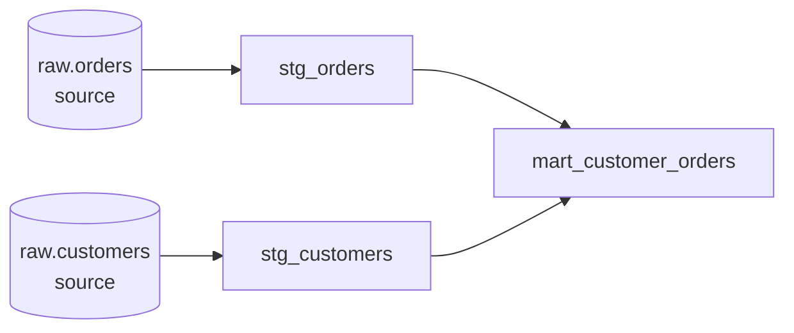


* TOC
{:toc}

## 문제: SQL 변환은 왜 관리하기 어려운가

ELT(Extract-Load-Transform)에서 E와 L은 대체로 도구가 해결한다. Fivetran, Airbyte, 각 클라우드의 적재 서비스가 원천 데이터를 데이터 웨어하우스로 옮긴다. 남는 것은 **T** — 웨어하우스 안에 이미 들어온 원시 테이블을 분석 가능한 형태로 가공하는 SQL 변환이다. 그리고 이 T가 실무에서 가장 관리가 안 되는 영역이다.

전형적인 상태는 이렇다.

- 변환 로직이 BI 도구 안, 저장 프로시저, 누군가의 로컬 `.sql` 파일, 크론으로 도는 셸 스크립트에 흩어져 있다.
- `CREATE TABLE mart_orders AS SELECT ...` 같은 쿼리가 서로를 참조하는데, **실행 순서**를 사람이 기억한다. staging을 먼저 돌려야 mart가 맞는데 그 순서가 문서에 없다.
- 같은 `revenue` 계산식이 대시보드 5개에 복붙되어 있고, 정의가 조금씩 다르다.
- 이 쿼리가 맞는지 검증하는 자동 테스트가 없다. 컬럼 하나가 어느 원천에서 왔는지 추적할 문서도 없다.

소프트웨어 엔지니어링이 20년 전에 해결한 문제들 — 버전 관리, 모듈화, 테스트, 문서화, 의존성 관리 — 가 SQL 변환 계층에는 적용되지 않은 상태다. dbt(data build tool)는 정확히 이 공백을 메운다. dbt는 데이터를 옮기지 않고, 웨어하우스 **안에서** SQL 변환을 소프트웨어처럼 다루게 하는 도구다.

이 문서는 초급이다. dbt가 푸는 문제, 실행 모델, `ref()`/`source()`, materialization 4종까지만 다룬다. 테스트·스냅샷·증분 전략·매크로 같은 주제는 [[/dbt/01_dbt_core_features]]와 [[/dbt/02_dbt_advanced]]로 넘긴다.

## dbt가 실제로 하는 일

dbt를 한 문장으로 요약하면 이렇다: **`SELECT` 문을 쓰면, dbt가 그것을 웨어하우스 안의 테이블이나 뷰로 만들어 준다.** 그 이상도 이하도 아니다. 데이터를 옮기는 엔진이 아니라, 이미 웨어하우스에 있는 데이터를 변환하는 SQL을 **컴파일하고 실행 순서를 잡아 실행하는** 오케스트레이터에 가깝다. 연산 자체는 BigQuery, Snowflake, Redshift 같은 웨어하우스가 수행한다. dbt는 SQL을 생성해 던지고, 결과 객체를 만든다.

dbt가 가져오는 것은 SQL 위에 얹은 엔지니어링 규율이다.

| 없던 것 | dbt가 주는 것 |
|---|---|
| 버전 관리 | 모든 변환이 `.sql` 파일 → Git으로 관리·리뷰·롤백 |
| 모듈화 | 큰 쿼리를 작은 모델로 쪼개고 `ref()`로 조립 |
| 의존성 관리 | `ref()`/`source()`로 DAG를 **자동** 생성, 실행 순서 자동 결정 |
| 테스트 | 데이터 품질 단언(not null, unique 등) — 중급에서 상술 |
| 문서화 | 모델·컬럼 설명 + 리니지 그래프 자동 생성 |
| 환경 분리 | dev/prod를 같은 코드로, 다른 스키마에 |

핵심은 마지막 두 줄이 아니라 **의존성 관리**다. 이것이 dbt를 단순 SQL 러너와 구분하는 지점이고, 뒤에서 자세히 본다.

## dbt Core vs dbt Cloud

혼동하기 쉬운 두 가지가 있다.

| | dbt Core | dbt Cloud |
|---|---|---|
| 형태 | 오픈소스 CLI (Python 패키지) | 관리형 SaaS |
| 실행 | 내 로컬/서버에서 `dbt` 명령 | 브라우저 IDE + 관리형 스케줄러 |
| 비용 | 무료 | 무료 티어 + 유료 플랜 |
| 스케줄링 | 직접 구성 (Airflow, cron 등) | 내장 스케줄러 |
| 부가 기능 | 없음 | 웹 IDE, CI/CD, 문서 호스팅, 관측성 등 |

중요한 사실: **핵심 기능(모델, `ref`, materialization, 컴파일)은 전부 dbt Core에 있다.** dbt Cloud는 Core를 감싸 IDE·스케줄러·협업 기능을 얹은 상용 레이어다. 이 문서의 모든 개념과 코드는 dbt Core 1.x 기준이며, Cloud에서도 동일하게 동작한다. 학습·이해는 Core로 하는 것이 맞다.

설치는 어댑터 단위다. 웨어하우스마다 별도 어댑터를 깐다.

```bash
# 예: BigQuery 어댑터. dbt-core는 의존성으로 함께 설치된다
pip install dbt-bigquery
# Snowflake라면 dbt-snowflake, Postgres라면 dbt-postgres
dbt --version
```

## 실행 모델: 모델 하나 = SELECT 문 하나

dbt의 최소 단위는 **모델(model)**이다. 모델은 `models/` 아래의 `.sql` 파일 하나이며, 그 안에는 **딱 하나의 `SELECT` 문**이 들어간다. `CREATE TABLE`도, `INSERT`도, 세미콜론으로 구분된 여러 문장도 쓰지 않는다. 파일 이름이 곧 생성될 관계(테이블/뷰)의 이름이 된다.

`models/staging/stg_orders.sql`:

```sql
select
    id               as order_id,
    user_id          as customer_id,
    order_date,
    status,
    amount_cents / 100.0 as amount_usd
from raw.jaffle_shop.orders
where status != 'deleted'
```

이 파일 하나가 있으면, `dbt run` 실행 시 dbt는 대략 아래 DDL을 **생성해서** 웨어하우스에 던진다(materialization이 view일 때).

```sql
create or replace view analytics.stg_orders as (
    select
        id as order_id,
        ...
    from raw.jaffle_shop.orders
    where status != 'deleted'
);
```

즉 개발자는 `SELECT`의 **로직**만 쓰고, `CREATE ... AS`의 **껍데기**는 dbt가 붙인다. 이 분리가 핵심이다. 로직에서 "이걸 테이블로 만들까 뷰로 만들까"를 떼어내면, 같은 SQL을 설정만 바꿔 다른 형태로 실체화할 수 있다(materialization).

실행은 두 단계다.

1. **컴파일(compile):** Jinja 템플릿(`{{ ... }}`)과 `ref()`/`source()`를 실제 스키마·테이블 이름이 박힌 순수 SQL로 치환한다. 결과는 `target/compiled/`에 남는다. 실제 컴파일 결과를 항상 확인할 수 있다는 점이 dbt 디버깅의 출발점이다.
2. **실행(run):** 컴파일된 SQL을 materialization에 맞는 DDL로 감싸 웨어하우스에 보낸다.

```bash
dbt compile              # SQL만 생성, 실행은 안 함 (검증용)
dbt run                  # 컴파일 + 실행
dbt run --select stg_orders   # 특정 모델만
```

## `ref()`와 `source()`: DAG가 저절로 생기는 원리

여기가 dbt의 정수다. 모델이 다른 모델을 참조할 때, 테이블 이름을 **하드코딩하지 않고** `ref()` 함수로 부른다.

`models/marts/mart_customer_orders.sql`:

```sql
with orders as (
    select * from {{ ref('stg_orders') }}
),

customers as (
    select * from {{ ref('stg_customers') }}
)

select
    c.customer_id,
    c.customer_name,
    count(o.order_id)       as order_count,
    sum(o.amount_usd)       as lifetime_value
from customers c
left join orders o on c.customer_id = o.customer_id
group by 1, 2
```

`{{ ref('stg_orders') }}`는 컴파일 시 `analytics.stg_orders`처럼 실제 이름으로 치환된다. 이 한 번의 간접 참조가 두 가지를 동시에 해결한다.

- **환경 이식성:** dev에서는 `dbt_dev.stg_orders`로, prod에서는 `analytics.stg_orders`로 자동 치환된다. 코드는 그대로다. 스키마 이름을 SQL에 박지 않기 때문에 가능하다.
- **의존성 자동 추론:** dbt는 `ref()` 호출을 파싱해 "mart_customer_orders는 stg_orders와 stg_customers에 의존한다"를 **스스로** 안다. 이 관계들을 모두 모으면 방향성 비순환 그래프(DAG)가 된다.



DAG가 생기면 dbt는 **실행 순서를 사람이 지정하지 않아도** 안다. staging을 먼저, 그다음 mart. `dbt run`을 그냥 실행하면 위상 정렬된 순서대로 돈다. 서로 의존하지 않는 모델은 병렬로도 돈다(스레드 설정에 따라). "어느 테이블을 먼저 만들어야 하지?"라는 질문 자체가 사라진다.

원천 테이블은 `ref()`가 아니라 `source()`로 참조한다. 원천은 dbt가 만든 모델이 아니라 적재 도구가 넣은 테이블이기 때문에, 별도로 선언한다.

`models/staging/_sources.yml`:

```yaml
version: 2

sources:
  - name: jaffle_shop          # 논리 그룹 이름
    database: raw              # 실제 프로젝트/DB
    schema: jaffle_shop
    tables:
      - name: orders
      - name: customers
```

그러면 staging 모델에서 원천을 이렇게 부른다.

```sql
select * from {{ source('jaffle_shop', 'orders') }}
```

`ref`와 `source`의 역할 구분은 명확하다.

| 함수 | 가리키는 대상 | 예 |
|---|---|---|
| `source()` | dbt 바깥에서 적재된 원천 테이블 | `{{ source('jaffle_shop', 'orders') }}` |
| `ref()` | dbt가 만든 다른 모델 | `{{ ref('stg_orders') }}` |

관례상 원천은 staging 모델에서 `source()`로 **한 번만** 받고, 그 뒤 모든 하위 모델은 `ref()`로 staging을 참조한다. 이러면 원천 스키마가 바뀌어도 staging 한 곳만 고치면 된다.

## Materialization: 같은 SELECT, 다른 실체화

모델의 SQL은 로직만 정의한다. 그 결과를 웨어하우스에 **어떤 물리적 형태로** 남길지가 materialization이다. dbt Core 1.x 기준 내장 materialization은 4종이다.

| materialization | 만들어지는 것 | 매 run마다 | 쿼리 시 비용 | 저장 비용 | 대표 용도 |
|---|---|---|---|---|---|
| `view` | 뷰 | 뷰 정의만 갱신(데이터 저장 안 함) | 매번 원본 재계산 | 없음 | 가벼운 변환, staging |
| `table` | 테이블 | 전체 DROP & 재생성 | 낮음(결과 저장됨) | 있음 | 자주 조회되는 mart |
| `incremental` | 테이블 | 새/변경 행만 추가·갱신 | 낮음 | 있음 | 대용량 이벤트/로그 |
| `ephemeral` | (아무것도 안 만듦) | 상위 모델에 CTE로 인라인 | — | 없음 | 재사용용 중간 로직 |

동작을 하나씩 짚으면.

- **view** — dbt Core 1.x의 사실상 기본값. `CREATE VIEW`만 하므로 build가 빠르고 저장 비용이 없다. 대신 조회할 때마다 원본을 다시 스캔·계산한다. 로직이 가볍고 원천이 크지 않은 staging에 적합하다.
- **table** — `dbt run`마다 테이블을 통째로 DROP하고 다시 만든다(full-refresh). 결과가 물리적으로 저장되므로 조회가 빠르지만, 매 run이 전체 재계산이라 원천이 크면 build 비용이 커진다.
- **incremental** — 첫 run은 table처럼 전체 생성, 이후엔 "지난번 이후 새로 들어온 행"만 골라 append/merge 한다. 대용량에서 build 시간·비용을 크게 줄이지만, 필터 조건과 고유키 설정 등 설정 부담이 있다. **증분 전략의 상세는 초급 범위를 넘는다 — [[/dbt/01_dbt_core_features]]에서 다룬다.**
- **ephemeral** — 물리 객체를 만들지 않는다. 이 모델을 `ref()`하는 상위 모델의 SQL 안에 CTE로 끼워 넣어(인라인) 컴파일된다. 웨어하우스에 뷰/테이블이 안 생기므로 네임스페이스가 깔끔하지만, 독립 조회·디버깅이 안 되고 컴파일된 SQL이 커진다.

선택 기준을 한 줄로: **조회 빈도가 높고 원천이 크면 table/incremental, 가볍고 자주 안 보면 view, 순수 재사용 중간 단계면 ephemeral.**

materialization은 SQL을 건드리지 않고 **설정으로** 바꾼다. 모델 상단 config 블록으로:

```sql
{{ config(materialized='table') }}

select ...
```

또는 `dbt_project.yml`에서 디렉터리 단위로 일괄 지정한다(개별 모델 config가 우선).

## 프로젝트 최소 구조와 실행 흐름

dbt 프로젝트가 성립하는 데 필요한 최소 요소는 세 가지다.

```text
my_project/
├── dbt_project.yml        # 프로젝트 설정 (이 파일이 있어야 프로젝트로 인식)
├── models/
│   ├── staging/
│   │   ├── _sources.yml    # source 선언
│   │   ├── stg_orders.sql
│   │   └── stg_customers.sql
│   └── marts/
│       └── mart_customer_orders.sql
└── (profiles.yml)          # 접속 정보 — 보통 ~/.dbt/ 에 별도 보관
```

`dbt_project.yml` — 프로젝트의 루트 설정.

```yaml
name: 'jaffle_shop'
version: '1.0.0'
profile: 'jaffle_shop'      # profiles.yml의 어느 접속을 쓸지

models:
  jaffle_shop:
    staging:
      +materialized: view    # staging/ 아래 전부 view로
    marts:
      +materialized: table    # marts/ 아래 전부 table로
```

`profiles.yml` — **접속 정보**(자격증명·프로젝트·데이터셋). 코드 저장소가 아니라 보통 `~/.dbt/profiles.yml`에 둔다. 비밀정보를 Git에 넣지 않기 위한 분리다.

```yaml
jaffle_shop:
  target: dev
  outputs:
    dev:
      type: bigquery
      method: oauth
      project: my-gcp-project
      dataset: dbt_dev        # dev는 개인 데이터셋으로
      threads: 4
    prod:
      type: bigquery
      method: service-account
      keyfile: /secrets/sa.json
      project: my-gcp-project
      dataset: analytics
      threads: 8
```

`target`만 바꾸면 같은 코드가 dev 데이터셋과 prod 데이터셋으로 각각 배포된다. `ref()`가 스키마를 하드코딩하지 않기에 성립하는 구조다.

명령 흐름의 뼈대.

| 명령 | 하는 일 |
|---|---|
| `dbt debug` | 접속·설정 점검(가장 먼저 돌려볼 것) |
| `dbt compile` | Jinja/`ref` 치환된 SQL 생성, 실행 안 함 |
| `dbt run` | 모델을 DAG 순서로 실행(테이블/뷰 생성) |
| `dbt test` | 데이터 품질 테스트 실행 — 중급 주제 |
| `dbt build` | `run` + `test` + 스냅샷·시드를 **DAG 순서로 통합** 실행 |

`dbt run`과 `dbt build`의 차이: `run`은 모델만 만든다. `build`는 모델을 만든 뒤 그 모델의 테스트까지 이어서 돌리고, 테스트가 실패하면 그 하위 모델 실행을 막는 식으로 품질 게이트를 건다. 초급에서는 `dbt run`으로 모델 실행 감각을 잡고, 테스트를 붙이는 단계에서 `dbt build`로 넘어가면 된다. 테스트 자체는 [[/dbt/01_dbt_core_features]]에서 다룬다.

특정 부분만 실행하는 노드 선택(selection)도 실무에서 많이 쓴다.

```bash
dbt run --select stg_orders            # 이 모델만
dbt run --select stg_orders+           # 이 모델과 그 하위(downstream) 전부
dbt run --select +mart_customer_orders  # 이 모델과 그 상위(upstream) 전부
dbt run --select staging               # staging 디렉터리/태그 전부
```

`+`의 방향이 DAG 기준이라는 점만 기억하면 된다. `모델+`는 하류, `+모델`은 상류다.

## 초급에서 다루지 않는 것 (경계)

이 문서는 의도적으로 좁다. 아래는 전부 후속 문서로 넘긴다.

| 주제 | 어디서 |
|---|---|
| 테스트(generic/singular), 문서화, 시드, 스냅샷 | [[/dbt/01_dbt_core_features]] |
| incremental 상세 전략(merge/insert_overwrite, `is_incremental()`) | [[/dbt/01_dbt_core_features]] |
| 매크로·Jinja 심화, dbt 패키지, 커스텀 materialization | [[/dbt/02_dbt_advanced]] |
| CI/CD, 상태 기반 실행(`state:`, slim CI), 성능·비용 튜닝 | [[/dbt/02_dbt_advanced]] |

## 정리

dbt의 초급 이해는 네 개의 사실로 압축된다.

1. dbt는 데이터를 옮기지 않는다. 웨어하우스 **안에서** SQL 변환(T)에 소프트웨어 엔지니어링 규율(버전관리·모듈화·의존성·문서화)을 입힌다.
2. 모델 = `SELECT` 문 하나. `CREATE`의 껍데기는 dbt가 붙인다. 로직과 실체화가 분리된다.
3. `ref()`/`source()`가 의존성 DAG를 **자동 생성**하고, dbt는 그 순서대로 실행한다. 실행 순서를 사람이 관리하지 않는 것이 dbt의 본질적 가치다.
4. materialization(view/table/incremental/ephemeral)은 같은 SQL을 설정만으로 다른 물리 형태로 만든다. 조회 빈도와 원천 크기로 고른다.

