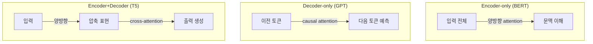

GPT로는 챗봇을 만드는데, 왜 BERT로는 만들기 어려울까? 둘 다 같은 Transformer에서 출발했는데 쓰임새는 정반대다. 한쪽은 분류와 검색에, 한쪽은 대화와 생성에 쓰인다. 그 차이의 뿌리에는 **아키텍처 구조**가 있다.

이 글은 Transformer의 세 가지 변형(Encoder-only / Decoder-only / Encoder+Decoder)을 비교하고, 오늘날 주류 LLM이 왜 Decoder-only로 수렴했는지를 짚는다. 수식을 깊게 파지 않고도 "이 아키텍처는 왜 이 태스크에 맞는가"라는 직관을 얻는 것이 목표다.

## Transformer 기본 구조 3분 리뷰

Transformer는 두 종류의 블록으로 이루어진다. **Encoder**는 입력 문장 전체를 양방향(bidirectional)으로 본다. 앞뒤 토큰을 모두 참고하므로 문맥을 "이해"하는 데 특화된다. 반면 **Decoder**는 이전 토큰만 보고 다음 토큰을 예측한다. 미래 토큰을 가리는 자기회귀(autoregressive) 방식이라 "생성"에 특화된다.

이 두 블록을 어떻게 조합하느냐에 따라 세 가지 변형이 나뉜다. 아래 다이어그램이 핵심 차이를 보여준다.

세 구조 모두 `self-attention`이라는 같은 엔진을 쓴다. 토큰들이 서로 얼마나 주목할지를 계산하는 연산으로, 한 줄로 쓰면 다음과 같다.

$$\text{Attention}(Q,K,V)=\text{softmax}\!\left(\frac{QK^\top}{\sqrt{d_k}}\right)V$$

복잡해 보이지만 의미는 단순하다. **각 토큰이 다른 토큰들에게 얼마나 주목하는가를 가중치로 계산해 정보를 섞는다.** 차이는 "어느 방향으로 주목하느냐"다. Encoder는 양쪽 다 보고, Decoder는 과거만 본다.

## 세 가지 구조와 대표 모델

세 구조가 각각 어떤 모델에 쓰이고 어디에 강한지 정리한 표다.

| 구조 | 대표 모델 | Attention 방식 | 강점 / 약점 |
|------|-----------|----------------|-------------|
| Encoder-only | BERT | 양방향(bidirectional) | 이해·분류·검색에 강함 / 생성 불가 |
| Decoder-only | GPT | 자기회귀(causal) | 범용 생성·대화 / 양방향 문맥 제한 |
| Encoder+Decoder | T5, BART, CT5 | encoder 양방향 + decoder causal + cross-attention | 입력→출력 변환 최적 / 두 스택 복잡, cross-attention 비용 |

BERT는 양방향이라 문맥을 깊게 이해하지만, 다음 토큰을 순차 생성하는 구조가 없어 글을 "써내려갈" 수 없다. GPT는 반대로 한 토큰씩 이어쓰며 무엇이든 생성하지만, 미래 토큰을 못 보므로 양방향 이해는 구조적으로 제한된다. T5·BART 같은 Seq2Seq는 입력을 Encoder로 이해하고 그 표현을 Decoder가 `cross-attention`으로 참고해 출력을 만든다.

## 왜 Decoder-only가 LLM의 주류가 됐는가

그렇다면 왜 GPT 쪽으로 기울었을까? 네 가지 이유가 맞물린다.

1. **사전학습이 단순하다.** "다음 토큰 예측" 하나의 목표로 인터넷의 모든 텍스트를 통째로 학습한다. 별도 라벨이 필요 없어 데이터를 사실상 무한히 부을 수 있다.
2. **스케일링에 깔끔하게 맞는다.** 단일 스택이라 파라미터·데이터·연산을 키울수록 성능이 매끄럽게 따라온다(scaling law). Encoder+Decoder는 두 스택의 균형을 맞춰 튜닝해야 하는 부담이 있다.
3. **In-context learning이 창발한다.** 입력과 출력의 경계가 없어 모든 태스크를 "텍스트 이어쓰기"로 통합할 수 있다. 그 결과 프롬프트만으로 태스크를 바꾸는 few-shot, instruction following이 자연스럽게 나타난다.
4. **태스크가 하나로 통합된다.** 분류·번역·QA를 전부 생성 문제로 환원하므로, 하나의 모델이 범용으로 동작한다.

"Decoder-only가 zero-shot 일반화에서 더 낫다"는 관찰은 연구(Wang et al., 2022 등)로 뒷받침되지만, 절대적 우위라기보다 **학습 설정에 따라 달라지는 경향**으로 보는 편이 안전하다.

핵심은 Decoder-only가 본질적으로 "우월"해서가 아니라, 대규모 자기회귀 학습과 in-context learning에 **가장 단순하게 스케일링되기 때문**에 주류가 됐다는 점이다.

## 그럼 Encoder+Decoder는 왜 살아남았나

Seq2Seq는 죽은 구조가 아니다. 입력과 출력이 명확히 분리된 태스크에서는 여전히 더 경제적이고 효과적인 선택이다.

### 장점

Encoder가 입력 전체를 양방향으로 압축하면서 정보 병목(Information Bottleneck)을 통과시킨다. 이 과정에서 더 풍부하고 정제된 표현이 만들어져, 번역·요약처럼 입력→출력이 뚜렷이 나뉘는 태스크에 강하다. 특히 입력과 출력의 길이가 크게 다른 경우 구조적으로 잘 맞는다.

규모가 GPT급 미만일 때는 **같은 성능을 더 적은 파라미터로** 낼 수 있다는 것도 큰 이점이다. 네이버의 CT5는 T5 1.1 구조를 기반으로 한국어 코퍼스를 학습해 파라미터 대비 효율을 입증한 사례인데, BF16과 Adafactor 같은 학습 안정화 엔지니어링이 그 효율을 뒷받침했다. 자세한 내용은 원본 정리글 [[/llm/00_what_is_transformers]]{CT5 발표 정리}를 참고하면 좋다.

### 한계

대신 두 스택을 함께 학습·튜닝해야 하고 `cross-attention` 연산 오버헤드가 따른다. 초거대 스케일에서 범용 생성을 노릴 때는 Decoder-only의 단순함과 스케일링 친화성에 밀린다. 이 트레이드오프가 주류 LLM의 방향을 갈랐다.

## 결론 — 태스크별 구조 선택 기준

정답은 하나가 아니다. 필요한 것이 무엇이냐에 따라 구조를 고르면 된다.

| 필요한 것 | 추천 구조 | 대표 모델 |
|-----------|-----------|-----------|
| 이해·분류만 | Encoder-only | BERT 계열 |
| 범용 생성·대화·에이전트, 대규모 | Decoder-only | GPT 계열 |
| 명확한 입력→출력 변환(번역·요약), 중소 규모 효율 | Encoder+Decoder | T5 / CT5 계열 |

현대 LLM이 Decoder-only로 수렴한 것은 그 구조가 절대적으로 우월해서가 아니라, **대규모 사전학습과 범용성에 가장 잘 최적화된 선택**이기 때문이다. 아키텍처는 정답이 아니라 태스크와 규모 사이의 트레이드오프다.

## 참고

- Wang et al., "What Language Model Architecture and Pretraining Objective Work Best for Zero-Shot Generalization?", 2022 — <https://arxiv.org/abs/2204.05832>
- Raffel et al., "Exploring the Limits of Transfer Learning with a Unified Text-to-Text Transformer (T5)", 2020 — <https://arxiv.org/abs/1910.10683>
