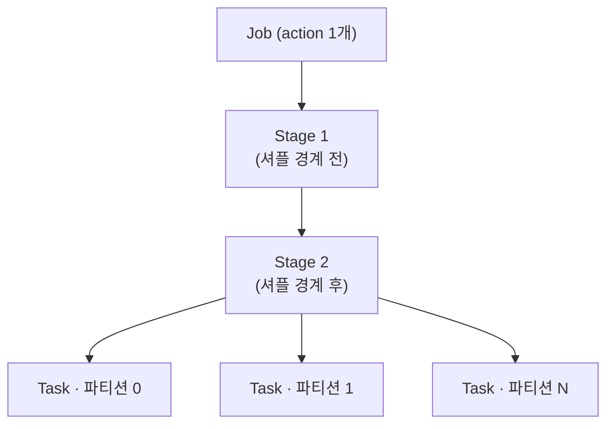
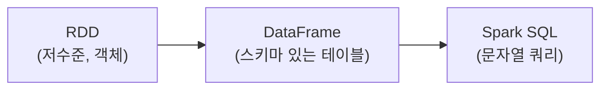
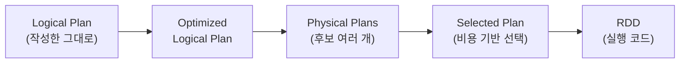

* TOC
{:toc}

## 문제 정의 — 데이터가 한 대 메모리를 넘을 때

다음 작업을 생각해 보자. GCS에 Parquet로 저장된 8억 행, 압축 후 약 400GB의 주문 로그에서 고객별·일별 매출을 집계한다. 작업 환경의 메모리는 16GB다.

`pandas`로 처리하면 다음과 같이 실패한다.

```python
import pandas as pd
df = pd.read_parquet("gs://data-lake/orders/")
# MemoryError
```

`pandas`는 데이터를 전부 메모리에 적재한다. 400GB는 16GB에 들어가지 않는다. 청크 단위로 나눠 읽는 방법(`chunksize`)이 있지만, 그럴 경우 고객·채널을 가로지르는 `groupBy`와 `join`을 청크별로 직접 분할 집계하고 다시 병합해야 한다. 이 "분할 처리 후 병합" 로직을 직접 구현하면, 사실상 분산 처리 엔진을 다시 만드는 것과 같다.

Spark가 그 엔진이다. 데이터가 한 대의 메모리에 들어가지 않을 때, "분할하고·각각 처리하고·병합하는" 작업을 수행하는 분산 실행 엔진이다. PySpark는 그 엔진을 파이썬으로 제어하는 API다. 이 글은 PySpark API와 함께, 그 API가 내부적으로 무엇을 실행하는지를 다룬다.

---

## 1. Spark와 PySpark는 다른 것이다

먼저 구분해야 할 사실. Spark는 Scala로 작성돼 JVM 위에서 실행되는 분산 엔진이고, PySpark는 그 엔진을 호출하는 파이썬 API다. 둘은 같은 프로세스가 아니다.

파이썬에서 `df.groupBy(...).agg(...)`를 호출하면, 이 호출은 데이터를 직접 처리하지 않는다. `Py4J` 브리지를 통해 JVM 측에 "이런 연산을 수행하라"는 계획(plan)으로 전달된다. 실제 데이터 처리는 JVM 익스큐터가 수행한다. 파이썬은 연산을 지시할 뿐이다.


이 구분이 중요한 이유는 성능 때문이다. DataFrame/SQL 연산만 사용하는 한, 파이썬으로 작성하든 Scala로 작성하든 성능은 거의 같다. 둘 다 동일한 JVM 엔진에 동일한 계획을 전달하기 때문이다. 파이썬이 느려지는 경우는 데이터를 파이썬 프로세스로 가져와야 할 때뿐이며, 그 대표적인 경우가 파이썬 UDF다(§8).

<div class="callout-note">
"PySpark가 Scala Spark보다 느리다"는 진술은 절반만 맞다. DataFrame API 안에 머무는 한 동일한 엔진이 실행되므로 차이가 없다. 차이는 <strong>파이썬 코드로 행을 직접 처리하는 시점</strong>(UDF, <code>collect()</code>, RDD <code>map</code>)에만 발생한다.
</div>

---

## 2. 실행 모델 — Driver, Executor, 지연 실행

Spark 클러스터는 두 종류의 프로세스로 구성된다.

- **Driver** — 사용자 코드가 실행되는 프로세스. 연산 계획을 세우고, 분할된 일감을 익스큐터에 분배한다.
- **Executor** — 데이터 조각을 들고 실제 계산을 수행하는 워커 프로세스. 여러 노드에 분산돼 병렬로 실행된다.

여기서 Spark의 핵심 성질인 지연 실행(lazy evaluation)이 나온다. Spark 연산은 두 종류로 나뉜다.

| 종류 | 예 | 동작 |
|------|-----|------|
| **Transformation** | `select`, `filter`, `withColumn`, `groupBy`, `join` | 즉시 실행하지 않고 계획(DAG)에 추가만 한다 |
| **Action** | `show`, `count`, `collect`, `write` | 이 시점에 전체 계획이 실행된다 |

```python
from pyspark.sql import functions as F

# 아래 세 줄은 데이터를 읽지 않는다 — 계획만 쌓인다
daily = (
    orders
    .filter(F.col("status") == "completed")
    .withColumn("order_date", F.to_date("completed_at"))
    .groupBy("customer_id", "order_date")
    .agg(F.sum("amount").alias("revenue"))
)

# 이 action이 트리거 — 이때 위 전체가 한꺼번에 실행된다
daily.write.mode("overwrite").parquet("gs://data-lake/mart/daily_revenue/")
```

지연 실행을 사용하는 이유는 최적화다. 계획을 모두 모은 뒤 실행하면 전체를 보고 최적화할 수 있다. `filter`를 `groupBy`보다 먼저 적용해 읽을 데이터를 줄이고, 사용하지 않는 컬럼은 읽지 않는다. 연산을 즉시 실행하면 이러한 최적화 여지가 사라진다.

action이 호출되면 Spark는 계획을 **Job → Stage → Task** 로 분해한다.



- **Job**: action 하나가 Job 하나다.
- **Stage**: Job을 셔플 경계로 분할한 구간이다(셔플은 §5).
- **Task**: Stage를 파티션 수만큼 분할한 실제 일감이다. 파티션이 200개면 태스크 200개가 익스큐터들에 분배돼 병렬 실행된다.

파티션 수가 곧 병렬도다. 이것이 Spark 성능을 결정하는 첫 번째 설정값이다.

---

## 3. 세 가지 API와 DataFrame의 위치

Spark는 데이터를 다루는 API를 세 단계로 제공한다.



- **RDD (Resilient Distributed Dataset)** — Spark의 최초 추상화. 분산된 객체 컬렉션을 `map`/`filter`/`reduce`로 다룬다. 스키마가 없어 Spark가 데이터 내용을 알지 못한다. 따라서 최적화가 불가능하고, 파이썬에서는 객체를 직렬화해 파이썬 워커로 전송해야 해 느리다.
- **DataFrame** — 스키마가 있는 분산 테이블. 컬럼·타입을 Spark가 인식한다. 오늘날 데이터 엔지니어링의 기본 단위다.
- **Spark SQL** — DataFrame을 SQL 문자열로 다루는 인터페이스. 내부적으로 DataFrame과 동일한 엔진으로 컴파일된다.

같은 집계를 RDD와 DataFrame으로 작성하면 다음과 같이 다르다.

<div class="compare-grid">
<div class="compare-col" markdown="1">

**RDD — Spark가 내용을 모른다**

```python
# 객체를 파이썬에서 직접 처리
(orders.rdd
  .filter(lambda r: r.status == "completed")
  .map(lambda r: (r.customer_id, r.amount))
  .reduceByKey(lambda a, b: a + b)
  .collect())
```

스키마가 없어 최적화 불가. 파이썬 객체 직렬화 비용이 추가된다.

</div>
<div class="compare-col" markdown="1">

**DataFrame — Spark가 컬럼을 안다**

```python
# 같은 연산을 선언적으로
(orders
  .filter(F.col("status") == "completed")
  .groupBy("customer_id")
  .agg(F.sum("amount")))
```

엔진이 계획을 보고 최적화한다. 파이썬/Scala 성능이 동일하다.

</div>
</div>

차이의 핵심은 다음과 같다. RDD는 "어떻게" 처리할지를 기술하고, DataFrame은 "무엇을" 원하는지를 기술한다. "무엇을"만 기술하면 "어떻게"는 엔진이 결정하며, 그 결정을 수행하는 것이 다음 장의 Catalyst다.

<div class="callout-tip">
실무 규칙: <strong>RDD를 직접 사용하지 않는다.</strong> DataFrame/SQL로 표현할 수 없는 드문 경우(커스텀 파티셔닝, 비정형 바이너리 파싱)가 아니면 RDD는 성능상 불리하다. 입문자가 흔히 하는 실수가 "Spark = RDD"라고 가정하고 <code>rdd.map</code>으로 모든 로직을 작성하는 것이다.
</div>

---

## 4. Catalyst와 Tungsten — DataFrame이 빠른 이유

DataFrame에 연산을 쌓으면, action 시점에 **Catalyst 옵티마이저**가 그 계획을 네 단계로 변환한다.



Catalyst가 자동으로 수행하는 대표적 최적화 두 가지:

- **Predicate Pushdown** — `filter`를 가능한 한 데이터 소스에 가깝게 적용한다. Parquet의 경우 조건에 맞지 않는 파일/행 그룹을 읽지 않는다.
- **Column Pruning** — `select`에서 사용하는 컬럼만 읽는다. 100개 컬럼 중 3개만 사용하면 3개만 스캔한다.

`explain()`으로 확인할 수 있다.

```python
daily.explain(mode="formatted")
# == Physical Plan ==
# ...
# PushedFilters: [IsNotNull(status), EqualTo(status,completed)]   ← 소스에서 필터링
# ReadSchema: struct<customer_id,amount,completed_at>             ← 3개 컬럼만 읽음
```

그 아래의 **Tungsten**은 메모리·CPU 레벨 최적화다. JVM 객체 대신 off-heap 바이너리 포맷으로 데이터를 보관해(객체 헤더·GC 부담 제거), 여러 연산을 하나의 함수로 합쳐 컴파일한다(whole-stage code generation). 이것이 DataFrame이 RDD보다 빠른 물리적 이유다.

Spark 3.x부터 기본 활성화된 **AQE(Adaptive Query Execution)** 는 실행 중에 실제 데이터 통계를 보고 계획을 변경한다. 셔플 후 파티션을 동적으로 병합하고, 한쪽 테이블이 작으면 조인 전략을 broadcast로 전환하며, 데이터 쏠림(skew)을 감지해 큰 파티션을 분할한다.

<div class="callout-note">
정리하면, <strong>"무엇을"</strong>만 선언하면 Catalyst가 논리적으로 다듬고, 비용 기반으로 물리 계획을 선택하고, Tungsten이 기계 레벨로 컴파일하고, AQE가 실행 중 다시 조정한다. RDD로 직접 "어떻게"를 작성하면 이 네 단계의 최적화를 모두 사용할 수 없다.
</div>

---

## 5. 파티션과 셔플 — Spark 성능의 핵심

Spark 성능 이해의 대부분은 셔플 이해에 해당한다.

데이터는 **파티션** 단위로 나뉘어 여러 익스큐터에 분산돼 있다. transformation은 파티션을 가로지르는지에 따라 둘로 나뉜다.

| | Narrow transformation | Wide transformation |
|---|---|---|
| 예 | `filter`, `select`, `withColumn`, `map` | `groupBy`, `join`, `distinct`, `repartition`, `orderBy` |
| 데이터 이동 | 없음 (파티션 내에서 완결) | **있음 — 네트워크로 재분배(셔플)** |
| 비용 | 낮음 | 높음 |

**셔플(shuffle)** 은 같은 키를 같은 익스큐터로 모으기 위해 데이터를 디스크에 쓰고 → 네트워크로 전송하고 → 다시 읽는 과정이다. 디스크 I/O, 네트워크 전송, 직렬화 비용이 함께 발생한다. Spark 잡이 느린 원인은 대부분 셔플이다.

`groupBy("customer_id")`는 같은 `customer_id`를 한 곳에 모아야 하므로 셔플을 유발한다. 셔플 결과 파티션 수는 `spark.sql.shuffle.partitions`(기본값 **200**)로 결정된다.

```python
spark = (
    SparkSession.builder
    .config("spark.sql.shuffle.partitions", "400")  # 데이터가 크면 늘린다
    .getOrCreate()
)
```

이 값이 데이터 규모와 맞지 않으면 문제가 발생한다.

- 너무 **작으면**: 파티션 하나가 커져 익스큐터 메모리를 초과하고 디스크로 흘러넘친다(spill). 성능이 저하되거나 OOM이 발생한다.
- 너무 **크면**: 파티션 하나가 작아져 태스크 스케줄링 오버헤드가 실제 연산 비용을 초과한다.

### repartition vs coalesce

파티션 수를 직접 조정하는 두 연산이다. 동작이 다르다.

```python
df.repartition(400)        # 셔플 발생. 늘리거나 균등하게 재분배할 때
df.coalesce(10)            # 셔플 없음. 줄이기만 가능 (출력 파일 수 축소)
```

`coalesce`는 셔플 없이 인접 파티션을 병합하므로 비용이 낮지만, 파티션 수를 늘릴 수 없고 데이터 쏠림을 해소하지 못한다. `repartition`은 셔플을 유발하지만 데이터를 균등하게 재분배한다. 출력 파일이 과도하게 분할됐을 때 마지막에 `coalesce`로 줄이는 것이 일반적인 패턴이다.

<div class="callout-warning">
비용이 큰 실수는 <strong>불필요한 셔플</strong>이다. <code>distinct()</code> 남용, 불필요한 <code>orderBy</code>, 작은 테이블을 큰 테이블에 일반 조인하는 것이 모두 셔플을 유발한다. 잡이 느릴 때는 <code>explain()</code>에서 <code>Exchange</code>(셔플의 물리 연산자) 개수부터 확인한다.
</div>

---

## 6. 조인 — broadcast로 셔플 제거

조인은 기본적으로 셔플을 유발한다. 양쪽 테이블에서 같은 키를 같은 위치로 모아야 하기 때문이다(sort-merge join). 그러나 한쪽 테이블이 작으면 셔플을 제거할 수 있다.

작은 테이블(예: 고객 마스터 50MB)을 모든 익스큐터에 복사(broadcast)하면, 큰 테이블은 자신의 파티션에서 메모리에 올라온 작은 테이블과 직접 조인한다. 큰 테이블의 데이터 이동이 없다.

```python
from pyspark.sql.functions import broadcast

# customers는 작다 → 전 노드에 복사, orders는 이동하지 않음
result = orders.join(broadcast(customers), "customer_id")
```

Spark는 작은 쪽이 `spark.sql.autoBroadcastJoinThreshold`(기본값 **10MB**) 이하면 자동으로 broadcast한다. 다만 통계가 부정확하면 자동 적용을 놓칠 수 있으므로, 작은 테이블임을 미리 안다면 `broadcast()`로 명시하는 것이 안전하다.

<div class="compare-grid">
<div class="compare-col" markdown="1">

**일반 조인 — 양쪽 모두 셔플**

```python
orders.join(customers, "customer_id")
# 8억 행 orders도 키별로 재분배됨
# → 대규모 셔플
```

</div>
<div class="compare-col" markdown="1">

**broadcast 조인 — 셔플 없음**

```python
orders.join(broadcast(customers), "customer_id")
# customers만 복사, orders는 이동 안 함
# → 네트워크 이동 최소
```

</div>
</div>

---

## 7. 실전 예제 — 집계 마트 생성

문제 정의의 작업을 끝까지 처리한다. 8억 행 주문과 고객 마스터로 고객 등급별·일별 매출 마트를 만든다.

```python
from pyspark.sql import SparkSession, functions as F
from pyspark.sql.functions import broadcast
from pyspark.sql.window import Window

spark = (
    SparkSession.builder
    .appName("daily-revenue-by-tier")
    .config("spark.sql.shuffle.partitions", "400")
    .getOrCreate()
)

# 1) 읽기 — 아직 실행되지 않음 (lazy)
orders    = spark.read.parquet("gs://data-lake/orders/")       # 8억 행
customers = spark.read.parquet("gs://data-lake/customers/")     # 50MB, 작다

# 2) 정제 + 집계 (narrow filter → wide groupBy)
daily = (
    orders
    .filter(F.col("status") == "completed")            # predicate pushdown 대상
    .withColumn("order_date", F.to_date("completed_at"))
    .groupBy("customer_id", "order_date")              # ← 셔플 1회
    .agg(
        F.count("*").alias("order_count"),
        F.sum("amount").alias("revenue"),
    )
)

# 3) 고객 등급 결합 — 작은 테이블이므로 broadcast (셔플 없음)
enriched = daily.join(broadcast(customers.select("customer_id", "tier")), "customer_id")

# 4) 등급·일자별 매출 + 등급 내 순위 (window)
w = Window.partitionBy("tier", "order_date").orderBy(F.desc("revenue"))
mart = (
    enriched
    .withColumn("rank_in_tier", F.row_number().over(w))   # ← 셔플 2회
    .filter(F.col("rank_in_tier") <= 100)                 # 등급별 상위 100 고객
)

# 5) 쓰기 — 이 시점에 1~4 전체가 실행된다 (action)
(mart
  .repartition("order_date")                              # 날짜별 파일로 정리
  .write
  .partitionBy("order_date")                              # 파티션 디렉토리로 저장
  .mode("overwrite")
  .parquet("gs://data-lake/mart/top_customers_daily/"))
```

이 코드에 앞 절들의 개념이 모두 포함돼 있다.

- 1~4는 계획만 쌓는다(lazy). 5의 `write`(action)가 실행을 트리거한다.
- `filter`는 narrow + pushdown이므로 소스에서 미리 걸러 8억 행을 읽기 전에 줄인다.
- `groupBy`와 `window`는 wide이므로 셔플 2회가 발생한다. 이 잡의 비용 중심이다.
- `customers`는 broadcast이므로 조인 셔플 1회를 제거한다.
- 결과는 `order_date`로 파티셔닝해 저장하므로, 이후 특정 날짜만 읽을 때 pushdown 이득을 얻는다.

이 마트는 [[/data-architect/00_what_is_medaliion_architecture]] 의 골드 레이어에 해당한다. Spark는 브론즈→실버→골드 레이어를 변환하는 엔진이며, 위 코드는 실버(정제된 orders)에서 골드(집계 마트)로 변환하는 한 단계다.

---

## 8. UDF와 파이썬 직렬화 비용

§1에서 미룬 내용이다. 파이썬 UDF는 느리며, 그 이유는 직렬화 비용에 있다.

DataFrame 내장 함수(`F.sum`, `F.to_date` 등)는 JVM 안에서 처리가 완결된다. 그러나 파이썬 UDF를 사용하면, JVM은 행마다 데이터를 직렬화해 파이썬 워커 프로세스로 전송하고, 파이썬이 처리한 결과를 다시 직렬화해 받는다. 이 왕복 직렬화가 8억 행에 걸쳐 반복되면 비용이 매우 커진다.

```python
# 느림 — 행마다 JVM↔파이썬 왕복
from pyspark.sql.functions import udf
@udf("double")
def to_usd(krw): return krw / 1330.0
df.withColumn("usd", to_usd("amount"))
```

해법은 두 가지다.

1. **내장 함수로 표현 가능하면 UDF를 사용하지 않는다.** 위 예는 `F.col("amount") / 1330.0` 으로 충분하다.
2. 파이썬 로직이 반드시 필요하면 **Pandas UDF**(벡터화 UDF)를 사용한다. Apache Arrow로 행 단위가 아니라 컬럼 묶음(배치) 단위로 전송해 직렬화 비용을 크게 줄인다.

```python
# 빠름 — Arrow로 배치 전송, 파이썬에서 벡터 연산
import pandas as pd
from pyspark.sql.functions import pandas_udf

@pandas_udf("double")
def normalize(s: pd.Series) -> pd.Series:
    return (s - s.mean()) / s.std()

df.withColumn("z_revenue", normalize("revenue"))
```

<div class="callout-warning">
<code>collect()</code>도 같은 부류의 비용을 발생시킨다. <code>df.collect()</code>는 분산된 전체 데이터를 <strong>드라이버 한 대의 메모리로</strong> 가져온다. 큰 데이터에 <code>collect()</code>를 호출하면 드라이버가 OOM으로 종료된다. 확인 용도면 <code>show(20)</code>, 일부만 필요하면 <code>limit().collect()</code>, 저장이면 <code>write</code>를 사용한다.
</div>

---

## 9. 흔한 실패와 한계

Spark는 모든 경우에 적합하지 않다. 실무에서 자주 발생하는 실패 유형은 다음과 같다.

- **데이터 쏠림(skew)** — 특정 키에 데이터가 집중되면 그 파티션을 담당한 태스크 하나만 오래 실행된다. 다른 태스크는 모두 끝났는데 한 태스크만 지연되는 형태다. AQE의 skew 처리가 자동으로 해결하기도 하지만, 해결되지 않으면 솔트(salt) 키를 추가해 데이터를 인위적으로 분산해야 한다.
- **OOM과 spill** — 파티션이 익스큐터 메모리보다 크면 디스크로 흘러넘치고(spill, 성능 저하), 더 크면 종료된다(OOM). 파티션 수·메모리 설정·셔플 파티션이 데이터 규모와 맞아야 한다.
- **작은 파일 문제** — 출력 파티션이 과도하면 수많은 작은 파일이 생성돼 다음 읽기가 느려진다. `coalesce`로 줄인다.
- **반복 실행되는 메타데이터 연산** — `count()`, `distinct().count()` 같은 연산을 디버깅 중 반복 호출하면 매번 전체 잡이 다시 실행된다(lazy 때문). 재사용할 결과는 `cache()`/`persist()`로 메모리에 고정한다.

가장 중요한 한계는 작은 데이터에는 Spark가 적합하지 않다는 점이다.

<div class="callout-note">
Spark는 분산·셔플·JVM 기동에 따른 <strong>고정 오버헤드</strong>가 크다. 수 GB 이하라면 <code>pandas</code>·<code>DuckDB</code>·<code>Polars</code>가 한 대에서 더 빠르고 비용이 낮다. Spark의 손익분기는 "한 대에 데이터가 들어가지 않거나, 한 대로는 너무 느린" 지점이다. 그 아래 규모에서는 클러스터 기동 시간만 소모해 손해다. 문제 정의의 400GB는 Spark가 적합하지만, 400MB라면 <code>pandas</code>가 적합하다.
</div>

---

## 10. 배치 너머 — Structured Streaming

지금까지는 정적 데이터(배치)를 다뤘다. Spark는 같은 DataFrame API로 연속해서 들어오는 스트림도 처리한다. Structured Streaming은 스트림을 "행이 계속 추가되는 테이블"로 모델링해, 배치 코드와 거의 같은 문법으로 실시간 집계를 작성하게 한다.

```python
# 배치의 spark.read 가 spark.readStream 으로 바뀐다
stream = (
    spark.readStream
    .format("kafka")
    .option("kafka.bootstrap.servers", "broker:9092")
    .option("subscribe", "orders")
    .load()
)

agg = (
    stream
    .selectExpr("CAST(value AS STRING) AS json")
    # ... 파싱 ...
    .groupBy(F.window("event_time", "5 minutes"), "tier")
    .agg(F.sum("amount").alias("revenue"))
)

(agg.writeStream
  .outputMode("update")
  .format("console")
  .trigger(processingTime="30 seconds")
  .start())
```

소스가 Kafka인 경우, 프로듀서가 발행한 이벤트를 Spark가 컨슈머로 받아 실시간 집계한다. 배치 마트(§7)와 스트리밍 집계(§10)가 동일한 DataFrame 문법을 공유한다는 점이 Spark를 데이터 플랫폼의 공통 처리 엔진으로 사용하는 근거다.

---

## 정리

PySpark 사용은 파이썬 문법으로 JVM 분산 엔진에 "무엇을" 원하는지 선언하는 작업이다. 성능 차이를 만드는 것은 문법이 아니라, API 호출 뒤에서 실제로 무엇이 실행되는지에 대한 이해다. 아래 표의 오른쪽 항목이 그 실제 실행 내용이다.

| 보이는 API (PySpark) | 실제 실행 내용 |
|---|---|
| `df.groupBy().agg()` | JVM 익스큐터 간 셔플 |
| 함수 호출 여러 줄 | action 전까지 쌓이는 계획(DAG) |
| `df.join(small)` | broadcast로 제거 가능한 셔플 |
| `@udf` | 행마다 발생하는 JVM↔파이썬 직렬화 왕복 |
| `df.collect()` | 분산 데이터를 드라이버 한 대로 수집 |

오른쪽 항목을 인식하면, 느린 Spark 잡에서 `explain()`을 열고 `Exchange` 개수를 확인해 셔플을 줄이는 방향으로 튜닝할 수 있다. 이것이 PySpark를 "실행되게" 쓰는 것과 "빠르게" 쓰는 것의 차이다.

---

## 참고

- [[/data-architect/00_what_is_medaliion_architecture]] — Spark가 변환 엔진으로 브론즈→실버→골드 레이어를 만든다. §7의 마트가 골드 레이어다.
- Apache Spark, [*Spark SQL, DataFrames and Datasets Guide*](https://spark.apache.org/docs/latest/sql-programming-guide.html) — DataFrame API·Catalyst·실행 모델 공식 문서
- Apache Spark, [*Structured Streaming + Kafka Integration Guide*](https://spark.apache.org/docs/latest/structured-streaming-kafka-integration.html) — §10의 Kafka 소스 연동 공식 문서
- Apache Spark, [*Performance Tuning*](https://spark.apache.org/docs/latest/sql-performance-tuning.html) — 셔플 파티션·broadcast 임계값·AQE 설정
- Apache Spark, [*Structured Streaming Programming Guide*](https://spark.apache.org/docs/latest/structured-streaming-programming-guide.html) — 스트림을 테이블로 보는 모델
</content>
