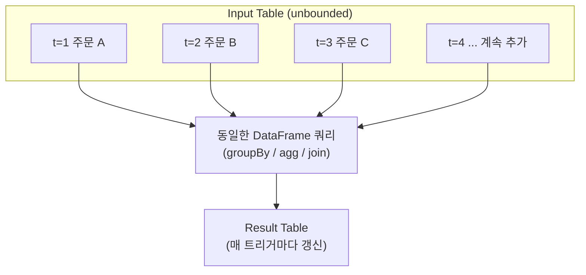
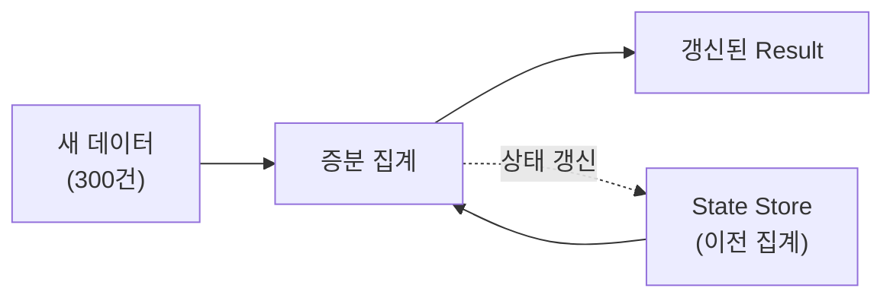
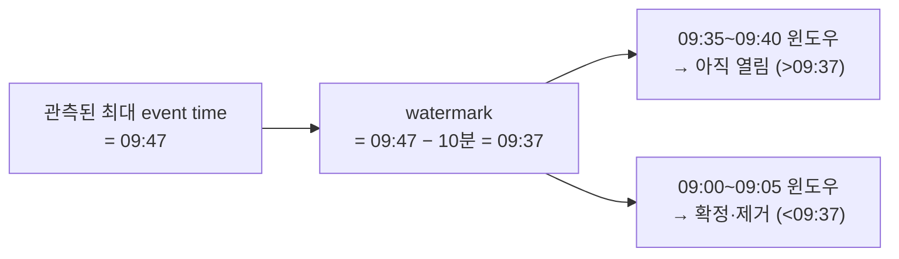
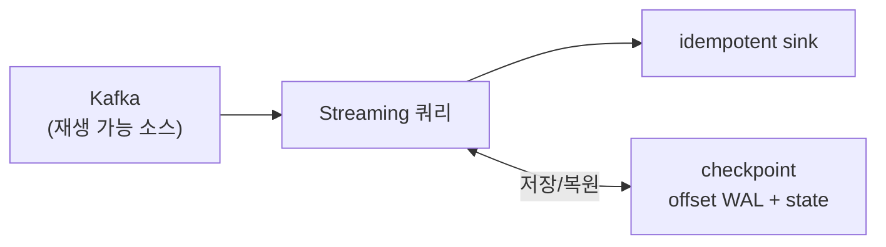

* TOC
{:toc}

## 문제 정의 — 배치의 지연은 실행 주기와 같다

[[/spark/00_what_is_pyspark]] §7의 매출 마트 잡은 하루 한 번 도는 배치다. 이 구조에서 데이터의 최대 지연(freshness lag)은 배치 주기와 같다. 하루 한 번 실행하면 최신 주문이 마트에 반영되기까지 최대 24시간이 걸린다.

집계 주기를 5분으로 줄여 실시간 대시보드를 채우려는 요구를 배치 반복으로 구현하면 다음과 같다.

```python
# 5분마다 크론으로 전체 잡을 다시 실행 — 안티패턴
while True:
    orders = spark.read.parquet("gs://data-lake/orders/")   # 8억 행 전체 재스캔
    daily = orders.filter(...).groupBy(...).agg(...)
    daily.write.mode("overwrite").parquet(...)
    time.sleep(300)
```

문제가 명확하다. 5분마다 8억 행 **전체**를 다시 읽어 전부 다시 집계한다. 새로 들어온 몇천 행 때문에 나머지 전부를 재계산한다. 데이터가 커질수록 5분 주기를 지킬 수 없게 되고, 결국 집계가 밀린다.

필요한 것은 증분 계산이다. **직전 실행 이후 새로 도착한 데이터만** 읽어, 이전 집계 결과에 더한다. Structured Streaming이 그 증분 계산을 배치와 거의 같은 문법으로 수행하는 Spark의 스트림 처리 엔진이다. 이 글은 그 API와 함께, 그 API가 "이전 결과를 어떻게 기억하고 새 데이터만 더하는지"를 다룬다.

---

## 1. 스트림을 무한히 자라는 테이블로 본다

Structured Streaming의 핵심 추상화는 한 문장이다. **스트림은 행이 계속 append되는, 끝이 없는 테이블이다.**



이 관점의 실질적 함의는 쿼리 의미론(semantics)의 동일성이다. 무한 테이블에 대해 `groupBy(...).agg(...)`를 작성하면, 그 쿼리의 **의미**는 정적 테이블에 대한 것과 동일하다. 다른 것은 실행 방식뿐이다. 배치는 테이블 전체에 쿼리를 한 번 돌리고, 스트리밍은 새 행이 도착할 때마다 쿼리를 증분 실행해 Result Table을 갱신한다. 엔진은 이 증분 실행이 "전체를 한 번에 계산한 결과와 같아지도록" 보장하는 것을 목표로 한다.

그래서 코드 차이가 거의 없다. 배치의 `spark.read`가 `spark.readStream`으로, `df.write`가 `df.writeStream`으로 바뀔 뿐이다.

<div class="compare-grid">
<div class="compare-col" markdown="1">

**배치 — 유한 테이블에 1회 실행**

```python
orders = spark.read.parquet("gs://.../orders/")
agg = (orders
  .groupBy("tier")
  .agg(F.sum("amount")))
agg.write.parquet("gs://.../mart/")
```

</div>
<div class="compare-col" markdown="1">

**스트리밍 — 무한 테이블에 증분 실행**

```python
orders = spark.readStream.format("kafka")...load()
agg = (orders
  .groupBy("tier")
  .agg(F.sum("amount")))
agg.writeStream.format("console").start()
```

</div>
</div>

`groupBy("tier").agg(F.sum("amount"))` 부분은 글자 그대로 동일하다. 이것이 Structured Streaming의 설계 목표다 — 배치에서 검증한 로직을 그대로 스트림에 올린다.

<div class="callout-note">
"무한 테이블"은 비유가 아니라 실행 모델 그 자체다. 엔진은 도착한 데이터를 <strong>입력 테이블에 append된 새 행</strong>으로 취급하고, 사용자 쿼리를 그 위에 반복 적용해 <strong>Result Table</strong>을 유지한다. 다음 절의 상태(state)는 이 Result Table을 매번 처음부터 다시 만들지 않기 위한 장치다.
</div>

---

## 2. 증분 실행 — 상태(state)를 기억한다

문제 정의의 안티패턴이 실패한 이유는 매번 전체를 재계산했기 때문이다. Structured Streaming은 그러지 않는다. 이전 트리거까지의 **중간 집계 결과를 상태 저장소(state store)에 보관**하고, 새 트리거에서는 새로 도착한 데이터만 그 상태에 반영한다.

`tier`별 매출 합계를 예로 들면, 엔진이 유지하는 상태는 이런 키-값이다.

```
state store (트리거 N 종료 시점)
  "GOLD"   → { revenue: 8_240_000, count: 412 }
  "SILVER" → { revenue: 3_110_000, count: 980 }
  "BRONZE" → { revenue:   750_000, count: 210 }
```

트리거 N+1에서 새 주문 300건이 도착하면, 엔진은 8억 행을 다시 읽지 않는다. 300건만 읽어 해당 `tier`의 상태에 더한다.



이것이 배치 루프와의 결정적 차이다. 비용이 **전체 데이터 크기**가 아니라 **트리거당 새 데이터 크기 + 상태 크기**에 비례한다.

증분 갱신이 성립하려면 집계가 부분 결과를 결합(combine)하는 형태로 표현돼야 한다. `sum`·`count`·`min`·`max`·`avg`는 "기존 상태 + 새 배치의 부분 집계"로 정확히 합쳐지므로 증분화가 자명하다. 반면 정확한 distinct 개수(중복 제거 카운트)나 중앙값(median)처럼 전체 데이터를 봐야 계산되는 연산은 이 형태로 결합되지 않는다. Structured Streaming은 이런 연산을 근사 알고리즘(`approx_count_distinct` 등)으로 제공하거나, 상태에 원소 전체를 쌓는 무거운 방식으로만 지원한다. 스트리밍에서 어떤 집계가 싼지는 그 집계가 결합 가능한지에 달렸다.

이 방식은 상태 크기라는 새 문제를 만든다. 상태는 집계 키의 수에 비례해 쌓인다. `tier`는 값이 3개뿐이라 상태가 항상 작지만, 5분 윈도우별로 집계하면 시간이 흐를수록 윈도우 수가 늘어 상태가 무한히 증가한다. 오래된 윈도우의 상태를 언제 제거할지가 관건이며, 그 판단 기준이 §5의 워터마크다. 출력 방식(§3)을 먼저 정리한 뒤 다룬다.

---

## 3. Output Mode — 무엇을 내보낼 것인가

매 트리거마다 Result Table이 갱신된다. 그 결과를 sink(콘솔·Kafka·파일 등)로 **어떻게** 내보낼지가 output mode다. 세 가지가 있고, 쿼리 종류에 따라 사용 가능한 것이 다르다.

| Mode | 내보내는 것 | 사용처 | 제약 |
|------|-----------|--------|------|
| **append** | 이번 트리거에 **새로 확정된** 행만 | 집계 없는 변환, 또는 워터마크로 확정된 집계 | 집계 결과는 워터마크가 있어야 append 가능 |
| **update** | 이번 트리거에 **값이 바뀐** 행만 | 집계 결과를 upsert하는 대시보드 | 가장 범용적 |
| **complete** | **전체** Result Table | 결과가 작고 매번 전체가 필요할 때 | 집계에만 허용, 상태가 무한 증가 |

핵심 구분은 append와 complete다.

- **complete**는 매 트리거마다 전체 결과 테이블을 통째로 내보낸다. `tier` 3행처럼 결과가 작을 때만 쓴다. 윈도우 집계에 complete를 쓰면 모든 윈도우를 영원히 보관·출력하므로 상태가 무한히 커진다.
- **append**는 한 번 확정된 행만 내보내고 다시 건드리지 않는다. 집계 결과에 append를 쓰려면 "이 집계는 이제 더 안 바뀐다"는 확정 시점이 필요하고, 그 시점을 정하는 것이 워터마크다(§5).

```python
# 집계 없는 변환 → append 자연스러움 (행이 확정되어 나감)
parsed.writeStream.outputMode("append")...

# 집계 결과를 upsert → update
agg.writeStream.outputMode("update")...

# 작은 전체 결과를 매번 → complete
small_agg.writeStream.outputMode("complete")...
```

<div class="callout-warning">
초심자가 윈도우 집계에 <code>complete</code>를 걸어두고 "메모리가 계속 는다"고 겪는 경우가 흔하다. complete는 결과 전체를 상태로 들고 있어야 하므로 시간 축 집계에는 부적합하다. 시간 윈도우 집계는 <strong>워터마크 + append</strong> 또는 <strong>update</strong>가 정석이다.
</div>

---

## 4. Event Time과 Processing Time — 언제를 기준으로 집계하나

실시간 집계에서 가장 많은 오해가 "시간"의 정의다. 두 시간이 있다.

- **Event time** — 이벤트가 실제로 발생한 시각. 주문이 생성된 시각. 데이터 안에 컬럼으로 들어 있다.
- **Processing time** — Spark가 그 이벤트를 처리한 시각. 도착·연산 시점.

둘은 다르다. 모바일 앱이 오프라인이었다가 복구되면, 09:00에 발생한 주문(event time)이 09:40에 도착(processing time)할 수 있다. 네트워크 지연, 재시도, Kafka 적체로 이런 지각(late) 데이터는 상시 발생한다.

"09:00~09:05 매출"을 정확히 집계하려면 **event time** 기준이어야 한다. processing time으로 집계하면, 09:40에 도착한 09:00 주문이 09:40 버킷에 잘못 들어간다. Structured Streaming은 event time 윈도우 집계를 1급으로 지원한다.

```python
# processing time 아니라 데이터의 event_time 컬럼으로 5분 윈도우
agg = (
    stream
    .groupBy(F.window("event_time", "5 minutes"), "tier")
    .agg(F.sum("amount").alias("revenue"))
)
```

`F.window("event_time", "5 minutes")`는 각 행을 그 event time이 속한 5분 버킷에 배정한다. 09:00에 발생했으나 09:40에 도착한 주문도 09:00~09:05 윈도우로 정확히 들어간다.

이는 다시 상태 문제로 이어진다. 09:40에 도착할 09:00 데이터를 받으려면 엔진은 09:00 윈도우의 상태를 계속 열어두어야 한다. 상태를 무한정 열어두면 상태가 무한히 커지고, 너무 일찍 닫으면 지각 데이터를 놓친다. 이 트레이드오프를 명시적 임계값으로 끊는 장치가 워터마크다.

---

## 5. Watermark — 상태를 언제 버릴지 정한다

워터마크는 한 줄로 정의된다. **"이 시각보다 오래된 지각 데이터는 더 이상 기다리지 않는다"는 임계선.**

```python
agg = (
    stream
    .withWatermark("event_time", "10 minutes")     # 지각 허용 한도 = 10분
    .groupBy(F.window("event_time", "5 minutes"), "tier")
    .agg(F.sum("amount").alias("revenue"))
)
```

동작 규칙은 이렇다. 엔진은 지금까지 본 데이터 중 가장 큰 event time을 추적한다. 워터마크 = (관측된 최대 event time) − (지각 허용 한도). 워터마크보다 이전에 끝나는 윈도우는 **확정(finalize)** 하고 상태에서 제거한다. 그 이후 도착하는 더 오래된 데이터는 버린다.



워터마크가 두 문제를 동시에 푼다.

1. **상태 크기를 유한하게 유지한다.** 확정된 오래된 윈도우를 상태에서 지우므로, 상태는 대략 "허용 한도 구간"만큼만 유지된다. §2에서 미룬 "상태가 무한히 커지는가"의 답이다.
2. **append 모드를 가능하게 한다.** 윈도우가 확정되는 시점이 곧 "이 집계 결과는 더 안 바뀐다"는 시점이므로, 그때 결과를 append로 내보낼 수 있다.

트레이드오프가 명확하다. 허용 한도를 늘리면(예: 1시간) 더 늦은 지각 데이터도 받지만 상태가 커지고 결과 확정이 늦어진다. 줄이면 상태가 작고 결과가 빨리 나오지만 그만큼 지각 데이터를 더 버린다. 정답은 데이터의 실제 지연 분포에 달렸다.

<div class="callout-warning">
워터마크 없이 event time 윈도우를 <code>append</code>로 집계하면 쿼리가 시작되지 않거나(엔진이 확정 시점을 모름), <code>complete</code>로만 동작하며 상태가 계속 증가한다. <strong>event time 윈도우 집계 + append</strong>에는 워터마크가 사실상 필수다. 또한 워터마크로 버려진 지각 데이터는 <strong>조용히 사라진다</strong> — 얼마나 버려지는지 별도로 모니터링해야 한다.
</div>

---

## 6. 실전 예제 — Kafka 주문 스트림의 5분 윈도우 매출

앞 절들을 하나로 합친다. [[/kafka/03_kafka_producer_summary]]의 프로듀서가 `orders` 토픽에 발행한 주문 이벤트를, Spark가 컨슈머로 받아 등급·5분 윈도우별 매출을 실시간 집계한다.

Kafka 메시지 `value`가 아래 JSON이라고 하자.

```json
{"order_id":"o-8831","customer_id":"c-201","tier":"GOLD","amount":42000,"event_time":"2026-07-01T09:03:11Z"}
```

```python
from pyspark.sql import SparkSession, functions as F
from pyspark.sql.types import StructType, StructField, StringType, LongType, TimestampType

spark = SparkSession.builder.appName("streaming-revenue").getOrCreate()

# 1) Kafka 소스 — readStream (아직 실행 안 됨)
raw = (
    spark.readStream
    .format("kafka")
    .option("kafka.bootstrap.servers", "broker:9092")
    .option("subscribe", "orders")
    .option("startingOffsets", "latest")       # 신규 이벤트부터
    .option("maxOffsetsPerTrigger", "500000")  # 트리거당 상한 (역압/폭주 방어)
    .load()
)

# 2) value(bytes) → JSON 파싱 → 컬럼
schema = StructType([
    StructField("order_id",    StringType()),
    StructField("customer_id", StringType()),
    StructField("tier",        StringType()),
    StructField("amount",      LongType()),
    StructField("event_time",  TimestampType()),
])
parsed = (
    raw.select(F.from_json(F.col("value").cast("string"), schema).alias("o"))
       .select("o.*")
)

# 3) event time 기준 5분 윈도우 집계 + 워터마크 10분
agg = (
    parsed
    .withWatermark("event_time", "10 minutes")
    .groupBy(F.window("event_time", "5 minutes"), "tier")
    .agg(
        F.count("*").alias("order_count"),
        F.sum("amount").alias("revenue"),
    )
)

# 4) sink — update 모드로 30초마다, checkpoint 지정
query = (
    agg.writeStream
    .outputMode("update")
    .format("console")
    .option("checkpointLocation", "gs://data-lake/_chk/streaming-revenue/")  # §7
    .trigger(processingTime="30 seconds")                                     # §8
    .start()
)
query.awaitTermination()
```

이 코드에 앞 절 개념이 모두 들어 있다.

- **1** `readStream` + Kafka 소스. 배치의 `read`와 대칭이다. `maxOffsetsPerTrigger`로 한 트리거가 삼키는 양을 제한해 폭주를 막는다.
- **2** Kafka `value`는 항상 bytes다. `from_json`으로 스키마를 입혀 테이블로 만든다. 이 파싱은 §1의 무한 테이블에 대한 narrow 변환이다.
- **3** `event_time`(processing time 아님) 기준 5분 윈도우, 워터마크 10분. §2의 상태가 여기서 윈도우별로 유지되고, §5 규칙으로 오래된 윈도우가 확정·제거된다.
- **4** `update` 모드(§3) — 값이 바뀐 윈도우만 내보낸다. checkpoint(§7)로 offset·상태를 저장해 장애 복구를 보장하고, 30초 트리거(§8)로 처리 주기를 정한다.

배치 §7 마트와 비교하면, `read→write` 1회 실행이 `readStream→writeStream` 무한 증분 실행으로 바뀌었을 뿐 집계 로직의 형태는 동일하다.

---

## 7. Checkpoint — 장애가 나도 정확히 한 번

스트리밍 잡은 며칠·몇 주씩 돈다. 그 사이 익스큐터가 죽고, 드라이버가 재시작되고, 배포로 잡이 내려간다. 재시작했을 때 두 가지가 보장돼야 한다. (1) 어디까지 읽었는지 알아야 하고(중복·누락 방지), (2) 지금까지의 집계 상태를 잃지 않아야 한다.

`checkpointLocation`이 이 둘을 저장한다.

- **offset 로그(WAL)** — 각 트리거에서 소스의 어디까지 처리했는지(Kafka라면 토픽·파티션별 offset)를 쓰기 전에 먼저 기록한다.
- **state store 스냅샷** — §2의 집계 상태를 주기적으로 체크포인트에 저장한다.

재시작하면 엔진은 checkpoint에서 마지막 offset과 상태를 복원해, 죽은 지점의 트리거부터 다시 시작한다.



**exactly-once는 스트리밍 엔진 혼자 보장하지 못한다.** 정확히는 Spark가 보장하는 것은 소스 offset과 상태를 원자적으로 커밋하는 것까지이고, 최종 결과가 한 번만 반영되려면 소스와 sink의 성질이 맞아야 한다. end-to-end exactly-once에는 세 조건이 함께 필요하다.

1. **재생 가능한 소스(replayable source)** — 재시작 후 같은 데이터를 다시 읽을 수 있어야 한다. Kafka는 offset으로 재생 가능하다. 소켓 소스는 불가능하다.
2. **checkpoint** — 어디까지 처리했는지 기록.
3. **멱등(idempotent) 또는 트랜잭션 sink** — 재처리 시 같은 결과를 두 번 써도 중복되지 않아야 한다. 파일 sink(트랜잭션 커밋)나 upsert 가능한 저장소가 여기 해당한다.

<div class="callout-note">
Kafka는 offset을 소스 쪽에 커밋하지 않고 <strong>Spark의 checkpoint에</strong> 기록한다. 따라서 checkpoint 경로를 지우거나 바꾸면 잡은 자신이 어디까지 읽었는지 잊고 <code>startingOffsets</code> 기준으로 다시 시작한다 — 재처리 또는 누락의 흔한 원인이다. checkpoint 경로는 잡의 정체성이므로 함부로 바꾸지 않는다.
</div>

---

## 8. Trigger — 얼마나 자주 처리하나

trigger는 마이크로배치를 얼마나 자주 돌릴지 정한다.

| Trigger | 동작 | 용도 |
|---------|------|------|
| 기본(미지정) | 직전 배치가 끝나면 곧바로 다음 배치 | 최저 지연을 원할 때 |
| `processingTime="30 seconds"` | 30초 간격으로 배치 | 지연/비용 균형 (가장 흔함) |
| `availableNow=True` | 밀린 데이터를 모두 처리하고 종료 | 스트림 코드를 배치처럼 주기 실행 |
| `continuous="1 second"` | 마이크로배치 아닌 연속 처리 | 실험적, ~1ms 지연, 지원 연산 제한 |

기본 동작 방식은 **마이크로배치(micro-batch)** 다. 이름은 "스트리밍"이지만 내부적으로는 짧은 주기의 작은 배치를 연속 실행하는 것이다. 그래서 §1처럼 배치 코드와 문법이 같다. 진짜 이벤트 단위(record-at-a-time) 처리는 Continuous Processing인데, 지원 연산이 제한적이고 실험적이라 실무 대부분은 마이크로배치를 쓴다.

`availableNow`는 유용한 중간 지점이다. 스트리밍 코드를 그대로 두고, 크론으로 하루 몇 번 실행해 "그동안 밀린 것만 처리하고 종료"하게 한다. 상시 클러스터를 띄우는 비용 없이 checkpoint 기반 증분 처리의 이점(전체 재스캔 회피)만 취한다.

<div class="callout-tip">
"실시간"이 항상 필요한 건 아니다. 대시보드가 분 단위면 <code>processingTime</code> 30초~1분으로 충분하고, 시간 단위면 <code>availableNow</code>를 크론으로 돌리는 편이 상시 클러스터보다 훨씬 싸다. 초 단위 미만 지연이 실제로 필요할 때만 지연을 낮춰라 — 지연을 낮출수록 트리거당 오버헤드 비중이 커진다.
</div>

---

## 9. 흔한 실패와 한계

Structured Streaming의 실패는 대부분 상태 관리에서 온다.

- **상태 무한 증가** — 워터마크 없는 event time 집계, 또는 카디널리티가 계속 늘어나는 키(예: `order_id`별 집계)로 그룹화하면 상태가 끝없이 자란다. 결국 익스큐터 메모리를 넘겨 잡이 죽는다. 집계 키는 유한 카디널리티여야 하고, 시간 축 집계에는 워터마크를 건다.
- **큰 상태와 GC** — 상태가 커지면 기본 state store(JVM 힙 기반)가 GC 압박을 받는다. Spark 3.2+의 **RocksDB state store**(`spark.sql.streaming.stateStore.providerClass`)로 상태를 off-heap/디스크로 내려 큰 상태를 감당한다.
- **작은 파일 폭증** — 파일 sink로 30초마다 쓰면 하루에 파일 수천 개가 생긴다. 배치 §5와 같은 작은 파일 문제다. 트리거 주기를 늘리거나, 주기적 컴팩션 또는 Iceberg·Delta 같은 테이블 포맷으로 관리한다.
- **stream-stream 조인의 상태** — 두 스트림을 조인하려면 양쪽 모두 워터마크와 시간 조건이 필요하다. 없으면 엔진이 매칭을 언제 포기할지 몰라 양쪽 상태를 무한히 들고 있는다.
- **checkpoint 스키마 변경** — 집계 키나 상태 구조를 바꾸고 같은 checkpoint로 재시작하면 상태 복원이 실패한다. 상태 스키마를 바꾸는 배포는 checkpoint 마이그레이션 또는 재시작 전략이 필요하다.

가장 중요한 한계는 **애초에 스트리밍이 필요한지**다.

<div class="callout-note">
스트리밍 잡은 상시 클러스터·checkpoint 운영·상태 관리라는 <strong>지속 비용</strong>을 만든다. "5분 지연이면 충분한" 요구에 마이크로배치 스트리밍을 상시 띄우는 것은 과하다. 그런 경우 <code>availableNow</code> 트리거를 크론으로 돌리는 <strong>증분 배치</strong>가 스트리밍의 대부분 이점(전체 재스캔 회피, exactly-once)을 훨씬 낮은 운영 비용으로 준다. 진짜 초·초미만 지연이 SLA로 요구될 때만 상시 스트리밍을 쓴다.
</div>

---

## 정리

Structured Streaming은 "스트림 = 무한 테이블"이라는 한 가지 추상화 위에 서 있다. 그 덕에 배치에서 검증한 DataFrame 로직을 문법 변경 거의 없이 스트림에 올린다. 배치와 다른 부분은 문법이 아니라, API 뒤에서 엔진이 관리하는 것들이다.

| 보이는 API | 실제로 엔진이 하는 일 |
|---|---|
| `readStream ... load()` | 무한 입력 테이블에 새 행 append |
| `groupBy().agg()` | 이전 결과를 state store에 유지하며 증분 갱신 |
| `.withWatermark(...)` | 오래된 상태를 확정·제거해 상태 크기를 유한하게 유지 |
| `F.window("event_time", ...)` | processing time 아닌 발생 시각 기준 버킷팅 |
| `outputMode("append")` | 워터마크로 확정된 행만 한 번 내보냄 |
| `option("checkpointLocation", ...)` | offset WAL + 상태 스냅샷 저장 → 재시작 시 복원 |
| `trigger(...)` | 마이크로배치 주기 |

느린·불안정한 스트리밍 잡을 만나면 순서대로 확인한다. 상태가 무한히 자라는가(워터마크·키 카디널리티) → checkpoint가 온전한가(offset·상태 복원) → 트리거 주기가 데이터 유입량과 맞는가. 배치에서 `explain()`으로 셔플을 줄였듯, 스트리밍에서는 **상태를 유한하게 유지하는 것**이 튜닝의 중심이다.

---

## 참고

- [[/spark/00_what_is_pyspark]] — 이 글의 배치 편. Driver/Executor·지연 실행·셔플·DataFrame API가 스트리밍에도 그대로 적용된다.
- [[/kafka/03_kafka_producer_summary]] — §6의 Kafka 소스에 이벤트를 발행하는 프로듀서 쪽.
- [[/data-architect/00_what_is_medaliion_architecture]] — 스트리밍 집계 결과도 골드 레이어를 실시간으로 채우는 한 경로다.
- Apache Spark, [*Structured Streaming Programming Guide*](https://spark.apache.org/docs/latest/structured-streaming-programming-guide.html) — 무한 테이블 모델·output mode·워터마크·state store 공식 문서
- Apache Spark, [*Structured Streaming + Kafka Integration Guide*](https://spark.apache.org/docs/latest/structured-streaming-kafka-integration.html) — §6의 Kafka 소스·offset·`maxOffsetsPerTrigger`
