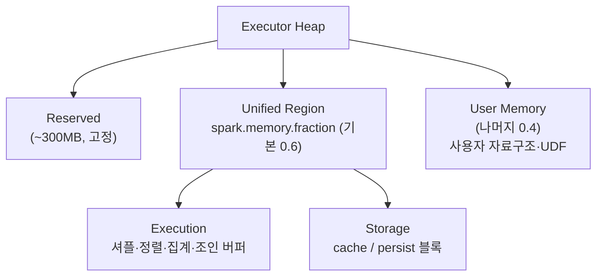
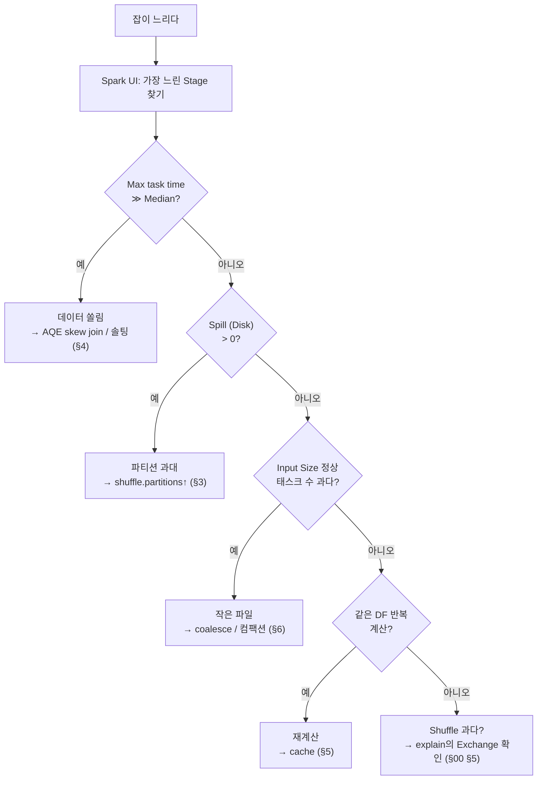

* TOC
{:toc}

## 문제 정의 — "느리다"에서 무엇을 봐야 하는가

[[/spark/00_what_is_pyspark]] §9는 느린 잡의 대응을 "`explain()`에서 `Exchange` 개수를 확인하라"로 요약했다. 그것은 시작점이지, 진단 절차 전체가 아니다. 실무에서 마주치는 상황은 이렇다.

- 어제까지 12분에 끝나던 잡이 오늘 갑자기 1시간 넘게 돈다.
- 태스크 199개는 3초 만에 끝났는데 1개가 40분째 실행 중이다.
- 데이터를 2배로 늘렸더니 실행 시간이 8배가 됐다.
- 익스큐터가 `OutOfMemoryError`로 죽고 재시도를 반복한다.

이 증상들은 원인이 서로 다르고, 조치도 다르다. 추측으로 `spark.executor.memory`를 키우거나 파티션 수를 바꾸는 것은 대부분 시간 낭비다. 정확한 순서는 **Spark UI로 병목을 특정한 뒤, 그 병목에 맞는 조치를 한다**이다. 이 글은 느린 Spark 잡을 진단하는 절차와, 가장 흔한 네 가지 병목(쏠림·spill·잘못된 파티션 사이징·불필요한 재계산)의 원인과 조치를 다룬다.

`explain()`이 실행 **전** 계획을 보여준다면, 이 글의 도구인 Spark UI는 실행 **후** 실제로 무슨 일이 일어났는지를 보여준다. 튜닝은 후자에서 시작한다.

---

## 1. Spark UI — 병목을 추측하지 않고 특정한다

Spark UI는 실행된 잡의 Job → Stage → Task 계층과 각 단계의 실측치를 보여준다(`http://<driver>:4040`, 종료 후엔 History Server). 튜닝의 첫 단계는 항상 여기서 **가장 오래 걸린 Stage**를 찾는 것이다.

병목을 특정할 때 보는 지표는 정해져 있다.

| UI 지표 | 무엇을 뜻하나 | 이상 신호 |
|---|---|---|
| Task 시간 분포 (Min/Median/Max) | 파티션 간 부하 균형 | **Max ≫ Median** → 데이터 쏠림(§4) |
| Shuffle Read / Write | 셔플로 오간 데이터량 | 스테이지 입력 대비 과도 → 불필요한 셔플 |
| Spill (Memory) / Spill (Disk) | 메모리 부족으로 디스크로 흘린 양 | 0이 아니면 → 메모리/파티션 문제(§2·§3) |
| GC Time | 태스크 시간 중 GC 비중 | 태스크 시간의 10% 초과 → 메모리 압박 |
| Input Size / Records | 스테이지가 읽은 실제 데이터 | 예상보다 크면 → pushdown·pruning 실패 |

진단의 핵심 판별식은 **Max task time과 Median task time의 비교**다.

- Max ≈ Median인데 전체가 느리다 → 균등하게 느린 것이다. 데이터가 크거나 파티션 수가 부적절하다(§3). 자원이나 파티션 사이징 문제.
- Max ≫ Median (예: median 3초, max 40분) → 특정 파티션 하나에 데이터가 몰렸다. 쏠림이다(§4). 이 경우 익스큐터를 늘려도 소용없다. 몰린 태스크 하나가 끝나야 스테이지가 끝나기 때문이다.

이 한 가지 비교가 "자원을 늘릴 문제"인지 "데이터를 재분배할 문제"인지를 가른다. 추측으로 메모리를 키우는 실수는 대부분 이 판별을 건너뛴 데서 나온다.

---

## 2. 통합 메모리 모델 — spill과 OOM의 근원

메모리 관련 증상(spill, OOM)을 이해하려면 익스큐터 힙이 어떻게 나뉘는지를 알아야 한다. Spark는 1.6부터 **통합 메모리 관리(Unified Memory Management)** 를 쓴다.

익스큐터 힙은 대략 이렇게 나뉜다.



- **Reserved (~300MB)** — 시스템 예약. 건드릴 수 없다.
- **User Memory (기본 0.4)** — 사용자 코드가 만든 객체, UDF 내부 자료구조 등.
- **Unified Region (`spark.memory.fraction`, 기본 0.6)** — Spark가 연산과 캐시에 쓰는 영역. 이 안에서 다시 둘로 나뉜다.
  - **Execution** — 셔플·정렬·집계·조인의 중간 버퍼. 태스크가 계산 중에 쓴다.
  - **Storage** — `cache()`/`persist()`한 블록.

두 영역의 관계에 비대칭 규칙이 있다. 이것이 실무에서 중요하다.

- Execution과 Storage는 서로 남는 공간을 빌려 쓴다.
- **Execution이 메모리를 요구하면 Storage를 밀어낼(evict) 수 있다.** 캐시한 블록이 쫓겨나 재계산될 수 있다는 뜻이다.
- 반대로 **Storage는 Execution을 밀어낼 수 없다.** `spark.memory.storageFraction`(기본 0.5)이 Storage가 최소한 보장받는 크기다.

즉 연산이 우선이고 캐시는 양보한다. 캐시를 많이 잡아도 정작 셔플·조인이 메모리를 필요로 하면 캐시가 사라진다. "캐시했는데 왜 다시 계산되지?"의 흔한 원인이 이 eviction이다.

Execution 메모리가 부족하면 잡이 즉시 죽는 게 아니라 **디스크로 흘러넘친다(spill)**. spill은 정확성엔 문제없지만 디스크 I/O로 크게 느려진다. spill로도 감당 안 되거나 User Memory가 폭발하면 그때 OOM으로 종료된다.

---

## 3. Spill — 파티션이 익스큐터 메모리보다 클 때

spill의 직접 원인은 **한 태스크가 처리하는 파티션이 execution 메모리에 담기지 않는 것**이다. 태스크는 파티션 하나를 담당하므로(§00 §2), 파티션이 크면 그 태스크의 execution 버퍼가 넘친다.

파티션이 커지는 경로는 둘이다.

1. **입력 파티션이 큼** — 읽어들이는 파일 블록이 크다. `spark.sql.files.maxPartitionBytes`(기본 128MB)가 파일 기반 소스의 입력 파티션 목표 크기를 정한다.
2. **셔플 후 파티션이 큼** — `spark.sql.shuffle.partitions`(기본 200)가 너무 작아 셔플 결과가 소수의 큰 파티션으로 뭉친다.

조치는 파티션을 execution 메모리에 맞게 잘게 나누는 것이다.

```python
# 셔플 후 파티션을 늘려 파티션당 데이터를 줄인다
spark.conf.set("spark.sql.shuffle.partitions", "800")   # 데이터 규모에 맞춰
```

파티션 크기의 실무 목표는 대략 **128MB~200MB 수준**이 흔히 쓰이는 경험칙이다(정답은 아니며, 익스큐터 코어당 메모리에 따라 조정한다). 이보다 크면 spill·OOM 위험이 크고, 너무 작으면 태스크 스케줄링 오버헤드가 연산을 압도한다(§00 §5).

Spark 3.x의 AQE는 셔플 후 작은 파티션을 자동 병합하므로 `shuffle.partitions`를 크게 잡아도 파편화는 자동 보정된다(§00 §5). 따라서 **이 값은 넉넉히 크게 두고 spill이 사라지는지 UI에서 확인하는 방향**이 안전하다. 반대로 spill이 보이는데 이 값이 작다면, 늘리는 것이 첫 조치다.

<div class="callout-warning">
spill을 "메모리를 늘리면 해결"이라고만 접근하면 비용만 커지고 근본 원인(파티션 사이징·쏠림)은 남는다. UI에서 <strong>Spill (Disk)</strong>이 큰 스테이지를 먼저 찾고, 그 스테이지의 파티션 수와 Max task time을 함께 본다. spill + Max≫Median이면 메모리가 아니라 쏠림 문제다(§4).
</div>

---

## 4. 데이터 쏠림(skew) — 한 파티션에 몰릴 때

쏠림은 특정 키에 데이터가 불균등하게 집중돼, 그 키를 맡은 파티션(태스크) 하나만 오래 실행되는 현상이다. UI에서 **Max task time ≫ Median**으로 나타난다(§1). 익스큐터를 늘려도 소용없다. 스테이지는 가장 느린 태스크가 끝나야 완료되기 때문이다.

전형적 원인은 조인·groupBy의 키가 편향된 경우다. 예를 들어 `user_id`로 집계하는데 전체 트래픽의 40%가 게스트 계정 하나(`user_id = "guest"`)에 몰려 있으면, 그 키의 파티션 하나가 나머지를 합친 것보다 커진다.

### 조치 1 — AQE skew join (먼저 시도)

Spark 3.x는 AQE의 skew join 처리(`spark.sql.adaptive.skewJoin.enabled`, 기본 true)로 실행 중에 큰 파티션을 감지해 여러 개로 쪼갠다. 조인 쏠림은 이것만으로 해소되는 경우가 많으므로, AQE가 켜져 있는지부터 확인한다.

### 조치 2 — 솔팅(salting), AQE로 안 될 때

집계 쏠림이나 AQE가 못 잡는 경우, 편향 키에 인위적 접미사(salt)를 붙여 여러 파티션으로 강제 분산한 뒤, 부분 집계를 다시 합친다.

```python
from pyspark.sql import functions as F

SALT_N = 16   # 편향 키를 16개 버킷으로 분산

# 1) 키에 0~15 난수 salt를 붙여 groupBy → 쏠린 키가 16개 파티션으로 분산됨
partial = (
    events
    .withColumn("salt", (F.rand() * SALT_N).cast("int"))
    .groupBy("user_id", "salt")
    .agg(F.sum("amount").alias("partial_amount"))
)

# 2) salt를 떼고 부분 집계를 재합산 → 최종 결과
result = (
    partial
    .groupBy("user_id")
    .agg(F.sum("partial_amount").alias("amount"))
)
```

1단계 groupBy가 편향 키를 16개로 쪼개 병렬 처리하고, 2단계가 16개 부분합을 하나로 합친다. 2단계는 키당 최대 16행만 다루므로 쏠리지 않는다. 이 기법은 집계가 결합 가능(associative)할 때만 성립한다(§01 §2). `sum`·`count`는 되지만 정확한 median은 이렇게 쪼갤 수 없다.

<div class="callout-note">
솔팅은 공짜가 아니다. salt 수만큼 중간 데이터가 늘고 2단계 셔플이 추가된다. 따라서 <strong>쏠림이 실제로 병목일 때만</strong>(UI에서 Max≫Median 확인) 적용한다. 쏠림이 없는데 솔팅하면 오히려 느려진다. AQE skew join이 해결하면 솔팅은 불필요하다.
</div>

---

## 5. 캐싱 — 재사용될 때만 이득

캐싱은 계산 결과를 메모리(또는 디스크)에 고정해 재계산을 피하는 기법이다. Spark는 지연 실행이므로, 같은 DataFrame을 여러 action에서 쓰면 **매번 처음부터 다시 계산한다**(§00 §2). 이 재계산이 병목이면 캐싱이 답이다.

```python
filtered = orders.filter(F.col("status") == "completed")
filtered.cache()          # 첫 action에서 계산·저장, 이후 재사용

a = filtered.groupBy("tier").count()          # 여기서 계산되며 캐시됨
b = filtered.groupBy("region").sum("amount")  # 캐시에서 재사용 (재계산 없음)
```

`cache()`는 `persist(StorageLevel.MEMORY_AND_DISK)`의 축약이다(DataFrame 기본). 메모리에 안 들어가면 디스크로 넘겨 저장한다.

캐싱은 만능이 아니며, 오용하면 오히려 해롭다.

- **한 번만 쓰는 DataFrame을 캐시하면 손해다.** 저장 비용만 들고 재사용 이득이 없다. 캐싱은 **2회 이상 재사용**될 때만 이득이다.
- 캐시가 §2의 Storage 영역을 차지하므로, 과도한 캐시는 Execution 메모리를 압박해 spill을 유발한다. 또한 Execution이 필요로 하면 캐시가 evict돼 결국 재계산된다.
- 다 쓴 캐시는 `unpersist()`로 명시적으로 해제해야 메모리가 회수된다.

<div class="callout-tip">
캐싱 판단 기준은 단순하다. <strong>"이 DataFrame이 이후 두 번 이상 쓰이고, 그 재계산이 무거운가?"</strong> 둘 다 예일 때만 캐시한다. 반복 <code>count()</code>로 디버깅할 때(§00 §9)나, 하나의 정제 결과를 여러 갈래 집계로 쓸 때가 대표적 대상이다.
</div>

---

## 6. 입력 파티션과 작은 파일 — 읽기 단계의 병목

병목이 항상 셔플에 있는 것은 아니다. 읽기 단계 자체가 느린 경우가 있고, 원인은 대개 **작은 파일 문제**다.

Spark는 파일 기반 소스를 읽을 때 파일들을 `spark.sql.files.maxPartitionBytes`(기본 128MB) 목표로 파티션에 묶는다. 그런데 이전 잡이 파티션을 과도하게 쪼개 저장했거나 스트리밍이 잦은 트리거로 작은 파일을 양산하면(§01 §9), 수만 개의 작은 파일이 생긴다. 이때 파일 하나당 열기·메타데이터 처리 오버헤드가 실제 데이터 읽기보다 커진다.

조치는 두 방향이다.

1. **쓰기 시점에 파일 수를 조절한다.** 출력 직전 `coalesce`(줄이기, 셔플 없음) 또는 `repartition`(균등 재분배, 셔플 있음)으로 파티션 수를 데이터 규모에 맞춘다(§00 §5).

```python
# 출력 파일이 과도하게 잘게 쪼개지지 않도록
(mart
  .repartition("order_date")     # 날짜별로 묶어 파일 수 제어
  .write.partitionBy("order_date")
  .parquet("gs://.../mart/"))
```

2. **테이블 포맷으로 컴팩션을 자동화한다.** Iceberg·Delta 같은 포맷은 작은 파일을 주기적으로 병합하는 컴팩션 연산을 제공한다. 스트리밍 sink처럼 작은 파일이 계속 쌓이는 경우 근본 대책이다.

읽기가 느릴 때는 UI의 첫 스테이지 **Input Size와 태스크 수**를 본다. Input Size는 작은데 태스크가 수만 개면 작은 파일 문제이고, Input Size가 예상보다 크면 pushdown·pruning이 안 먹은 것이다(§00 §4).

---

## 7. 실전 진단 흐름

앞 절들을 하나의 절차로 묶는다. 느린 잡을 만나면 순서대로 좁혀 간다.



이 흐름의 핵심은 **원인을 먼저 특정하고 그에 맞는 단 하나의 조치를 하는 것**이다. 쏠림에 메모리를 늘리거나, spill에 캐시를 걸거나, 작은 파일 문제에 셔플 파티션을 만지는 것은 모두 원인과 조치가 어긋난 사례다. UI가 원인을 가리키고, 조치는 그 원인에만 대응한다.

---

## 8. 흔한 실패와 한계

- **UI를 보지 않고 튜닝** — 가장 흔한 실패다. 증상만 보고 `executor.memory`·`executor.cores`를 키우면, 쏠림·작은 파일처럼 자원과 무관한 병목은 그대로 남고 비용만 는다. 진단이 조치보다 먼저다.
- **과도한 캐싱** — "혹시 몰라" 캐시하면 Storage가 Execution을 압박해 spill을 유발한다(§2·§5). 재사용 없는 캐시는 순수 손해다.
- **`spark.sql.shuffle.partitions`를 한 값으로 고정** — 데이터 규모가 잡마다 다른데 전역 고정하면, 작은 잡엔 과대·큰 잡엔 과소가 된다. AQE 자동 병합에 맡기고, 넉넉히 크게 두는 편이 낫다.
- **모든 조인에 `broadcast` 강제** — 큰 테이블을 broadcast하면 드라이버·익스큐터 메모리를 넘겨 OOM이 난다. broadcast는 임계값(기본 10MB) 이하 작은 테이블에만 쓴다(§00 §6).
- **AQE를 끄고 수동 튜닝** — Spark 3.x에서 AQE는 셔플 병합·skew join·조인 전략 전환을 실행 중에 자동 수행한다. 특별한 이유 없이 끄면 이 자동 최적화를 모두 잃는다. 대부분의 경우 AQE를 켜 두고 그 위에서 튜닝하는 것이 맞다.

가장 중요한 한계는 튜닝으로 풀리지 않는 문제가 있다는 점이다.

<div class="callout-note">
파티션·메모리·캐시 튜닝은 <strong>실행 방식</strong>을 개선할 뿐, 잘못된 <strong>데이터 모델</strong>이나 과한 요구를 되돌리지 못한다. 매번 8억 행 전체를 스캔하는 구조라면, 튜닝보다 증분 처리(§01)나 파티셔닝된 저장 레이아웃(§00 §7)으로 <strong>읽는 데이터 자체를 줄이는</strong> 설계 변경이 답이다. 튜닝은 올바른 설계 위에서만 효과가 크다.
</div>

---

## 정리

Spark 튜닝은 설정값을 바꾸는 기술이 아니라, **증상에서 원인을 특정하고 그 원인에만 대응하는 진단 절차**다. Spark UI가 원인을 가리킨다.

| 증상 (Spark UI) | 원인 | 조치 |
|---|---|---|
| Max task time ≫ Median | 데이터 쏠림 | AQE skew join → 솔팅 (§4) |
| Spill (Disk) > 0 | 파티션이 execution 메모리 초과 | `shuffle.partitions`↑, 파티션 사이징 (§3) |
| GC Time이 태스크의 10%↑ | 메모리 압박 | 캐시 축소·파티션 축소, User Memory 점검 (§2) |
| 태스크 수 과다, Input Size 작음 | 작은 파일 | `coalesce`·컴팩션 (§6) |
| 같은 DF 반복 계산 | 재계산 | `cache()` (재사용 2회↑일 때만) (§5) |
| Input Size가 예상보다 큼 | pushdown·pruning 실패 | `explain()`으로 PushedFilters 확인 (§00 §4) |
| Exchange 과다 | 불필요한 셔플 | `distinct`·`orderBy` 남용 제거, broadcast (§00 §5·§6) |

이 표의 왼쪽(증상)에서 오른쪽(조치)으로 가는 유일한 경로가 가운데(원인)이며, 그 원인은 추측이 아니라 UI 실측으로 특정한다. 이것이 "설정을 바꿔 본다"와 "튜닝한다"의 차이다.

---

## 참고

- [[/spark/00_what_is_pyspark]] — 이 글의 전제. Driver/Executor·파티션·셔플·Catalyst·AQE의 기본 개념 위에서 튜닝이 이뤄진다.
- [[/spark/01_structured_streaming]] — 스트리밍의 튜닝은 상태(state) 크기 관리가 중심이며, 이 글의 파티션·메모리 원리를 공유한다.
- Apache Spark, [*Performance Tuning*](https://spark.apache.org/docs/latest/sql-performance-tuning.html) — 셔플 파티션·broadcast·AQE·skew join 공식 설정
- Apache Spark, [*Web UI*](https://spark.apache.org/docs/latest/web-ui.html) — Job/Stage/Task 지표, spill·shuffle·GC 읽는 법
- Apache Spark, [*Tuning Spark*](https://spark.apache.org/docs/latest/tuning.html) — 메모리 관리·직렬화·데이터 지역성
