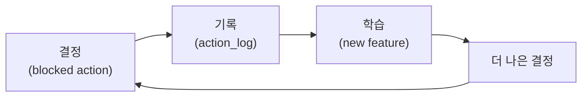

> [[/data-architect/04_what_is_ontology]] 는 온톨로지가 "프로젝트가 아니라 인프라로 취급될 때만 살아있다"고 §8에서 못 박았고, [[/data-architect/05_how_to_implement_ontology]] 는 그 인프라를 K씨 사건 하나로 끝까지 지었다. 그런데 04는 실패 모드를 *목록*으로 던졌고, 05는 한계를 에필로그 직전에 *고백*했다. 이 글은 그 흩어진 경고들을 개념별 **안티패턴 ↔ 베스트 프랙티스** 쌍으로 다시 줄 세운다. 잘 지은 온톨로지가 어느 지점에서 조용히 거짓말이 되는지를 보는 도감이다.

---

## 도입 — 잘 만든 거짓말

K씨 알람은 2만 원짜리 사건이었지만, 그 밑에는 "잘 만든 거짓말"이 깔려 있었다. `last_purchase_at = 2024-09-15`은 *문법적으로 완벽한* 피처였다. SQL은 에러 없이 돌았고, 값은 타입이 맞았고, 대시보드는 깔끔했다. 틀린 건 코드가 아니라 그 코드가 본 K씨였다.

온톨로지의 안티패턴은 거의 다 이 모양이다. 컴파일 에러로 죽지 않는다. *동작은 하는데 의미가 어제와 다른 세계를 가리키는* 상태로 천천히 썩는다. 그래서 진단이 어렵다 — 빨간불이 안 들어온다.

04~06이 "온톨로지가 무엇이고, 어떻게 짓고, 어떻게 형식화되는가"를 답했다면, 07은 한 가지만 답한다. **그래서 어떻게 망가지고, 어떻게 살려두는가.** 안티패턴은 거의 전부 "한 번 잘 만들고 방치"의 변주다.

> 온톨로지는 만들 때가 아니라 방치할 때 죽는다.

아래 여섯 개 축 — 엔티티·관계·표준·시제·거버넌스·메타 — 마다 왼쪽에 안티패턴, 오른쪽에 베스트 프랙티스를 나란히 둔다. 좌우 순서는 끝까지 바뀌지 않는다. 위치로 패턴을 외우라는 뜻이다.

---

## 1. 엔티티와 동일성 — 가장 지루한 곳에서 가장 자주 죽는다

> [[/data-architect/04_what_is_ontology]] §5는 "가장 지루하고 가장 중요한 것"으로 동일성(identity)을 꼽았고, 05편은 한계에서 "Identity resolution은 끝나지 않는다"고 적었다. 이 둘을 본격적으로 펼친다.

### 안티패턴 — 동일성을 일회성 배치로 끝냈다고 믿기

05편은 K씨의 `U-29182`(CRM)와 `M-00991`(POS)을 이메일 정규화 매칭으로 `CUST-029182` 하나에 묶었다. `match_rule='seed'`, `match_rule='email_exact'`, `confidence=1.0`. 깔끔하게 닫혔다 — *그날까지는*.

문제는 동일성이 *흐른다*는 것이다. 게스트 주문, 전화번호만 바뀐 회원, 이메일 없는 POS 회원이 매주 새로 쌓인다. 시드 배치를 한 번 돌리고 파이프라인을 멈추면, 이 신규 분리분은 영원히 따로 집계된다.

### 베스트 프랙티스 — 동일성을 영구 운영으로 선언하기

해법은 더 똑똑한 매칭 규칙이 아니라, entity resolution을 *끝나는 작업이 아니라 멈추지 않는 운영*으로 선언하는 것이다. confidence를 구간으로 쪼개 자동 병합 / 휴먼 리뷰 큐 / 보류로 분기하고, 같은 사람이 둘로 세어지는 N:1 위반을 상시 모니터링한다.

<div class="compare-grid">
<div class="compare-col" markdown="1">

**안티패턴 — 동일성을 한 번 묶고 끝**

```sql
-- match_rule='seed'만 있고 재해소 파이프라인 없음
SELECT ci.canonical_id, COUNT(*) AS orders
FROM `marketeon.ontology.links` l
JOIN `marketeon.ontology.customer_identity` ci
  ON ci.canonical_id = l.source_id
WHERE l.rel_type = 'placed'
GROUP BY ci.canonical_id;
-- 게스트 주문·전화 변경분은 분리된 채 집계에서 누락
```

집계가 *동작은 하지만* 같은 사람을 여럿으로 센다.

</div>
<div class="compare-col" markdown="1">

**베스트 프랙티스 — 동일성을 영구 운영으로**

```sql
-- confidence 구간으로 분기 + 재해소 상시 가동
SELECT ci.canonical_id, COUNT(*) AS orders
FROM `marketeon.ontology.links` l
JOIN `marketeon.ontology.customer_identity` ci
  ON ci.canonical_id = l.source_id
WHERE l.rel_type = 'placed'
  AND ci.confidence >= 0.9     -- 자동 병합 구간만
GROUP BY ci.canonical_id;
-- 0.7~0.9는 휴먼 리뷰 큐, <0.7은 보류
```

entity resolution을 *멈추지 않는 운영*으로 선언한다.

</div>
</div>

같은 canonical_id 하나에 두 source_id가 충돌 없이 붙는지(N:1), 매주 쌓이는 `confidence < 0.9` 매핑이 처리되는지를 데이터 계약(data contract)과 DQ 게이트로 잠근다. 05편의 한 문장이 여기서 규칙이 된다.

> 온톨로지를 도입한다는 건 entity resolution을 영원히 운영하겠다는 선언이다.

---

## 2. 관계 — 외래키 사고로 링크를 모델링하기

> 05편은 구매를 `last_purchase_at` *컬럼*으로 박았다가 채널 하나가 늘 때마다 무너졌다. [[/data-architect/06_ontology_core_concepts]] 는 그 위에서 `P31`(is a)과 `P279`(is a kind of)의 경계를 못 박았다. 관계를 외래키처럼 다루는 순간 두 가지가 동시에 깨진다.

### 안티패턴 — 관계를 이벤트로, is-a를 instance-of로 뭉개기

05편의 원죄가 여기 있다. "마지막 구매"를 *관계*가 아니라 `crm.orders` 위의 `MAX(order_date)` 컬럼으로 박으니, POS라는 새 채널은 조인 바깥에 남아 통째로 누락됐다. 관계를 컬럼으로 치환하면 채널이 늘 때마다 피처 로직을 손대야 한다.

06편이 짚은 두 번째 함정은 *추론*에서 터진다. `P31`(instance of)은 transitive가 아닌데 `P279`(subclass of)처럼 타고 올라가면, Angela Merkel을 politician을 거쳐 "profession의 instance"로 만든다 — 사람을 직업으로 바꾸는 추론 오류다.

### 베스트 프랙티스 — 관계를 일급 시민으로, 의미와 방향을 함께 적기

05편의 처방은 `links` 테이블이었다. 구매를 `rel_type='placed'` 링크로 표현하면, 새 채널은 *링크 행을 추가*할 뿐 계산 로직을 건드리지 않는다. 관계가 컬럼이 아니라 일급 시민(first-class citizen)이 되는 순간 확장은 데이터 작업이 된다.

<div class="compare-grid">
<div class="compare-col" markdown="1">

**안티패턴 — 구매를 컬럼으로 박기**

```sql
-- 채널마다 다시 짜야 하는 피처
SELECT MAX(order_date) AS last_purchase_at
FROM `marketeon.crm.orders`
WHERE user_id = 'U-29182';
-- POS 주문은 이 조인 바깥 → 누락
```

새 채널 = 쿼리 수정. 의미가 SQL에 묻힌다.

</div>
<div class="compare-col" markdown="1">

**베스트 프랙티스 — 구매를 링크로**

```sql
-- 채널 무관, links 행만 추가
SELECT MAX(o.completed_at) AS last_purchase_at
FROM `marketeon.ontology.links` l
JOIN `marketeon.ontology.orders` o
  ON o.canonical_id = l.target_id
WHERE l.source_id = 'CUST-029182'
  AND l.rel_type = 'placed' AND l.valid_to IS NULL;
```

새 채널 = 링크 추가. 계산 로직 불변.

</div>
</div>

관계 *타입*을 검증할 때는 06편의 언어 테스트를 쓴다. "x **is a** C"면 `P31`(instance), "A **is a kind of** B"면 `P279`(subclass). 그리고 그 관계가 다음 엔티티로 순회되는 object property인지, 값에서 끝나는 datatype property인지를 스키마에 강제한다 — 06편이 실선/점선으로 갈랐던 그 구분이다.

<div class="callout-warning">
함정: <code>P31</code>은 transitive가 <strong>아니다</strong>. 추론 경로는 <code>P31/P279*</code>(instance 한 번 + subclass 여러 번)이지 <code>P31*</code>이 아니다. <code>P31*</code>로 타면 "politician의 instance인 사람"을 "profession의 instance"로 추론해 <strong>사람을 직업으로 만든다</strong>. 외래키는 카디널리티는 강제해도 이 의미 위반은 잡지 못한다.
</div>

---

## 3. 표준 스택 — 도구를 문제보다 먼저 고르기

> [[/data-architect/04_what_is_ontology]] 는 시맨틱 웹 실패의 세 원인(OWA·형식화 비용·강제력 부재)을 짚었고, 06편은 "도구가 아니라 문제가 정당화한다"로 닫았다. 스택 선택의 안티패턴은 거의 다 이 순서를 뒤집는 데서 나온다.

### 안티패턴 — 과형식화, RDF/OWL의 실패를 반복하기

04편 §8이 "과형식화(over-formalization)"라 부른 실패. 아무도 쓰지 않을 정교한 분류 체계를 짓고, 폐쇄적·규범적 데이터에 OWA 스택을 끌어온다. 시맨틱 웹이 죽은 자리를 조직 안에서 축소 재현하는 셈이다.

증상은 *세계 가정 불일치*로 드러난다. OWA 데이터에 CWA 쿼리(부재=거짓)를 들이대거나, 그 반대를 한다. 06편의 예: Wikidata에서 `FILTER NOT EXISTS { ?p wdt:P26 ?x }`로 "배우자 없는 사람"을 뽑으면 *미혼*이 아니라 *배우자가 입력 안 된 사람*이 나온다.

### 베스트 프랙티스 — 세계 가정에 맞는 스택

06편 결론을 그대로 가져온다. 같은 다섯 개념인데 세계 가정에 따라 정답 스택이 정반대다. 핵심 진단 질문은 하나로 압축된다 — **"내 식별자가 조직 밖에서 의미가 있는가?"**

| 신호 | 세계 가정 | 정답 스택 | 식별자 |
|------|-----------|-----------|--------|
| 외부 연합·공개 vocabulary 재사용 필요 | OWA | RDF / SPARQL | 전역 IRI |
| 조직 경계 내·결정론·디버깅 우선 | CWA | SQL | org-local id |

마켓온의 `CUST-029182`는 조직 밖에서 의미가 없다. 그래서 전역 IRI도, triple store도, SPARQL도 마켓온에는 *과잉*이다 — org-local id와 SQL이 본질이다. 반대로 Wikidata의 `Q42`는 전 세계가 재사용하므로 RDF가 본질이다.

<div class="callout-note">
도구가 아니라 문제가 정당화한다. 진단 질문 — "내 식별자가 조직 밖에서 의미가 있는가?" 답이 <strong>No</strong>면 org-local id + SQL이 정답이고, RDF/OWL 스택은 04편이 경고한 형식화 비용만 떠안는다. "할 수 있다"와 "해야 한다"는 다르다.
</div>

---

## 4. 시제 — 과거와 오류를 같은 서랍에 넣기

> 06편 축4는 rank를 preferred / normal / deprecated로 갈랐고, 05편 Property Definition은 "의미의 SCD2"를 `prop_def`로 실체화했다. 시간을 다루는 안티패턴은 *과거였던 것*과 *틀린 것*을 같은 서랍에 넣는 데서 시작한다.

### 안티패턴 — 정의 변경을 덮어쓰기 / 오래된 값을 deprecated로 지우기

가장 흔한 죽음. "마지막 구매"의 정의가 웹 기준에서 전채널 기준으로 바뀌었을 때, `prop_def`를 `UPDATE`로 *덮어쓴다*. SQL 한 줄이 조용히 바뀌고 — 04편 §6이 경고한 그대로 — 3개월 전 리포트를 그대로 재현할 길이 사라진다. 어제의 0.87과 오늘의 0.12 중 무엇이 맞는지 아무도 증명하지 못한다.

쌍둥이 함정은 06편의 것이다. *오래된 값*을 deprecated로 표시하는 것. deprecated는 "틀린 값" 전용인데 여기에 "과거였지만 참이었던 값"을 섞으면, 역사를 오류로 지운다.

### 베스트 프랙티스 — 의미의 SCD2

05편의 `prop_def`가 답이다. 정의를 `UPDATE`로 덮지 않고 `valid_from`/`valid_to`로 *둘 다 보존*한다. 인시던트 전 정의와 후 정의가 나란히 살아 있고, `change_note`에 인시던트 번호가 박힌다. 그러면 "as-of" 재현 — *그 시점의 정의로 그 시점의 값을* — 이 쿼리 하나로 가능해진다.

<div class="compare-grid">
<div class="compare-col" markdown="1">

**안티패턴 — 정의를 덮어쓰기**

```sql
-- 과거 정의가 사라진다
UPDATE `marketeon.ontology.prop_def`
SET description = '전채널 기준 마지막 구매',
    computation = 'MAX(orders.completed_at) ...'
WHERE prop_name = 'last_purchase_at'
  AND entity_type = 'customer';
-- 인시던트 전날의 정의는 영원히 복구 불가
```

3개월 전 리포트를 재현할 수 없다.

</div>
<div class="compare-col" markdown="1">

**베스트 프랙티스 — as-of 재현**

```sql
-- 그 시점에 유효했던 정의를 그대로 소환
SELECT description, change_note
FROM `marketeon.ontology.prop_def`
WHERE prop_name = 'last_purchase_at'
  AND entity_type = 'customer'
  AND valid_from <= TIMESTAMP '2024-12-09'
  AND (valid_to IS NULL
       OR valid_to > TIMESTAMP '2024-12-09');
-- 'CRM(웹/앱) 기준 ... 오프라인 채널 제외.'
```

과거와 현재의 정의가 둘 다 살아 있다.

</div>
</div>

<div class="callout-warning">
오래된 값은 deprecated가 아니다. deprecated는 *틀린 값* 전용이고, "과거였지만 참이었던 값"은 <strong>normal + 시점(P585 / valid_from)</strong>으로 표시한다. 06편이 "<code>valid_to IS NULL</code>은 CWA가 아니라 현재 유효 레코드 선택 술어일 뿐"이라 한 것과 같은 논리다 — 과거임(normal)과 틀림(deprecated)은 다른 차원이다. 섞으면 역사를 오류로 지운다.
</div>

---

## 5. 동사와 거버넌스 — 행위를 코드에 묻어두기

> 05편의 Action(Kinetic Layer)은 쿠폰 발송을 `action_def`의 precondition 게이트로 끌어냈고, [[/data-architect/04_what_is_ontology]] §6은 "의미의 거버넌스"를 말했다. 동사를 다루는 안티패턴은 행위를 코드 깊숙이 묻어 *누구도 데이터로 볼 수 없게* 만드는 것이다.

### 안티패턴 — 액션을 if문에 숨기고, 정의 합의를 스키마로 대체하려 하기

05편 K씨 사건의 세 번째 부재가 이것이다. 쿠폰 발송 조건이 CS 자동화 코드의 `if`문 안에 묻혀 있었고, "이 고객에게 지금 쿠폰을 보내도 되는가"를 데이터로 물을 수 없었다. 허용된 행위의 범위가 애플리케이션 로직에 갇히면, 에이전트는 존재하지 않는 동사를 환각하고 감사(audit)는 불가능해진다.

쌍둥이 오해는 반대 방향이다 — *스키마만 만들면 합의가 된다*는 착각. 05편 한계가 분명히 했다. `prop_def`에 정의를 등록하는 데는 하루, 마케팅·재무·데이터팀이 "전채널 기준"에 동의하는 데는 두 달이 걸렸다.

### 베스트 프랙티스 — 동사를 데이터로, 허용 주체·전제조건을 노출하기

05편 처방은 `action_def`다. 허용 주체(`allowed_callers`)와 전제조건(`preconditions` JSON)을 데이터로 노출하고, 모든 시도를 `action_log`에 남긴다. 그러면 에이전트는 *허용된 동사만* 보게 되어 환각이 구조적으로 막히고, 차단된 시도조차 사라지지 않는다.

<div class="compare-grid">
<div class="compare-col" markdown="1">

**안티패턴 — 조건을 if문에 묻기**

```text
# CS 자동화 코드 (의사코드)
if churn_score > 0.85:
    issue_coupon(user_id)   # 게이트 없음
# - 허용 주체? 코드에만 있음
# - 발송 조건? 코드에만 있음
# - 차단 기록? 남지 않음
```

누구도 "허용된 동사"를 데이터로 조회할 수 없다.

</div>
<div class="compare-col" markdown="1">

**베스트 프랙티스 — 동사를 데이터로**

```sql
-- 허용 주체·전제조건을 데이터에서 읽는다
SELECT action_name, allowed_callers, preconditions
FROM `marketeon.ontology.action_def`
WHERE target_entity_type = 'customer'
  AND 'agent:recommendation' IN UNNEST(allowed_callers)
  AND valid_to IS NULL;
-- 모든 시도는 action_log에 status/block_reason 기록
```

허용된 동사만 보이고, 환각이 구조적으로 막힌다.

</div>
</div>

<div class="callout-note">
스키마는 합의를 <em>담는 그릇</em>일 뿐, 합의를 <em>만들어내지</em> 않는다. <code>action_def</code>에 정의를 등록하는 건 하루, "전채널 기준"에 조직이 동의하는 건 두 달이다. 거버넌스는 기술이 아니라 합의 절차다 — 스키마는 그 합의를 기록하고 노출할 뿐이다.
</div>

---

## 6. 메타 안티패턴 — 온톨로지를 프로젝트로 취급하기

> [[/data-architect/04_what_is_ontology]] §8의 최상위 실패 모드. 앞의 다섯 축이 *무엇을* 틀리는가였다면, 이 축은 *왜* 틀리는가다 — 온톨로지를 한 번 끝내는 프로젝트로 보는 순간 다섯 축이 동시에 썩는다.

### 안티패턴 — 한 번 멋지게 모델링하고 라이브 메타데이터에서 분리

가장 흔한 메타 실패. 온톨로지를 한 번 우아하게 모델링한 뒤 라이브 메타데이터에서 떼어 놓는 것. 신규 사업, 인수, 폐기된 테이블을 온톨로지가 모르면, 04편 §8의 표현대로 "더 이상 존재하지 않는 비즈니스"를 계속 모델링하게 된다.

두 변종이 따라붙는다. **boil the ocean** — 첫 가치를 내기도 전에 7개 도메인을 한 번에 형식화하려다 좌초하는 것. 그리고 **불필요한 도입** — 작고 단일 팀이 쓰는 데이터에 온톨로지를 얹는 것. 04편이 분명히 했듯, 모든 데이터가 온톨로지를 필요로 하지는 않는다.

### 베스트 프랙티스 — 인프라로 취급

규칙은 04편 §8의 재진술이다. **작게 시작하고, 라이브 메타데이터에 묶고, 코드로 버전 관리하며 키운다.** 온톨로지가 살아 있다는 증거는 모델의 우아함이 아니라, 05편이 보여준 Dynamic Loop가 *실제로 도는가*다 — 내려진 결정이 기록되고, 그 기록이 학습되어, 더 나은 결정으로 되먹임되는 순환.



05편에서 K씨의 `blocked` 기록이 `action_log`에 쌓이고, 847명의 같은 패턴이 채널 전환 신호라는 새 피처가 되고, 모델이 그들을 이탈이 아닌 전환으로 재분류한 그 순환이 바로 이 루프다. 이 루프가 도는 한 온톨로지는 살아 있고, 멈추는 순간 "어제의 세계"를 모델링하는 박제가 된다.

---

## 마무리 — 살아있는 모델

여섯 축을 한 표로 겹친다. 진단 질문은 모두 *답이 'No'면 당신의 온톨로지는 그 줄의 안티패턴에 있다*.

| 개념 | 안티패턴 | 베스트 프랙티스 | 진단 질문 |
|------|----------|------------------|-----------|
| 엔티티·동일성 | 일회성 배치로 끝 | confidence 구간 + 영구 재해소 | "지난주 신규 게스트 주문이 기존 고객에 병합됐는가?" |
| 관계 | 컬럼·is-a 혼동 | links 일급 시민 + 언어 테스트 | "새 채널 추가에 계산 로직 수정이 *불필요*한가?" |
| 표준 스택 | 과형식화·세계가정 불일치 | 문제가 도구를 정한다 | "내 식별자가 조직 밖에서도 의미가 있는가? (없으면 SQL이 정답)" |
| 시제 | 정의 덮어쓰기·과거=오류 | 의미의 SCD2(valid_from/to) | "3개월 전 리포트를 그 시점 정의로 재현할 수 있는가?" |
| 동사·거버넌스 | if문에 묻은 행위 | action_def + action_log 노출 | "허용된 동사 목록을 데이터로 조회할 수 있는가?" |

다섯 줄의 진단 질문에 모두 "예"라 답할 수 있다면, 당신의 온톨로지는 살아 있다.

<div class="callout-tip">
안티패턴은 거의 전부 한 문장으로 환원된다 — <strong>한 번 잘 만들고 방치</strong>. 처방도 한 문장이다. 동일성은 영구 운영으로, 관계는 일급 시민으로, 스택은 문제가 정하게, 정의는 SCD2로, 동사는 데이터로, 그리고 전체를 프로젝트가 아니라 인프라로.
</div>

> 좋은 온톨로지와 나쁜 온톨로지를 가르는 건 모델의 정교함이 아니라, 그것이 어제와 다른 세계를 아직도 아는가이다.

06편 말미가 던진 다음 주제가 여기서 더 무거워진다 — **온톨로지 정렬(alignment)과 연합**. 마켓온의 `CUST-029182`(폐쇄·CWA)와 Wikidata의 `Q42`(개방·OWA)를 잇는 순간, 두 세계 가정이 충돌한다. 살아 있는 온톨로지 둘을 연결할 때 무엇이 깨지는가 — 그것이 다음 글의 자리다.

---

## 참고

- [[/data-architect/04_what_is_ontology]] — 실패 모드 §8(프로젝트 취급·boil the ocean·과형식화·불필요한 도입), 동일성 §5, 의미의 거버넌스 §6
- [[/data-architect/05_how_to_implement_ontology]] — 마켓온 K씨 사건, 다섯 개념의 폐쇄형 구현, 한계 4가지, Dynamic Loop
- [[/data-architect/06_ontology_core_concepts]] — `P31`/`P279`와 `P31/P279*` 추론 경로, rank(preferred/normal/deprecated), OWA/CWA 함정
- Palantir, [*Foundry Ontology*](https://www.palantir.com/docs/foundry/ontology/overview/) — Semantic·Kinetic·Dynamic 3계층, 온톨로지를 인프라로 운영하는 모델
- Wikidata, [*Help:Ranking*](https://www.wikidata.org/wiki/Help:Ranking) — deprecated는 *틀린 값* 전용, 과거 값은 normal + point in time(P585)
