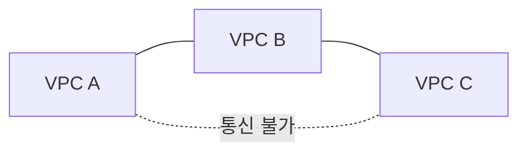

> "방화벽을 열었는데 왜 연결이 안 되죠?" — GCP 네트워크에서 가장 흔한 첫 질문이다. 이 글은 그 질문에서 출발해, **Google Professional Cloud Architect(PCA)** 시험의 VPC 문제가 결국 "올바른 연결 방식 선택"이라는 의사결정임을 보인다. 이 글은 PCA 준비 시리즈의 1편이자, 이후 모든 편이 그 위에 쌓이는 네트워크 토대다.

---

## 도입 — 방화벽을 열었는데 왜 연결이 안 되죠?

같은 VPC, 다른 서브넷에 있는 두 VM. `vm-a`에서 `vm-b`로 `ping`이 안 나간다. 콘솔에서 `allow-icmp` 규칙을 추가한다. 여전히 안 된다. 한참을 헤매다 깨닫는다 — 추가한 규칙의 priority가 기존 deny 규칙보다 **숫자가 컸다.** GCP에서 방화벽 우선순위는 숫자가 낮을수록 강하다. 직관과 정반대다.

PCA 시험의 VPC 문제는 이 장면의 변주다. 표면적으로는 "ping이 왜 안 되나", "어떤 구성이 가장 적합한가"를 묻지만 본질은 하나다 — **요구사항을 읽고 올바른 GCP 프리미티브로 매핑할 줄 아는가.** Peering인가 Shared VPC인가 VPN인가, Cloud NAT인가 Private Google Access인가, Network Tag인가 Service Account인가.

<div class="callout-note">
이 글의 지도: 정신모델 → 패킷 흐름(Route·Firewall) → 연결 3선택지 → Private Access → 시험 유형 공략 → 케이스. 각 축은 "문제 → 케이스 → 결론"으로 닫는다.
</div>

암기가 아니라 판단을 묻는 시험이므로, 각 섹션 끝에서 "그래서 시험에선 뭘 고르나"를 손에 쥐는 것을 목표로 한다.

---

## 정신모델 — GCP는 네트워크를 어떻게 보는가

### Global VPC, Regional Subnet

GCP에서 **VPC는 글로벌 리소스**다. 하나의 VPC가 모든 리전에 걸쳐 존재하고, 그 안의 **서브넷은 리전 단위**다. `us-central1`의 서브넷과 `asia-northeast3`의 서브넷을 같은 VPC에 두면, 둘은 별도의 VPN이나 Peering 없이 Google 백본을 통해 사설 IP로 직접 통신한다.

<div class="callout-warning">
AWS는 VPC가 <strong>리전</strong> 단위라 리전 간 통신에 Peering/Transit Gateway가 필요하다. GCP는 VPC가 <strong>글로벌</strong>이라 같은 VPC 내 리전 간은 <strong>기본 라우팅</strong>된다. "리전 간 연결에 무엇이 필요한가"에서 같은 VPC라면 정답은 "아무것도 필요 없다" — AWS 직관을 가져오면 오답.
</div>

라우팅 모드도 알아두자. VPC의 **Dynamic Routing Mode**(`Regional` 기본 / `Global`)는 Cloud Router가 학습한 온프렘 BGP 경로를 해당 리전에만 전파할지 모든 리전 서브넷에 전파할지를 정한다. "온프렘 경로가 한 리전에서만 보인다" 류 트러블슈팅으로 등장한다(6편).

### IP 주소 설계: Primary와 Secondary Range

서브넷은 **Primary CIDR**를 하나 가지며 VM의 NIC IP가 여기서 나온다. 추가로 **Secondary range**를 붙일 수 있는데, GKE의 **VPC-native(Alias IP)** 클러스터가 Pod·Service IP를 이 secondary range에서 가져온다. Pod이 노드 IP를 빌리지 않고 자기 IP를 갖게 되어 VPC의 1급 시민이 된다(3편).

> CIDR 비중첩은 철칙이다. 같은 VPC 내 서브넷은 물론, 나중에 Peering·VPN으로 연결할 상대 네트워크와도 겹치면 안 된다. 멀티 프로젝트·하이브리드를 염두에 두고 IP 대역을 처음부터 넉넉히, 겹치지 않게 할당하는 것이 아키텍트의 일이다.

**결론**: VPC는 글로벌·서브넷은 리전, CIDR은 비중첩. 이 둘이 이후 모든 연결 결정의 전제다. 주소를 그었으니, 그 위로 패킷이 어떻게 흐르는가.

---

## 패킷은 어떻게 흐르는가 — Route와 Firewall

VM이 패킷을 보내면 **Route**가 "어디로 보낼지"를, **Firewall**이 "보내도/받아도 되는지"를 결정한다. 시험 트러블슈팅의 대부분이 이 둘 중 하나다.

### Route 우선순위

라우트는 두 종류다. **System-generated**(VPC 생성 시 자동 — 서브넷 간 통신용 subnet route, 인터넷으로 향하는 default route `0.0.0.0/0`)와 **Custom**(사용자 static route, 또는 Cloud Router가 BGP로 학습한 dynamic route. 다음 홉을 NVA·VPN 터널·ILB로 지정 가능)이다.

여러 라우트가 한 목적지에 매칭되면 **가장 좁은(구체적인) prefix**가 우선한다. `10.1.2.0/24`와 `10.1.0.0/16`이 `10.1.2.5`에 모두 매칭되면 `/24`가 이긴다. prefix가 같으면 priority(낮을수록 우선)로 정한다.

> "default route를 삭제했더니 인터넷이 안 된다"는, system-generated `0.0.0.0/0`이 인터넷 게이트웨이로 향하는 유일한 경로였기 때문이다. 외부 통신을 막을 때 의도적으로 쓰기도 한다.

### Firewall Rule의 숨은 규칙

VPC 방화벽은 **stateful**(응답 트래픽 자동 허용)이고, 두 개의 **implied rule**이 숨어 있다 — **implied deny ingress**(명시 allow 없으면 인바운드 차단)와 **implied allow egress**(명시 deny 없으면 아웃바운드 허용). 그래서 "egress는 되는데 ingress가 안 된다"가 기본 상태다.

<div class="callout-warning">
Firewall priority는 <strong>숫자가 낮을수록 우선</strong>(0이 최강, 기본 1000, 범위 0~65535). priority 100짜리 deny가 1000짜리 allow를 이긴다. priority가 같으면 deny가 allow보다 우선. 직관과 반대 — 함정 1순위.
</div>

타겟팅 방식이 다음 문제다. 두 방식을 나란히 본다.

<div class="compare-grid">
<div class="compare-col" markdown="1">

**Network Tag 타겟팅**

```bash
gcloud compute firewall-rules create allow-web \
  --network=prod-vpc \
  --target-tags=web-server \
  --source-ranges=0.0.0.0/0 \
  --allow=tcp:80
```

`compute.instances.setTags` 권한만 있으면 누구나 VM에 태그를 붙여 규칙 적용 대상을 바꿀 수 있다 — 변경이 쉽다 = 보안 경계로는 약하다.

</div>
<div class="compare-col" markdown="1">

**Service Account 타겟팅**

```bash
gcloud compute firewall-rules create allow-web \
  --network=prod-vpc \
  --target-service-accounts=web@proj.iam.gserviceaccount.com \
  --source-ranges=0.0.0.0/0 \
  --allow=tcp:80
```

SA를 바꾸려면 IAM 권한이 필요하다 — 강결합 = 거버넌스가 강하다. 보안 중요 시 PCA 권장 답. 단, 한 규칙에서 Tag와 SA **혼용 불가**.

</div>
</div>

> 트러블슈팅 체크리스트: ① 수신 측 ingress allow가 있는가(implied deny 전제) → ② priority가 deny보다 낮은가 → ③ Tag/SA가 양쪽 VM에 매칭되는가 → ④ source range가 의도대로인가. 이 순서면 대부분 풀린다.

**결론**: ping 실패 = priority 역전 또는 implied deny. 보안 중요 타겟팅은 **Service Account**. 패킷의 길을 봤으니, 이제 시험의 핵심 — VPC를 연결하는 세 길이다.

---

## VPC를 연결하는 세 가지 길 — 이 챕터가 시험의 핵심

요구사항을 읽고 Peering / Shared VPC / VPN·Interconnect 중 하나를 고르는 능력이 VPC 파트의 절반이다. 각각 "무엇을 위한 것인가"를 한 문장으로 못 박는다.

### VPC Peering — 비전이적 내부 연결

두 VPC를 사설 IP로 직접 연결한다. **서로 다른 프로젝트·조직**의 VPC끼리도 맺을 수 있고, 트래픽이 Google 백본으로 흐르며 **추가 비용이 없다.** 세 제약이 시험 포인트다 — ① **CIDR 중첩 불가** ② **비전이성**(A↔B, B↔C 있어도 A↔C 불가) ③ **subnet route만 자동 교환**(static·dynamic route는 기본 미전파).



**케이스 적용 — M&A 후 통합**: 회사를 인수해 두 VPC를 Peering으로 잇는데, **양쪽 모두 `10.0.0.0/16`**을 쓴다.

<div class="callout-warning">
Peering의 절대 제약: <strong>CIDR이 겹치면 맺을 수 없다.</strong> 위 M&A는 Peering 불가 → 한쪽 대역 재설계(IP 재할당·마이그레이션) 또는 단기 HA VPN+별도 대역 우회. "왜 Peering이 안 되나"의 단골 정답.
</div>

**결론**: 독립 조직/프로젝트 간 · 내부 IP · CIDR 안 겹침 · 최소 비용 → **Peering**. 단 비전이성·CIDR 중첩을 항상 의심하라.

### Shared VPC — 조직 단위 중앙 거버넌스

**한 조직 안에서** 네트워크를 중앙 집중 관리한다. **Host Project**가 VPC·서브넷을 소유하고 **Service Project**들이 그 서브넷을 빌려 자기 리소스를 띄운다. 네트워크는 Host의 관리자가 단일 통제하고, 각 팀은 컴퓨트만 운영한다.

**케이스 적용 — 멀티팀 SaaS**: 10개 팀이 각자 프로젝트를 운영하되, 보안팀이 방화벽·서브넷을 중앙 관리하고 싶다 → Host Project 1개 + Service Project 10개의 Shared VPC. 각 팀 admin에게 해당 서브넷의 `compute.networkUser`만 부여하면, 그 admin은 지정 서브넷에 인스턴스만 띄울 수 있고 네트워크는 못 바꾼다. "팀은 워크로드, 보안팀은 네트워크"가 IAM으로 강제된다.

<details>
<summary>심화 — Service Project Admin 권한 경계 (검증 필요)</summary>
<div markdown="1">

Shared VPC 권한은 두 단계로 나뉜다.

- **Shared VPC Admin**(조직/폴더 레벨 `compute.xpnAdmin`): Host Project를 지정하고 어떤 Service Project를 붙일지 결정한다.
- **Service Project Admin**: Host의 특정 서브넷에 대해 `compute.networkUser` 역할을 받은 주체. 이 역할은 **지정된 서브넷에 인스턴스/리소스를 띄우는 것**까지만 허용한다. 서브넷·방화벽·라우트를 생성·수정할 수는 없다.

`compute.networkUser`를 **서브넷 단위**로 줄지 **Host Project 전체**로 줄지에 따라 위임 범위가 달라진다. 최소 권한 원칙상 팀별로 필요한 서브넷에만 부여하는 것이 권장된다. 정확한 역할명·범위는 GCP 공식 문서로 재확인 권장.

</div>
</details>

**결론**: 한 조직 · 여러 팀/프로젝트 · 중앙 네트워크 통제 → **Shared VPC**. Peering(다른 VPC 연결)과 달리 하나의 VPC를 공유하는 구조임에 주의.

### Cloud VPN / Interconnect — 온프렘으로 가는 길 (6편 예고)

위 둘은 GCP 내부 연결이다. **온프렘 데이터센터**와의 사설 연결은 다른 도구를 쓴다. **Cloud VPN**은 IPsec 암호화 터널을 인터넷 위에 세운다(저비용·빠른 구축, HA VPN은 99.99% SLA). **Dedicated/Partner Interconnect**는 물리 전용 회선이다(고대역 10/100 Gbps·저지연·고비용).

**케이스 적용 — 하이브리드 연동**: 온프렘 DB와 GCP가 사설 통신, 일 수백 GB 동기화, 지연 중요하나 초저지연까지는 아님 → 초기엔 **HA VPN**으로 시작, 대역·안정성 요구가 커지면 **Interconnect**로 승급. 둘 다 Cloud Router(BGP)로 경로 교환.

**결론**: 저비용·빠른 구축 → VPN, 고대역·저지연·안정성 → Interconnect. 상세 비교·SLA·대역 산정은 6편. 연결을 봤으니, 외부 IP 없이 사는 법이다.

---

## 외부 IP 없이 살아가기 — Private Access 패턴

"VM에 외부 IP를 주지 말라"가 보안·규제 요구에 자주 등장한다. 그럼 그 VM은 어떻게 패키지를 받고 GCS·BigQuery를 호출하는가? 두 도구가 **서로 다른 문제**를 푼다 — 혼동하면 바로 오답이다.

<div class="compare-grid">
<div class="compare-col" markdown="1">

**Cloud NAT — 일반 인터넷 egress**

```bash
gcloud compute routers nats create nat-cfg \
  --router=prod-router --region=us-central1 \
  --nat-all-subnet-ip-ranges \
  --auto-allocate-nat-external-ips
```

`apt update` 등 일반 인터넷 egress를 외부 IP 없는 VM에 공유 제공. **egress only — 외부에서 먼저 들어오는 인바운드는 불가**(인바운드는 외부 IP나 LB 필요). 외부 IP 절약.

</div>
<div class="compare-col" markdown="1">

**Private Google Access — Google API 한정**

```bash
gcloud compute networks subnets update prod-subnet \
  --region=us-central1 \
  --enable-private-google-access
```

서브넷 수준 설정. 외부 IP 없는 VM이 **Google API·서비스**(GCS·BigQuery·Pub/Sub)에 사설 경로로 접근. 트래픽은 인터넷으로 안 나간다. **Google API 한정** — 임의 외부 사이트 불가.

</div>
</div>

<div class="callout-warning">
혼동 1순위: <strong>apt 패키지 다운로드 → Cloud NAT</strong>(일반 인터넷), <strong>GCS/BigQuery 접근 → Private Google Access</strong>(Google API). "외부 IP 금지"라고 둘을 한 덩어리로 묶으면 틀린다 — 한 시나리오에 둘 다 필요한 경우가 많다.
</div>

<details>
<summary>심화 — Private Service Connect / VPC Service Controls와의 경계 (검증 필요)</summary>
<div markdown="1">

자주 혼동되는 세 개념을 분리한다.

- **Private Google Access**: 외부 IP 없는 VM이 **사설 경로로 Google API에 접근**하는 서브넷 설정. "연결성"의 문제.
- **Private Service Connect(PSC)**: 서비스 **producer↔consumer**를 사설 엔드포인트(내부 IP)로 연결. 자체/서드파티 관리형 서비스를 자기 VPC 안의 IP처럼 노출. "서비스 노출/소비"의 문제.
- **VPC Service Controls(VPC-SC)**: GCS·BigQuery 등 관리형 서비스 둘레에 **서비스 경계(perimeter)**를 쳐서, 탈취된 자격증명으로도 경계 밖 **데이터 유출(exfiltration)을 막는다.** 네트워크 연결이 아니라 "데이터 경계"의 문제.

시험에서는 키워드 매칭이 안전하다 — "외부 IP 없이 Google API = Private Google Access", "서비스를 사설 엔드포인트로 = PSC", "데이터 유출 방지 경계 = VPC-SC". 정밀 정의는 GCP 공식 문서 1차 출처로 재확인 권장.

</div>
</details>

**결론**: 외부 IP 없이 Google API는 **PGA**, 일반 인터넷은 **Cloud NAT**(egress only), 데이터 유출 방지는 **VPC-SC**. 세 도구가 각각 다른 문제를 푼다.

---

## 시험장에서 — 문제 유형별 공략

### 아키텍처 설계형 (유형 A)

가장 출제 빈도가 높다. 요구사항 키워드를 연결 방식으로 매핑하는 치트시트가 본편의 핵심 자산이다.

| 요구사항 키워드 | 정답 프리미티브 |
|-----------------|-----------------|
| 한 조직 · 여러 팀 · 중앙 네트워크 통제 | **Shared VPC** |
| 독립 조직/프로젝트 간 · 내부 IP · CIDR 안 겹침 · 최소 비용 | **VPC Peering** |
| 외부 IP 없이 Google API(GCS/BQ)만 | **Private Google Access** |
| 외부 IP 없이 일반 인터넷 egress(apt) | **Cloud NAT** |
| 온프렘 · 저비용 · 빠른 구축 | **Cloud VPN(HA)** |
| 온프렘 · 고대역 · 저지연 · 안정성 | **Interconnect** |
| 데이터 유출 방지 경계 | **VPC Service Controls** |

### 트러블슈팅형 (유형 B)

연결 실패는 정해진 순서로 디버깅한다.

| 점검 | 흔한 원인 |
|------|-----------|
| 수신 측 ingress allow 존재? | implied deny ingress 전제 |
| priority가 deny보다 낮은가? | priority 역전(가장 흔함) |
| Tag/SA가 양쪽 매칭? | 타겟 누락 |
| Peering 너머 3번째 VPC? | 비전이성(A↔C 직접 필요) |

### 비교선택형 (유형 C)

| 질문 | 판별 |
|------|------|
| apt vs GCS 접근 | apt=**Cloud NAT** / GCS=**PGA** |
| Shared VPC vs Peering | 단일 조직·중앙=**Shared VPC** / 독립 조직 간=**Peering** |
| Tag vs SA 타겟 | 보안 중요=**Service Account** |

---

## 실전 케이스로 굳히기

앞 축에서 부분 적용한 케이스를 GCP 구조 매핑으로 정리한다.

| 케이스 | 상황 | 매핑 |
|--------|------|------|
| 1. 멀티팀 SaaS | 10팀 각 프로젝트, 보안팀 중앙 관리 | Shared VPC(Host+Service, `compute.networkUser`) |
| 2. M&A 통합 | 독립 VPC 사설 연결, CIDR 충돌 | Peering 불가 → 재설계 또는 HA VPN 우회 |
| 3. 금융 데이터 격리 | 외부 IP 금지, apt+GCS, 유출 방지 | Cloud NAT + PGA + VPC-SC |
| 4. 하이브리드 | 온프렘 DB ↔ GCP 사설 통신 | HA VPN(저비용) → Interconnect(승급) |

케이스 3이 특히 함정이다. "외부 IP 금지"를 NAT/PGA 한 덩어리로 묶지 말 것 — 패치(apt)는 NAT, Google API(GCS·BQ)는 PGA, 유출 방지는 VPC-SC로 **세 도구가 각각** 들어간다.

---

## 마무리

처음의 장면 — "방화벽을 열었는데 왜 연결이 안 되죠?" — 은 implied deny와 priority 역전을 알면 풀린다. 그리고 그 너머의 모든 VPC 문제는 요구사항을 읽고 올바른 연결 방식을 고르는 의사결정이다.

<div class="callout-tip">
VPC 문제 = <strong>연결 방식 선택 문제</strong>. 요구사항 키워드(거버넌스 / 비용 / 격리 / 온프렘)를 연결 방식에 매핑하면 답이 보인다.
</div>

시험 직전에 훑을 **함정 6쌍**:

| 혼동 쌍 | 핵심 구분선 |
|---------|------------|
| Peering vs Shared VPC vs VPN | Peering=독립 VPC 연결 / Shared VPC=단일 조직 1 VPC 공유 / VPN=온프렘 암호화 터널 |
| Cloud NAT vs PGA | NAT=일반 인터넷 egress(apt) / PGA=Google API 한정(GCS·BQ) |
| Network Tag vs Service Account | Tag=변경 쉬움·약함 / SA=IAM 강결합·권장 |
| Firewall priority 방향 | 0~65535, 기본 1000, **숫자 낮을수록 우선** |
| VPC=Global, Subnet=Regional | 같은 VPC면 리전 간 기본 라우팅(AWS 함정) |
| Peering 비전이성 | A↔B, B↔C 있어도 A↔C 불가 |

다음 편 **2편 Compute Engine & 인스턴스 설계**에서는 이 VPC 위에 실제 워크로드를 올린다. 머신 타입, MIG와 오토스케일링, 가용성 설계, 그리고 인스턴스에 붙는 Service Account가 방화벽·IAM과 어떻게 맞물리는지 — 네트워크 위에 컴퓨트를 쌓는다.

---

## 참고

- [[/cloud]] — Google PCA 준비 시리즈 인덱스
- Google Cloud, [*VPC overview*](https://cloud.google.com/vpc/docs/vpc) — VPC·서브넷·라우팅 1차 출처
- Google Cloud, [*Firewall rules overview*](https://cloud.google.com/firewall/docs/firewalls) — priority·implied rule·타겟팅 정확한 수치
- Google Cloud, [*VPC Network Peering*](https://cloud.google.com/vpc/docs/vpc-peering) / [*Shared VPC*](https://cloud.google.com/vpc/docs/shared-vpc) — 비전이성·CIDR 제약·권한 모델
- Google Cloud, [*Private Google Access*](https://cloud.google.com/vpc/docs/private-google-access) / [*Cloud NAT*](https://cloud.google.com/nat/docs/overview) / [*VPC Service Controls*](https://cloud.google.com/vpc-service-controls/docs/overview) — 세 개념 경계 정밀 확인
